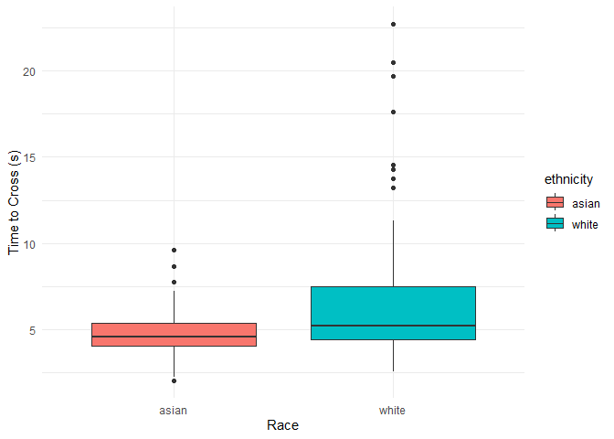
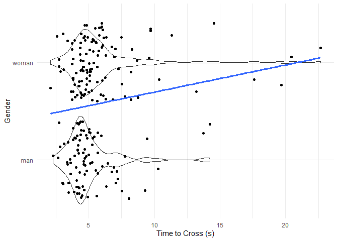
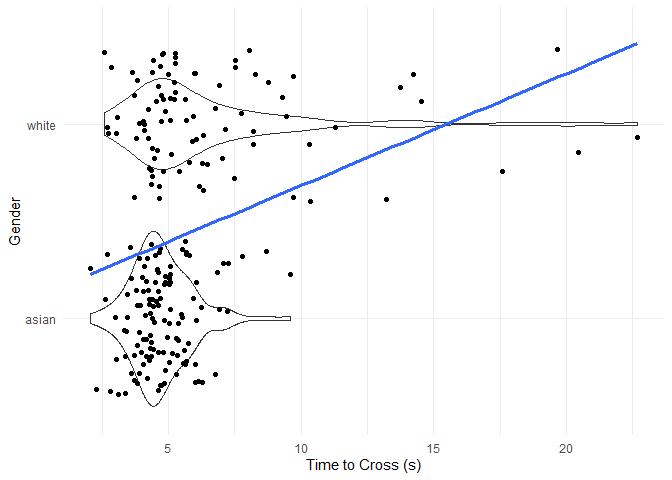
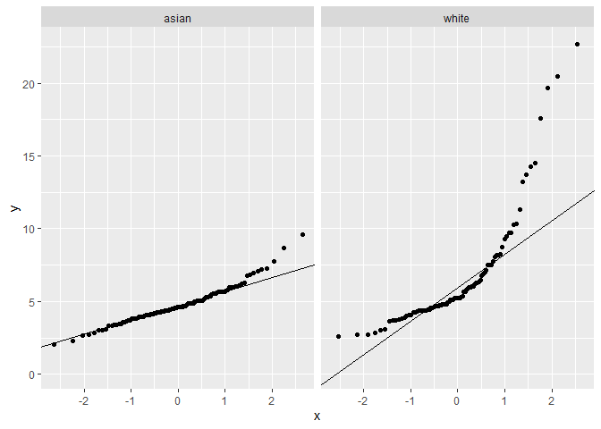
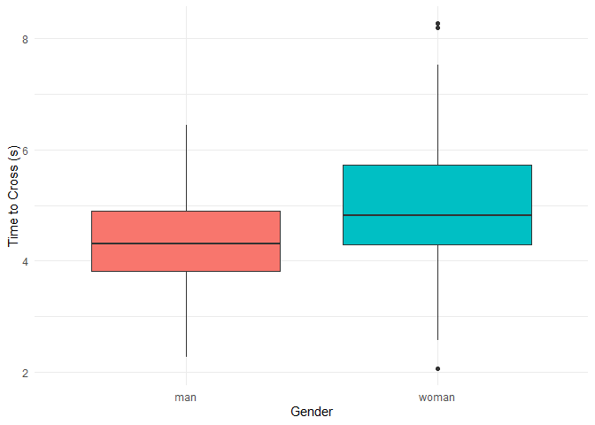
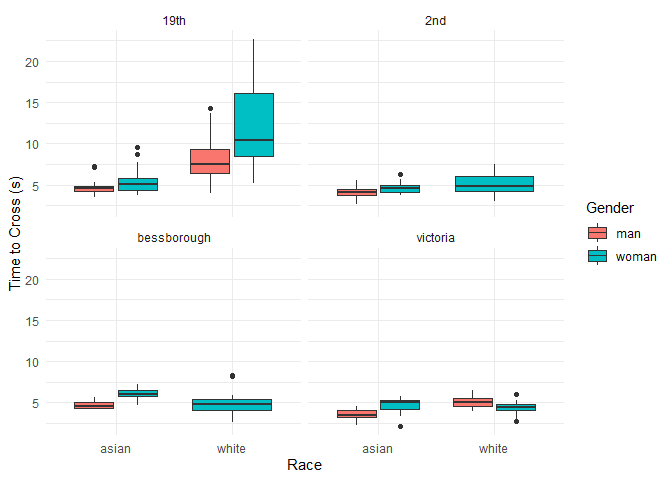
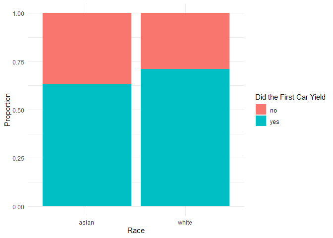
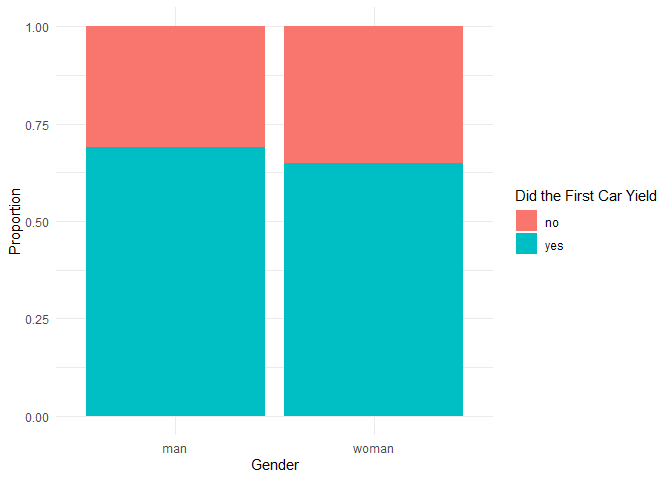
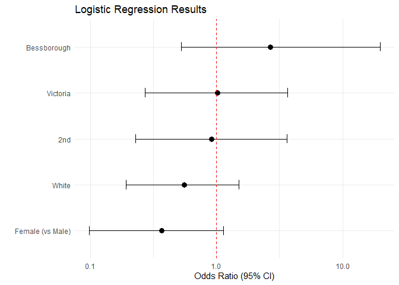
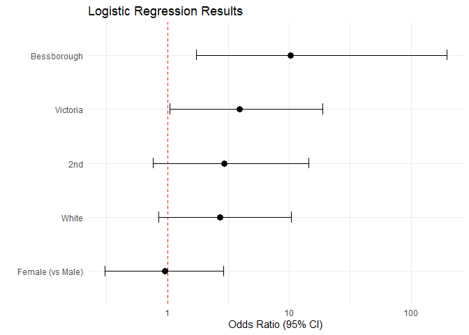

LOAD PACKAGES

``` r
library(tidyverse)
```

```
## ── Attaching core tidyverse packages ──────────────────────── tidyverse 2.0.0 ──
## ✔ dplyr     1.2.1     ✔ readr     2.2.0
## ✔ forcats   1.0.1     ✔ stringr   1.6.0
## ✔ ggplot2   4.0.3     ✔ tibble    3.3.1
## ✔ lubridate 1.9.5     ✔ tidyr     1.3.2
## ✔ purrr     1.2.2     
## ── Conflicts ────────────────────────────────────────── tidyverse_conflicts() ──
## ✖ dplyr::filter() masks stats::filter()
## ✖ dplyr::lag()    masks stats::lag()
## ℹ Use the conflicted package (<http://conflicted.r-lib.org/>) to force all conflicts to become errors
```

``` r
library(broom)
library(snakecase)
```

LOAD DATA - REMOVE INVALID TRIALS - TRIALS WITH UNAFFILIATED PEDESTRIANS

``` r
data_file <- read_csv("master_file.csv") %>% 
  mutate(
    ethnicity = as.factor(ethnicity),
    gender = as.factor(gender),
    location = as.factor(location),
    first_car_yield = as.factor(first_car_yield),
    did_car_proceed_before_across = as.factor(did_car_proceed_before_across)
  )
```

```
## Rows: 255 Columns: 12
## ── Column specification ────────────────────────────────────────────────────────
## Delimiter: ","
## chr (9): ethnicity, gender, location, date, time_of_day, first_car_yield, di...
## dbl (3): trial_number, num_cars_pass_before_yield, time_to_cross_street
## 
## ℹ Use `spec()` to retrieve the full column specification for this data.
## ℹ Specify the column types or set `show_col_types = FALSE` to quiet this message.
```

``` r
data <- data_file %>% drop_na(valid_trial)

data_19th_rm <- data %>% filter(location != "19th")
```

GENERAL DESCRIPTIVE STATS

``` r
data %>% 
  summarise(
    n = n(),
    mean_time = mean(time_to_cross_street, na.rm = TRUE),
    sd_time = sd(time_to_cross_street, na.rm = TRUE), 
    min_time = min(time_to_cross_street, na.rm = TRUE),
    max_time = max(time_to_cross_street, na.rm = TRUE),
    mean_cars = mean(num_cars_pass_before_yield, na.rm = TRUE), 
    sd_cars = sd(num_cars_pass_before_yield, na.rm = TRUE)
  )
```

```
## # A tibble: 1 × 7
##       n mean_time sd_time min_time max_time mean_cars sd_cars
##   <int>     <dbl>   <dbl>    <dbl>    <dbl>     <dbl>   <dbl>
## 1   210      5.57    2.85     2.07     22.7     0.567    1.02
```

FREQUENCY TABLES

``` r
data %>% count(ethnicity)
```

```
## # A tibble: 2 × 2
##   ethnicity     n
##   <fct>     <int>
## 1 asian       120
## 2 white        90
```

``` r
data %>% count(gender)
```

```
## # A tibble: 2 × 2
##   gender     n
##   <fct>  <int>
## 1 man       90
## 2 woman    120
```

``` r
data %>% count(location)
```

```
## # A tibble: 4 × 2
##   location        n
##   <fct>       <int>
## 1 19th           60
## 2 2nd            45
## 3 bessborough    45
## 4 victoria       60
```

``` r
data %>% count(first_car_yield)
```

```
## # A tibble: 2 × 2
##   first_car_yield     n
##   <fct>           <int>
## 1 no                 70
## 2 yes               140
```

``` r
data %>% count(did_car_proceed_before_across)
```

```
## # A tibble: 3 × 2
##   did_car_proceed_before_across     n
##   <fct>                         <int>
## 1 no                               18
## 2 yes                             175
## 3 <NA>                             17
```

FIRST CAR YIELD DESCRIPTIVE STATS

``` r
data %>% 
  group_by(gender) %>% 
  count(first_car_yield) %>% 
  mutate(percentage = n / sum(n) * 100)
```

```
## # A tibble: 4 × 4
## # Groups:   gender [2]
##   gender first_car_yield     n percentage
##   <fct>  <fct>           <int>      <dbl>
## 1 man    no                 28       31.1
## 2 man    yes                62       68.9
## 3 woman  no                 42       35  
## 4 woman  yes                78       65
```

``` r
  .groups = "drop"

data %>% 
  group_by(ethnicity) %>% 
  count(first_car_yield) %>% 
  mutate(percentage = n / sum(n) * 100)
```

```
## # A tibble: 4 × 4
## # Groups:   ethnicity [2]
##   ethnicity first_car_yield     n percentage
##   <fct>     <fct>           <int>      <dbl>
## 1 asian     no                 44       36.7
## 2 asian     yes                76       63.3
## 3 white     no                 26       28.9
## 4 white     yes                64       71.1
```

``` r
  .groups = "drop"
  
data %>% 
  group_by(ethnicity, gender) %>% 
  count(first_car_yield) %>% 
  mutate(percentage = n / sum(n) * 100)
```

```
## # A tibble: 8 × 5
## # Groups:   ethnicity, gender [4]
##   ethnicity gender first_car_yield     n percentage
##   <fct>     <fct>  <fct>           <int>      <dbl>
## 1 asian     man    no                 16       26.7
## 2 asian     man    yes                44       73.3
## 3 asian     woman  no                 28       46.7
## 4 asian     woman  yes                32       53.3
## 5 white     man    no                 12       40  
## 6 white     man    yes                18       60  
## 7 white     woman  no                 14       23.3
## 8 white     woman  yes                46       76.7
```

``` r
  .groups = "drop"
```

FIRST CAR YIELD - LOGISTIC REGRESSION
GENDER - LOCATION FIXED EFFECTS

``` r
m1 <- glm(first_car_yield ~ gender + factor(location),
          data = data,
          family = binomial())

tidy(m1)
```

```
## # A tibble: 5 × 5
##   term                        estimate std.error statistic      p.value
##   <chr>                          <dbl>     <dbl>     <dbl>        <dbl>
## 1 (Intercept)                   -0.449     0.317     -1.42 0.157       
## 2 genderwoman                   -0.350     0.345     -1.01 0.311       
## 3 factor(location)2nd            1.28      0.421      3.04 0.00233     
## 4 factor(location)bessborough    2.22      0.483      4.60 0.00000422  
## 5 factor(location)victoria       2.66      0.487      5.46 0.0000000468
```

``` r
summary(m1)
```

```
## 
## Call:
## glm(formula = first_car_yield ~ gender + factor(location), family = binomial(), 
##     data = data)
## 
## Coefficients:
##                             Estimate Std. Error z value Pr(>|z|)    
## (Intercept)                  -0.4488     0.3169  -1.416  0.15670    
## genderwoman                  -0.3496     0.3447  -1.014  0.31051    
## factor(location)2nd           1.2807     0.4206   3.045  0.00233 ** 
## factor(location)bessborough   2.2220     0.4830   4.600 4.22e-06 ***
## factor(location)victoria      2.6597     0.4868   5.463 4.68e-08 ***
## ---
## Signif. codes:  0 '***' 0.001 '**' 0.01 '*' 0.05 '.' 0.1 ' ' 1
## 
## (Dispersion parameter for binomial family taken to be 1)
## 
##     Null deviance: 267.34  on 209  degrees of freedom
## Residual deviance: 220.57  on 205  degrees of freedom
## AIC: 230.57
## 
## Number of Fisher Scoring iterations: 4
```

``` r
exp(coef(m1))
```

```
##                 (Intercept)                 genderwoman 
##                   0.6383743                   0.7049694 
##         factor(location)2nd factor(location)bessborough 
##                   3.5992448                   9.2262030 
##    factor(location)victoria 
##                  14.2920406
```

ETHNICITY - LOCATION FIXED EFFECTS

``` r
m2 <- glm(first_car_yield ~ ethnicity + factor(location),
          data = data,
          family = binomial())

tidy(m2)
```

```
## # A tibble: 5 × 5
##   term                        estimate std.error statistic      p.value
##   <chr>                          <dbl>     <dbl>     <dbl>        <dbl>
## 1 (Intercept)                   -0.928     0.334     -2.78 0.00543     
## 2 ethnicitywhite                 0.592     0.352      1.68 0.0924      
## 3 factor(location)2nd            1.34      0.426      3.14 0.00168     
## 4 factor(location)bessborough    2.29      0.489      4.68 0.00000288  
## 5 factor(location)victoria       2.69      0.491      5.48 0.0000000424
```

``` r
summary(m2)
```

```
## 
## Call:
## glm(formula = first_car_yield ~ ethnicity + factor(location), 
##     family = binomial(), data = data)
## 
## Coefficients:
##                             Estimate Std. Error z value Pr(>|z|)    
## (Intercept)                  -0.9281     0.3338  -2.780  0.00543 ** 
## ethnicitywhite                0.5917     0.3516   1.683  0.09237 .  
## factor(location)2nd           1.3377     0.4258   3.142  0.00168 ** 
## factor(location)bessborough   2.2870     0.4888   4.679 2.88e-06 ***
## factor(location)victoria      2.6900     0.4908   5.481 4.24e-08 ***
## ---
## Signif. codes:  0 '***' 0.001 '**' 0.01 '*' 0.05 '.' 0.1 ' ' 1
## 
## (Dispersion parameter for binomial family taken to be 1)
## 
##     Null deviance: 267.34  on 209  degrees of freedom
## Residual deviance: 218.69  on 205  degrees of freedom
## AIC: 228.69
## 
## Number of Fisher Scoring iterations: 4
```

``` r
exp(coef(m2))
```

```
##                 (Intercept)              ethnicitywhite 
##                   0.3953016                   1.8071193 
##         factor(location)2nd factor(location)bessborough 
##                   3.8104554                   9.8451747 
##    factor(location)victoria 
##                  14.7315214
```

GENDER + ETHNICITY - LOCATION FIXED EFFECTS

``` r
m3 <- glm(first_car_yield ~ gender + ethnicity + factor(location),
          data = data,
          family = binomial())

tidy(m3)
```

```
## # A tibble: 6 × 5
##   term                        estimate std.error statistic      p.value
##   <chr>                          <dbl>     <dbl>     <dbl>        <dbl>
## 1 (Intercept)                   -0.747     0.359     -2.08 0.0377      
## 2 genderwoman                   -0.493     0.354     -1.39 0.164       
## 3 ethnicitywhite                 0.694     0.360      1.93 0.0536      
## 4 factor(location)2nd            1.45      0.437      3.32 0.000910    
## 5 factor(location)bessborough    2.40      0.500      4.80 0.00000156  
## 6 factor(location)victoria       2.74      0.498      5.50 0.0000000390
```

``` r
summary(m3)
```

```
## 
## Call:
## glm(formula = first_car_yield ~ gender + ethnicity + factor(location), 
##     family = binomial(), data = data)
## 
## Coefficients:
##                             Estimate Std. Error z value Pr(>|z|)    
## (Intercept)                  -0.7465     0.3593  -2.078  0.03772 *  
## genderwoman                  -0.4928     0.3537  -1.393  0.16356    
## ethnicitywhite                0.6941     0.3596   1.930  0.05359 .  
## factor(location)2nd           1.4500     0.4371   3.317  0.00091 ***
## factor(location)bessborough   2.4027     0.5002   4.804 1.56e-06 ***
## factor(location)victoria      2.7387     0.4984   5.495 3.90e-08 ***
## ---
## Signif. codes:  0 '***' 0.001 '**' 0.01 '*' 0.05 '.' 0.1 ' ' 1
## 
## (Dispersion parameter for binomial family taken to be 1)
## 
##     Null deviance: 267.34  on 209  degrees of freedom
## Residual deviance: 216.71  on 204  degrees of freedom
## AIC: 228.71
## 
## Number of Fisher Scoring iterations: 4
```

``` r
exp(coef(m3))
```

```
##                 (Intercept)                 genderwoman 
##                   0.4740099                   0.6109120 
##              ethnicitywhite         factor(location)2nd 
##                   2.0019090                   4.2629448 
## factor(location)bessborough    factor(location)victoria 
##                  11.0528884                  15.4671069
```

MEAN NUMBER OF CARS PASS BEFORE YIELD - DESCRIPTIVE STATS

``` r
data %>% 
  group_by(gender) %>% 
  summarise(
    n = n(),
    mean = mean(num_cars_pass_before_yield),
    sd = sd(num_cars_pass_before_yield),
    .groups = "drop"
  )
```

```
## # A tibble: 2 × 4
##   gender     n  mean    sd
##   <fct>  <int> <dbl> <dbl>
## 1 man       90 0.456 0.781
## 2 woman    120 0.65  1.16
```

``` r
data %>% 
  group_by(ethnicity) %>% 
  summarise(
    n = n(),
    mean = mean(num_cars_pass_before_yield),
    sd = sd(num_cars_pass_before_yield),
    .groups = "drop"
  )
```

```
## # A tibble: 2 × 4
##   ethnicity     n  mean    sd
##   <fct>     <int> <dbl> <dbl>
## 1 asian       120 0.533 0.829
## 2 white        90 0.611 1.22
```

``` r
data %>% 
  group_by(ethnicity, gender) %>% 
  summarise(
    n = n(),
    mean = mean(num_cars_pass_before_yield),
    sd = sd(num_cars_pass_before_yield),
    .groups = "drop"
  )
```

```
## # A tibble: 4 × 5
##   ethnicity gender     n  mean    sd
##   <fct>     <fct>  <int> <dbl> <dbl>
## 1 asian     man       60 0.383 0.715
## 2 asian     woman     60 0.683 0.911
## 3 white     man       30 0.6   0.894
## 4 white     woman     60 0.617 1.37
```

MEAN NUMBER OF CARS PASS BEFORE YIELD - LINEAR REGRESSION
GENDER - LOCATION FIXED EFFECTS

``` r
m4 <- lm(num_cars_pass_before_yield ~ gender + factor(location),
         data = data)

tidy(m4)
```

```
## # A tibble: 5 × 5
##   term                        estimate std.error statistic  p.value
##   <chr>                          <dbl>     <dbl>     <dbl>    <dbl>
## 1 (Intercept)                    1.16      0.133      8.70 1.05e-15
## 2 genderwoman                    0.257     0.127      2.01 4.54e- 2
## 3 factor(location)2nd           -0.882     0.179     -4.92 1.74e- 6
## 4 factor(location)bessborough   -1.02      0.179     -5.67 4.82e- 8
## 5 factor(location)victoria      -1.15      0.165     -6.99 3.84e-11
```

``` r
summary(m4)
```

```
## 
## Call:
## lm(formula = num_cars_pass_before_yield ~ gender + factor(location), 
##     data = data)
## 
## Residuals:
##     Min      1Q  Median      3Q     Max 
## -1.4117 -0.3967 -0.2617 -0.0050  4.5883 
## 
## Coefficients:
##                             Estimate Std. Error t value Pr(>|t|)    
## (Intercept)                   1.1550     0.1327   8.705 1.05e-15 ***
## genderwoman                   0.2567     0.1275   2.013   0.0454 *  
## factor(location)2nd          -0.8817     0.1790  -4.925 1.74e-06 ***
## factor(location)bessborough  -1.0150     0.1790  -5.669 4.82e-08 ***
## factor(location)victoria     -1.1500     0.1646  -6.988 3.84e-11 ***
## ---
## Signif. codes:  0 '***' 0.001 '**' 0.01 '*' 0.05 '.' 0.1 ' ' 1
## 
## Residual standard error: 0.9014 on 205 degrees of freedom
## Multiple R-squared:  0.2273,	Adjusted R-squared:  0.2122 
## F-statistic: 15.07 on 4 and 205 DF,  p-value: 8.115e-11
```

ETHNICITY - LOCATION FIXED EFFECTS

``` r
m5 <- lm(num_cars_pass_before_yield ~ ethnicity + factor(location),
         data = data)

tidy(m5)
```

```
## # A tibble: 5 × 5
##   term                        estimate std.error statistic  p.value
##   <chr>                          <dbl>     <dbl>     <dbl>    <dbl>
## 1 (Intercept)                   1.27       0.134     9.49  6.08e-18
## 2 ethnicitywhite                0.0233     0.129     0.181 8.56e- 1
## 3 factor(location)2nd          -0.835      0.181    -4.62  6.81e- 6
## 4 factor(location)bessborough  -0.968      0.181    -5.36  2.27e- 7
## 5 factor(location)victoria     -1.15       0.166    -6.92  5.66e-11
```

``` r
summary(m5)
```

```
## 
## Call:
## lm(formula = num_cars_pass_before_yield ~ ethnicity + factor(location), 
##     data = data)
## 
## Residuals:
##     Min      1Q  Median      3Q     Max 
## -1.2950 -0.3267 -0.2717 -0.1217  4.7050 
## 
## Coefficients:
##                             Estimate Std. Error t value Pr(>|t|)    
## (Intercept)                  1.27167    0.13398   9.491  < 2e-16 ***
## ethnicitywhite               0.02333    0.12873   0.181    0.856    
## factor(location)2nd         -0.83500    0.18078  -4.619 6.81e-06 ***
## factor(location)bessborough -0.96833    0.18078  -5.357 2.27e-07 ***
## factor(location)victoria    -1.15000    0.16618  -6.920 5.66e-11 ***
## ---
## Signif. codes:  0 '***' 0.001 '**' 0.01 '*' 0.05 '.' 0.1 ' ' 1
## 
## Residual standard error: 0.9102 on 205 degrees of freedom
## Multiple R-squared:  0.2121,	Adjusted R-squared:  0.1967 
## F-statistic:  13.8 on 4 and 205 DF,  p-value: 5.56e-10
```

GENDER + ETHNICITY - LOCATION FIXED EFFECTS

``` r
m6 <- lm(num_cars_pass_before_yield ~ gender + ethnicity + factor(location),
         data = data)

tidy(m6)
```

```
## # A tibble: 6 × 5
##   term                        estimate std.error statistic  p.value
##   <chr>                          <dbl>     <dbl>     <dbl>    <dbl>
## 1 (Intercept)                   1.17       0.143     8.17  3.27e-14
## 2 genderwoman                   0.262      0.130     2.01  4.54e- 2
## 3 ethnicitywhite               -0.0292     0.130    -0.224 8.23e- 1
## 4 factor(location)2nd          -0.887      0.181    -4.89  2.00e- 6
## 5 factor(location)bessborough  -1.02       0.181    -5.63  5.92e- 8
## 6 factor(location)victoria     -1.15       0.165    -6.97  4.27e-11
```

``` r
summary(m6)
```

```
## 
## Call:
## lm(formula = num_cars_pass_before_yield ~ gender + ethnicity + 
##     factor(location), data = data)
## 
## Residuals:
##     Min      1Q  Median      3Q     Max 
## -1.4000 -0.4083 -0.2500  0.0125  4.6000 
## 
## Coefficients:
##                             Estimate Std. Error t value Pr(>|t|)    
## (Intercept)                  1.16667    0.14286   8.166 3.27e-14 ***
## genderwoman                  0.26250    0.13041   2.013   0.0454 *  
## ethnicitywhite              -0.02917    0.13041  -0.224   0.8233    
## factor(location)2nd         -0.88750    0.18133  -4.894 2.00e-06 ***
## factor(location)bessborough -1.02083    0.18133  -5.630 5.92e-08 ***
## factor(location)victoria    -1.15000    0.16496  -6.971 4.27e-11 ***
## ---
## Signif. codes:  0 '***' 0.001 '**' 0.01 '*' 0.05 '.' 0.1 ' ' 1
## 
## Residual standard error: 0.9035 on 204 degrees of freedom
## Multiple R-squared:  0.2274,	Adjusted R-squared:  0.2085 
## F-statistic: 12.01 on 5 and 204 DF,  p-value: 3.332e-10
```

TIME TO ENTER INTERSECTION - DESCRIPTIVE STATS

``` r
data %>% 
  group_by(gender) %>% 
  summarise(
    n = n(),
    mean = mean(time_to_cross_street),
    sd = sd(time_to_cross_street),
    .groups = "drop"
  )
```

```
## # A tibble: 2 × 4
##   gender     n  mean    sd
##   <fct>  <int> <dbl> <dbl>
## 1 man       90  5.04  2.00
## 2 woman    120  5.96  3.30
```

``` r
data %>% 
  group_by(ethnicity) %>% 
  summarise(
    n = n(),
    mean = mean(time_to_cross_street),
    sd = sd(time_to_cross_street),
    .groups = "drop"
  )
```

```
## # A tibble: 2 × 4
##   ethnicity     n  mean    sd
##   <fct>     <int> <dbl> <dbl>
## 1 asian       120  4.75  1.20
## 2 white        90  6.65  3.88
```

``` r
data %>% 
  group_by(gender, ethnicity) %>% 
  summarise(
    n = n(),
    mean = mean(time_to_cross_street),
    sd = sd(time_to_cross_street),
    .groups = "drop"
  )
```

```
## # A tibble: 4 × 5
##   gender ethnicity     n  mean    sd
##   <fct>  <fct>     <int> <dbl> <dbl>
## 1 man    asian        60  4.27 0.924
## 2 man    white        30  6.58 2.62 
## 3 woman  asian        60  5.24 1.26 
## 4 woman  white        60  6.68 4.40
```

TIME TO ENTER INTERSECTION - LINEAR REGRESSION
GENDER - LOCATION FIXED EFFECTS 

``` r
m7 <- lm(time_to_cross_street ~ gender + factor(location),
         data = data)

tidy(m7)
```

```
## # A tibble: 5 × 5
##   term                        estimate std.error statistic  p.value
##   <chr>                          <dbl>     <dbl>     <dbl>    <dbl>
## 1 (Intercept)                     7.13     0.360     19.8  1.89e-49
## 2 genderwoman                     1.13     0.346      3.27 1.25e- 3
## 3 factor(location)2nd            -3.28     0.486     -6.74 1.58e-10
## 4 factor(location)bessborough    -2.64     0.486     -5.44 1.52e- 7
## 5 factor(location)victoria       -3.31     0.447     -7.40 3.41e-12
```

``` r
summary(m7)
```

```
## 
## Call:
## lm(formula = time_to_cross_street ~ gender + factor(location), 
##     data = data)
## 
## Residuals:
##     Min      1Q  Median      3Q     Max 
## -4.5548 -1.0519 -0.0991  0.6579 14.4152 
## 
## Coefficients:
##                             Estimate Std. Error t value Pr(>|t|)    
## (Intercept)                   7.1319     0.3604  19.791  < 2e-16 ***
## genderwoman                   1.1329     0.3462   3.272  0.00125 ** 
## factor(location)2nd          -3.2767     0.4862  -6.739 1.58e-10 ***
## factor(location)bessborough  -2.6447     0.4862  -5.439 1.52e-07 ***
## factor(location)victoria     -3.3083     0.4470  -7.402 3.41e-12 ***
## ---
## Signif. codes:  0 '***' 0.001 '**' 0.01 '*' 0.05 '.' 0.1 ' ' 1
## 
## Residual standard error: 2.448 on 205 degrees of freedom
## Multiple R-squared:  0.2749,	Adjusted R-squared:  0.2607 
## F-statistic: 19.43 on 4 and 205 DF,  p-value: 1.437e-13
```

ETHNICITY - LOCATION FIXED EFFECTS

``` r
m8 <- lm(time_to_cross_street ~ ethnicity + factor(location),
         data = data)

tidy(m8)
```

```
## # A tibble: 5 × 5
##   term                        estimate std.error statistic  p.value
##   <chr>                          <dbl>     <dbl>     <dbl>    <dbl>
## 1 (Intercept)                     6.82     0.347     19.7  4.62e-49
## 2 ethnicitywhite                  1.76     0.333      5.27 3.46e- 7
## 3 factor(location)2nd            -2.80     0.468     -5.97 1.02e- 8
## 4 factor(location)bessborough    -2.16     0.468     -4.62 6.73e- 6
## 5 factor(location)victoria       -3.31     0.430     -7.69 6.09e-13
```

``` r
summary(m8)
```

```
## 
## Call:
## lm(formula = time_to_cross_street ~ ethnicity + factor(location), 
##     data = data)
## 
## Residuals:
##     Min      1Q  Median      3Q     Max 
## -4.5364 -1.3643 -0.1161  0.8817 14.1036 
## 
## Coefficients:
##                             Estimate Std. Error t value Pr(>|t|)    
## (Intercept)                   6.8203     0.3469  19.660  < 2e-16 ***
## ethnicitywhite                1.7561     0.3333   5.269 3.46e-07 ***
## factor(location)2nd          -2.7952     0.4681  -5.972 1.02e-08 ***
## factor(location)bessborough  -2.1632     0.4681  -4.621 6.73e-06 ***
## factor(location)victoria     -3.3083     0.4303  -7.689 6.09e-13 ***
## ---
## Signif. codes:  0 '***' 0.001 '**' 0.01 '*' 0.05 '.' 0.1 ' ' 1
## 
## Residual standard error: 2.357 on 205 degrees of freedom
## Multiple R-squared:  0.328,	Adjusted R-squared:  0.3149 
## F-statistic: 25.02 on 4 and 205 DF,  p-value: < 2.2e-16
```

GENDER + ETHNICITY - LOCATION FIXED EFFECTS

``` r
m9 <- lm(time_to_cross_street ~ gender + ethnicity + factor(location),
         data = data)

tidy(m9)
```

```
## # A tibble: 6 × 5
##   term                        estimate std.error statistic  p.value
##   <chr>                          <dbl>     <dbl>     <dbl>    <dbl>
## 1 (Intercept)                    6.49      0.368     17.6  6.86e-43
## 2 genderwoman                    0.814     0.336      2.42 1.63e- 2
## 3 ethnicitywhite                 1.59      0.336      4.74 4.02e- 6
## 4 factor(location)2nd           -2.96      0.467     -6.33 1.55e- 9
## 5 factor(location)bessborough   -2.33      0.467     -4.98 1.38e- 6
## 6 factor(location)victoria      -3.31      0.425     -7.78 3.56e-13
```

``` r
summary(m9)
```

```
## 
## Call:
## lm(formula = time_to_cross_street ~ gender + ethnicity + factor(location), 
##     data = data)
## 
## Residuals:
##     Min      1Q  Median      3Q     Max 
## -4.0479 -1.3555  0.0864  1.0172 13.7779 
## 
## Coefficients:
##                             Estimate Std. Error t value Pr(>|t|)    
## (Intercept)                   6.4946     0.3683  17.634  < 2e-16 ***
## genderwoman                   0.8142     0.3362   2.422   0.0163 *  
## ethnicitywhite                1.5933     0.3362   4.739 4.02e-06 ***
## factor(location)2nd          -2.9580     0.4675  -6.328 1.55e-09 ***
## factor(location)bessborough  -2.3260     0.4675  -4.976 1.38e-06 ***
## factor(location)victoria     -3.3083     0.4253  -7.779 3.56e-13 ***
## ---
## Signif. codes:  0 '***' 0.001 '**' 0.01 '*' 0.05 '.' 0.1 ' ' 1
## 
## Residual standard error: 2.329 on 204 degrees of freedom
## Multiple R-squared:  0.3468,	Adjusted R-squared:  0.3308 
## F-statistic: 21.66 on 5 and 204 DF,  p-value: < 2.2e-16
```

CAR PROCEED THROUGH INTERSECTION - DESCRIPTIVE STATS

``` r
data %>% 
  group_by(gender) %>% 
  count(did_car_proceed_before_across) %>% 
  mutate(percentage = n / sum(n) * 100)
```

```
## # A tibble: 6 × 4
## # Groups:   gender [2]
##   gender did_car_proceed_before_across     n percentage
##   <fct>  <fct>                         <int>      <dbl>
## 1 man    no                                4       4.44
## 2 man    yes                              78      86.7 
## 3 man    <NA>                              8       8.89
## 4 woman  no                               14      11.7 
## 5 woman  yes                              97      80.8 
## 6 woman  <NA>                              9       7.5
```

``` r
  .groups = "drop"

data %>% 
  group_by(ethnicity) %>% 
  count(did_car_proceed_before_across) %>% 
  mutate(percentage = n / sum(n) * 100)
```

```
## # A tibble: 6 × 4
## # Groups:   ethnicity [2]
##   ethnicity did_car_proceed_before_across     n percentage
##   <fct>     <fct>                         <int>      <dbl>
## 1 asian     no                                7       5.83
## 2 asian     yes                             102      85   
## 3 asian     <NA>                             11       9.17
## 4 white     no                               11      12.2 
## 5 white     yes                              73      81.1 
## 6 white     <NA>                              6       6.67
```

``` r
  .groups = "drop"
  
data %>% 
  group_by(ethnicity, gender) %>% 
  count(did_car_proceed_before_across) %>% 
  mutate(percentage = n / sum(n) * 100)
```

```
## # A tibble: 12 × 5
## # Groups:   ethnicity, gender [4]
##    ethnicity gender did_car_proceed_before_across     n percentage
##    <fct>     <fct>  <fct>                         <int>      <dbl>
##  1 asian     man    no                                3       5   
##  2 asian     man    yes                              53      88.3 
##  3 asian     man    <NA>                              4       6.67
##  4 asian     woman  no                                4       6.67
##  5 asian     woman  yes                              49      81.7 
##  6 asian     woman  <NA>                              7      11.7 
##  7 white     man    no                                1       3.33
##  8 white     man    yes                              25      83.3 
##  9 white     man    <NA>                              4      13.3 
## 10 white     woman  no                               10      16.7 
## 11 white     woman  yes                              48      80   
## 12 white     woman  <NA>                              2       3.33
```

``` r
  .groups = "drop"
```

CAR PROCEED THROUGH INTERSECTION - LOGISTIC REGRESSION 
GENDER - LOCATION FIXED EFFECTS

``` r
m10 <- glm(did_car_proceed_before_across ~ gender + factor(location),
           data = data,
           family = binomial()
           )

tidy(m10)
```

```
## # A tibble: 5 × 5
##   term                        estimate std.error statistic   p.value
##   <chr>                          <dbl>     <dbl>     <dbl>     <dbl>
## 1 (Intercept)                   2.84       0.644    4.41   0.0000103
## 2 genderwoman                  -1.10       0.594   -1.85   0.0643   
## 3 factor(location)2nd          -0.0469     0.681   -0.0689 0.945    
## 4 factor(location)bessborough   1.04       0.872    1.19   0.234    
## 5 factor(location)victoria      0.0249     0.647    0.0385 0.969
```

``` r
summary(m10)
```

```
## 
## Call:
## glm(formula = did_car_proceed_before_across ~ gender + factor(location), 
##     family = binomial(), data = data)
## 
## Coefficients:
##                             Estimate Std. Error z value Pr(>|z|)    
## (Intercept)                  2.83974    0.64370   4.412 1.03e-05 ***
## genderwoman                 -1.09887    0.59389  -1.850   0.0643 .  
## factor(location)2nd         -0.04693    0.68148  -0.069   0.9451    
## factor(location)bessborough  1.03800    0.87238   1.190   0.2341    
## factor(location)victoria     0.02490    0.64683   0.038   0.9693    
## ---
## Signif. codes:  0 '***' 0.001 '**' 0.01 '*' 0.05 '.' 0.1 ' ' 1
## 
## (Dispersion parameter for binomial family taken to be 1)
## 
##     Null deviance: 119.67  on 192  degrees of freedom
## Residual deviance: 113.82  on 188  degrees of freedom
##   (17 observations deleted due to missingness)
## AIC: 123.82
## 
## Number of Fisher Scoring iterations: 5
```

``` r
exp(coef(m10))
```

```
##                 (Intercept)                 genderwoman 
##                  17.1112307                   0.3332482 
##         factor(location)2nd factor(location)bessborough 
##                   0.9541508                   2.8235621 
##    factor(location)victoria 
##                   1.0252080
```

ETHNICITY - LOCATION FIXED EFFECTS

``` r
m11 <- glm(did_car_proceed_before_across ~ ethnicity + factor(location),
           data = data,
           family = binomial()
           )

tidy(m11)
```

```
## # A tibble: 5 × 5
##   term                        estimate std.error statistic    p.value
##   <chr>                          <dbl>     <dbl>     <dbl>      <dbl>
## 1 (Intercept)                   2.59       0.581    4.46   0.00000815
## 2 ethnicitywhite               -0.764      0.515   -1.48   0.138     
## 3 factor(location)2nd          -0.285      0.680   -0.419  0.675     
## 4 factor(location)bessborough   0.777      0.871    0.892  0.372     
## 5 factor(location)victoria      0.0460     0.643    0.0716 0.943
```

``` r
summary(m11)
```

```
## 
## Call:
## glm(formula = did_car_proceed_before_across ~ ethnicity + factor(location), 
##     family = binomial(), data = data)
## 
## Coefficients:
##                             Estimate Std. Error z value Pr(>|z|)    
## (Intercept)                  2.59092    0.58076   4.461 8.15e-06 ***
## ethnicitywhite              -0.76402    0.51452  -1.485    0.138    
## factor(location)2nd         -0.28491    0.68049  -0.419    0.675    
## factor(location)bessborough  0.77669    0.87089   0.892    0.372    
## factor(location)victoria     0.04604    0.64313   0.072    0.943    
## ---
## Signif. codes:  0 '***' 0.001 '**' 0.01 '*' 0.05 '.' 0.1 ' ' 1
## 
## (Dispersion parameter for binomial family taken to be 1)
## 
##     Null deviance: 119.67  on 192  degrees of freedom
## Residual deviance: 115.49  on 188  degrees of freedom
##   (17 observations deleted due to missingness)
## AIC: 125.49
## 
## Number of Fisher Scoring iterations: 5
```

``` r
exp(coef(m11))
```

```
##                 (Intercept)              ethnicitywhite 
##                  13.3420379                   0.4657893 
##         factor(location)2nd factor(location)bessborough 
##                   0.7520793                   2.1742534 
##    factor(location)victoria 
##                   1.0471130
```

GENDER + ETHNICITY - LOCATION FIXED EFFECTS

``` r
m12 <- glm(did_car_proceed_before_across ~ gender + ethnicity + factor(location),
           data = data,
           family = binomial()
           )

tidy(m12)
```

```
## # A tibble: 6 × 5
##   term                        estimate std.error statistic    p.value
##   <chr>                          <dbl>     <dbl>     <dbl>      <dbl>
## 1 (Intercept)                   3.10       0.692    4.48   0.00000754
## 2 genderwoman                  -0.994      0.607   -1.64   0.102     
## 3 ethnicitywhite               -0.590      0.520   -1.13   0.257     
## 4 factor(location)2nd          -0.0931     0.690   -0.135  0.893     
## 5 factor(location)bessborough   0.985      0.879    1.12   0.263     
## 6 factor(location)victoria      0.0224     0.649    0.0345 0.972
```

``` r
summary(m12)
```

```
## 
## Call:
## glm(formula = did_car_proceed_before_across ~ gender + ethnicity + 
##     factor(location), family = binomial(), data = data)
## 
## Coefficients:
##                             Estimate Std. Error z value Pr(>|z|)    
## (Intercept)                   3.0969     0.6916   4.478 7.54e-06 ***
## genderwoman                  -0.9942     0.6073  -1.637    0.102    
## ethnicitywhite               -0.5895     0.5198  -1.134    0.257    
## factor(location)2nd          -0.0931     0.6895  -0.135    0.893    
## factor(location)bessborough   0.9847     0.8789   1.120    0.263    
## factor(location)victoria      0.0224     0.6485   0.035    0.972    
## ---
## Signif. codes:  0 '***' 0.001 '**' 0.01 '*' 0.05 '.' 0.1 ' ' 1
## 
## (Dispersion parameter for binomial family taken to be 1)
## 
##     Null deviance: 119.67  on 192  degrees of freedom
## Residual deviance: 112.51  on 187  degrees of freedom
##   (17 observations deleted due to missingness)
## AIC: 124.51
## 
## Number of Fisher Scoring iterations: 6
```

``` r
exp(coef(m12))
```

```
##                 (Intercept)                 genderwoman 
##                  22.1285215                   0.3700003 
##              ethnicitywhite         factor(location)2nd 
##                   0.5545916                   0.9111053 
## factor(location)bessborough    factor(location)victoria 
##                   2.6771172                   1.0226502
```

CARS STOP CLOSE OR FAR BINNING

``` r
data$car_stop_close_or_far_bin <- ifelse(data$car_stop_close_or_far == "far", 1,
                                  ifelse(data$car_stop_close_or_far == "close", 0, NA))
```

CARS STOP CLOSE OR FAR - DESCRIPTIVE STATS

``` r
data %>% 
  group_by(gender) %>% 
  count(car_stop_close_or_far) %>% 
  mutate(percentage = n / sum(n) * 100)
```

```
## # A tibble: 6 × 4
## # Groups:   gender [2]
##   gender car_stop_close_or_far     n percentage
##   <fct>  <chr>                 <int>      <dbl>
## 1 man    close                     7       7.78
## 2 man    far                      75      83.3 
## 3 man    <NA>                      8       8.89
## 4 woman  close                     8       6.67
## 5 woman  far                     103      85.8 
## 6 woman  <NA>                      9       7.5
```

``` r
  .groups = "drop"

data %>% 
  group_by(ethnicity) %>% 
  count(car_stop_close_or_far) %>% 
  mutate(percentage = n / sum(n) * 100)
```

```
## # A tibble: 6 × 4
## # Groups:   ethnicity [2]
##   ethnicity car_stop_close_or_far     n percentage
##   <fct>     <chr>                 <int>      <dbl>
## 1 asian     close                    11       9.17
## 2 asian     far                      98      81.7 
## 3 asian     <NA>                     11       9.17
## 4 white     close                     4       4.44
## 5 white     far                      80      88.9 
## 6 white     <NA>                      6       6.67
```

``` r
  .groups = "drop"
  
data %>% 
  group_by(ethnicity, gender) %>% 
  count(car_stop_close_or_far) %>% 
  mutate(percentage = n / sum(n) * 100)
```

```
## # A tibble: 12 × 5
## # Groups:   ethnicity, gender [4]
##    ethnicity gender car_stop_close_or_far     n percentage
##    <fct>     <fct>  <chr>                 <int>      <dbl>
##  1 asian     man    close                     5       8.33
##  2 asian     man    far                      51      85   
##  3 asian     man    <NA>                      4       6.67
##  4 asian     woman  close                     6      10   
##  5 asian     woman  far                      47      78.3 
##  6 asian     woman  <NA>                      7      11.7 
##  7 white     man    close                     2       6.67
##  8 white     man    far                      24      80   
##  9 white     man    <NA>                      4      13.3 
## 10 white     woman  close                     2       3.33
## 11 white     woman  far                      56      93.3 
## 12 white     woman  <NA>                      2       3.33
```

``` r
  .groups = "drop"
```

CARS STOP CLOSE OR FAR - LOGISTIC REGRESSION
GENDER - LOCATION FIXED EFFECTS

``` r
m13 <- glm(car_stop_close_or_far_bin ~ gender + factor(location),
           data = data,
           family = binomial()
)

tidy(m13)
```

```
## # A tibble: 5 × 5
##   term                        estimate std.error statistic p.value
##   <chr>                          <dbl>     <dbl>     <dbl>   <dbl>
## 1 (Intercept)                   1.56       0.478     3.26  0.00110
## 2 genderwoman                   0.0932     0.555     0.168 0.867  
## 3 factor(location)2nd           0.917      0.718     1.28  0.202  
## 4 factor(location)bessborough   2.14       1.09      1.97  0.0488 
## 5 factor(location)victoria      1.34       0.708     1.89  0.0589
```

``` r
summary(m13)
```

```
## 
## Call:
## glm(formula = car_stop_close_or_far_bin ~ gender + factor(location), 
##     family = binomial(), data = data)
## 
## Coefficients:
##                             Estimate Std. Error z value Pr(>|z|)   
## (Intercept)                  1.56161    0.47832   3.265   0.0011 **
## genderwoman                  0.09322    0.55532   0.168   0.8667   
## factor(location)2nd          0.91682    0.71790   1.277   0.2016   
## factor(location)bessborough  2.13909    1.08572   1.970   0.0488 * 
## factor(location)victoria     1.33720    0.70793   1.889   0.0589 . 
## ---
## Signif. codes:  0 '***' 0.001 '**' 0.01 '*' 0.05 '.' 0.1 ' ' 1
## 
## (Dispersion parameter for binomial family taken to be 1)
## 
##     Null deviance: 105.442  on 192  degrees of freedom
## Residual deviance:  98.058  on 188  degrees of freedom
##   (17 observations deleted due to missingness)
## AIC: 108.06
## 
## Number of Fisher Scoring iterations: 6
```

``` r
exp(coef(m13))
```

```
##                 (Intercept)                 genderwoman 
##                    4.766474                    1.097708 
##         factor(location)2nd factor(location)bessborough 
##                    2.501312                    8.491709 
##    factor(location)victoria 
##                    3.808356
```

ETHNICITY - LOCATION FIXED EFFECTS

``` r
m14 <- glm(car_stop_close_or_far_bin ~ ethnicity + factor(location),
           data = data,
           family = binomial()
           )

tidy(m14)
```

```
## # A tibble: 5 × 5
##   term                        estimate std.error statistic p.value
##   <chr>                          <dbl>     <dbl>     <dbl>   <dbl>
## 1 (Intercept)                    1.20      0.446      2.69 0.00725
## 2 ethnicitywhite                 0.985     0.621      1.59 0.113  
## 3 factor(location)2nd            1.07      0.725      1.47 0.140  
## 4 factor(location)bessborough    2.32      1.09       2.12 0.0336 
## 5 factor(location)victoria       1.36      0.714      1.91 0.0567
```

``` r
summary(m14)
```

```
## 
## Call:
## glm(formula = car_stop_close_or_far_bin ~ ethnicity + factor(location), 
##     family = binomial(), data = data)
## 
## Coefficients:
##                             Estimate Std. Error z value Pr(>|z|)   
## (Intercept)                   1.1973     0.4459   2.685  0.00725 **
## ethnicitywhite                0.9847     0.6206   1.587  0.11258   
## factor(location)2nd           1.0698     0.7254   1.475  0.14029   
## factor(location)bessborough   2.3204     1.0920   2.125  0.03360 * 
## factor(location)victoria      1.3608     0.7142   1.905  0.05673 . 
## ---
## Signif. codes:  0 '***' 0.001 '**' 0.01 '*' 0.05 '.' 0.1 ' ' 1
## 
## (Dispersion parameter for binomial family taken to be 1)
## 
##     Null deviance: 105.442  on 192  degrees of freedom
## Residual deviance:  95.299  on 188  degrees of freedom
##   (17 observations deleted due to missingness)
## AIC: 105.3
## 
## Number of Fisher Scoring iterations: 6
```

``` r
exp(coef(m14))
```

```
##                 (Intercept)              ethnicitywhite 
##                    3.311189                    2.676983 
##         factor(location)2nd factor(location)bessborough 
##                    2.914710                   10.179521 
##    factor(location)victoria 
##                    3.899412
```

GENDER + ETHNICITY - LOCATION FIXED EFFECTS 

``` r
m15 <- glm(car_stop_close_or_far_bin ~ gender + ethnicity + factor(location),
           data = data,
           family = binomial()
           )

tidy(m15)
```

```
## # A tibble: 6 × 5
##   term                        estimate std.error statistic p.value
##   <chr>                          <dbl>     <dbl>     <dbl>   <dbl>
## 1 (Intercept)                   1.22       0.519    2.35    0.0189
## 2 genderwoman                  -0.0457     0.561   -0.0814  0.935 
## 3 ethnicitywhite                0.991      0.625    1.59    0.113 
## 4 factor(location)2nd           1.07       0.726    1.48    0.140 
## 5 factor(location)bessborough   2.32       1.09     2.13    0.0334
## 6 factor(location)victoria      1.36       0.714    1.90    0.0568
```

``` r
summary(m15)
```

```
## 
## Call:
## glm(formula = car_stop_close_or_far_bin ~ gender + ethnicity + 
##     factor(location), family = binomial(), data = data)
## 
## Coefficients:
##                             Estimate Std. Error z value Pr(>|z|)  
## (Intercept)                  1.21879    0.51897   2.348   0.0189 *
## genderwoman                 -0.04568    0.56122  -0.081   0.9351  
## ethnicitywhite               0.99110    0.62530   1.585   0.1130  
## factor(location)2nd          1.07313    0.72632   1.477   0.1395  
## factor(location)bessborough  2.32405    1.09281   2.127   0.0334 *
## factor(location)victoria     1.36056    0.71429   1.905   0.0568 .
## ---
## Signif. codes:  0 '***' 0.001 '**' 0.01 '*' 0.05 '.' 0.1 ' ' 1
## 
## (Dispersion parameter for binomial family taken to be 1)
## 
##     Null deviance: 105.442  on 192  degrees of freedom
## Residual deviance:  95.292  on 187  degrees of freedom
##   (17 observations deleted due to missingness)
## AIC: 107.29
## 
## Number of Fisher Scoring iterations: 6
```

``` r
exp(coef(m15))
```

```
##                 (Intercept)                 genderwoman 
##                   3.3830853                   0.9553436 
##              ethnicitywhite         factor(location)2nd 
##                   2.6942021                   2.9245088 
## factor(location)bessborough    factor(location)victoria 
##                  10.2169722                   3.8983680
```

VISUALIZATIONS TIME BY RACE

``` r
data %>% 
  ggplot(aes(x = ethnicity,
         y = time_to_cross_street,
         fill = ethnicity)) +
  geom_boxplot() +
  labs(
    x = "Race",
    y = "Time to Cross (s)"
  ) +
  theme_minimal(
  )
```

<!-- -->

TIME BY GENDER

``` r
data %>% 
  ggplot(aes(x = gender,
         y = time_to_cross_street,
         fill = gender)) +
  geom_boxplot(show.legend = FALSE) +
  labs(
    x = "Gender",
    y = "Time to Cross (s)"
  ) + 
  theme_minimal()
```

<!-- -->


``` r
data %>% 
  ggplot(aes(x = time_to_cross_street,
             y = gender)) +
  geom_violin() +
  geom_jitter(show.legend = FALSE) +
  geom_smooth(aes(group = 1), method = "lm", se = FALSE, linewidth = 1.2) +
  labs(
    x = "Time to Cross (s)",
    y = "Gender"
  ) + 
  theme_minimal()
```

```
## `geom_smooth()` using formula = 'y ~ x'
```

<!-- -->


``` r
data %>% 
  ggplot(aes(x = time_to_cross_street,
             y = ethnicity)) +
  geom_violin() +
  geom_jitter(show.legend = FALSE) +
  geom_smooth(aes(group = 1), method = "lm", se = FALSE, linewidth = 1.2) +
  labs(
    x = "Time to Cross (s)",
    y = "Gender"
  ) + 
  theme_minimal()
```

```
## `geom_smooth()` using formula = 'y ~ x'
```

<!-- -->


``` r
data %>% 
  ggplot(aes(sample = time_to_cross_street)) +
  geom_qq() +
  stat_qq_line() +
  facet_wrap(~ethnicity)
```

<!-- -->


``` r
data %>% 
  ggplot(aes(sample = time_to_cross_street)) +
  geom_qq() +
  stat_qq_line() +
  facet_wrap(~gender)
```

<!-- -->

19TH REMOVED - TIME TO CROSS BY GENDER

``` r
data_19th_rm %>% 
  ggplot(aes(x = gender,
         y = time_to_cross_street,
         fill = gender)) +
  geom_boxplot(show.legend = FALSE) +
  labs(
    x = "Gender",
    y = "Time to Cross (s)"
  ) + 
  theme_minimal()
```

<!-- -->

TIME BY RACE AND GENDER - GROUPED BY LOCATION

``` r
data%>% 
  ggplot(aes(x = ethnicity,
             y = time_to_cross_street,
               fill = gender)) +
  geom_boxplot() +
  facet_wrap(~location) +
  labs(
    x = "Race",
    y = "Time to Cross (s)",
    fill = "Gender"
  ) +
  theme_minimal()
```

<!-- -->

CARS PASSED BY RACE AND GENDER

``` r
data %>% 
  ggplot(aes(x = ethnicity,
             y = num_cars_pass_before_yield,
             fill = gender)) +
  geom_col() +
  labs (
    x = "Race",
    y = "Number of Cars Passed",
    fill = "Gender"
  ) +
  theme_minimal()
```

<!-- -->

PROPORTION OF FIRST CAR YIELD RACE VISUAL

``` r
data %>% 
  ggplot(aes(x = ethnicity,
             fill = first_car_yield)
         ) +
  geom_bar(position = "fill") +
  labs (
    x = "Race",
    y = "Proportion",
    fill = "Did the First Car Yield"
  ) +
  theme_minimal()
```

<!-- -->

PROPORTION OF FIRST CAR YIELD GENDER VISUAL

``` r
data %>% 
  ggplot(aes(x = gender,
             fill = first_car_yield)
         ) +
  geom_bar(position = "fill") +
  labs (
    x = "Gender",
    y = "Proportion",
    fill = "Did the First Car Yield"
  ) +
  theme_minimal()
```

<!-- -->

ODDS FIRST CAR YIELD

``` r
or1 <- tidy(m3, conf.int = TRUE, exponentiate = TRUE)

ggplot(or1[-1,], aes(x = estimate,
                    y = reorder(term, estimate))) +
  geom_point(size = 3) +
  geom_errorbarh(aes(xmin = conf.low,
                     xmax = conf.high),
                 height = 0.2) +
  geom_vline(xintercept = 1,
             linetype = "dashed",
             colour = "red") +
  scale_x_log10() +
  scale_y_discrete(labels = c(
    "genderman" = "Male (vs Female)",
    "genderwoman" = "Female (vs Male)",
    "ethnicityasian" = "South Asian",
    "ethnicityblack" = "Black",
    "ethnicitywhite" = "White",
    "factor(location)victoria" = "Victoria",
    "factor(location)bessborough" = "Bessborough",
    "factor(location)2nd" = "2nd",
    "factor(location)19th" = "19th")) +
  labs(
    x = "Odds Ratio (95% CI)",
    y = "",
    title = "Logistic Regression Results"
  ) +
  theme_minimal()
```

```
## Warning: `geom_errorbarh()` was deprecated in ggplot2 4.0.0.
## ℹ Please use the `orientation` argument of `geom_errorbar()` instead.
## This warning is displayed once per session.
## Call `lifecycle::last_lifecycle_warnings()` to see where this warning was
## generated.
```

```
## `height` was translated to `width`.
```

<!-- -->

ODDS CAR PROCEEDED

``` r
or2 <- tidy(m12, conf.int = TRUE, exponentiate = TRUE)

ggplot(or2[-1,], aes(x = estimate,
                    y = reorder(term, estimate))) +
  geom_point(size = 3) +
  geom_errorbarh(aes(xmin = conf.low,
                     xmax = conf.high),
                 height = 0.2) +
  geom_vline(xintercept = 1,
             linetype = "dashed",
             colour = "red") +
  scale_x_log10() +
  scale_y_discrete(labels = c(
    "genderman" = "Male (vs Female)",
    "genderwoman" = "Female (vs Male)",
    "ethnicityasian" = "South Asian",
    "ethnicityblack" = "Black",
    "ethnicitywhite" = "White",
    "factor(location)victoria" = "Victoria",
    "factor(location)bessborough" = "Bessborough",
    "factor(location)2nd" = "2nd",
    "factor(location)19th" = "19th")) +
  labs(
    x = "Odds Ratio (95% CI)",
    y = "",
    title = "Logistic Regression Results"
  ) +
  theme_minimal()
```

```
## `height` was translated to `width`.
```

<!-- -->

ODDS CAR CLOSE//FAR

``` r
or3 <- tidy(m15, conf.int = TRUE, exponentiate = TRUE)

ggplot(or3[-1,], aes(x = estimate,
                    y = reorder(term, estimate))) +
  geom_point(size = 3) +
  geom_errorbarh(aes(xmin = conf.low,
                     xmax = conf.high),
                 height = 0.2) +
  geom_vline(xintercept = 1,
             linetype = "dashed",
             colour = "red") +
  scale_x_log10() +
  scale_y_discrete(labels = c(
    "genderman" = "Male (vs Female)",
    "genderwoman" = "Female (vs Male)",
    "ethnicityasian" = "South Asian",
    "ethnicityblack" = "Black",
    "ethnicitywhite" = "White",
    "factor(location)victoria" = "Victoria",
    "factor(location)bessborough" = "Bessborough",
    "factor(location)2nd" = "2nd",
    "factor(location)19th" = "19th")) +
  labs(
    x = "Odds Ratio (95% CI)",
    y = "",
    title = "Logistic Regression Results"
  ) +
  theme_minimal()
```

```
## `height` was translated to `width`.
```

<!-- -->
