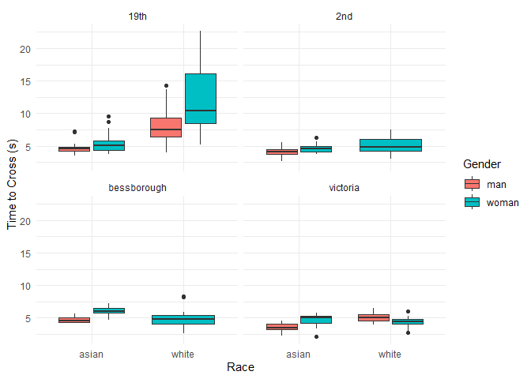

LOAD PACKAGES


``` r
library(tidyverse)
```

```
## ── Attaching core tidyverse packages ──────────────────────── tidyverse 2.0.0 ──
## ✔ dplyr     1.2.1     ✔ readr     2.2.0
## ✔ forcats   1.0.1     ✔ stringr   1.6.0
## ✔ ggplot2   4.0.3     ✔ tibble    3.3.1
## ✔ lubridate 1.9.5     ✔ tidyr     1.3.2
## ✔ purrr     1.2.2     
## ── Conflicts ────────────────────────────────────────── tidyverse_conflicts() ──
## ✖ dplyr::filter() masks stats::filter()
## ✖ dplyr::lag()    masks stats::lag()
## ℹ Use the conflicted package (<http://conflicted.r-lib.org/>) to force all conflicts to become errors
```

``` r
library(broom)
library(snakecase)
```

LOAD DATA - REMOVE INVALID TRIALS - TRIALS WITH UNAFFILIATED PEDESTRIANS


``` r
data_file <- read_csv("master_file.csv") %>% 
  mutate(
    ethnicity = as.factor(ethnicity),
    gender = as.factor(gender),
    location = as.factor(location),
    first_car_yield = as.factor(first_car_yield),
    did_car_proceed_before_across = as.factor(did_car_proceed_before_across)
  )
```

```
## Rows: 255 Columns: 12
## ── Column specification ────────────────────────────────────────────────────────
## Delimiter: ","
## chr (9): ethnicity, gender, location, date, time_of_day, first_car_yield, di...
## dbl (3): trial_number, num_cars_pass_before_yield, time_to_cross_street
## 
## ℹ Use `spec()` to retrieve the full column specification for this data.
## ℹ Specify the column types or set `show_col_types = FALSE` to quiet this message.
```

``` r
data <- data_file %>% drop_na(valid_trial)

data_19th_rm <- data %>% filter(location != "19th")
```

GENERAL DESCRIPTIVE STATS


``` r
data %>% 
  summarise(
    n = n(),
    mean_time = mean(time_to_cross_street, na.rm = TRUE),
    sd_time = sd(time_to_cross_street, na.rm = TRUE), 
    min_time = min(time_to_cross_street, na.rm = TRUE),
    max_time = max(time_to_cross_street, na.rm = TRUE),
    mean_cars = mean(num_cars_pass_before_yield, na.rm = TRUE), 
    sd_cars = sd(num_cars_pass_before_yield, na.rm = TRUE)
  )
```

```
## # A tibble: 1 × 7
##       n mean_time sd_time min_time max_time mean_cars sd_cars
##   <int>     <dbl>   <dbl>    <dbl>    <dbl>     <dbl>   <dbl>
## 1   210      5.57    2.85     2.07     22.7     0.567    1.02
```

FREQUENCY TABLES


``` r
data %>% count(ethnicity)
```

```
## # A tibble: 2 × 2
##   ethnicity     n
##   <fct>     <int>
## 1 asian       120
## 2 white        90
```

``` r
data %>% count(gender)
```

```
## # A tibble: 2 × 2
##   gender     n
##   <fct>  <int>
## 1 man       90
## 2 woman    120
```

``` r
data %>% count(location)
```

```
## # A tibble: 4 × 2
##   location        n
##   <fct>       <int>
## 1 19th           60
## 2 2nd            45
## 3 bessborough    45
## 4 victoria       60
```

``` r
data %>% count(first_car_yield)
```

```
## # A tibble: 2 × 2
##   first_car_yield     n
##   <fct>           <int>
## 1 no                 70
## 2 yes               140
```

``` r
data %>% count(did_car_proceed_before_across)
```

```
## # A tibble: 3 × 2
##   did_car_proceed_before_across     n
##   <fct>                         <int>
## 1 no                               18
## 2 yes                             175
## 3 <NA>                             17
```

FIRST CAR YIELD - LOGISTIC REGRESSION


``` r
m1 <- glm(first_car_yield ~ gender + factor(location),
          data = data,
          family = binomial())

tidy(m1)
```

```
## # A tibble: 5 × 5
##   term                        estimate std.error statistic      p.value
##   <chr>                          <dbl>     <dbl>     <dbl>        <dbl>
## 1 (Intercept)                   -0.449     0.317     -1.42 0.157       
## 2 genderwoman                   -0.350     0.345     -1.01 0.311       
## 3 factor(location)2nd            1.28      0.421      3.04 0.00233     
## 4 factor(location)bessborough    2.22      0.483      4.60 0.00000422  
## 5 factor(location)victoria       2.66      0.487      5.46 0.0000000468
```

``` r
summary(m1)
```

```
## 
## Call:
## glm(formula = first_car_yield ~ gender + factor(location), family = binomial(), 
##     data = data)
## 
## Coefficients:
##                             Estimate Std. Error z value Pr(>|z|)    
## (Intercept)                  -0.4488     0.3169  -1.416  0.15670    
## genderwoman                  -0.3496     0.3447  -1.014  0.31051    
## factor(location)2nd           1.2807     0.4206   3.045  0.00233 ** 
## factor(location)bessborough   2.2220     0.4830   4.600 4.22e-06 ***
## factor(location)victoria      2.6597     0.4868   5.463 4.68e-08 ***
## ---
## Signif. codes:  0 '***' 0.001 '**' 0.01 '*' 0.05 '.' 0.1 ' ' 1
## 
## (Dispersion parameter for binomial family taken to be 1)
## 
##     Null deviance: 267.34  on 209  degrees of freedom
## Residual deviance: 220.57  on 205  degrees of freedom
## AIC: 230.57
## 
## Number of Fisher Scoring iterations: 4
```

``` r
exp(coef(m1))
```

```
##                 (Intercept)                 genderwoman 
##                   0.6383743                   0.7049694 
##         factor(location)2nd factor(location)bessborough 
##                   3.5992448                   9.2262030 
##    factor(location)victoria 
##                  14.2920406
```


``` r
m2 <- glm(first_car_yield ~ ethnicity + factor(location),
          data = data,
          family = binomial())

tidy(m2)
```

```
## # A tibble: 5 × 5
##   term                        estimate std.error statistic      p.value
##   <chr>                          <dbl>     <dbl>     <dbl>        <dbl>
## 1 (Intercept)                   -0.928     0.334     -2.78 0.00543     
## 2 ethnicitywhite                 0.592     0.352      1.68 0.0924      
## 3 factor(location)2nd            1.34      0.426      3.14 0.00168     
## 4 factor(location)bessborough    2.29      0.489      4.68 0.00000288  
## 5 factor(location)victoria       2.69      0.491      5.48 0.0000000424
```

``` r
summary(m2)
```

```
## 
## Call:
## glm(formula = first_car_yield ~ ethnicity + factor(location), 
##     family = binomial(), data = data)
## 
## Coefficients:
##                             Estimate Std. Error z value Pr(>|z|)    
## (Intercept)                  -0.9281     0.3338  -2.780  0.00543 ** 
## ethnicitywhite                0.5917     0.3516   1.683  0.09237 .  
## factor(location)2nd           1.3377     0.4258   3.142  0.00168 ** 
## factor(location)bessborough   2.2870     0.4888   4.679 2.88e-06 ***
## factor(location)victoria      2.6900     0.4908   5.481 4.24e-08 ***
## ---
## Signif. codes:  0 '***' 0.001 '**' 0.01 '*' 0.05 '.' 0.1 ' ' 1
## 
## (Dispersion parameter for binomial family taken to be 1)
## 
##     Null deviance: 267.34  on 209  degrees of freedom
## Residual deviance: 218.69  on 205  degrees of freedom
## AIC: 228.69
## 
## Number of Fisher Scoring iterations: 4
```

``` r
exp(coef(m2))
```

```
##                 (Intercept)              ethnicitywhite 
##                   0.3953016                   1.8071193 
##         factor(location)2nd factor(location)bessborough 
##                   3.8104554                   9.8451747 
##    factor(location)victoria 
##                  14.7315214
```


``` r
m3 <- glm(first_car_yield ~ gender + ethnicity + factor(location),
          data = data,
          family = binomial(link = "logit"))

tidy(m3)
```

```
## # A tibble: 6 × 5
##   term                        estimate std.error statistic      p.value
##   <chr>                          <dbl>     <dbl>     <dbl>        <dbl>
## 1 (Intercept)                   -0.747     0.359     -2.08 0.0377      
## 2 genderwoman                   -0.493     0.354     -1.39 0.164       
## 3 ethnicitywhite                 0.694     0.360      1.93 0.0536      
## 4 factor(location)2nd            1.45      0.437      3.32 0.000910    
## 5 factor(location)bessborough    2.40      0.500      4.80 0.00000156  
## 6 factor(location)victoria       2.74      0.498      5.50 0.0000000390
```

``` r
summary(m3)
```

```
## 
## Call:
## glm(formula = first_car_yield ~ gender + ethnicity + factor(location), 
##     family = binomial(link = "logit"), data = data)
## 
## Coefficients:
##                             Estimate Std. Error z value Pr(>|z|)    
## (Intercept)                  -0.7465     0.3593  -2.078  0.03772 *  
## genderwoman                  -0.4928     0.3537  -1.393  0.16356    
## ethnicitywhite                0.6941     0.3596   1.930  0.05359 .  
## factor(location)2nd           1.4500     0.4371   3.317  0.00091 ***
## factor(location)bessborough   2.4027     0.5002   4.804 1.56e-06 ***
## factor(location)victoria      2.7387     0.4984   5.495 3.90e-08 ***
## ---
## Signif. codes:  0 '***' 0.001 '**' 0.01 '*' 0.05 '.' 0.1 ' ' 1
## 
## (Dispersion parameter for binomial family taken to be 1)
## 
##     Null deviance: 267.34  on 209  degrees of freedom
## Residual deviance: 216.71  on 204  degrees of freedom
## AIC: 228.71
## 
## Number of Fisher Scoring iterations: 4
```

``` r
exp(coef(m3))
```

```
##                 (Intercept)                 genderwoman 
##                   0.4740099                   0.6109120 
##              ethnicitywhite         factor(location)2nd 
##                   2.0019090                   4.2629448 
## factor(location)bessborough    factor(location)victoria 
##                  11.0528884                  15.4671069
```

TIME TO CROSS BY RACE DESCRIPTIVE STATS


``` r
data %>% 
  group_by(ethnicity) %>% 
  summarise(
    n = n(),
    mean = mean(time_to_cross_street),
    sd = sd(time_to_cross_street)
  )
```

```
## # A tibble: 2 × 4
##   ethnicity     n  mean    sd
##   <fct>     <int> <dbl> <dbl>
## 1 asian       120  4.75  1.20
## 2 white        90  6.65  3.88
```

19th TIMES REMOVED

``` r
data_19th_rm %>% 
  group_by(ethnicity) %>% 
  summarise(
    n = n(),
    mean = mean(time_to_cross_street),
    sd = sd(time_to_cross_street)
  )
```

```
## # A tibble: 2 × 4
##   ethnicity     n  mean    sd
##   <fct>     <int> <dbl> <dbl>
## 1 asian        90  4.61  1.06
## 2 white        60  4.86  1.22
```


ONE-WAY ANOVA RACE


``` r
race_model <- aov(
  time_to_cross_street~ethnicity,
  data = data
)

tidy(race_model)
```

```
## # A tibble: 2 × 6
##   term         df sumsq meansq statistic     p.value
##   <chr>     <dbl> <dbl>  <dbl>     <dbl>       <dbl>
## 1 ethnicity     1  184. 184.        25.4  0.00000101
## 2 Residuals   208 1510.   7.26      NA   NA
```

``` r
TukeyHSD(race_model)
```

```
##   Tukey multiple comparisons of means
##     95% family-wise confidence level
## 
## Fit: aov(formula = time_to_cross_street ~ ethnicity, data = data)
## 
## $ethnicity
##                 diff      lwr     upr p adj
## white-asian 1.893639 1.152938 2.63434 1e-06
```

19th REMOVED - ONE-WAY ANOVA RACE


``` r
race_model <- aov(
  time_to_cross_street~ethnicity,
  data = data_19th_rm
)

tidy(race_model)
```

```
## # A tibble: 2 × 6
##   term         df  sumsq meansq statistic p.value
##   <chr>     <dbl>  <dbl>  <dbl>     <dbl>   <dbl>
## 1 ethnicity     1   2.27   2.27      1.78   0.184
## 2 Residuals   148 188.     1.27     NA     NA
```

``` r
TukeyHSD(race_model)
```

```
##   Tukey multiple comparisons of means
##     95% family-wise confidence level
## 
## Fit: aov(formula = time_to_cross_street ~ ethnicity, data = data_19th_rm)
## 
## $ethnicity
##                  diff        lwr       upr     p adj
## white-asian 0.2510556 -0.1206324 0.6227435 0.1840026
```

ONE-WAY ANOVA LOCATION


``` r
location_model <- aov(
  time_to_cross_street~location,
  data = data
)

tidy(location_model)
```

```
## # A tibble: 2 × 6
##   term         df sumsq meansq statistic   p.value
##   <chr>     <dbl> <dbl>  <dbl>     <dbl>     <dbl>
## 1 location      3  402. 134.        21.3  4.51e-12
## 2 Residuals   206 1293.   6.28      NA   NA
```

``` r
TukeyHSD(location_model)
```

```
##   Tukey multiple comparisons of means
##     95% family-wise confidence level
## 
## Fit: aov(formula = time_to_cross_street ~ location, data = data)
## 
## $location
##                            diff        lwr        upr     p adj
## 2nd-19th             -3.0878889 -4.3674969 -1.8082809 0.0000000
## bessborough-19th     -2.4558889 -3.7354969 -1.1762809 0.0000083
## victoria-19th        -3.3083333 -4.4930201 -2.1236466 0.0000000
## bessborough-2nd       0.6320000 -0.7359585  1.9999585 0.6296602
## victoria-2nd         -0.2204444 -1.5000524  1.0591635 0.9702907
## victoria-bessborough -0.8524444 -2.1320524  0.4271635 0.3131102
```

TIME TO CROSS BY GENDER DESCRIPTIVE STATS


``` r
data %>% 
  group_by(gender) %>% 
  summarise(
    n = n(),
    mean = mean(time_to_cross_street),
    sd = sd(time_to_cross_street)
  )
```

```
## # A tibble: 2 × 4
##   gender     n  mean    sd
##   <fct>  <int> <dbl> <dbl>
## 1 man       90  5.04  2.00
## 2 woman    120  5.96  3.30
```


T-TEST


``` r
t.test(
  time_to_cross_street ~ gender,
  data = data
)
```

```
## 
## 	Welch Two Sample t-test
## 
## data:  time_to_cross_street by gender
## t = -2.4893, df = 199.95, p-value = 0.01362
## alternative hypothesis: true difference in means between group man and group woman is not equal to 0
## 95 percent confidence interval:
##  -1.6400207 -0.1902016
## sample estimates:
##   mean in group man mean in group woman 
##            5.042222            5.957333
```

TIME TO CROSS BY RACE X GENDER


``` r
data %>% 
  group_by(ethnicity, gender) %>% 
  summarise(
    n = n(),
    mean = mean(time_to_cross_street),
    sd = sd(time_to_cross_street),
    .groups = "drop"
  )
```

```
## # A tibble: 4 × 5
##   ethnicity gender     n  mean    sd
##   <fct>     <fct>  <int> <dbl> <dbl>
## 1 asian     man       60  4.27 0.924
## 2 asian     woman     60  5.24 1.26 
## 3 white     man       30  6.58 2.62 
## 4 white     woman     60  6.68 4.40
```


19th TIMES REMOVED - TIME TO CROSS BY RACE X GENDER


``` r
data_19th_rm %>% 
  group_by(ethnicity, gender) %>% 
  summarise(
    n = n(),
    mean = mean(time_to_cross_street),
    sd = sd(time_to_cross_street),
    .groups = "drop"
  )
```

```
## # A tibble: 4 × 5
##   ethnicity gender     n  mean    sd
##   <fct>     <fct>  <int> <dbl> <dbl>
## 1 asian     man       45  4.10 0.820
## 2 asian     woman     45  5.12 1.04 
## 3 white     man       15  5.08 0.784
## 4 white     woman     45  4.79 1.33
```


TWO-WAY ANOVA


``` r
time_model <- aov(
  time_to_cross_street ~ ethnicity*gender,
  data = data
)

tidy(time_model)
```

```
## # A tibble: 4 × 6
##   term                df   sumsq meansq statistic      p.value
##   <chr>            <dbl>   <dbl>  <dbl>     <dbl>        <dbl>
## 1 ethnicity            1  184.   184.       25.6   0.000000914
## 2 gender               1   19.0   19.0       2.64  0.106      
## 3 ethnicity:gender     1    9.01   9.01      1.25  0.264      
## 4 Residuals          206 1482.     7.19     NA    NA
```

NUMBER OF CARS PASSED BY GENDER AND/OR RACE DESCRIPTIVE STATS


``` r
data %>% 
  group_by(ethnicity, gender) %>% 
  summarise(
    n = n(),
    mean = mean(num_cars_pass_before_yield),
    sd = sd(num_cars_pass_before_yield),
    .groups = "drop"
  )
```

```
## # A tibble: 4 × 5
##   ethnicity gender     n  mean    sd
##   <fct>     <fct>  <int> <dbl> <dbl>
## 1 asian     man       60 0.383 0.715
## 2 asian     woman     60 0.683 0.911
## 3 white     man       30 0.6   0.894
## 4 white     woman     60 0.617 1.37
```

GENDER COMPARISON


``` r
t.test(
  num_cars_pass_before_yield ~ gender,
  data = data
)
```

```
## 
## 	Welch Two Sample t-test
## 
## data:  num_cars_pass_before_yield by gender
## t = -1.4518, df = 205.91, p-value = 0.1481
## alternative hypothesis: true difference in means between group man and group woman is not equal to 0
## 95 percent confidence interval:
##  -0.45849447  0.06960558
## sample estimates:
##   mean in group man mean in group woman 
##           0.4555556           0.6500000
```

RACE COMPARISON


``` r
cars_race <- aov(
  num_cars_pass_before_yield ~ ethnicity,
  data = data
)

tidy(cars_race)
```

```
## # A tibble: 2 × 6
##   term         df   sumsq meansq statistic p.value
##   <chr>     <dbl>   <dbl>  <dbl>     <dbl>   <dbl>
## 1 ethnicity     1   0.311  0.311     0.301   0.584
## 2 Residuals   208 215.     1.03     NA      NA
```

LOCATION COMPARISON


``` r
cars_location <- aov(
  num_cars_pass_before_yield ~ location, 
  data = data
)

tidy(cars_location)
```

```
## # A tibble: 2 × 6
##   term         df sumsq meansq statistic   p.value
##   <chr>     <dbl> <dbl>  <dbl>     <dbl>     <dbl>
## 1 location      3  45.7 15.2        18.5  1.19e-10
## 2 Residuals   206 170.   0.825      NA   NA
```

``` r
TukeyHSD(cars_location)
```

```
##   Tukey multiple comparisons of means
##     95% family-wise confidence level
## 
## Fit: aov(formula = num_cars_pass_before_yield ~ location, data = data)
## 
## $location
##                            diff        lwr        upr     p adj
## 2nd-19th             -0.8388889 -1.3027212 -0.3750566 0.0000301
## bessborough-19th     -0.9722222 -1.4360545 -0.5083899 0.0000009
## victoria-19th        -1.1500000 -1.5794253 -0.7205747 0.0000000
## bessborough-2nd      -0.1333333 -0.6291909  0.3625242 0.8983497
## victoria-2nd         -0.3111111 -0.7749434  0.1527212 0.3070898
## victoria-bessborough -0.1777778 -0.6416101  0.2860545 0.7537290
```

RACE AND GENDER COMPARISON


``` r
cars_model <- aov(
  num_cars_pass_before_yield ~ ethnicity * gender,
  data = data
)

tidy(cars_model)
```

```
## # A tibble: 4 × 6
##   term                df   sumsq meansq statistic p.value
##   <chr>            <dbl>   <dbl>  <dbl>     <dbl>   <dbl>
## 1 ethnicity            1   0.311  0.311     0.302   0.584
## 2 gender               1   1.74   1.74      1.69    0.195
## 3 ethnicity:gender     1   0.963  0.963     0.934   0.335
## 4 Residuals          206 213.     1.03     NA      NA
```

FIRST CAR YIELD BY RACE AND/OR GENDER RACE COMPARISON


``` r
data %>% 
  count(ethnicity, first_car_yield)
```

```
## # A tibble: 4 × 3
##   ethnicity first_car_yield     n
##   <fct>     <fct>           <int>
## 1 asian     no                 44
## 2 asian     yes                76
## 3 white     no                 26
## 4 white     yes                64
```

``` r
chisq.test(
  table(data$ethnicity,
        data$first_car_yield)
)
```

```
## 
## 	Pearson's Chi-squared test with Yates' continuity correction
## 
## data:  table(data$ethnicity, data$first_car_yield)
## X-squared = 1.0719, df = 1, p-value = 0.3005
```

LOCATION COMPARISON


``` r
data %>% 
  count(location, first_car_yield)
```

```
## # A tibble: 8 × 3
##   location    first_car_yield     n
##   <fct>       <fct>           <int>
## 1 19th        no                 39
## 2 19th        yes                21
## 3 2nd         no                 16
## 4 2nd         yes                29
## 5 bessborough no                  8
## 6 bessborough yes                37
## 7 victoria    no                  7
## 8 victoria    yes                53
```

``` r
chisq.test(
  table(data$location,
        data$first_car_yield)
)
```

```
## 
## 	Pearson's Chi-squared test
## 
## data:  table(data$location, data$first_car_yield)
## X-squared = 44.75, df = 3, p-value = 1.046e-09
```

GENDER COMPARISON


``` r
data %>% 
  count(gender, first_car_yield)
```

```
## # A tibble: 4 × 3
##   gender first_car_yield     n
##   <fct>  <fct>           <int>
## 1 man    no                 28
## 2 man    yes                62
## 3 woman  no                 42
## 4 woman  yes                78
```

``` r
chisq.test(
  table(data$gender,
        data$first_car_yield)
)
```

```
## 
## 	Pearson's Chi-squared test with Yates' continuity correction
## 
## data:  table(data$gender, data$first_car_yield)
## X-squared = 0.19687, df = 1, p-value = 0.6573
```

LOGISTIC REGRESSION


``` r
firstcar_model <- glm(
  first_car_yield ~ ethnicity + gender,
  data = data,
  family = binomial()
)

tidy(firstcar_model)
```

```
## # A tibble: 3 × 5
##   term           estimate std.error statistic p.value
##   <chr>             <dbl>     <dbl>     <dbl>   <dbl>
## 1 (Intercept)       0.670     0.246     2.72  0.00646
## 2 ethnicitywhite    0.396     0.305     1.30  0.195  
## 3 genderwoman      -0.243     0.303    -0.801 0.423
```

DID CAR PROCEED BY RACE AND/OR GENDER RACE COMPARISON


``` r
data %>% 
  count(ethnicity, did_car_proceed_before_across)
```

```
## # A tibble: 6 × 3
##   ethnicity did_car_proceed_before_across     n
##   <fct>     <fct>                         <int>
## 1 asian     no                                7
## 2 asian     yes                             102
## 3 asian     <NA>                             11
## 4 white     no                               11
## 5 white     yes                              73
## 6 white     <NA>                              6
```

``` r
chisq.test(
  table(data$ethnicity,
        data$did_car_proceed_before_across)
)
```

```
## 
## 	Pearson's Chi-squared test with Yates' continuity correction
## 
## data:  table(data$ethnicity, data$did_car_proceed_before_across)
## X-squared = 1.7714, df = 1, p-value = 0.1832
```

LOCATION COMPARISON


``` r
data %>% 
  count(location, did_car_proceed_before_across)
```

```
## # A tibble: 11 × 3
##    location    did_car_proceed_before_across     n
##    <fct>       <fct>                         <int>
##  1 19th        no                                5
##  2 19th        yes                              43
##  3 19th        <NA>                             12
##  4 2nd         no                                5
##  5 2nd         yes                              36
##  6 2nd         <NA>                              4
##  7 bessborough no                                2
##  8 bessborough yes                              42
##  9 bessborough <NA>                              1
## 10 victoria    no                                6
## 11 victoria    yes                              54
```

``` r
chisq.test(
  table(data$location,
        data$did_car_proceed_before_across)
)
```

```
## Warning in chisq.test(table(data$location,
## data$did_car_proceed_before_across)): Chi-squared approximation may be
## incorrect
```

```
## 
## 	Pearson's Chi-squared test
## 
## data:  table(data$location, data$did_car_proceed_before_across)
## X-squared = 1.6879, df = 3, p-value = 0.6396
```

GENDER COMPARISON


``` r
data %>% 
  count(gender, did_car_proceed_before_across)
```

```
## # A tibble: 6 × 3
##   gender did_car_proceed_before_across     n
##   <fct>  <fct>                         <int>
## 1 man    no                                4
## 2 man    yes                              78
## 3 man    <NA>                              8
## 4 woman  no                               14
## 5 woman  yes                              97
## 6 woman  <NA>                              9
```

``` r
chisq.test(
  table(data$gender,
        data$did_car_proceed_before_across)
)
```

```
## 
## 	Pearson's Chi-squared test with Yates' continuity correction
## 
## data:  table(data$gender, data$did_car_proceed_before_across)
## X-squared = 2.4843, df = 1, p-value = 0.115
```

LOGISTIC REGRESSION


``` r
proceed_model <- glm(
  did_car_proceed_before_across ~ ethnicity + gender,
  data = data,
  family = binomial()
)

tidy(proceed_model)
```

```
## # A tibble: 3 × 5
##   term           estimate std.error statistic      p.value
##   <chr>             <dbl>     <dbl>     <dbl>        <dbl>
## 1 (Intercept)       3.21      0.564      5.69 0.0000000125
## 2 ethnicitywhite   -0.628     0.517     -1.21 0.225       
## 3 genderwoman      -0.910     0.597     -1.52 0.127
```

DID CAR YIELD CLOSE OR FAR BY RACE AND/OR GENDER GENDER COMPARISON


``` r
data %>% 
  count(gender, car_stop_close_or_far)
```

```
## # A tibble: 6 × 3
##   gender car_stop_close_or_far     n
##   <fct>  <chr>                 <int>
## 1 man    close                     7
## 2 man    far                      75
## 3 man    <NA>                      8
## 4 woman  close                     8
## 5 woman  far                     103
## 6 woman  <NA>                      9
```

``` r
chisq.test(
  table(data$gender,
        data$car_stop_close_or_far)
)
```

```
## 
## 	Pearson's Chi-squared test with Yates' continuity correction
## 
## data:  table(data$gender, data$car_stop_close_or_far)
## X-squared = 0.004767, df = 1, p-value = 0.945
```

RACE COMPARISON


``` r
data %>% 
  count(ethnicity, car_stop_close_or_far)
```

```
## # A tibble: 6 × 3
##   ethnicity car_stop_close_or_far     n
##   <fct>     <chr>                 <int>
## 1 asian     close                    11
## 2 asian     far                      98
## 3 asian     <NA>                     11
## 4 white     close                     4
## 5 white     far                      80
## 6 white     <NA>                      6
```

``` r
chisq.test(
  table(data$ethnicity,
        data$car_stop_close_or_far)
)
```

```
## 
## 	Pearson's Chi-squared test with Yates' continuity correction
## 
## data:  table(data$ethnicity, data$car_stop_close_or_far)
## X-squared = 1.2101, df = 1, p-value = 0.2713
```

LOCATION COMPARISON


``` r
data %>% 
  count(location, car_stop_close_or_far)
```

```
## # A tibble: 11 × 3
##    location    car_stop_close_or_far     n
##    <fct>       <chr>                 <int>
##  1 19th        close                     8
##  2 19th        far                      40
##  3 19th        <NA>                     12
##  4 2nd         close                     3
##  5 2nd         far                      38
##  6 2nd         <NA>                      4
##  7 bessborough close                     1
##  8 bessborough far                      43
##  9 bessborough <NA>                      1
## 10 victoria    close                     3
## 11 victoria    far                      57
```

``` r
chisq.test(
  table(data$location,
        data$car_stop_close_or_far)
)
```

```
## Warning in chisq.test(table(data$location, data$car_stop_close_or_far)):
## Chi-squared approximation may be incorrect
```

```
## 
## 	Pearson's Chi-squared test
## 
## data:  table(data$location, data$car_stop_close_or_far)
## X-squared = 7.8093, df = 3, p-value = 0.05012
```

LOGISTIC REGRESSION


``` r
data$car_stop_close_or_far_bin <- ifelse(data$car_stop_close_or_far == "far", 1,
                                  ifelse(data$car_stop_close_or_far == "close", 0, NA))

yield_model <- glm(
  car_stop_close_or_far_bin ~ ethnicity + gender,
  data = data,
  family = binomial()
)

tidy(yield_model)
```

```
## # A tibble: 3 × 5
##   term           estimate std.error statistic     p.value
##   <chr>             <dbl>     <dbl>     <dbl>       <dbl>
## 1 (Intercept)      2.17       0.413    5.25   0.000000152
## 2 ethnicitywhite   0.802      0.613    1.31   0.191      
## 3 genderwoman      0.0336     0.551    0.0610 0.951
```

VISUALIZATIONS TIME BY RACE


``` r
data %>% 
  ggplot(aes(x = ethnicity,
         y = time_to_cross_street,
         fill = ethnicity)) +
  geom_boxplot() +
  labs(
    x = "Race",
    y = "Time to Cross (s)"
  ) +
  theme_minimal(
  )
```

<!-- -->

TIME BY GENDER


``` r
data %>% 
  ggplot(aes(x = gender,
         y = time_to_cross_street,
         fill = gender)) +
  geom_boxplot(show.legend = FALSE) +
  labs(
    x = "Gender",
    y = "Time to Cross (s)"
  ) + 
  theme_minimal()
```

<!-- -->


``` r
data %>% 
  ggplot(aes(x = time_to_cross_street,
             y = gender)) +
  geom_violin() +
  geom_jitter(show.legend = FALSE) +
  geom_smooth(aes(group = 1), method = "lm", se = FALSE, size = 1.2) +
  labs(
    x = "Time to Cross (s)",
    y = "Gender"
  ) + 
  theme_minimal()
```

```
## Warning: Using `size` aesthetic for lines was deprecated in ggplot2 3.4.0.
## ℹ Please use `linewidth` instead.
## This warning is displayed once per session.
## Call `lifecycle::last_lifecycle_warnings()` to see where this warning was
## generated.
```

```
## `geom_smooth()` using formula = 'y ~ x'
```

<!-- -->

``` r
data %>% 
  ggplot(aes(sample = time_to_cross_street)) +
  geom_qq() +
  stat_qq_line() +
  facet_wrap(~gender)
```

<!-- -->

``` r
  theme_minimal()
```

```
## <theme> List of 144
##  $ line                            : <ggplot2::element_line>
##   ..@ colour       : chr "black"
##   ..@ linewidth    : num 0.5
##   ..@ linetype     : num 1
##   ..@ lineend      : chr "butt"
##   ..@ linejoin     : chr "round"
##   ..@ arrow        : logi FALSE
##   ..@ arrow.fill   : chr "black"
##   ..@ inherit.blank: logi TRUE
##  $ rect                            : <ggplot2::element_rect>
##   ..@ fill         : chr "white"
##   ..@ colour       : chr "black"
##   ..@ linewidth    : num 0.5
##   ..@ linetype     : num 1
##   ..@ linejoin     : chr "round"
##   ..@ inherit.blank: logi TRUE
##  $ text                            : <ggplot2::element_text>
##   ..@ family       : chr ""
##   ..@ face         : chr "plain"
##   ..@ italic       : chr NA
##   ..@ fontweight   : num NA
##   ..@ fontwidth    : num NA
##   ..@ colour       : chr "black"
##   ..@ size         : num 11
##   ..@ hjust        : num 0.5
##   ..@ vjust        : num 0.5
##   ..@ angle        : num 0
##   ..@ lineheight   : num 0.9
##   ..@ margin       : <ggplot2::margin> num [1:4] 0 0 0 0
##   ..@ debug        : logi FALSE
##   ..@ inherit.blank: logi TRUE
##  $ title                           : <ggplot2::element_text>
##   ..@ family       : NULL
##   ..@ face         : NULL
##   ..@ italic       : chr NA
##   ..@ fontweight   : num NA
##   ..@ fontwidth    : num NA
##   ..@ colour       : NULL
##   ..@ size         : NULL
##   ..@ hjust        : NULL
##   ..@ vjust        : NULL
##   ..@ angle        : NULL
##   ..@ lineheight   : NULL
##   ..@ margin       : NULL
##   ..@ debug        : NULL
##   ..@ inherit.blank: logi TRUE
##  $ point                           : <ggplot2::element_point>
##   ..@ colour       : chr "black"
##   ..@ shape        : num 19
##   ..@ size         : num 1.5
##   ..@ fill         : chr "white"
##   ..@ stroke       : num 0.5
##   ..@ inherit.blank: logi TRUE
##  $ polygon                         : <ggplot2::element_polygon>
##   ..@ fill         : chr "white"
##   ..@ colour       : chr "black"
##   ..@ linewidth    : num 0.5
##   ..@ linetype     : num 1
##   ..@ linejoin     : chr "round"
##   ..@ inherit.blank: logi TRUE
##  $ geom                            : <ggplot2::element_geom>
##   ..@ ink        : chr "black"
##   ..@ paper      : chr "white"
##   ..@ accent     : chr "#3366FF"
##   ..@ linewidth  : num 0.5
##   ..@ borderwidth: num 0.5
##   ..@ linetype   : int 1
##   ..@ bordertype : int 1
##   ..@ family     : chr ""
##   ..@ fontsize   : num 3.87
##   ..@ pointsize  : num 1.5
##   ..@ pointshape : num 19
##   ..@ colour     : NULL
##   ..@ fill       : NULL
##  $ spacing                         : 'simpleUnit' num 5.5points
##   ..- attr(*, "unit")= int 8
##  $ margins                         : <ggplot2::margin> num [1:4] 5.5 5.5 5.5 5.5
##  $ aspect.ratio                    : NULL
##  $ axis.title                      : NULL
##  $ axis.title.x                    : <ggplot2::element_text>
##   ..@ family       : NULL
##   ..@ face         : NULL
##   ..@ italic       : chr NA
##   ..@ fontweight   : num NA
##   ..@ fontwidth    : num NA
##   ..@ colour       : NULL
##   ..@ size         : NULL
##   ..@ hjust        : NULL
##   ..@ vjust        : num 1
##   ..@ angle        : NULL
##   ..@ lineheight   : NULL
##   ..@ margin       : <ggplot2::margin> num [1:4] 2.75 0 0 0
##   ..@ debug        : NULL
##   ..@ inherit.blank: logi TRUE
##  $ axis.title.x.top                : <ggplot2::element_text>
##   ..@ family       : NULL
##   ..@ face         : NULL
##   ..@ italic       : chr NA
##   ..@ fontweight   : num NA
##   ..@ fontwidth    : num NA
##   ..@ colour       : NULL
##   ..@ size         : NULL
##   ..@ hjust        : NULL
##   ..@ vjust        : num 0
##   ..@ angle        : NULL
##   ..@ lineheight   : NULL
##   ..@ margin       : <ggplot2::margin> num [1:4] 0 0 2.75 0
##   ..@ debug        : NULL
##   ..@ inherit.blank: logi TRUE
##  $ axis.title.x.bottom             : NULL
##  $ axis.title.y                    : <ggplot2::element_text>
##   ..@ family       : NULL
##   ..@ face         : NULL
##   ..@ italic       : chr NA
##   ..@ fontweight   : num NA
##   ..@ fontwidth    : num NA
##   ..@ colour       : NULL
##   ..@ size         : NULL
##   ..@ hjust        : NULL
##   ..@ vjust        : num 1
##   ..@ angle        : num 90
##   ..@ lineheight   : NULL
##   ..@ margin       : <ggplot2::margin> num [1:4] 0 2.75 0 0
##   ..@ debug        : NULL
##   ..@ inherit.blank: logi TRUE
##  $ axis.title.y.left               : NULL
##  $ axis.title.y.right              : <ggplot2::element_text>
##   ..@ family       : NULL
##   ..@ face         : NULL
##   ..@ italic       : chr NA
##   ..@ fontweight   : num NA
##   ..@ fontwidth    : num NA
##   ..@ colour       : NULL
##   ..@ size         : NULL
##   ..@ hjust        : NULL
##   ..@ vjust        : num 1
##   ..@ angle        : num -90
##   ..@ lineheight   : NULL
##   ..@ margin       : <ggplot2::margin> num [1:4] 0 0 0 2.75
##   ..@ debug        : NULL
##   ..@ inherit.blank: logi TRUE
##  $ axis.text                       : <ggplot2::element_text>
##   ..@ family       : NULL
##   ..@ face         : NULL
##   ..@ italic       : chr NA
##   ..@ fontweight   : num NA
##   ..@ fontwidth    : num NA
##   ..@ colour       : chr "#4D4D4DFF"
##   ..@ size         : 'rel' num 0.8
##   ..@ hjust        : NULL
##   ..@ vjust        : NULL
##   ..@ angle        : NULL
##   ..@ lineheight   : NULL
##   ..@ margin       : NULL
##   ..@ debug        : NULL
##   ..@ inherit.blank: logi TRUE
##  $ axis.text.x                     : <ggplot2::element_text>
##   ..@ family       : NULL
##   ..@ face         : NULL
##   ..@ italic       : chr NA
##   ..@ fontweight   : num NA
##   ..@ fontwidth    : num NA
##   ..@ colour       : NULL
##   ..@ size         : NULL
##   ..@ hjust        : NULL
##   ..@ vjust        : num 1
##   ..@ angle        : NULL
##   ..@ lineheight   : NULL
##   ..@ margin       : <ggplot2::margin> num [1:4] 2.2 0 0 0
##   ..@ debug        : NULL
##   ..@ inherit.blank: logi TRUE
##  $ axis.text.x.top                 : <ggplot2::element_text>
##   ..@ family       : NULL
##   ..@ face         : NULL
##   ..@ italic       : chr NA
##   ..@ fontweight   : num NA
##   ..@ fontwidth    : num NA
##   ..@ colour       : NULL
##   ..@ size         : NULL
##   ..@ hjust        : NULL
##   ..@ vjust        : NULL
##   ..@ angle        : NULL
##   ..@ lineheight   : NULL
##   ..@ margin       : <ggplot2::margin> num [1:4] 0 0 4.95 0
##   ..@ debug        : NULL
##   ..@ inherit.blank: logi TRUE
##  $ axis.text.x.bottom              : <ggplot2::element_text>
##   ..@ family       : NULL
##   ..@ face         : NULL
##   ..@ italic       : chr NA
##   ..@ fontweight   : num NA
##   ..@ fontwidth    : num NA
##   ..@ colour       : NULL
##   ..@ size         : NULL
##   ..@ hjust        : NULL
##   ..@ vjust        : NULL
##   ..@ angle        : NULL
##   ..@ lineheight   : NULL
##   ..@ margin       : <ggplot2::margin> num [1:4] 4.95 0 0 0
##   ..@ debug        : NULL
##   ..@ inherit.blank: logi TRUE
##  $ axis.text.y                     : <ggplot2::element_text>
##   ..@ family       : NULL
##   ..@ face         : NULL
##   ..@ italic       : chr NA
##   ..@ fontweight   : num NA
##   ..@ fontwidth    : num NA
##   ..@ colour       : NULL
##   ..@ size         : NULL
##   ..@ hjust        : num 1
##   ..@ vjust        : NULL
##   ..@ angle        : NULL
##   ..@ lineheight   : NULL
##   ..@ margin       : <ggplot2::margin> num [1:4] 0 2.2 0 0
##   ..@ debug        : NULL
##   ..@ inherit.blank: logi TRUE
##  $ axis.text.y.left                : <ggplot2::element_text>
##   ..@ family       : NULL
##   ..@ face         : NULL
##   ..@ italic       : chr NA
##   ..@ fontweight   : num NA
##   ..@ fontwidth    : num NA
##   ..@ colour       : NULL
##   ..@ size         : NULL
##   ..@ hjust        : NULL
##   ..@ vjust        : NULL
##   ..@ angle        : NULL
##   ..@ lineheight   : NULL
##   ..@ margin       : <ggplot2::margin> num [1:4] 0 4.95 0 0
##   ..@ debug        : NULL
##   ..@ inherit.blank: logi TRUE
##  $ axis.text.y.right               : <ggplot2::element_text>
##   ..@ family       : NULL
##   ..@ face         : NULL
##   ..@ italic       : chr NA
##   ..@ fontweight   : num NA
##   ..@ fontwidth    : num NA
##   ..@ colour       : NULL
##   ..@ size         : NULL
##   ..@ hjust        : NULL
##   ..@ vjust        : NULL
##   ..@ angle        : NULL
##   ..@ lineheight   : NULL
##   ..@ margin       : <ggplot2::margin> num [1:4] 0 0 0 4.95
##   ..@ debug        : NULL
##   ..@ inherit.blank: logi TRUE
##  $ axis.text.theta                 : NULL
##  $ axis.text.r                     : <ggplot2::element_text>
##   ..@ family       : NULL
##   ..@ face         : NULL
##   ..@ italic       : chr NA
##   ..@ fontweight   : num NA
##   ..@ fontwidth    : num NA
##   ..@ colour       : NULL
##   ..@ size         : NULL
##   ..@ hjust        : num 0.5
##   ..@ vjust        : NULL
##   ..@ angle        : NULL
##   ..@ lineheight   : NULL
##   ..@ margin       : <ggplot2::margin> num [1:4] 0 2.2 0 2.2
##   ..@ debug        : NULL
##   ..@ inherit.blank: logi TRUE
##  $ axis.ticks                      : <ggplot2::element_blank>
##  $ axis.ticks.x                    : NULL
##  $ axis.ticks.x.top                : NULL
##  $ axis.ticks.x.bottom             : NULL
##  $ axis.ticks.y                    : NULL
##  $ axis.ticks.y.left               : NULL
##  $ axis.ticks.y.right              : NULL
##  $ axis.ticks.theta                : NULL
##  $ axis.ticks.r                    : NULL
##  $ axis.minor.ticks.x.top          : NULL
##  $ axis.minor.ticks.x.bottom       : NULL
##  $ axis.minor.ticks.y.left         : NULL
##  $ axis.minor.ticks.y.right        : NULL
##  $ axis.minor.ticks.theta          : NULL
##  $ axis.minor.ticks.r              : NULL
##  $ axis.ticks.length               : 'rel' num 0.5
##  $ axis.ticks.length.x             : NULL
##  $ axis.ticks.length.x.top         : NULL
##  $ axis.ticks.length.x.bottom      : NULL
##  $ axis.ticks.length.y             : NULL
##  $ axis.ticks.length.y.left        : NULL
##  $ axis.ticks.length.y.right       : NULL
##  $ axis.ticks.length.theta         : NULL
##  $ axis.ticks.length.r             : NULL
##  $ axis.minor.ticks.length         : 'rel' num 0.75
##  $ axis.minor.ticks.length.x       : NULL
##  $ axis.minor.ticks.length.x.top   : NULL
##  $ axis.minor.ticks.length.x.bottom: NULL
##  $ axis.minor.ticks.length.y       : NULL
##  $ axis.minor.ticks.length.y.left  : NULL
##  $ axis.minor.ticks.length.y.right : NULL
##  $ axis.minor.ticks.length.theta   : NULL
##  $ axis.minor.ticks.length.r       : NULL
##  $ axis.line                       : <ggplot2::element_blank>
##  $ axis.line.x                     : NULL
##  $ axis.line.x.top                 : NULL
##  $ axis.line.x.bottom              : NULL
##  $ axis.line.y                     : NULL
##  $ axis.line.y.left                : NULL
##  $ axis.line.y.right               : NULL
##  $ axis.line.theta                 : NULL
##  $ axis.line.r                     : NULL
##  $ legend.background               : <ggplot2::element_blank>
##  $ legend.margin                   : NULL
##  $ legend.spacing                  : 'rel' num 2
##  $ legend.spacing.x                : NULL
##  $ legend.spacing.y                : NULL
##  $ legend.key                      : <ggplot2::element_blank>
##  $ legend.key.size                 : 'simpleUnit' num 1.2lines
##   ..- attr(*, "unit")= int 3
##  $ legend.key.height               : NULL
##  $ legend.key.width                : NULL
##  $ legend.key.spacing              : NULL
##  $ legend.key.spacing.x            : NULL
##  $ legend.key.spacing.y            : NULL
##  $ legend.key.justification        : NULL
##  $ legend.frame                    : NULL
##  $ legend.ticks                    : NULL
##  $ legend.ticks.length             : 'rel' num 0.2
##  $ legend.axis.line                : NULL
##  $ legend.text                     : <ggplot2::element_text>
##   ..@ family       : NULL
##   ..@ face         : NULL
##   ..@ italic       : chr NA
##   ..@ fontweight   : num NA
##   ..@ fontwidth    : num NA
##   ..@ colour       : NULL
##   ..@ size         : 'rel' num 0.8
##   ..@ hjust        : NULL
##   ..@ vjust        : NULL
##   ..@ angle        : NULL
##   ..@ lineheight   : NULL
##   ..@ margin       : NULL
##   ..@ debug        : NULL
##   ..@ inherit.blank: logi TRUE
##  $ legend.text.position            : NULL
##  $ legend.title                    : <ggplot2::element_text>
##   ..@ family       : NULL
##   ..@ face         : NULL
##   ..@ italic       : chr NA
##   ..@ fontweight   : num NA
##   ..@ fontwidth    : num NA
##   ..@ colour       : NULL
##   ..@ size         : NULL
##   ..@ hjust        : num 0
##   ..@ vjust        : NULL
##   ..@ angle        : NULL
##   ..@ lineheight   : NULL
##   ..@ margin       : NULL
##   ..@ debug        : NULL
##   ..@ inherit.blank: logi TRUE
##  $ legend.title.position           : NULL
##  $ legend.position                 : chr "right"
##  $ legend.position.inside          : NULL
##  $ legend.direction                : NULL
##  $ legend.byrow                    : NULL
##  $ legend.justification            : chr "center"
##  $ legend.justification.top        : NULL
##  $ legend.justification.bottom     : NULL
##  $ legend.justification.left       : NULL
##  $ legend.justification.right      : NULL
##  $ legend.justification.inside     : NULL
##   [list output truncated]
##  @ complete: logi TRUE
##  @ validate: logi TRUE
```

19TH REMOVED - TIME TO CROSS BY GENDER

``` r
data_19th_rm %>% 
  ggplot(aes(x = gender,
         y = time_to_cross_street,
         fill = gender)) +
  geom_boxplot(show.legend = FALSE) +
  labs(
    x = "Gender",
    y = "Time to Cross (s)"
  ) + 
  theme_minimal()
```

<!-- -->

TIME BY RACE AND GENDER - GROUPED BY LOCATION


``` r
data%>% 
  ggplot(aes(x = ethnicity,
             y = time_to_cross_street,
               fill = gender)) +
  geom_boxplot() +
  facet_wrap(~location) +
  labs(
    x = "Race",
    y = "Time to Cross (s)",
    fill = "Gender"
  ) +
  theme_minimal()
```

<!-- -->

CARS PASSED BY RACE AND GENDER


``` r
data %>% 
  ggplot(aes(x = ethnicity,
             y = num_cars_pass_before_yield,
             fill = gender)) +
  geom_col() +
  labs (
    x = "Race",
    y = "Number of Cars Passed",
    fill = "Gender"
  ) +
  theme_minimal()
```

<!-- -->

PROPORTION OF FIRST CAR YIELD RACE VISUAL


``` r
data %>% 
  ggplot(aes(x = ethnicity,
             fill = first_car_yield)
         ) +
  geom_bar(position = "fill") +
  labs (
    x = "Race",
    y = "Proportion",
    fill = "Did the First Car Yield"
  ) +
  theme_minimal()
```

<!-- -->

PROPORTION OF FIRST CAR YIELD GENDER VISUAL


``` r
data %>% 
  ggplot(aes(x = gender,
             fill = first_car_yield)
         ) +
  geom_bar(position = "fill") +
  labs (
    x = "Gender",
    y = "Proportion",
    fill = "Did the First Car Yield"
  ) +
  theme_minimal()
```

<!-- -->
