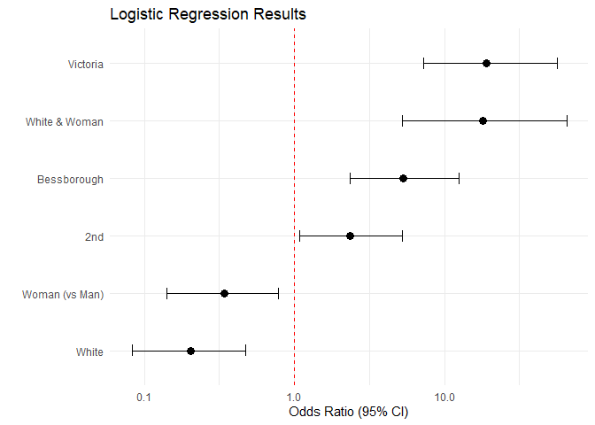
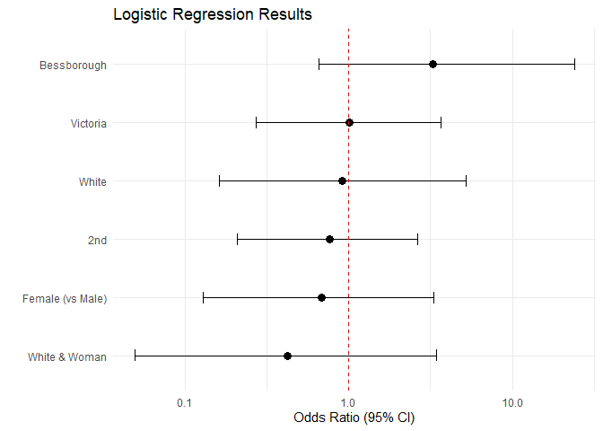
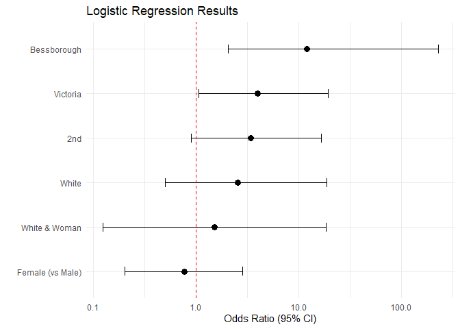

# 1. Load Packages

``` r
library(tidyverse)
```

```
## ── Attaching core tidyverse packages ──────────────────────── tidyverse 2.0.0 ──
## ✔ dplyr     1.2.1     ✔ readr     2.2.0
## ✔ forcats   1.0.1     ✔ stringr   1.6.0
## ✔ ggplot2   4.0.3     ✔ tibble    3.3.1
## ✔ lubridate 1.9.5     ✔ tidyr     1.3.2
## ✔ purrr     1.2.2     
## ── Conflicts ────────────────────────────────────────── tidyverse_conflicts() ──
## ✖ dplyr::filter() masks stats::filter()
## ✖ dplyr::lag()    masks stats::lag()
## ℹ Use the conflicted package (<http://conflicted.r-lib.org/>) to force all conflicts to become errors
```

``` r
library(broom)
library(snakecase)
library(stargazer)
```

```
## 
## Please cite as: 
## 
##  Hlavac, Marek (2022). stargazer: Well-Formatted Regression and Summary Statistics Tables.
##  R package version 5.2.3. https://CRAN.R-project.org/package=stargazer
```

``` r
library(gtsummary)
```

```
## Warning: package 'gtsummary' was built under R version 4.6.1
```

``` r
library(broom.helpers)
```

```
## Warning: package 'broom.helpers' was built under R version 4.6.1
```

```
## 
## Attaching package: 'broom.helpers'
## 
## The following objects are masked from 'package:gtsummary':
## 
##     all_categorical, all_continuous, all_contrasts, all_dichotomous,
##     all_interaction, all_intercepts
```

``` r
library(gt)
```

```
## Warning: package 'gt' was built under R version 4.6.1
```

# 2. Load data - Remove invalid trials - Trials with unaffiliated pedestrians

``` r
data_file <- read_csv("master_file.csv") %>% 
  mutate(
    ethnicity = as.factor(ethnicity),
    gender = as.factor(gender),
    location = as.factor(location),
    first_car_yield = as.factor(first_car_yield),
    did_car_proceed_before_across = as.factor(did_car_proceed_before_across)
  )
```

```
## Rows: 363 Columns: 15
## ── Column specification ────────────────────────────────────────────────────────
## Delimiter: ","
## chr (10): ethnicity, gender, location, date, time_of_day, close_side_first_c...
## dbl  (5): order, trial_number, close_side_num_cars_pass_before_yield, num_ca...
## 
## ℹ Use `spec()` to retrieve the full column specification for this data.
## ℹ Specify the column types or set `show_col_types = FALSE` to quiet this message.
```

``` r
data <- data_file %>% drop_na(valid_trial)

data_19th_rm <- data %>% filter(location != "19th")
```

# 3. General descriptive statistics

``` r
data %>% 
  summarise(
    n = n(),
    mean_time = mean(time_to_cross_street, na.rm = TRUE),
    sd_time = sd(time_to_cross_street, na.rm = TRUE), 
    min_time = min(time_to_cross_street, na.rm = TRUE),
    max_time = max(time_to_cross_street, na.rm = TRUE),
    mean_cars = mean(num_cars_pass_before_yield, na.rm = TRUE), 
    sd_cars = sd(num_cars_pass_before_yield, na.rm = TRUE)
  )
```

```
## # A tibble: 1 × 7
##       n mean_time sd_time min_time max_time mean_cars sd_cars
##   <int>     <dbl>   <dbl>    <dbl>    <dbl>     <dbl>   <dbl>
## 1   240      5.62    2.72     2.07     22.7     0.617   0.995
```

# 4. Frequency tables 

``` r
data %>% count(ethnicity)
```

```
## # A tibble: 2 × 2
##   ethnicity     n
##   <fct>     <int>
## 1 asian       120
## 2 white       120
```

``` r
data %>% count(gender)
```

```
## # A tibble: 2 × 2
##   gender     n
##   <fct>  <int>
## 1 man      120
## 2 woman    120
```

``` r
data %>% count(location)
```

```
## # A tibble: 4 × 2
##   location        n
##   <fct>       <int>
## 1 19th           60
## 2 2nd            60
## 3 bessborough    60
## 4 victoria       60
```

``` r
data %>% count(first_car_yield)
```

```
## # A tibble: 2 × 2
##   first_car_yield     n
##   <fct>           <int>
## 1 no                 92
## 2 yes               148
```

``` r
data %>% count(did_car_proceed_before_across)
```

```
## # A tibble: 3 × 2
##   did_car_proceed_before_across     n
##   <fct>                         <int>
## 1 no                               20
## 2 yes                             199
## 3 <NA>                             21
```
# 5. First car yield
# 5a. First car yield - Descriptive stats

``` r
data %>% 
  group_by(gender) %>% 
  count(first_car_yield) %>% 
  mutate(percentage = n / sum(n) * 100)
```

```
## # A tibble: 4 × 4
## # Groups:   gender [2]
##   gender first_car_yield     n percentage
##   <fct>  <fct>           <int>      <dbl>
## 1 man    no                 50       41.7
## 2 man    yes                70       58.3
## 3 woman  no                 42       35  
## 4 woman  yes                78       65
```

``` r
  .groups = "drop"

data %>% 
  group_by(ethnicity) %>% 
  count(first_car_yield) %>% 
  mutate(percentage = n / sum(n) * 100)
```

```
## # A tibble: 4 × 4
## # Groups:   ethnicity [2]
##   ethnicity first_car_yield     n percentage
##   <fct>     <fct>           <int>      <dbl>
## 1 asian     no                 44       36.7
## 2 asian     yes                76       63.3
## 3 white     no                 48       40  
## 4 white     yes                72       60
```

``` r
  .groups = "drop"
  
data %>% 
  group_by(ethnicity, gender) %>% 
  count(first_car_yield) %>% 
  mutate(percentage = n / sum(n) * 100)
```

```
## # A tibble: 8 × 5
## # Groups:   ethnicity, gender [4]
##   ethnicity gender first_car_yield     n percentage
##   <fct>     <fct>  <fct>           <int>      <dbl>
## 1 asian     man    no                 16       26.7
## 2 asian     man    yes                44       73.3
## 3 asian     woman  no                 28       46.7
## 4 asian     woman  yes                32       53.3
## 5 white     man    no                 34       56.7
## 6 white     man    yes                26       43.3
## 7 white     woman  no                 14       23.3
## 8 white     woman  yes                46       76.7
```

``` r
  .groups = "drop"
```

# 5b. First car yield - Logistic regression 
# 5b1. Gender - Location fixed effects

``` r
m1 <- glm(first_car_yield ~ gender + factor(location),
          data = data,
          family = binomial())

tidy(m1)
```

```
## # A tibble: 5 × 5
##   term                        estimate std.error statistic      p.value
##   <chr>                          <dbl>     <dbl>     <dbl>        <dbl>
## 1 (Intercept)                   -0.793     0.312     -2.54 0.0110      
## 2 genderwoman                    0.339     0.292      1.16 0.246       
## 3 factor(location)2nd            0.758     0.376      2.02 0.0438      
## 4 factor(location)bessborough    1.48      0.392      3.76 0.000167    
## 5 factor(location)victoria       2.66      0.486      5.47 0.0000000461
```

``` r
summary(m1)
```

```
## 
## Call:
## glm(formula = first_car_yield ~ gender + factor(location), family = binomial(), 
##     data = data)
## 
## Coefficients:
##                             Estimate Std. Error z value Pr(>|z|)    
## (Intercept)                  -0.7928     0.3119  -2.542 0.011032 *  
## genderwoman                   0.3390     0.2921   1.160 0.245889    
## factor(location)2nd           0.7578     0.3759   2.016 0.043765 *  
## factor(location)bessborough   1.4764     0.3923   3.764 0.000167 ***
## factor(location)victoria      2.6587     0.4864   5.466 4.61e-08 ***
## ---
## Signif. codes:  0 '***' 0.001 '**' 0.01 '*' 0.05 '.' 0.1 ' ' 1
## 
## (Dispersion parameter for binomial family taken to be 1)
## 
##     Null deviance: 319.52  on 239  degrees of freedom
## Residual deviance: 275.78  on 235  degrees of freedom
## AIC: 285.78
## 
## Number of Fisher Scoring iterations: 4
```

``` r
exp(cbind(OR = coef(m1), confint(m1)))
```

```
## Waiting for profiling to be done...
```

```
##                                     OR     2.5 %     97.5 %
## (Intercept)                  0.4525612 0.2407761  0.8229677
## genderwoman                  1.4034791 0.7932319  2.4998786
## factor(location)2nd          2.1336757 1.0282616  4.5071277
## factor(location)bessborough  4.3771795 2.0600320  9.6355154
## factor(location)victoria    14.2781016 5.7897250 39.7267017
```

``` r
ci1 <- exp(confint(m1))
```

```
## Waiting for profiling to be done...
```

# 5b2. Ethnicity - Location fixed effects

``` r
m2 <- glm(first_car_yield ~ ethnicity + factor(location),
          data = data,
          family = binomial())

tidy(m2)
```

```
## # A tibble: 5 × 5
##   term                        estimate std.error statistic      p.value
##   <chr>                          <dbl>     <dbl>     <dbl>        <dbl>
## 1 (Intercept)                   -0.536     0.306    -1.75  0.0798      
## 2 ethnicitywhite                -0.169     0.291    -0.581 0.561       
## 3 factor(location)2nd            0.754     0.375     2.01  0.0443      
## 4 factor(location)bessborough    1.47      0.391     3.76  0.000173    
## 5 factor(location)victoria       2.65      0.485     5.46  0.0000000486
```

``` r
summary(m2)
```

```
## 
## Call:
## glm(formula = first_car_yield ~ ethnicity + factor(location), 
##     family = binomial(), data = data)
## 
## Coefficients:
##                             Estimate Std. Error z value Pr(>|z|)    
## (Intercept)                  -0.5356     0.3058  -1.752 0.079823 .  
## ethnicitywhite               -0.1690     0.2910  -0.581 0.561275    
## factor(location)2nd           0.7539     0.3748   2.011 0.044287 *  
## factor(location)bessborough   1.4688     0.3911   3.756 0.000173 ***
## factor(location)victoria      2.6472     0.4852   5.456 4.86e-08 ***
## ---
## Signif. codes:  0 '***' 0.001 '**' 0.01 '*' 0.05 '.' 0.1 ' ' 1
## 
## (Dispersion parameter for binomial family taken to be 1)
## 
##     Null deviance: 319.52  on 239  degrees of freedom
## Residual deviance: 276.80  on 235  degrees of freedom
## AIC: 286.8
## 
## Number of Fisher Scoring iterations: 4
```

``` r
exp(cbind(OR = coef(m2), confint(m2)))
```

```
## Waiting for profiling to be done...
```

```
##                                     OR     2.5 %    97.5 %
## (Intercept)                  0.5853231 0.3164848  1.056138
## ethnicitywhite               0.8444752 0.4759717  1.493318
## factor(location)2nd          2.1252318 1.0261961  4.479527
## factor(location)bessborough  4.3441853 2.0489757  9.538151
## factor(location)victoria    14.1148880 5.7372934 39.175898
```

``` r
ci2 <- exp(confint(m2))
```

```
## Waiting for profiling to be done...
```

# 5b3. Gender + Ethnicity - Location fixed effects

``` r
m3 <- glm(first_car_yield ~ gender + ethnicity + factor(location),
          data = data,
          family = binomial())

tidy(m3)
```

```
## # A tibble: 6 × 5
##   term                        estimate std.error statistic      p.value
##   <chr>                          <dbl>     <dbl>     <dbl>        <dbl>
## 1 (Intercept)                   -0.709     0.343    -2.07  0.0385      
## 2 genderwoman                    0.339     0.292     1.16  0.246       
## 3 ethnicitywhite                -0.170     0.292    -0.583 0.560       
## 4 factor(location)2nd            0.759     0.376     2.02  0.0436      
## 5 factor(location)bessborough    1.48      0.393     3.77  0.000166    
## 6 factor(location)victoria       2.66      0.487     5.47  0.0000000453
```

``` r
summary(m3)
```

```
## 
## Call:
## glm(formula = first_car_yield ~ gender + ethnicity + factor(location), 
##     family = binomial(), data = data)
## 
## Coefficients:
##                             Estimate Std. Error z value Pr(>|z|)    
## (Intercept)                  -0.7091     0.3427  -2.069 0.038506 *  
## genderwoman                   0.3395     0.2923   1.161 0.245533    
## ethnicitywhite               -0.1701     0.2919  -0.583 0.560081    
## factor(location)2nd           0.7592     0.3762   2.018 0.043592 *  
## factor(location)bessborough   1.4789     0.3927   3.766 0.000166 ***
## factor(location)victoria      2.6626     0.4869   5.469 4.53e-08 ***
## ---
## Signif. codes:  0 '***' 0.001 '**' 0.01 '*' 0.05 '.' 0.1 ' ' 1
## 
## (Dispersion parameter for binomial family taken to be 1)
## 
##     Null deviance: 319.52  on 239  degrees of freedom
## Residual deviance: 275.44  on 234  degrees of freedom
## AIC: 287.44
## 
## Number of Fisher Scoring iterations: 4
```

``` r
exp(cbind(OR = coef(m3), confint(m3)))
```

```
## Waiting for profiling to be done...
```

```
##                                     OR     2.5 %     97.5 %
## (Intercept)                  0.4920680 0.2468425  0.9520808
## genderwoman                  1.4042115 0.7932971  2.5023564
## ethnicitywhite               0.8435989 0.4746194  1.4943785
## factor(location)2nd          2.1365047 1.0289538  4.5163801
## factor(location)bessborough  4.3882738 2.0637465  9.6682961
## factor(location)victoria    14.3335038 5.8074735 39.9143688
```

``` r
ci3 <- exp(confint(m3))
```

```
## Waiting for profiling to be done...
```

# 5b4. Gender*Ethnicity - Location fixed effects

``` r
m4 <- glm(first_car_yield ~ gender*ethnicity + factor(location),
          data = data,
          family = binomial())

tidy(m4)
```

```
## # A tibble: 7 × 5
##   term                        estimate std.error statistic      p.value
##   <chr>                          <dbl>     <dbl>     <dbl>        <dbl>
## 1 (Intercept)                  -0.0906     0.385    -0.235 0.814       
## 2 genderwoman                  -1.08       0.436    -2.48  0.0131      
## 3 ethnicitywhite               -1.59       0.444    -3.59  0.000330    
## 4 factor(location)2nd           0.855      0.401     2.13  0.0329      
## 5 factor(location)bessborough   1.66       0.422     3.94  0.0000812   
## 6 factor(location)victoria      2.94       0.518     5.68  0.0000000138
## 7 genderwoman:ethnicitywhite    2.88       0.640     4.51  0.00000653
```

``` r
summary(m4)
```

```
## 
## Call:
## glm(formula = first_car_yield ~ gender * ethnicity + factor(location), 
##     family = binomial(), data = data)
## 
## Coefficients:
##                             Estimate Std. Error z value Pr(>|z|)    
## (Intercept)                  -0.0906     0.3848  -0.235  0.81385    
## genderwoman                  -1.0809     0.4357  -2.481  0.01311 *  
## ethnicitywhite               -1.5943     0.4440  -3.591  0.00033 ***
## factor(location)2nd           0.8550     0.4009   2.133  0.03295 *  
## factor(location)bessborough   1.6643     0.4223   3.941 8.12e-05 ***
## factor(location)victoria      2.9411     0.5182   5.676 1.38e-08 ***
## genderwoman:ethnicitywhite    2.8843     0.6397   4.509 6.53e-06 ***
## ---
## Signif. codes:  0 '***' 0.001 '**' 0.01 '*' 0.05 '.' 0.1 ' ' 1
## 
## (Dispersion parameter for binomial family taken to be 1)
## 
##     Null deviance: 319.52  on 239  degrees of freedom
## Residual deviance: 253.13  on 233  degrees of freedom
## AIC: 267.13
## 
## Number of Fisher Scoring iterations: 4
```

``` r
exp(cbind(OR = coef(m4), confint(m4)))
```

```
## Waiting for profiling to be done...
```

```
##                                     OR      2.5 %     97.5 %
## (Intercept)                  0.9133814 0.42733272  1.9545370
## genderwoman                  0.3393063 0.14146329  0.7860240
## ethnicitywhite               0.2030472 0.08271783  0.4747544
## factor(location)2nd          2.3513765 1.08154201  5.2356170
## factor(location)bessborough  5.2821285 2.35559189 12.4086193
## factor(location)victoria    18.9371865 7.23640896 56.0824742
## genderwoman:ethnicitywhite  17.8910219 5.25590862 65.0829075
```

``` r
ci4 <- exp(confint(m4))
```

```
## Waiting for profiling to be done...
```
# 5c1. Combined models - Odd Ratio with 95% CI - Stargazer

``` r
stargazer(m1, m2, m3, m4,
          coef = list(exp(coef(m1)),
                      exp(coef(m2)),
                      exp(coef(m3)),
                      exp(coef(m4))),
          ci = TRUE, 
          ci.custom = list(ci1, ci2, ci3, ci4),
          type = "text",
          title = "First Car Yield Models",
          column.labels = c("Gender Model",
                            "Ethnicity Model",
                            "Gender + Ethnicity Model",
                            "Gender*Ethnicity Model"),
          covariate.labels = c("Woman (vs Man)",
                               "White (vs South Asian)",
                               "2nd Avenue",
                               "Bessborough",
                               "Victoria Avenue",
                               "White Woman"),
          dep.var.labels = c("First Car Yield"))
```

```
## 
## First Car Yield Models
## ======================================================================================================
##                                                      Dependent variable:                              
##                        -------------------------------------------------------------------------------
##                                                        First Car Yield                                
##                         Gender Model   Ethnicity Model Gender + Ethnicity Model Gender*Ethnicity Model
##                              (1)             (2)                 (3)                     (4)          
## ------------------------------------------------------------------------------------------------------
## Woman (vs Man)            1.403***                             1.404***                 0.339         
##                        (0.793, 2.500)                       (0.793, 2.502)          (0.141, 0.786)    
##                                                                                                       
## White (vs South Asian)                    0.844***             0.844***                 0.203         
##                                        (0.476, 1.493)       (0.475, 1.494)          (0.083, 0.475)    
##                                                                                                       
## 2nd Avenue                2.134***        2.125***             2.137***                2.351***       
##                        (1.028, 4.507)  (1.026, 4.480)       (1.029, 4.516)          (1.082, 5.236)    
##                                                                                                       
## Bessborough               4.377***        4.344***             4.388***                5.282***       
##                        (2.060, 9.636)  (2.049, 9.538)       (2.064, 9.668)         (2.356, 12.409)    
##                                                                                                       
## Victoria Avenue           14.278***       14.115***           14.334***               18.937***       
##                        (5.790, 39.727) (5.737, 39.176)     (5.807, 39.914)         (7.236, 56.082)    
##                                                                                                       
## White Woman                                                                           17.891***       
##                                                                                    (5.256, 65.083)    
##                                                                                                       
## Constant                    0.453          0.585*               0.492                  0.913**        
##                        (0.241, 0.823)  (0.316, 1.056)       (0.247, 0.952)          (0.427, 1.955)    
##                                                                                                       
## ------------------------------------------------------------------------------------------------------
## Observations                 240             240                 240                     240          
## Log Likelihood            -137.891        -138.399             -137.721                -126.567       
## Akaike Inf. Crit.          285.782         286.798             287.442                 267.134        
## ======================================================================================================
## Note:                                                                      *p<0.1; **p<0.05; ***p<0.01
```

# 5c2. Combined models - Odd Ratio with 95% CI - gtsummary

``` r
tbl1 <- tbl_regression(
  m1,
  exponentiate = TRUE,
  label = list(
    gender ~ "Gender",
    "factor(location)" ~ "Intersection Location"
  )) %>% 
  modify_table_body(
    ~.x %>% 
      mutate(
        label = case_when(
          label == "man" ~ "Men",
          label == "woman" ~ "Women",
          label == "19th" ~ "19th Street",
          label == "2nd"  ~ "2nd Avenue",
          label == "bessborough" ~ "Bessborough",
          label == "victoria" ~ "Victoria Avenue",
          TRUE ~ label)
    ))

tbl2 <- tbl_regression(
  m2,
  exponentiate = TRUE,
  label = list(
    ethnicity ~ "Racialization",
    "factor(location)" ~ "Intersection Location"
  )) %>% 
  modify_table_body(
    ~.x %>% 
      mutate(
        label = case_when(
          label == "asian" ~ "South Asian",
          label == "white" ~ "White",
          label == "black" ~ "Black",
          label == "19th" ~ "19th Street",
          label == "2nd"  ~ "2nd Avenue",
          label == "bessborough" ~ "Bessborough",
          label == "victoria" ~ "Victoria Avenue",
          TRUE ~ label)
    ))

tbl3 <- tbl_regression(
  m3,
  exponentiate = TRUE,
  label = list(
    gender ~ "Gender",
    "factor(location)" ~ "Intersection Location",
    ethnicity ~ "Racialization"
  )) %>% 
  modify_table_body(
    ~.x %>% 
      mutate(
        label = case_when(
          label == "man" ~ "Men",
          label == "woman" ~ "Women",
          label == "asian" ~ "South Asian",
          label == "white" ~ "White",
          label == "black" ~ "Black",
          label == "19th" ~ "19th Street",
          label == "2nd"  ~ "2nd Avenue",
          label == "bessborough" ~ "Bessborough",
          label == "victoria" ~ "Victoria Avenue",
          TRUE ~ label)
    ))

tbl4 <- tbl_regression(
  m4,
  exponentiate = TRUE,
  label = list(
    gender ~ "Gender",
    "factor(location)" ~ "Intersection Location",
    ethnicity ~ "Racialization"
  )) %>% 
  modify_table_body(
    ~.x %>% 
      mutate(
        label = case_when(
          label == "man" ~ "Men",
          label == "woman" ~ "Women",
          label == "asian" ~ "South Asian",
          label == "white" ~ "White",
          label == "black" ~ "Black",
          label == "19th" ~ "19th Street",
          label == "2nd"  ~ "2nd Avenue",
          label == "bessborough" ~ "Bessborough",
          label == "victoria" ~ "Victoria Avenue",
          label == "woman * white" ~ "Women * White",
          TRUE ~ label)
    ))
```

# 5c3. Table 1 - First car yield combined models table

``` r
table1 <- tbl_merge(
  tbls = list(tbl1, tbl2, tbl3, tbl4),
  tab_spanner = c(
    "Gender",
    "Racialization",
    "Gender and Racialization",
    "Gender and Racialization Interaction"
  )
) %>% 
  modify_table_body(
    ~ .x %>% 
      mutate(
        row_order = case_when(
          variable == "gender" ~ 1,
          variable == "ethnicity" ~ 2,
          variable == "gender:ethnicity" ~ 3,
          variable == "location" ~ 4,
          TRUE ~ 99
        )
      ) %>% 
      arrange(row_order, row_type != "label") %>% 
      select(-row_order)
  )
```

```
## The number rows in the tables to be merged do not match, which may result in
## rows appearing out of order.
## ℹ See `tbl_merge()` (`?gtsummary::tbl_merge()`) help file for details. Use
##   `quiet=TRUE` to silence message.
```

``` r
as_gt(table1) %>% 
  gtsave(
    filename = "table1.png",
    vwidth = 2200,
    zoom = 2
  )
```

```
## file:///C:/Users/KADEGA~1/AppData/Local/Temp/RtmpoLt7fX/file26686b675e66.html screenshot completed
```

# 6. Mean number of cars before yield
# 6a. Mean number of cars before yield - Descriptive stats

``` r
data %>% 
  group_by(gender) %>% 
  summarise(
    n = n(),
    mean = mean(num_cars_pass_before_yield),
    sd = sd(num_cars_pass_before_yield),
    .groups = "drop"
  )
```

```
## # A tibble: 2 × 4
##   gender     n  mean    sd
##   <fct>  <int> <dbl> <dbl>
## 1 man      120 0.583 0.805
## 2 woman    120 0.65  1.16
```

``` r
data %>% 
  group_by(ethnicity) %>% 
  summarise(
    n = n(),
    mean = mean(num_cars_pass_before_yield),
    sd = sd(num_cars_pass_before_yield),
    .groups = "drop"
  )
```

```
## # A tibble: 2 × 4
##   ethnicity     n  mean    sd
##   <fct>     <int> <dbl> <dbl>
## 1 asian       120 0.533 0.829
## 2 white       120 0.7   1.13
```

``` r
data %>% 
  group_by(ethnicity, gender) %>% 
  summarise(
    n = n(),
    mean = mean(num_cars_pass_before_yield),
    sd = sd(num_cars_pass_before_yield),
    .groups = "drop"
  )
```

```
## # A tibble: 4 × 5
##   ethnicity gender     n  mean    sd
##   <fct>     <fct>  <int> <dbl> <dbl>
## 1 asian     man       60 0.383 0.715
## 2 asian     woman     60 0.683 0.911
## 3 white     man       60 0.783 0.846
## 4 white     woman     60 0.617 1.37
```

# 6b. Mean number of cars before yield - Linear regression 
# 6b1. Gender - Location fixed effects

``` r
m5 <- lm(num_cars_pass_before_yield ~ gender + factor(location),
         data = data)

tidy(m5)
```

```
## # A tibble: 5 × 5
##   term                        estimate std.error statistic  p.value
##   <chr>                          <dbl>     <dbl>     <dbl>    <dbl>
## 1 (Intercept)                   1.25       0.131     9.54  1.96e-18
## 2 genderwoman                   0.0667     0.117     0.569 5.70e- 1
## 3 factor(location)2nd          -0.667      0.166    -4.02  7.80e- 5
## 4 factor(location)bessborough  -0.850      0.166    -5.13  6.15e- 7
## 5 factor(location)victoria     -1.15       0.166    -6.94  3.86e-11
```

``` r
summary(m5)
```

```
## 
## Call:
## lm(formula = num_cars_pass_before_yield ~ gender + factor(location), 
##     data = data)
## 
## Residuals:
##     Min      1Q  Median      3Q     Max 
## -1.3167 -0.4667 -0.1667  0.4167  4.6833 
## 
## Coefficients:
##                             Estimate Std. Error t value Pr(>|t|)    
## (Intercept)                  1.25000    0.13106   9.537  < 2e-16 ***
## genderwoman                  0.06667    0.11723   0.569     0.57    
## factor(location)2nd         -0.66667    0.16578  -4.021 7.80e-05 ***
## factor(location)bessborough -0.85000    0.16578  -5.127 6.15e-07 ***
## factor(location)victoria    -1.15000    0.16578  -6.937 3.86e-11 ***
## ---
## Signif. codes:  0 '***' 0.001 '**' 0.01 '*' 0.05 '.' 0.1 ' ' 1
## 
## Residual standard error: 0.908 on 235 degrees of freedom
## Multiple R-squared:  0.1815,	Adjusted R-squared:  0.1676 
## F-statistic: 13.03 on 4 and 235 DF,  p-value: 1.345e-09
```

# 6b2. Ethnicity - Location fixed effects

``` r
m6 <- lm(num_cars_pass_before_yield ~ ethnicity + factor(location),
         data = data)

tidy(m6)
```

```
## # A tibble: 5 × 5
##   term                        estimate std.error statistic  p.value
##   <chr>                          <dbl>     <dbl>     <dbl>    <dbl>
## 1 (Intercept)                    1.2       0.131      9.19 2.16e-17
## 2 ethnicitywhite                 0.167     0.117      1.43 1.55e- 1
## 3 factor(location)2nd           -0.667     0.165     -4.04 7.36e- 5
## 4 factor(location)bessborough   -0.850     0.165     -5.15 5.62e- 7
## 5 factor(location)victoria      -1.15      0.165     -6.96 3.33e-11
```

``` r
summary(m6)
```

```
## 
## Call:
## lm(formula = num_cars_pass_before_yield ~ ethnicity + factor(location), 
##     data = data)
## 
## Residuals:
##     Min      1Q  Median      3Q     Max 
## -1.3667 -0.5167 -0.2167  0.4667  4.6333 
## 
## Coefficients:
##                             Estimate Std. Error t value Pr(>|t|)    
## (Intercept)                   1.2000     0.1306   9.189  < 2e-16 ***
## ethnicitywhite                0.1667     0.1168   1.427    0.155    
## factor(location)2nd          -0.6667     0.1652  -4.036 7.36e-05 ***
## factor(location)bessborough  -0.8500     0.1652  -5.146 5.62e-07 ***
## factor(location)victoria     -1.1500     0.1652  -6.962 3.33e-11 ***
## ---
## Signif. codes:  0 '***' 0.001 '**' 0.01 '*' 0.05 '.' 0.1 ' ' 1
## 
## Residual standard error: 0.9048 on 235 degrees of freedom
## Multiple R-squared:  0.1874,	Adjusted R-squared:  0.1736 
## F-statistic: 13.55 on 4 and 235 DF,  p-value: 5.914e-10
```

# 6b3. Gender + Ethnicity - Location fixed effects

``` r
m7 <- lm(num_cars_pass_before_yield ~ gender + ethnicity + factor(location),
         data = data)

tidy(m7)
```

```
## # A tibble: 6 × 5
##   term                        estimate std.error statistic  p.value
##   <chr>                          <dbl>     <dbl>     <dbl>    <dbl>
## 1 (Intercept)                   1.17       0.143     8.14  2.29e-14
## 2 genderwoman                   0.0667     0.117     0.570 5.69e- 1
## 3 ethnicitywhite                0.167      0.117     1.42  1.56e- 1
## 4 factor(location)2nd          -0.667      0.165    -4.03  7.54e- 5
## 5 factor(location)bessborough  -0.850      0.165    -5.14  5.84e- 7
## 6 factor(location)victoria     -1.15       0.165    -6.95  3.56e-11
```

``` r
summary(m7)
```

```
## 
## Call:
## lm(formula = num_cars_pass_before_yield ~ gender + ethnicity + 
##     factor(location), data = data)
## 
## Residuals:
##     Min      1Q  Median      3Q     Max 
## -1.4000 -0.5000 -0.2333  0.4333  4.6000 
## 
## Coefficients:
##                             Estimate Std. Error t value Pr(>|t|)    
## (Intercept)                  1.16667    0.14326   8.144 2.29e-14 ***
## genderwoman                  0.06667    0.11697   0.570    0.569    
## ethnicitywhite               0.16667    0.11697   1.425    0.156    
## factor(location)2nd         -0.66667    0.16542  -4.030 7.54e-05 ***
## factor(location)bessborough -0.85000    0.16542  -5.138 5.84e-07 ***
## factor(location)victoria    -1.15000    0.16542  -6.952 3.56e-11 ***
## ---
## Signif. codes:  0 '***' 0.001 '**' 0.01 '*' 0.05 '.' 0.1 ' ' 1
## 
## Residual standard error: 0.9061 on 234 degrees of freedom
## Multiple R-squared:  0.1885,	Adjusted R-squared:  0.1712 
## F-statistic: 10.87 on 5 and 234 DF,  p-value: 2.026e-09
```

# 6b4. Gender*Ethnicity - Location fixed effects

``` r
m8 <- lm(num_cars_pass_before_yield ~ gender*ethnicity + factor(location),
         data = data)

tidy(m8)
```

```
## # A tibble: 7 × 5
##   term                        estimate std.error statistic  p.value
##   <chr>                          <dbl>     <dbl>     <dbl>    <dbl>
## 1 (Intercept)                    1.05      0.154      6.83 7.34e-11
## 2 genderwoman                    0.300     0.164      1.83 6.92e- 2
## 3 ethnicitywhite                 0.400     0.164      2.43 1.57e- 2
## 4 factor(location)2nd           -0.667     0.164     -4.06 6.81e- 5
## 5 factor(location)bessborough   -0.850     0.164     -5.17 5.00e- 7
## 6 factor(location)victoria      -1.15      0.164     -7.00 2.76e-11
## 7 genderwoman:ethnicitywhite    -0.467     0.232     -2.01 4.58e- 2
```

``` r
summary(m8)
```

```
## 
## Call:
## lm(formula = num_cars_pass_before_yield ~ gender * ethnicity + 
##     factor(location), data = data)
## 
## Residuals:
##     Min      1Q  Median      3Q     Max 
## -1.4500 -0.4500 -0.2000  0.3167  4.7167 
## 
## Coefficients:
##                             Estimate Std. Error t value Pr(>|t|)    
## (Intercept)                   1.0500     0.1537   6.829 7.34e-11 ***
## genderwoman                   0.3000     0.1644   1.825   0.0692 .  
## ethnicitywhite                0.4000     0.1644   2.434   0.0157 *  
## factor(location)2nd          -0.6667     0.1644  -4.056 6.81e-05 ***
## factor(location)bessborough  -0.8500     0.1644  -5.172 5.00e-07 ***
## factor(location)victoria     -1.1500     0.1644  -6.997 2.76e-11 ***
## genderwoman:ethnicitywhite   -0.4667     0.2324  -2.008   0.0458 *  
## ---
## Signif. codes:  0 '***' 0.001 '**' 0.01 '*' 0.05 '.' 0.1 ' ' 1
## 
## Residual standard error: 0.9002 on 233 degrees of freedom
## Multiple R-squared:  0.2023,	Adjusted R-squared:  0.1818 
## F-statistic: 9.851 on 6 and 233 DF,  p-value: 1.112e-09
```

# 6c1. Combined models - Stargazer

``` r
stargazer(m5, m6, m7, m8,
          type = "text",
          title = "Mean Number of Cars that Passed",
           column.labels = c("Gender Model",
                            "Ethnicity Model",
                            "Gender + Ethnicity Model",
                            "Gender*Ethnicity Model"),
          covariate.labels = c("Woman (vs Man)",
                               "White (vs South Asian)",
                               "2nd Avenue",
                               "Bessborough",
                               "Victoria Avenue",
                               "White Woman"),
          dep.var.labels = c("Mean Number of Cars that Passed"))
```

```
## 
## Mean Number of Cars that Passed
## ======================================================================================================================
##                                                              Dependent variable:                                      
##                        -----------------------------------------------------------------------------------------------
##                                                        Mean Number of Cars that Passed                                
##                             Gender Model           Ethnicity Model     Gender + Ethnicity Model Gender*Ethnicity Model
##                                  (1)                     (2)                     (3)                     (4)          
## ----------------------------------------------------------------------------------------------------------------------
## Woman (vs Man)                  0.067                                           0.067                   0.300*        
##                                (0.117)                                         (0.117)                 (0.164)        
##                                                                                                                       
## White (vs South Asian)                                  0.167                   0.167                  0.400**        
##                                                        (0.117)                 (0.117)                 (0.164)        
##                                                                                                                       
## 2nd Avenue                    -0.667***               -0.667***               -0.667***               -0.667***       
##                                (0.166)                 (0.165)                 (0.165)                 (0.164)        
##                                                                                                                       
## Bessborough                   -0.850***               -0.850***               -0.850***               -0.850***       
##                                (0.166)                 (0.165)                 (0.165)                 (0.164)        
##                                                                                                                       
## Victoria Avenue               -1.150***               -1.150***               -1.150***               -1.150***       
##                                (0.166)                 (0.165)                 (0.165)                 (0.164)        
##                                                                                                                       
## White Woman                                                                                            -0.467**       
##                                                                                                        (0.232)        
##                                                                                                                       
## Constant                      1.250***                1.200***                 1.167***                1.050***       
##                                (0.131)                 (0.131)                 (0.143)                 (0.154)        
##                                                                                                                       
## ----------------------------------------------------------------------------------------------------------------------
## Observations                     240                     240                     240                     240          
## R2                              0.181                   0.187                   0.189                   0.202         
## Adjusted R2                     0.168                   0.174                   0.171                   0.182         
## Residual Std. Error       0.908 (df = 235)        0.905 (df = 235)         0.906 (df = 234)        0.900 (df = 233)   
## F Statistic            13.027*** (df = 4; 235) 13.550*** (df = 4; 235) 10.874*** (df = 5; 234)  9.851*** (df = 6; 233)
## ======================================================================================================================
## Note:                                                                                      *p<0.1; **p<0.05; ***p<0.01
```

# 6c2. Combined models - gtsummary

``` r
tbl5 <- tbl_regression(
  m5,
  intercept = TRUE,
  label = list(
    gender ~ "Gender",
    "factor(location)" ~ "Intersection Location"
    )
  )%>%
  modify_column_unhide(columns = std.error) %>% 
  modify_column_hide(columns = conf.low) %>% 
  modify_table_body(
    ~.x %>% 
      mutate(
        label = case_when(
          label == "(Intercept)" ~ "Constant",
          label == "man" ~ "Men",
          label == "woman" ~ "Women",
          label == "19th" ~ "19th Street",
          label == "2nd"  ~ "2nd Avenue",
          label == "bessborough" ~ "Bessborough",
          label == "victoria" ~ "Victoria Avenue",
          TRUE ~ label)
    ))

tbl6 <- tbl_regression(
  m6,
  intercept = TRUE,
  label = list(
    ethnicity ~ "Racialization",
    "factor(location)" ~ "Intersection Location"
  )) %>% 
  modify_column_unhide(columns = std.error) %>% 
  modify_column_hide(columns = conf.low) %>%
  modify_table_body(
    ~.x %>% 
      mutate(
        label = case_when(
          label == "(Intercept)" ~ "Constant",
          label == "asian" ~ "South Asian",
          label == "white" ~ "White",
          label == "black" ~ "Black",
          label == "19th" ~ "19th Street",
          label == "2nd"  ~ "2nd Avenue",
          label == "bessborough" ~ "Bessborough",
          label == "victoria" ~ "Victoria Avenue",
          TRUE ~ label)
    ))

tbl7 <- tbl_regression(
  m7,
  intercept = TRUE,
  label = list(
    gender ~ "Gender",
    "factor(location)" ~ "Intersection Location",
    ethnicity ~ "Racialization"
  )) %>% 
  modify_column_unhide(columns = std.error) %>% 
  modify_column_hide(columns = conf.low) %>% 
  modify_table_body(
    ~.x %>% 
      mutate(
        label = case_when(
          label == "(Intercept)" ~ "Constant",
          label == "man" ~ "Men",
          label == "woman" ~ "Women",
          label == "asian" ~ "South Asian",
          label == "white" ~ "White",
          label == "black" ~ "Black",
          label == "19th" ~ "19th Street",
          label == "2nd"  ~ "2nd Avenue",
          label == "bessborough" ~ "Bessborough",
          label == "victoria" ~ "Victoria Avenue",
          TRUE ~ label)
    ))

tbl8 <- tbl_regression(
  m8,
  intercept = TRUE,
  label = list(
    gender ~ "Gender",
    "factor(location)" ~ "Intersection Location",
    ethnicity ~ "Racialization"
  )) %>% 
  modify_column_unhide(columns = std.error) %>% 
  modify_column_hide(columns = conf.low) %>% 
  modify_table_body(
    ~.x %>% 
      mutate(
        label = case_when(
          label == "(Intercept)" ~ "Constant",
          label == "man" ~ "Men",
          label == "woman" ~ "Women",
          label == "asian" ~ "South Asian",
          label == "white" ~ "White",
          label == "black" ~ "Black",
          label == "19th" ~ "19th Street",
          label == "2nd"  ~ "2nd Avenue",
          label == "bessborough" ~ "Bessborough",
          label == "victoria" ~ "Victoria Avenue",
          label == "woman * white" ~ "Women * White",
          TRUE ~ label)
    ))
```

# 6c3. Table 2 - Mean number of cars before yield combined models table

``` r
table2 <- tbl_merge(
  tbls = list(tbl5, tbl6, tbl7, tbl8),
  tab_spanner = c(
    "Gender",
    "Racialization",
    "Gender and Racialization",
    "Gender and Racialization Interaction"
  )
) %>%
  modify_table_body(
    ~ .x %>% 
      mutate(
        row_order = case_when(
          variable == "(Intercept)" ~ 1,
          variable == "gender" ~ 2,
          variable == "ethnicity" ~ 3,
          variable == "gender:ethnicity" ~ 4,
          variable == "location" ~ 5,
          TRUE ~ 99
        )
      ) %>% 
      arrange(row_order, row_type != "label") %>% 
      select(-row_order)
  ) %>% 
  remove_abbreviation("CI = Confidence Interval")
```

```
## The number rows in the tables to be merged do not match, which may result in
## rows appearing out of order.
## ℹ See `tbl_merge()` (`?gtsummary::tbl_merge()`) help file for details. Use
##   `quiet=TRUE` to silence message.
```

``` r
as_gt(table2) %>% 
  gtsave(
    filename = "table2.png",
    vwidth = 2200,
    zoom = 2
  )
```

```
## file:///C:/Users/KADEGA~1/AppData/Local/Temp/RtmpoLt7fX/file26686e0f6561.html screenshot completed
```

# 7. Mean time to enter intersection
# 7a. Mean time to enter intersection - Descriptive stats

``` r
data %>% 
  group_by(gender) %>% 
  summarise(
    n = n(),
    mean = mean(time_to_cross_street),
    sd = sd(time_to_cross_street),
    .groups = "drop"
  )
```

```
## # A tibble: 2 × 4
##   gender     n  mean    sd
##   <fct>  <int> <dbl> <dbl>
## 1 man      120  5.29  1.93
## 2 woman    120  5.96  3.30
```

``` r
data %>% 
  group_by(ethnicity) %>% 
  summarise(
    n = n(),
    mean = mean(time_to_cross_street),
    sd = sd(time_to_cross_street),
    .groups = "drop"
  )
```

```
## # A tibble: 2 × 4
##   ethnicity     n  mean    sd
##   <fct>     <int> <dbl> <dbl>
## 1 asian       120  4.75  1.20
## 2 white       120  6.49  3.45
```

``` r
data %>% 
  group_by(gender, ethnicity) %>% 
  summarise(
    n = n(),
    mean = mean(time_to_cross_street),
    sd = sd(time_to_cross_street),
    .groups = "drop"
  )
```

```
## # A tibble: 4 × 5
##   gender ethnicity     n  mean    sd
##   <fct>  <fct>     <int> <dbl> <dbl>
## 1 man    asian        60  4.27 0.924
## 2 man    white        60  6.30 2.13 
## 3 woman  asian        60  5.24 1.26 
## 4 woman  white        60  6.68 4.40
```

# 7b. Mean time to enter intersection - Linear regression
# 7b1. Gender - Location fixed effects

``` r
m9 <- lm(time_to_cross_street ~ gender + factor(location),
         data = data)

tidy(m9)
```

```
## # A tibble: 5 × 5
##   term                        estimate std.error statistic  p.value
##   <chr>                          <dbl>     <dbl>     <dbl>    <dbl>
## 1 (Intercept)                    7.36      0.348     21.2  2.41e-56
## 2 genderwoman                    0.669     0.311      2.15 3.27e- 2
## 3 factor(location)2nd           -2.61      0.440     -5.92 1.12e- 8
## 4 factor(location)bessborough   -2.39      0.440     -5.42 1.46e- 7
## 5 factor(location)victoria      -3.31      0.440     -7.52 1.18e-12
```

``` r
summary(m9)
```

```
## 
## Call:
## lm(formula = time_to_cross_street ~ gender + factor(location), 
##     data = data)
## 
## Residuals:
##     Min      1Q  Median      3Q     Max 
## -4.3228 -1.0260 -0.2792  0.7078 14.6472 
## 
## Coefficients:
##                             Estimate Std. Error t value Pr(>|t|)    
## (Intercept)                   7.3639     0.3480  21.160  < 2e-16 ***
## genderwoman                   0.6689     0.3113   2.149   0.0327 *  
## factor(location)2nd          -2.6067     0.4402  -5.922 1.12e-08 ***
## factor(location)bessborough  -2.3868     0.4402  -5.422 1.46e-07 ***
## factor(location)victoria     -3.3083     0.4402  -7.515 1.18e-12 ***
## ---
## Signif. codes:  0 '***' 0.001 '**' 0.01 '*' 0.05 '.' 0.1 ' ' 1
## 
## Residual standard error: 2.411 on 235 degrees of freedom
## Multiple R-squared:  0.2262,	Adjusted R-squared:  0.213 
## F-statistic: 17.17 on 4 and 235 DF,  p-value: 2.277e-12
```

# 7b2. Ethnicity - Location fixed effects

``` r
m10 <- lm(time_to_cross_street ~ ethnicity + factor(location),
         data = data)

tidy(m10)
```

```
## # A tibble: 5 × 5
##   term                        estimate std.error statistic  p.value
##   <chr>                          <dbl>     <dbl>     <dbl>    <dbl>
## 1 (Intercept)                     6.83     0.328     20.8  2.56e-55
## 2 ethnicitywhite                  1.74     0.293      5.93 1.07e- 8
## 3 factor(location)2nd            -2.61     0.415     -6.29 1.55e- 9
## 4 factor(location)bessborough    -2.39     0.415     -5.76 2.65e- 8
## 5 factor(location)victoria       -3.31     0.415     -7.98 6.42e-14
```

``` r
summary(m10)
```

```
## 
## Call:
## lm(formula = time_to_cross_street ~ ethnicity + factor(location), 
##     data = data)
## 
## Residuals:
##    Min     1Q Median     3Q    Max 
## -4.528 -1.375 -0.165  0.838 14.112 
## 
## Coefficients:
##                             Estimate Std. Error t value Pr(>|t|)    
## (Intercept)                   6.8290     0.3277  20.837  < 2e-16 ***
## ethnicitywhite                1.7386     0.2931   5.931 1.07e-08 ***
## factor(location)2nd          -2.6067     0.4146  -6.288 1.55e-09 ***
## factor(location)bessborough  -2.3868     0.4146  -5.758 2.65e-08 ***
## factor(location)victoria     -3.3083     0.4146  -7.980 6.42e-14 ***
## ---
## Signif. codes:  0 '***' 0.001 '**' 0.01 '*' 0.05 '.' 0.1 ' ' 1
## 
## Residual standard error: 2.271 on 235 degrees of freedom
## Multiple R-squared:  0.3137,	Adjusted R-squared:  0.302 
## F-statistic: 26.85 on 4 and 235 DF,  p-value: < 2.2e-16
```

# 7b3. Gender + Ethnicity - Location fixed effects

``` r
m11 <- lm(time_to_cross_street ~ gender + ethnicity + factor(location),
         data = data)

tidy(m11)
```

```
## # A tibble: 6 × 5
##   term                        estimate std.error statistic  p.value
##   <chr>                          <dbl>     <dbl>     <dbl>    <dbl>
## 1 (Intercept)                    6.49      0.356     18.3  6.91e-47
## 2 genderwoman                    0.669     0.290      2.30 2.22e- 2
## 3 ethnicitywhite                 1.74      0.290      5.98 8.07e- 9
## 4 factor(location)2nd           -2.61      0.411     -6.35 1.14e- 9
## 5 factor(location)bessborough   -2.39      0.411     -5.81 2.03e- 8
## 6 factor(location)victoria      -3.31      0.411     -8.05 4.09e-14
```

``` r
summary(m11)
```

```
## 
## Call:
## lm(formula = time_to_cross_street ~ gender + ethnicity + factor(location), 
##     data = data)
## 
## Residuals:
##     Min      1Q  Median      3Q     Max 
## -4.1932 -1.3005 -0.0771  0.9372 13.7779 
## 
## Coefficients:
##                             Estimate Std. Error t value Pr(>|t|)    
## (Intercept)                   6.4946     0.3558  18.255  < 2e-16 ***
## genderwoman                   0.6689     0.2905   2.303   0.0222 *  
## ethnicitywhite                1.7386     0.2905   5.985 8.07e-09 ***
## factor(location)2nd          -2.6067     0.4108  -6.345 1.14e-09 ***
## factor(location)bessborough  -2.3868     0.4108  -5.810 2.03e-08 ***
## factor(location)victoria     -3.3083     0.4108  -8.053 4.09e-14 ***
## ---
## Signif. codes:  0 '***' 0.001 '**' 0.01 '*' 0.05 '.' 0.1 ' ' 1
## 
## Residual standard error: 2.25 on 234 degrees of freedom
## Multiple R-squared:  0.3289,	Adjusted R-squared:  0.3145 
## F-statistic: 22.93 on 5 and 234 DF,  p-value: < 2.2e-16
```

# 7b4. Gender*Ethnicity - Location fixed effects

``` r
m12 <- lm(time_to_cross_street ~ gender*ethnicity + factor(location),
         data = data)

tidy(m12)
```

```
## # A tibble: 7 × 5
##   term                        estimate std.error statistic  p.value
##   <chr>                          <dbl>     <dbl>     <dbl>    <dbl>
## 1 (Intercept)                    6.35      0.384     16.5  4.24e-41
## 2 genderwoman                    0.963     0.411      2.34 1.99e- 2
## 3 ethnicitywhite                 2.03      0.411      4.95 1.43e- 6
## 4 factor(location)2nd           -2.61      0.411     -6.35 1.14e- 9
## 5 factor(location)bessborough   -2.39      0.411     -5.81 2.04e- 8
## 6 factor(location)victoria      -3.31      0.411     -8.05 4.14e-14
## 7 genderwoman:ethnicitywhite    -0.589     0.581     -1.01 3.12e- 1
```

``` r
summary(m12)
```

```
## 
## Call:
## lm(formula = time_to_cross_street ~ gender * ethnicity + factor(location), 
##     data = data)
## 
## Residuals:
##     Min      1Q  Median      3Q     Max 
## -4.3403 -1.2607 -0.0653  0.9408 13.9250 
## 
## Coefficients:
##                             Estimate Std. Error t value Pr(>|t|)    
## (Intercept)                   6.3475     0.3843  16.519  < 2e-16 ***
## genderwoman                   0.9632     0.4108   2.345   0.0199 *  
## ethnicitywhite                2.0328     0.4108   4.949 1.43e-06 ***
## factor(location)2nd          -2.6067     0.4108  -6.345 1.14e-09 ***
## factor(location)bessborough  -2.3868     0.4108  -5.810 2.04e-08 ***
## factor(location)victoria     -3.3083     0.4108  -8.054 4.14e-14 ***
## genderwoman:ethnicitywhite   -0.5885     0.5810  -1.013   0.3121    
## ---
## Signif. codes:  0 '***' 0.001 '**' 0.01 '*' 0.05 '.' 0.1 ' ' 1
## 
## Residual standard error: 2.25 on 233 degrees of freedom
## Multiple R-squared:  0.3318,	Adjusted R-squared:  0.3146 
## F-statistic: 19.29 on 6 and 233 DF,  p-value: < 2.2e-16
```

# 7c1. Combined models - Stargazer 

``` r
stargazer(m9, m10, m11, m12,
          type = "text",
          title = "Mean Time to Enter the Intersection",
           column.labels = c("Gender Model",
                            "Ethnicity Model",
                            "Gender + Ethnicity Model",
                            "Gender*Ethnicity Model"),
          covariate.labels = c("Woman (vs Man)",
                               "White (vs South Asian)",
                               "2nd Avenue",
                               "Bessborough",
                               "Victoria Avenue",
                               "White Woman"),
          dep.var.labels = c("Mean Time to Enter the Intersection"))
```

```
## 
## Mean Time to Enter the Intersection
## =======================================================================================================================
##                                                              Dependent variable:                                       
##                        ------------------------------------------------------------------------------------------------
##                                                      Mean Time to Enter the Intersection                               
##                             Gender Model           Ethnicity Model     Gender + Ethnicity Model Gender*Ethnicity Model 
##                                  (1)                     (2)                     (3)                      (4)          
## -----------------------------------------------------------------------------------------------------------------------
## Woman (vs Man)                 0.669**                                         0.669**                  0.963**        
##                                (0.311)                                         (0.290)                  (0.411)        
##                                                                                                                        
## White (vs South Asian)                                1.739***                 1.739***                2.033***        
##                                                        (0.293)                 (0.290)                  (0.411)        
##                                                                                                                        
## 2nd Avenue                    -2.607***               -2.607***               -2.607***                -2.607***       
##                                (0.440)                 (0.415)                 (0.411)                  (0.411)        
##                                                                                                                        
## Bessborough                   -2.387***               -2.387***               -2.387***                -2.387***       
##                                (0.440)                 (0.415)                 (0.411)                  (0.411)        
##                                                                                                                        
## Victoria Avenue               -3.308***               -3.308***               -3.308***                -3.308***       
##                                (0.440)                 (0.415)                 (0.411)                  (0.411)        
##                                                                                                                        
## White Woman                                                                                             -0.589         
##                                                                                                         (0.581)        
##                                                                                                                        
## Constant                      7.364***                6.829***                 6.495***                6.347***        
##                                (0.348)                 (0.328)                 (0.356)                  (0.384)        
##                                                                                                                        
## -----------------------------------------------------------------------------------------------------------------------
## Observations                     240                     240                     240                      240          
## R2                              0.226                   0.314                   0.329                    0.332         
## Adjusted R2                     0.213                   0.302                   0.315                    0.315         
## Residual Std. Error       2.411 (df = 235)        2.271 (df = 235)         2.250 (df = 234)        2.250 (df = 233)    
## F Statistic            17.169*** (df = 4; 235) 26.851*** (df = 4; 235) 22.935*** (df = 5; 234)  19.285*** (df = 6; 233)
## =======================================================================================================================
## Note:                                                                                       *p<0.1; **p<0.05; ***p<0.01
```
# 7c2. Combined models - gtsummary

``` r
tbl9 <- tbl_regression(
  m9,
  intercept = TRUE,
  label = list(
    gender ~ "Gender",
    "factor(location)" ~ "Intersection Location"
    )
  )%>%
  modify_column_unhide(columns = std.error) %>% 
  modify_column_hide(columns = conf.low) %>% 
  modify_table_body(
    ~.x %>% 
      mutate(
        label = case_when(
          label == "(Intercept)" ~ "Constant",
          label == "man" ~ "Men",
          label == "woman" ~ "Women",
          label == "19th" ~ "19th Street",
          label == "2nd"  ~ "2nd Avenue",
          label == "bessborough" ~ "Bessborough",
          label == "victoria" ~ "Victoria Avenue",
          TRUE ~ label)
    ))

tbl10 <- tbl_regression(
  m10,
  intercept = TRUE,
  label = list(
    ethnicity ~ "Racialization",
    "factor(location)" ~ "Intersection Location"
  )) %>% 
  modify_column_unhide(columns = std.error) %>% 
  modify_column_hide(columns = conf.low) %>%
  modify_table_body(
    ~.x %>% 
      mutate(
        label = case_when(
          label == "(Intercept)" ~ "Constant",
          label == "asian" ~ "South Asian",
          label == "white" ~ "White",
          label == "black" ~ "Black",
          label == "19th" ~ "19th Street",
          label == "2nd"  ~ "2nd Avenue",
          label == "bessborough" ~ "Bessborough",
          label == "victoria" ~ "Victoria Avenue",
          TRUE ~ label)
    ))

tbl11 <- tbl_regression(
  m11,
  intercept = TRUE,
  label = list(
    gender ~ "Gender",
    "factor(location)" ~ "Intersection Location",
    ethnicity ~ "Racialization"
  )) %>% 
  modify_column_unhide(columns = std.error) %>% 
  modify_column_hide(columns = conf.low) %>% 
  modify_table_body(
    ~.x %>% 
      mutate(
        label = case_when(
          label == "(Intercept)" ~ "Constant",
          label == "man" ~ "Men",
          label == "woman" ~ "Women",
          label == "asian" ~ "South Asian",
          label == "white" ~ "White",
          label == "black" ~ "Black",
          label == "19th" ~ "19th Street",
          label == "2nd"  ~ "2nd Avenue",
          label == "bessborough" ~ "Bessborough",
          label == "victoria" ~ "Victoria Avenue",
          TRUE ~ label)
    ))

tbl12 <- tbl_regression(
  m12,
  intercept = TRUE,
  label = list(
    gender ~ "Gender",
    "factor(location)" ~ "Intersection Location",
    ethnicity ~ "Racialization"
  )) %>% 
  modify_column_unhide(columns = std.error) %>% 
  modify_column_hide(columns = conf.low) %>% 
  modify_table_body(
    ~.x %>% 
      mutate(
        label = case_when(
          label == "(Intercept)" ~ "Constant",
          label == "man" ~ "Men",
          label == "woman" ~ "Women",
          label == "asian" ~ "South Asian",
          label == "white" ~ "White",
          label == "black" ~ "Black",
          label == "19th" ~ "19th Street",
          label == "2nd"  ~ "2nd Avenue",
          label == "bessborough" ~ "Bessborough",
          label == "victoria" ~ "Victoria Avenue",
          label == "woman * white" ~ "Women * White",
          TRUE ~ label)
    ))
```

# 7c3. Table 3 - Mean time before entering intersection combined models table

``` r
table3 <- tbl_merge(
  tbls = list(tbl9, tbl10, tbl11, tbl12),
  tab_spanner = c(
    "Gender",
    "Racialization",
    "Gender and Racialization",
    "Gender and Racialization Interaction"
  )
) %>%
  modify_table_body(
    ~ .x %>% 
      mutate(
        row_order = case_when(
          variable == "(Intercept)" ~ 1,
          variable == "gender" ~ 2,
          variable == "ethnicity" ~ 3,
          variable == "gender:ethnicity" ~ 4,
          variable == "location" ~ 5,
          TRUE ~ 99
        )
      ) %>% 
      arrange(row_order, row_type != "label") %>% 
      select(-row_order)
  ) %>% 
  remove_abbreviation("CI = Confidence Interval")
```

```
## The number rows in the tables to be merged do not match, which may result in
## rows appearing out of order.
## ℹ See `tbl_merge()` (`?gtsummary::tbl_merge()`) help file for details. Use
##   `quiet=TRUE` to silence message.
```

``` r
as_gt(table3) %>% 
  gtsave(
    filename = "table3.png",
    vwidth = 2200,
    zoom = 2
  )
```

```
## file:///C:/Users/KADEGA~1/AppData/Local/Temp/RtmpoLt7fX/file266822583acb.html screenshot completed
```

# 8. Car proceed through intersection
# 8a. Car proceed through intersection - Descriptive stats

``` r
data %>% 
  group_by(gender) %>% 
  count(did_car_proceed_before_across) %>% 
  mutate(percentage = n / sum(n) * 100)
```

```
## # A tibble: 6 × 4
## # Groups:   gender [2]
##   gender did_car_proceed_before_across     n percentage
##   <fct>  <fct>                         <int>      <dbl>
## 1 man    no                                6        5  
## 2 man    yes                             102       85  
## 3 man    <NA>                             12       10  
## 4 woman  no                               14       11.7
## 5 woman  yes                              97       80.8
## 6 woman  <NA>                              9        7.5
```

``` r
  .groups = "drop"

data %>% 
  group_by(ethnicity) %>% 
  count(did_car_proceed_before_across) %>% 
  mutate(percentage = n / sum(n) * 100)
```

```
## # A tibble: 6 × 4
## # Groups:   ethnicity [2]
##   ethnicity did_car_proceed_before_across     n percentage
##   <fct>     <fct>                         <int>      <dbl>
## 1 asian     no                                7       5.83
## 2 asian     yes                             102      85   
## 3 asian     <NA>                             11       9.17
## 4 white     no                               13      10.8 
## 5 white     yes                              97      80.8 
## 6 white     <NA>                             10       8.33
```

``` r
  .groups = "drop"
  
data %>% 
  group_by(ethnicity, gender) %>% 
  count(did_car_proceed_before_across) %>% 
  mutate(percentage = n / sum(n) * 100)
```

```
## # A tibble: 12 × 5
## # Groups:   ethnicity, gender [4]
##    ethnicity gender did_car_proceed_before_across     n percentage
##    <fct>     <fct>  <fct>                         <int>      <dbl>
##  1 asian     man    no                                3       5   
##  2 asian     man    yes                              53      88.3 
##  3 asian     man    <NA>                              4       6.67
##  4 asian     woman  no                                4       6.67
##  5 asian     woman  yes                              49      81.7 
##  6 asian     woman  <NA>                              7      11.7 
##  7 white     man    no                                3       5   
##  8 white     man    yes                              49      81.7 
##  9 white     man    <NA>                              8      13.3 
## 10 white     woman  no                               10      16.7 
## 11 white     woman  yes                              48      80   
## 12 white     woman  <NA>                              2       3.33
```

``` r
  .groups = "drop"
```

# 8b. Car proceed through intersection - Logistic regression  
# 8b1. Gender - Location fixed effects

``` r
m13 <- glm(did_car_proceed_before_across ~ gender + factor(location),
           data = data,
           family = binomial()
           )

tidy(m13)
```

```
## # A tibble: 5 × 5
##   term                        estimate std.error statistic    p.value
##   <chr>                          <dbl>     <dbl>     <dbl>      <dbl>
## 1 (Intercept)                   2.70       0.594    4.55   0.00000537
## 2 genderwoman                  -0.904      0.512   -1.77   0.0773    
## 3 factor(location)2nd          -0.284      0.629   -0.452  0.651     
## 4 factor(location)bessborough   1.18       0.865    1.36   0.174     
## 5 factor(location)victoria      0.0281     0.645    0.0436 0.965
```

``` r
summary(m13)
```

```
## 
## Call:
## glm(formula = did_car_proceed_before_across ~ gender + factor(location), 
##     family = binomial(), data = data)
## 
## Coefficients:
##                             Estimate Std. Error z value Pr(>|z|)    
## (Intercept)                  2.70164    0.59379   4.550 5.37e-06 ***
## genderwoman                 -0.90412    0.51178  -1.767   0.0773 .  
## factor(location)2nd         -0.28416    0.62877  -0.452   0.6513    
## factor(location)bessborough  1.17526    0.86492   1.359   0.1742    
## factor(location)victoria     0.02811    0.64458   0.044   0.9652    
## ---
## Signif. codes:  0 '***' 0.001 '**' 0.01 '*' 0.05 '.' 0.1 ' ' 1
## 
## (Dispersion parameter for binomial family taken to be 1)
## 
##     Null deviance: 133.85  on 218  degrees of freedom
## Residual deviance: 126.49  on 214  degrees of freedom
##   (21 observations deleted due to missingness)
## AIC: 136.49
## 
## Number of Fisher Scoring iterations: 6
```

``` r
exp(cbind(OR = coef(m13), confint(m13)))
```

```
## Waiting for profiling to be done...
```

```
##                                     OR     2.5 %    97.5 %
## (Intercept)                 14.9041495 5.2007204 54.818493
## genderwoman                  0.4048974 0.1377931  1.060964
## factor(location)2nd          0.7526476 0.2066743  2.563823
## factor(location)bessborough  3.2389832 0.6575368 23.514220
## factor(location)victoria     1.0285116 0.2767083  3.675443
```

``` r
ci13 <- exp(confint(m13))
```

```
## Waiting for profiling to be done...
```

# 8b2. Ethnicity - Location fixed effects

``` r
m14 <- glm(did_car_proceed_before_across ~ ethnicity + factor(location),
           data = data,
           family = binomial()
           )

tidy(m14)
```

```
## # A tibble: 5 × 5
##   term                        estimate std.error statistic    p.value
##   <chr>                          <dbl>     <dbl>     <dbl>      <dbl>
## 1 (Intercept)                   2.53       0.568    4.46   0.00000813
## 2 ethnicitywhite               -0.675      0.493   -1.37   0.171     
## 3 factor(location)2nd          -0.266      0.626   -0.424  0.671     
## 4 factor(location)bessborough   1.19       0.863    1.38   0.169     
## 5 factor(location)victoria      0.0459     0.642    0.0715 0.943
```

``` r
summary(m14)
```

```
## 
## Call:
## glm(formula = did_car_proceed_before_across ~ ethnicity + factor(location), 
##     family = binomial(), data = data)
## 
## Coefficients:
##                             Estimate Std. Error z value Pr(>|z|)    
## (Intercept)                  2.53414    0.56798   4.462 8.13e-06 ***
## ethnicitywhite              -0.67526    0.49345  -1.368    0.171    
## factor(location)2nd         -0.26581    0.62624  -0.424    0.671    
## factor(location)bessborough  1.18797    0.86333   1.376    0.169    
## factor(location)victoria     0.04592    0.64229   0.071    0.943    
## ---
## Signif. codes:  0 '***' 0.001 '**' 0.01 '*' 0.05 '.' 0.1 ' ' 1
## 
## (Dispersion parameter for binomial family taken to be 1)
## 
##     Null deviance: 133.85  on 218  degrees of freedom
## Residual deviance: 127.91  on 214  degrees of freedom
##   (21 observations deleted due to missingness)
## AIC: 137.91
## 
## Number of Fisher Scoring iterations: 6
```

``` r
exp(cbind(OR = coef(m14), confint(m14)))
```

```
## Waiting for profiling to be done...
```

```
##                                     OR     2.5 %    97.5 %
## (Intercept)                 12.6055692 4.5954919 43.833472
## ethnicitywhite               0.5090231 0.1833167  1.306561
## factor(location)2nd          0.7665862 0.2115107  2.599331
## factor(location)bessborough  3.2804249 0.6682891 23.763271
## factor(location)victoria     1.0469872 0.2829078  3.726134
```

``` r
ci14 <- exp(confint(m14))
```

```
## Waiting for profiling to be done...
```

# 8b3. Gender + Ethnicity - Location fixed effects

``` r
m15 <- glm(did_car_proceed_before_across ~ gender + ethnicity + factor(location),
           data = data,
           family = binomial()
           )

tidy(m15)
```

```
## # A tibble: 6 × 5
##   term                        estimate std.error statistic    p.value
##   <chr>                          <dbl>     <dbl>     <dbl>      <dbl>
## 1 (Intercept)                   3.05       0.670    4.56   0.00000512
## 2 genderwoman                  -0.883      0.514   -1.72   0.0858    
## 3 ethnicitywhite               -0.647      0.497   -1.30   0.193     
## 4 factor(location)2nd          -0.276      0.632   -0.436  0.663     
## 5 factor(location)bessborough   1.18       0.867    1.36   0.173     
## 6 factor(location)victoria      0.0244     0.648    0.0377 0.970
```

``` r
summary(m15)
```

```
## 
## Call:
## glm(formula = did_car_proceed_before_across ~ gender + ethnicity + 
##     factor(location), family = binomial(), data = data)
## 
## Coefficients:
##                             Estimate Std. Error z value Pr(>|z|)    
## (Intercept)                  3.05468    0.66993   4.560 5.12e-06 ***
## genderwoman                 -0.88282    0.51389  -1.718   0.0858 .  
## ethnicitywhite              -0.64697    0.49731  -1.301   0.1933    
## factor(location)2nd         -0.27569    0.63236  -0.436   0.6629    
## factor(location)bessborough  1.18260    0.86744   1.363   0.1728    
## factor(location)victoria     0.02444    0.64771   0.038   0.9699    
## ---
## Signif. codes:  0 '***' 0.001 '**' 0.01 '*' 0.05 '.' 0.1 ' ' 1
## 
## (Dispersion parameter for binomial family taken to be 1)
## 
##     Null deviance: 133.85  on 218  degrees of freedom
## Residual deviance: 124.73  on 213  degrees of freedom
##   (21 observations deleted due to missingness)
## AIC: 136.73
## 
## Number of Fisher Scoring iterations: 6
```

``` r
exp(cbind(OR = coef(m15), confint(m15)))
```

```
## Waiting for profiling to be done...
```

```
##                                     OR     2.5 %    97.5 %
## (Intercept)                 21.2143403 6.4148763 90.782113
## genderwoman                  0.4136137 0.1402817  1.089005
## ethnicitywhite               0.5236280 0.1873490  1.355341
## factor(location)2nd          0.7590474 0.2071320  2.604681
## factor(location)bessborough  3.2628473 0.6589395 23.773160
## factor(location)victoria     1.0247388 0.2740914  3.683563
```

``` r
ci15 <- exp(confint(m15))
```

```
## Waiting for profiling to be done...
```

# 8b4. Gender*Ethnicity - Location fixed effects

``` r
m16 <- glm(did_car_proceed_before_across ~ gender*ethnicity + factor(location),
           data = data,
           family = binomial()
           )

tidy(m16)
```

```
## # A tibble: 7 × 5
##   term                        estimate std.error statistic  p.value
##   <chr>                          <dbl>     <dbl>     <dbl>    <dbl>
## 1 (Intercept)                   2.74       0.730    3.76   0.000172
## 2 genderwoman                  -0.376      0.794   -0.473  0.636   
## 3 ethnicitywhite               -0.0874     0.845   -0.103  0.918   
## 4 factor(location)2nd          -0.268      0.634   -0.423  0.673   
## 5 factor(location)bessborough   1.19       0.869    1.37   0.172   
## 6 factor(location)victoria      0.0171     0.650    0.0263 0.979   
## 7 genderwoman:ethnicitywhite   -0.853      1.05    -0.809  0.419
```

``` r
summary(m16)
```

```
## 
## Call:
## glm(formula = did_car_proceed_before_across ~ gender * ethnicity + 
##     factor(location), family = binomial(), data = data)
## 
## Coefficients:
##                             Estimate Std. Error z value Pr(>|z|)    
## (Intercept)                  2.74112    0.72958   3.757 0.000172 ***
## genderwoman                 -0.37556    0.79366  -0.473 0.636071    
## ethnicitywhite              -0.08738    0.84451  -0.103 0.917587    
## factor(location)2nd         -0.26819    0.63450  -0.423 0.672527    
## factor(location)bessborough  1.18645    0.86916   1.365 0.172237    
## factor(location)victoria     0.01709    0.64986   0.026 0.979019    
## genderwoman:ethnicitywhite  -0.85274    1.05470  -0.809 0.418795    
## ---
## Signif. codes:  0 '***' 0.001 '**' 0.01 '*' 0.05 '.' 0.1 ' ' 1
## 
## (Dispersion parameter for binomial family taken to be 1)
## 
##     Null deviance: 133.85  on 218  degrees of freedom
## Residual deviance: 124.07  on 212  degrees of freedom
##   (21 observations deleted due to missingness)
## AIC: 138.07
## 
## Number of Fisher Scoring iterations: 6
```

``` r
exp(cbind(OR = coef(m16), confint(m16)))
```

```
## Waiting for profiling to be done...
```

```
##                                     OR      2.5 %    97.5 %
## (Intercept)                 15.5043836 4.34462702 80.414578
## genderwoman                  0.6869039 0.12886893  3.292783
## ethnicitywhite               0.9163251 0.16169226  5.191345
## factor(location)2nd          0.7647626 0.20788930  2.635870
## factor(location)bessborough  3.2754325 0.65914893 23.925324
## factor(location)victoria     1.0172375 0.27094598  3.671142
## genderwoman:ethnicitywhite   0.4262466 0.04990583  3.442809
```

``` r
ci16 <- exp(confint(m16))
```

```
## Waiting for profiling to be done...
```

# 8c1. Combined models - Odd Ratio with 95% CI - Stargazer

``` r
stargazer(m13, m14, m15, m16,
          coef = list(exp(coef(m13)),
                      exp(coef(m14)),
                      exp(coef(m15)),
                      exp(coef(m16))),
          ci = TRUE, 
          ci.custom = list(ci13, ci14, ci15, ci16),
          type = "text",
          title = "Car Proceeded through Intersection",
          column.labels = c("Gender Model",
                            "Ethnicity Model",
                            "Gender + Ethnicity Model",
                            "Gender*Ethnicity Model"),
          covariate.labels = c("Woman (vs Man)",
                               "White (vs South Asian)",
                               "2nd Avenue",
                               "Bessborough",
                               "Victoria Avenue",
                               "White Woman"),
          dep.var.labels = c("Car Proceeded through Intersection"))
```

```
## 
## Car Proceeded through Intersection
## ======================================================================================================
##                                                      Dependent variable:                              
##                        -------------------------------------------------------------------------------
##                                              Car Proceeded through Intersection                       
##                         Gender Model   Ethnicity Model Gender + Ethnicity Model Gender*Ethnicity Model
##                              (1)             (2)                 (3)                     (4)          
## ------------------------------------------------------------------------------------------------------
## Woman (vs Man)              0.405                               0.414                   0.687         
##                        (0.138, 1.061)                       (0.140, 1.089)          (0.129, 3.293)    
##                                                                                                       
## White (vs South Asian)                      0.509               0.524                   0.916         
##                                        (0.183, 1.307)       (0.187, 1.355)          (0.162, 5.191)    
##                                                                                                       
## 2nd Avenue                  0.753           0.767               0.759                   0.765         
##                        (0.207, 2.564)  (0.212, 2.599)       (0.207, 2.605)          (0.208, 2.636)    
##                                                                                                       
## Bessborough               3.239***        3.280***             3.263***                3.275***       
##                        (0.658, 23.514) (0.668, 23.763)     (0.659, 23.773)         (0.659, 23.925)    
##                                                                                                       
## Victoria Avenue             1.029           1.047               1.025                   1.017         
##                        (0.277, 3.675)  (0.283, 3.726)       (0.274, 3.684)          (0.271, 3.671)    
##                                                                                                       
## White Woman                                                                             0.426         
##                                                                                     (0.050, 3.443)    
##                                                                                                       
## Constant                  14.904***       12.606***           21.214***               15.504***       
##                        (5.201, 54.818) (4.595, 43.833)     (6.415, 90.782)         (4.345, 80.415)    
##                                                                                                       
## ------------------------------------------------------------------------------------------------------
## Observations                 219             219                 219                     219          
## Log Likelihood             -63.244         -63.953             -62.364                 -62.036        
## Akaike Inf. Crit.          136.488         137.907             136.728                 138.071        
## ======================================================================================================
## Note:                                                                      *p<0.1; **p<0.05; ***p<0.01
```

# 8c2. Combined models - Odd Ratio with 95% CI - gtsummary

``` r
tbl13 <- tbl_regression(
  m13,
  exponentiate = TRUE,
  label = list(
    gender ~ "Gender",
    "factor(location)" ~ "Intersection Location"
  )) %>% 
  modify_table_body(
    ~.x %>% 
      mutate(
        label = case_when(
          label == "man" ~ "Men",
          label == "woman" ~ "Women",
          label == "19th" ~ "19th Street",
          label == "2nd"  ~ "2nd Avenue",
          label == "bessborough" ~ "Bessborough",
          label == "victoria" ~ "Victoria Avenue",
          TRUE ~ label)
    ))

tbl14 <- tbl_regression(
  m14,
  exponentiate = TRUE,
  label = list(
    ethnicity ~ "Racialization",
    "factor(location)" ~ "Intersection Location"
  )) %>% 
  modify_table_body(
    ~.x %>% 
      mutate(
        label = case_when(
          label == "asian" ~ "South Asian",
          label == "white" ~ "White",
          label == "black" ~ "Black",
          label == "19th" ~ "19th Street",
          label == "2nd"  ~ "2nd Avenue",
          label == "bessborough" ~ "Bessborough",
          label == "victoria" ~ "Victoria Avenue",
          TRUE ~ label)
    ))

tbl15 <- tbl_regression(
  m15,
  exponentiate = TRUE,
  label = list(
    gender ~ "Gender",
    "factor(location)" ~ "Intersection Location",
    ethnicity ~ "Racialization"
  )) %>% 
  modify_table_body(
    ~.x %>% 
      mutate(
        label = case_when(
          label == "man" ~ "Men",
          label == "woman" ~ "Women",
          label == "asian" ~ "South Asian",
          label == "white" ~ "White",
          label == "black" ~ "Black",
          label == "19th" ~ "19th Street",
          label == "2nd"  ~ "2nd Avenue",
          label == "bessborough" ~ "Bessborough",
          label == "victoria" ~ "Victoria Avenue",
          TRUE ~ label)
    ))

tbl16 <- tbl_regression(
  m16,
  exponentiate = TRUE,
  label = list(
    gender ~ "Gender",
    "factor(location)" ~ "Intersection Location",
    ethnicity ~ "Racialization"
  )) %>% 
  modify_table_body(
    ~.x %>% 
      mutate(
        label = case_when(
          label == "man" ~ "Men",
          label == "woman" ~ "Women",
          label == "asian" ~ "South Asian",
          label == "white" ~ "White",
          label == "black" ~ "Black",
          label == "19th" ~ "19th Street",
          label == "2nd"  ~ "2nd Avenue",
          label == "bessborough" ~ "Bessborough",
          label == "victoria" ~ "Victoria Avenue",
          label == "woman * white" ~ "Women * White",
          TRUE ~ label)
    ))
```

# 8c3. Table 4 - Car Proceed combined models table

``` r
table4 <- tbl_merge(
  tbls = list(tbl13, tbl14, tbl15, tbl16),
  tab_spanner = c(
    "Gender",
    "Racialization",
    "Gender and Racialization",
    "Gender and Racialization Interaction"
  )
) %>% 
  modify_table_body(
    ~ .x %>% 
      mutate(
        row_order = case_when(
          variable == "gender" ~ 1,
          variable == "ethnicity" ~ 2,
          variable == "gender:ethnicity" ~ 3,
          variable == "location" ~ 4,
          TRUE ~ 99
        )
      ) %>% 
      arrange(row_order, row_type != "label") %>% 
      select(-row_order)
  )
```

```
## The number rows in the tables to be merged do not match, which may result in
## rows appearing out of order.
## ℹ See `tbl_merge()` (`?gtsummary::tbl_merge()`) help file for details. Use
##   `quiet=TRUE` to silence message.
```

``` r
as_gt(table4) %>% 
  gtsave(
    filename = "table4.png",
    vwidth = 2200,
    zoom = 2
  )
```

```
## file:///C:/Users/KADEGA~1/AppData/Local/Temp/RtmpoLt7fX/file26683ef35626.html screenshot completed
```

# 9. Cars stop close or far 
# 9a. Cars stop close or far binning

``` r
data$car_stop_close_or_far_bin <- ifelse(data$car_stop_close_or_far == "far", 1,
                                  ifelse(data$car_stop_close_or_far == "close", 0, NA))
```

# 9b. Cars stop close or far - Descritpive stats

``` r
data %>% 
  group_by(gender) %>% 
  count(car_stop_close_or_far) %>% 
  mutate(percentage = n / sum(n) * 100)
```

```
## # A tibble: 6 × 4
## # Groups:   gender [2]
##   gender car_stop_close_or_far     n percentage
##   <fct>  <chr>                 <int>      <dbl>
## 1 man    close                     7       5.83
## 2 man    far                     101      84.2 
## 3 man    <NA>                     12      10   
## 4 woman  close                     8       6.67
## 5 woman  far                     103      85.8 
## 6 woman  <NA>                      9       7.5
```

``` r
  .groups = "drop"

data %>% 
  group_by(ethnicity) %>% 
  count(car_stop_close_or_far) %>% 
  mutate(percentage = n / sum(n) * 100)
```

```
## # A tibble: 6 × 4
## # Groups:   ethnicity [2]
##   ethnicity car_stop_close_or_far     n percentage
##   <fct>     <chr>                 <int>      <dbl>
## 1 asian     close                    11       9.17
## 2 asian     far                      98      81.7 
## 3 asian     <NA>                     11       9.17
## 4 white     close                     4       3.33
## 5 white     far                     106      88.3 
## 6 white     <NA>                     10       8.33
```

``` r
  .groups = "drop"
  
data %>% 
  group_by(ethnicity, gender) %>% 
  count(car_stop_close_or_far) %>% 
  mutate(percentage = n / sum(n) * 100)
```

```
## # A tibble: 12 × 5
## # Groups:   ethnicity, gender [4]
##    ethnicity gender car_stop_close_or_far     n percentage
##    <fct>     <fct>  <chr>                 <int>      <dbl>
##  1 asian     man    close                     5       8.33
##  2 asian     man    far                      51      85   
##  3 asian     man    <NA>                      4       6.67
##  4 asian     woman  close                     6      10   
##  5 asian     woman  far                      47      78.3 
##  6 asian     woman  <NA>                      7      11.7 
##  7 white     man    close                     2       3.33
##  8 white     man    far                      50      83.3 
##  9 white     man    <NA>                      8      13.3 
## 10 white     woman  close                     2       3.33
## 11 white     woman  far                      56      93.3 
## 12 white     woman  <NA>                      2       3.33
```

``` r
  .groups = "drop"
```

# 9c. Cars stop close or far - Logistic regression 
# 9c1. Gender - Location fixed effects

``` r
m17 <- glm(car_stop_close_or_far_bin ~ gender + factor(location),
           data = data,
           family = binomial()
)

tidy(m17)
```

```
## # A tibble: 5 × 5
##   term                        estimate std.error statistic  p.value
##   <chr>                          <dbl>     <dbl>     <dbl>    <dbl>
## 1 (Intercept)                   1.66       0.486     3.41  0.000654
## 2 genderwoman                  -0.0917     0.549    -0.167 0.867   
## 3 factor(location)2nd           1.20       0.710     1.70  0.0899  
## 4 factor(location)bessborough   2.43       1.08      2.25  0.0244  
## 5 factor(location)victoria      1.33       0.708     1.88  0.0596
```

``` r
summary(m17)
```

```
## 
## Call:
## glm(formula = car_stop_close_or_far_bin ~ gender + factor(location), 
##     family = binomial(), data = data)
## 
## Coefficients:
##                             Estimate Std. Error z value Pr(>|z|)    
## (Intercept)                  1.65792    0.48645   3.408 0.000654 ***
## genderwoman                 -0.09174    0.54891  -0.167 0.867264    
## factor(location)2nd          1.20316    0.70953   1.696 0.089939 .  
## factor(location)bessborough  2.43202    1.08044   2.251 0.024388 *  
## factor(location)victoria     1.33334    0.70783   1.884 0.059607 .  
## ---
## Signif. codes:  0 '***' 0.001 '**' 0.01 '*' 0.05 '.' 0.1 ' ' 1
## 
## (Dispersion parameter for binomial family taken to be 1)
## 
##     Null deviance: 109.38  on 218  degrees of freedom
## Residual deviance: 100.21  on 214  degrees of freedom
##   (21 observations deleted due to missingness)
## AIC: 110.21
## 
## Number of Fisher Scoring iterations: 6
```

``` r
exp(cbind(OR = coef(m17), confint(m17)))
```

```
## Waiting for profiling to be done...
```

```
##                                     OR     2.5 %     97.5 %
## (Intercept)                  5.2483813 2.1622025  14.928734
## genderwoman                  0.9123412 0.3021483   2.699599
## factor(location)2nd          3.3306221 0.8982217  15.961952
## factor(location)bessborough 11.3818228 1.9769385 215.427482
## factor(location)victoria     3.7936800 1.0269718  18.135619
```

``` r
ci17 <- exp(confint(m17))
```

```
## Waiting for profiling to be done...
```

# 9c2. Ethnicity - Location fixed effects

``` r
m18 <- glm(car_stop_close_or_far_bin ~ ethnicity + factor(location),
           data = data,
           family = binomial()
           )

tidy(m18)
```

```
## # A tibble: 5 × 5
##   term                        estimate std.error statistic p.value
##   <chr>                          <dbl>     <dbl>     <dbl>   <dbl>
## 1 (Intercept)                     1.15     0.440      2.61 0.00909
## 2 ethnicitywhite                  1.14     0.613      1.86 0.0633 
## 3 factor(location)2nd             1.23     0.718      1.71 0.0878 
## 4 factor(location)bessborough     2.48     1.09       2.28 0.0226 
## 5 factor(location)victoria        1.37     0.716      1.91 0.0560
```

``` r
summary(m18)
```

```
## 
## Call:
## glm(formula = car_stop_close_or_far_bin ~ ethnicity + factor(location), 
##     family = binomial(), data = data)
## 
## Coefficients:
##                             Estimate Std. Error z value Pr(>|z|)   
## (Intercept)                   1.1470     0.4397   2.609  0.00909 **
## ethnicitywhite                1.1390     0.6132   1.857  0.06326 . 
## factor(location)2nd           1.2256     0.7180   1.707  0.08782 . 
## factor(location)bessborough   2.4761     1.0860   2.280  0.02261 * 
## factor(location)victoria      1.3685     0.7160   1.911  0.05597 . 
## ---
## Signif. codes:  0 '***' 0.001 '**' 0.01 '*' 0.05 '.' 0.1 ' ' 1
## 
## (Dispersion parameter for binomial family taken to be 1)
## 
##     Null deviance: 109.379  on 218  degrees of freedom
## Residual deviance:  96.367  on 214  degrees of freedom
##   (21 observations deleted due to missingness)
## AIC: 106.37
## 
## Number of Fisher Scoring iterations: 6
```

``` r
exp(cbind(OR = coef(m18), confint(m18)))
```

```
## Waiting for profiling to be done...
```

```
##                                    OR     2.5 %     97.5 %
## (Intercept)                  3.148652 1.3876832   7.959711
## ethnicitywhite               3.123645 1.0039833  11.817222
## factor(location)2nd          3.406303 0.9028614  16.550190
## factor(location)bessborough 11.894337 2.0367407 226.490055
## factor(location)victoria     3.929574 1.0464167  19.038902
```

``` r
ci18 <- exp(confint(m18))
```

```
## Waiting for profiling to be done...
```

# 9c3. Gender + Ethnicity - Location fixed effects

``` r
m19 <- glm(car_stop_close_or_far_bin ~ gender + ethnicity + factor(location),
           data = data,
           family = binomial()
           )

tidy(m19)
```

```
## # A tibble: 6 × 5
##   term                        estimate std.error statistic p.value
##   <chr>                          <dbl>     <dbl>     <dbl>   <dbl>
## 1 (Intercept)                    1.22      0.526     2.32   0.0205
## 2 genderwoman                   -0.142     0.557    -0.255  0.799 
## 3 ethnicitywhite                 1.15      0.614     1.87   0.0621
## 4 factor(location)2nd            1.22      0.718     1.70   0.0886
## 5 factor(location)bessborough    2.47      1.09      2.28   0.0227
## 6 factor(location)victoria       1.37      0.716     1.91   0.0562
```

``` r
summary(m19)
```

```
## 
## Call:
## glm(formula = car_stop_close_or_far_bin ~ gender + ethnicity + 
##     factor(location), family = binomial(), data = data)
## 
## Coefficients:
##                             Estimate Std. Error z value Pr(>|z|)  
## (Intercept)                   1.2191     0.5263   2.317   0.0205 *
## genderwoman                  -0.1417     0.5568  -0.255   0.7991  
## ethnicitywhite                1.1457     0.6140   1.866   0.0621 .
## factor(location)2nd           1.2228     0.7181   1.703   0.0886 .
## factor(location)bessborough   2.4743     1.0862   2.278   0.0227 *
## factor(location)victoria      1.3677     0.7163   1.910   0.0562 .
## ---
## Signif. codes:  0 '***' 0.001 '**' 0.01 '*' 0.05 '.' 0.1 ' ' 1
## 
## (Dispersion parameter for binomial family taken to be 1)
## 
##     Null deviance: 109.379  on 218  degrees of freedom
## Residual deviance:  96.302  on 213  degrees of freedom
##   (21 observations deleted due to missingness)
## AIC: 108.3
## 
## Number of Fisher Scoring iterations: 6
```

``` r
exp(cbind(OR = coef(m19), confint(m19)))
```

```
## Waiting for profiling to be done...
```

```
##                                     OR     2.5 %     97.5 %
## (Intercept)                  3.3842418 1.2707759  10.289725
## genderwoman                  0.8678586 0.2828300   2.605283
## ethnicitywhite               3.1445132 1.0092503  11.912880
## factor(location)2nd          3.3968473 0.8999814  16.507363
## factor(location)bessborough 11.8732114 2.0324021 226.116921
## factor(location)victoria     3.9262930 1.0450692  19.029818
```

``` r
ci19 <- exp(confint(m19))
```

```
## Waiting for profiling to be done...
```

# 9c4. Gender*Ethnicity - Location fixed effects

``` r
m20 <- glm(car_stop_close_or_far_bin ~ gender*ethnicity + factor(location),
           data = data,
           family = binomial()
           )

tidy(m20)
```

```
## # A tibble: 7 × 5
##   term                        estimate std.error statistic p.value
##   <chr>                          <dbl>     <dbl>     <dbl>   <dbl>
## 1 (Intercept)                    1.28      0.564     2.27   0.0232
## 2 genderwoman                   -0.260     0.661    -0.393  0.694 
## 3 ethnicitywhite                 0.928     0.877     1.06   0.290 
## 4 factor(location)2nd            1.22      0.719     1.70   0.0896
## 5 factor(location)bessborough    2.48      1.09      2.28   0.0226
## 6 factor(location)victoria       1.37      0.717     1.91   0.0555
## 7 genderwoman:ethnicitywhite     0.410     1.23      0.334  0.738
```

``` r
summary(m20)
```

```
## 
## Call:
## glm(formula = car_stop_close_or_far_bin ~ gender * ethnicity + 
##     factor(location), family = binomial(), data = data)
## 
## Coefficients:
##                             Estimate Std. Error z value Pr(>|z|)  
## (Intercept)                   1.2806     0.5642   2.270   0.0232 *
## genderwoman                  -0.2600     0.6609  -0.393   0.6940  
## ethnicitywhite                0.9281     0.8774   1.058   0.2902  
## factor(location)2nd           1.2199     0.7185   1.698   0.0896 .
## factor(location)bessborough   2.4766     1.0864   2.280   0.0226 *
## factor(location)victoria      1.3725     0.7167   1.915   0.0555 .
## genderwoman:ethnicitywhite    0.4098     1.2265   0.334   0.7383  
## ---
## Signif. codes:  0 '***' 0.001 '**' 0.01 '*' 0.05 '.' 0.1 ' ' 1
## 
## (Dispersion parameter for binomial family taken to be 1)
## 
##     Null deviance: 109.379  on 218  degrees of freedom
## Residual deviance:  96.191  on 212  degrees of freedom
##   (21 observations deleted due to missingness)
## AIC: 110.19
## 
## Number of Fisher Scoring iterations: 6
```

``` r
exp(cbind(OR = coef(m20), confint(m20)))
```

```
## Waiting for profiling to be done...
```

```
##                                     OR     2.5 %     97.5 %
## (Intercept)                  3.5989542 1.2752995  12.149752
## genderwoman                  0.7710282 0.2012320   2.843561
## ethnicitywhite               2.5296422 0.5004154  18.701087
## factor(location)2nd          3.3867670 0.8964830  16.467979
## factor(location)bessborough 11.9007476 2.0359298 226.699991
## factor(location)victoria     3.9450151 1.0491610  19.135535
## genderwoman:ethnicitywhite   1.5064690 0.1241437  18.460814
```

``` r
ci20 <- exp(confint(m20))
```

```
## Waiting for profiling to be done...
```

# 9c1. Combined models - Odd Ratio with 95% CI - Stargazer

``` r
stargazer(m17, m18, m19, m20,
          coef = list(exp(coef(m17)),
                      exp(coef(m18)),
                      exp(coef(m19)),
                      exp(coef(m20))),
          ci = TRUE, 
          ci.custom = list(ci17, ci18, ci19, ci20),
          type = "text",
          title = "Car Stopped Close or Far Model",
          column.labels = c("Gender Model",
                            "Ethnicity Model",
                            "Gender + Ethnicity Model",
                            "Gender*Ethnicity Model"),
          covariate.labels = c("Woman (vs Man)",
                               "White (vs South Asian)",
                               "2nd Avenue",
                               "Bessborough",
                               "Victoria Avenue",
                               "White Woman"),
          dep.var.labels = c("Car Stopped Close or Far"))
```

```
## 
## Car Stopped Close or Far Model
## ========================================================================================================
##                                                       Dependent variable:                               
##                        ---------------------------------------------------------------------------------
##                                                    Car Stopped Close or Far                             
##                          Gender Model   Ethnicity Model  Gender + Ethnicity Model Gender*Ethnicity Model
##                              (1)              (2)                  (3)                     (4)          
## --------------------------------------------------------------------------------------------------------
## Woman (vs Man)              0.912*                                0.868                   0.771         
##                         (0.302, 2.700)                        (0.283, 2.605)          (0.201, 2.844)    
##                                                                                                         
## White (vs South Asian)                      3.124***             3.145***                2.530***       
##                                         (1.004, 11.817)      (1.009, 11.913)         (0.500, 18.701)    
##                                                                                                         
## 2nd Avenue                 3.331***         3.406***             3.397***                3.387***       
##                        (0.898, 15.962)  (0.903, 16.550)      (0.900, 16.507)         (0.896, 16.468)    
##                                                                                                         
## Bessborough               11.382***        11.894***            11.873***               11.901***       
##                        (1.977, 215.427) (2.037, 226.490)     (2.032, 226.117)        (2.036, 226.700)   
##                                                                                                         
## Victoria Avenue            3.794***         3.930***             3.926***                3.945***       
##                        (1.027, 18.136)  (1.046, 19.039)      (1.045, 19.030)         (1.049, 19.136)    
##                                                                                                         
## White Woman                                                                               1.506         
##                                                                                      (0.124, 18.461)    
##                                                                                                         
## Constant                   5.248***         3.149***             3.384***                3.599***       
##                        (2.162, 14.929)   (1.388, 7.960)      (1.271, 10.290)         (1.275, 12.150)    
##                                                                                                         
## --------------------------------------------------------------------------------------------------------
## Observations                 219              219                  219                     219          
## Log Likelihood             -50.104          -48.183              -48.151                 -48.095        
## Akaike Inf. Crit.          110.208          106.367              108.302                 110.191        
## ========================================================================================================
## Note:                                                                        *p<0.1; **p<0.05; ***p<0.01
```

# 9c2. Combined models - Odd Ratio with 95% CI - gtsummary

``` r
tbl17 <- tbl_regression(
  m17,
  exponentiate = TRUE,
  label = list(
    gender ~ "Gender",
    "factor(location)" ~ "Intersection Location"
  )) %>% 
  modify_table_body(
    ~.x %>% 
      mutate(
        label = case_when(
          label == "man" ~ "Men",
          label == "woman" ~ "Women",
          label == "19th" ~ "19th Street",
          label == "2nd"  ~ "2nd Avenue",
          label == "bessborough" ~ "Bessborough",
          label == "victoria" ~ "Victoria Avenue",
          TRUE ~ label)
    ))

tbl18 <- tbl_regression(
  m18,
  exponentiate = TRUE,
  label = list(
    ethnicity ~ "Racialization",
    "factor(location)" ~ "Intersection Location"
  )) %>% 
  modify_table_body(
    ~.x %>% 
      mutate(
        label = case_when(
          label == "asian" ~ "South Asian",
          label == "white" ~ "White",
          label == "black" ~ "Black",
          label == "19th" ~ "19th Street",
          label == "2nd"  ~ "2nd Avenue",
          label == "bessborough" ~ "Bessborough",
          label == "victoria" ~ "Victoria Avenue",
          TRUE ~ label)
    ))

tbl19 <- tbl_regression(
  m19,
  exponentiate = TRUE,
  label = list(
    gender ~ "Gender",
    "factor(location)" ~ "Intersection Location",
    ethnicity ~ "Racialization"
  )) %>% 
  modify_table_body(
    ~.x %>% 
      mutate(
        label = case_when(
          label == "man" ~ "Men",
          label == "woman" ~ "Women",
          label == "asian" ~ "South Asian",
          label == "white" ~ "White",
          label == "black" ~ "Black",
          label == "19th" ~ "19th Street",
          label == "2nd"  ~ "2nd Avenue",
          label == "bessborough" ~ "Bessborough",
          label == "victoria" ~ "Victoria Avenue",
          TRUE ~ label)
    ))

tbl20 <- tbl_regression(
  m20,
  exponentiate = TRUE,
  label = list(
    gender ~ "Gender",
    "factor(location)" ~ "Intersection Location",
    ethnicity ~ "Racialization"
  )) %>% 
  modify_table_body(
    ~.x %>% 
      mutate(
        label = case_when(
          label == "man" ~ "Men",
          label == "woman" ~ "Women",
          label == "asian" ~ "South Asian",
          label == "white" ~ "White",
          label == "black" ~ "Black",
          label == "19th" ~ "19th Street",
          label == "2nd"  ~ "2nd Avenue",
          label == "bessborough" ~ "Bessborough",
          label == "victoria" ~ "Victoria Avenue",
          label == "woman * white" ~ "Women * White",
          TRUE ~ label)
    ))
```

# 9c3. Table 5 - Car yield close//far combined models table

``` r
table5 <- tbl_merge(
  tbls = list(tbl17, tbl18, tbl19, tbl20),
  tab_spanner = c(
    "Gender",
    "Racialization",
    "Gender and Racialization",
    "Gender and Racialization Interaction"
  )
) %>% 
  modify_table_body(
    ~ .x %>% 
      mutate(
        row_order = case_when(
          variable == "gender" ~ 1,
          variable == "ethnicity" ~ 2,
          variable == "gender:ethnicity" ~ 3,
          variable == "location" ~ 4,
          TRUE ~ 99
        )
      ) %>% 
      arrange(row_order, row_type != "label") %>% 
      select(-row_order)
  )
```

```
## The number rows in the tables to be merged do not match, which may result in
## rows appearing out of order.
## ℹ See `tbl_merge()` (`?gtsummary::tbl_merge()`) help file for details. Use
##   `quiet=TRUE` to silence message.
```

``` r
as_gt(table5) %>% 
  gtsave(
    filename = "table5.png",
    vwidth = 2200,
    zoom = 2
  )
```

```
## file:///C:/Users/KADEGA~1/AppData/Local/Temp/RtmpoLt7fX/file266840651b21.html screenshot completed
```

# 10. Histograms
# 10a. Ethnicity

``` r
data %>% 
  ggplot(aes(x = time_to_cross_street,
         fill = ethnicity)) +
  geom_histogram((aes(y = after_stat(density))),binwidth = 0.5) +
  stat_function(fun = dnorm, args = list(mean = mean(data$time_to_cross_street), sd = sd(data$time_to_cross_street)), colour = "red", linewidth = 1) +
    labs(
    x = "Time to Cross (s)",
    y = "Count"
  ) +
  theme_minimal(
  )
```

```
## Warning: Multiple drawing groups in `geom_function()`
## ℹ Did you use the correct group, colour, or fill aesthetics?
```

<!-- -->

# 10b. Gender

``` r
data %>% 
  ggplot(aes(x = time_to_cross_street,
         fill = gender)) +
  geom_histogram((aes(y = after_stat(density))),binwidth = 0.5) +
  stat_function(fun = dnorm, args = list(mean = mean(data$time_to_cross_street), sd = sd(data$time_to_cross_street)), colour = "red", linewidth = 1) +
  labs(
    x = "Time to Cross (s)",
    y = "Count"
  ) +
  theme_minimal(
  )
```

```
## Warning: Multiple drawing groups in `geom_function()`
## ℹ Did you use the correct group, colour, or fill aesthetics?
```

<!-- -->

# 11. Visualizations
# 11a. Time by ethnicity

``` r
data %>% 
  ggplot(aes(x = ethnicity,
         y = time_to_cross_street,
         fill = ethnicity)) +
  geom_boxplot() +
  labs(
    x = "Ethnicicty",
    y = "Time to Cross (s)"
  ) +
  scale_x_discrete(labels = c(
    "white" = "White",
    "asian" = "South Asian",
    "black" = "Black"
   )) +
  theme_minimal(
  )
```

<!-- -->

# 11b. Time by gender

``` r
data %>% 
  ggplot(aes(x = gender,
         y = time_to_cross_street,
         fill = gender)) +
  geom_boxplot(show.legend = FALSE) +
  labs(
    x = "Gender",
    y = "Time to Cross (s)"
  ) + 
  scale_x_discrete(labels = c(
    "man" = "Man",
    "woman" = "Woman"
   )) +
  theme_minimal()
```

<!-- -->

# 11c. Time to enter the street - Violin Plot with Jitter overlay - Facet by gender

``` r
data %>% 
  ggplot(aes(x = time_to_cross_street,
             y = gender)) +
  geom_violin() +
  geom_jitter(show.legend = FALSE) +
  geom_smooth(aes(group = 1), method = "lm", se = FALSE, linewidth = 1.2) +
  labs(
    x = "Time to Cross (s)",
    y = "Gender"
  ) + 
    scale_y_discrete(labels = c(
    "man" = "Man",
    "woman" = "Woman"
   )) +
  theme_minimal()
```

```
## `geom_smooth()` using formula = 'y ~ x'
```

<!-- -->

# 11d. Time to enter the street - Violin Plot with Jitter overlay - Facet by ethnicity

``` r
data %>% 
  ggplot(aes(x = time_to_cross_street,
             y = ethnicity)) +
  geom_violin() +
  geom_jitter(show.legend = FALSE) +
  geom_smooth(aes(group = 1), method = "lm", se = FALSE, linewidth = 1.2) +
  labs(
    x = "Time to Cross (s)",
    y = "Gender"
  ) + 
    scale_y_discrete(labels = c(
    "asian" = "South Asian",
    "white" = "White",
    "black" = "Black"
   )) +
  theme_minimal()
```

```
## `geom_smooth()` using formula = 'y ~ x'
```

<!-- -->

# 11e. Time to enter - QQplot - By ethnicity  

``` r
data %>% 
  ggplot(aes(sample = time_to_cross_street)) +
  geom_qq() +
  stat_qq_line() +
  facet_wrap(~ethnicity)
```

<!-- -->

# 11f. Time to enter - QQplot - By gender 

``` r
data %>% 
  ggplot(aes(sample = time_to_cross_street)) +
  geom_qq() +
  stat_qq_line() +
  facet_wrap(~gender)
```

<!-- -->

# 11g. 19th removed - Time to enter - By gender

``` r
data_19th_rm %>% 
  ggplot(aes(x = gender,
         y = time_to_cross_street,
         fill = gender)) +
  geom_boxplot(show.legend = FALSE) +
  labs(
    x = "Gender",
    y = "Time to Cross (s)"
  ) + 
  scale_x_discrete(labels = c(
    "man" = "Man",
    "woman" = "Woman"
  )) +
  theme_minimal()
```

<!-- -->

# 11h. Time by ethnicity and gender - grouped by location 

``` r
data%>% 
  ggplot(aes(x = ethnicity,
             y = time_to_cross_street,
               fill = gender)) +
  geom_boxplot() +
  facet_wrap(~location) +
  labs(
    x = "Ethnicity",
    y = "Time to Cross (s)",
    fill = "Gender"
  ) +
  theme_minimal()
```

<!-- -->

# 11i. Cars passed by ethnicity and gender

``` r
data %>% 
  ggplot(aes(x = ethnicity,
             y = num_cars_pass_before_yield,
             fill = gender)) +
  geom_col() +
  labs (
    x = "Ethnicity",
    y = "Number of Cars Passed",
    fill = "Gender"
  ) +
   scale_x_discrete(labels = c(
    "asian" = "South Asian",
    "white" = "White",
    "black" = "Black"
   )) + 
  theme_minimal()
```

<!-- -->

# 11j. Proportion of first car yields - By ethnicity 

``` r
data %>% 
  ggplot(aes(x = ethnicity,
             fill = first_car_yield)
         ) +
  geom_bar(position = "fill") +
  labs (
    x = "Ethnicity",
    y = "Proportion",
    fill = "Did the First Car Yield"
  ) +
   scale_x_discrete(labels = c(
    "asian" = "South Asian",
    "white" = "White",
    "black" = "Black"
   )) + 
  theme_minimal()
```

<!-- -->

# 11k. Proportion of first car yield - By gender 

``` r
data %>% 
  ggplot(aes(x = gender,
             fill = first_car_yield)
         ) +
  geom_bar(position = "fill") +
  labs (
    x = "Gender",
    y = "Proportion",
    fill = "Did the First Car Yield"
  ) +
  scale_x_discrete(labels = c(
    "man" = "Man",
    "woman" = "Woman"
  )) +
  theme_minimal()
```

<!-- -->

# 11l. Odds first car yield

``` r
or1 <- tidy(m4, conf.int = TRUE, exponentiate = TRUE)

ggplot(or1[-1,], aes(x = estimate,
                    y = reorder(term, estimate))) +
  geom_point(size = 3) +
  geom_errorbarh(aes(xmin = conf.low,
                     xmax = conf.high),
                 height = 0.2) +
  geom_vline(xintercept = 1,
             linetype = "dashed",
             colour = "red") +
  scale_x_log10() +
  scale_y_discrete(labels = c(
    "genderman" = "Man (vs Woman)",
    "genderwoman" = "Woman (vs Man)",
    "ethnicityasian" = "South Asian",
    "ethnicityblack" = "Black",
    "ethnicitywhite" = "White",
    "genderwoman:ethnicitywhite" = "White & Woman",
    "factor(location)victoria" = "Victoria",
    "factor(location)bessborough" = "Bessborough",
    "factor(location)2nd" = "2nd",
    "factor(location)19th" = "19th")) +
  labs(
    x = "Odds Ratio (95% CI)",
    y = "",
    title = "Logistic Regression Results"
  ) +
  theme_minimal()
```

```
## Warning: `geom_errorbarh()` was deprecated in ggplot2 4.0.0.
## ℹ Please use the `orientation` argument of `geom_errorbar()` instead.
## This warning is displayed once per session.
## Call `lifecycle::last_lifecycle_warnings()` to see where this warning was
## generated.
```

```
## `height` was translated to `width`.
```

<!-- -->

# 11m. Odds car proceeded

``` r
or2 <- tidy(m16, conf.int = TRUE, exponentiate = TRUE)

ggplot(or2[-1,], aes(x = estimate,
                    y = reorder(term, estimate))) +
  geom_point(size = 3) +
  geom_errorbarh(aes(xmin = conf.low,
                     xmax = conf.high),
                 height = 0.2) +
  geom_vline(xintercept = 1,
             linetype = "dashed",
             colour = "red") +
  scale_x_log10() +
  scale_y_discrete(labels = c(
    "genderman" = "Male (vs Female)",
    "genderwoman" = "Female (vs Male)",
    "ethnicityasian" = "South Asian",
    "ethnicityblack" = "Black",
    "ethnicitywhite" = "White",
    "factor(location)victoria" = "Victoria",
    "factor(location)bessborough" = "Bessborough",
    "factor(location)2nd" = "2nd",
    "factor(location)19th" = "19th",
    "genderwoman:ethnicitywhite" = "White & Woman")) +
  labs(
    x = "Odds Ratio (95% CI)",
    y = "",
    title = "Logistic Regression Results"
  ) +
  theme_minimal()
```

```
## `height` was translated to `width`.
```

<!-- -->

# 11n. Odds car stopped close//far 

``` r
or3 <- tidy(m20, conf.int = TRUE, exponentiate = TRUE)

ggplot(or3[-1,], aes(x = estimate,
                    y = reorder(term, estimate))) +
  geom_point(size = 3) +
  geom_errorbarh(aes(xmin = conf.low,
                     xmax = conf.high),
                 height = 0.2) +
  geom_vline(xintercept = 1,
             linetype = "dashed",
             colour = "red") +
  scale_x_log10() +
  scale_y_discrete(labels = c(
    "genderman" = "Male (vs Female)",
    "genderwoman" = "Female (vs Male)",
    "ethnicityasian" = "South Asian",
    "ethnicityblack" = "Black",
    "ethnicitywhite" = "White",
    "factor(location)victoria" = "Victoria",
    "factor(location)bessborough" = "Bessborough",
    "factor(location)2nd" = "2nd",
    "factor(location)19th" = "19th",
    "genderwoman:ethnicitywhite" = "White & Woman")) +
  labs(
    x = "Odds Ratio (95% CI)",
    y = "",
    title = "Logistic Regression Results"
  ) +
  theme_minimal()
```

```
## `height` was translated to `width`.
```

<!-- -->
