# 1. Load Packages

``` r
library(tidyverse)
```

```
## ── Attaching core tidyverse packages ──────────────────────── tidyverse 2.0.0 ──
## ✔ dplyr     1.2.1     ✔ readr     2.2.0
## ✔ forcats   1.0.1     ✔ stringr   1.6.0
## ✔ ggplot2   4.0.3     ✔ tibble    3.3.1
## ✔ lubridate 1.9.5     ✔ tidyr     1.3.2
## ✔ purrr     1.2.2     
## ── Conflicts ────────────────────────────────────────── tidyverse_conflicts() ──
## ✖ dplyr::filter() masks stats::filter()
## ✖ dplyr::lag()    masks stats::lag()
## ℹ Use the conflicted package (<http://conflicted.r-lib.org/>) to force all conflicts to become errors
```

``` r
library(broom)
library(snakecase)
library(gtsummary)
```

```
## Warning: package 'gtsummary' was built under R version 4.6.1
```

``` r
library(broom.helpers)
```

```
## Warning: package 'broom.helpers' was built under R version 4.6.1
```

```
## 
## Attaching package: 'broom.helpers'
## 
## The following objects are masked from 'package:gtsummary':
## 
##     all_categorical, all_continuous, all_contrasts, all_dichotomous,
##     all_interaction, all_intercepts
```

``` r
library(gt)
```

```
## Warning: package 'gt' was built under R version 4.6.1
```

# 2. Load data - Remove invalid trials - Trials with unaffiliated pedestrians

``` r
data_file <- read_csv("master_file.csv") %>% 
  mutate(
    ethnicity = as.factor(ethnicity),
    gender = as.factor(gender),
    location = as.factor(location),
    first_car_yield = as.factor(first_car_yield),
    did_car_proceed_before_across = as.factor(did_car_proceed_before_across)
  )
```

```
## Rows: 363 Columns: 15
## ── Column specification ────────────────────────────────────────────────────────
## Delimiter: ","
## chr (10): ethnicity, gender, location, date, time_of_day, close_side_first_c...
## dbl  (5): order, trial_number, close_side_num_cars_pass_before_yield, num_ca...
## 
## ℹ Use `spec()` to retrieve the full column specification for this data.
## ℹ Specify the column types or set `show_col_types = FALSE` to quiet this message.
```

``` r
data <- data_file %>% drop_na(valid_trial)

data_19th_rm <- data %>% filter(location != "19th")
```

# 3. General descriptive statistics

``` r
data %>% 
  summarise(
    n = n(),
    mean_time = mean(time_to_cross_street, na.rm = TRUE),
    sd_time = sd(time_to_cross_street, na.rm = TRUE), 
    min_time = min(time_to_cross_street, na.rm = TRUE),
    max_time = max(time_to_cross_street, na.rm = TRUE),
    mean_cars = mean(num_cars_pass_before_yield, na.rm = TRUE), 
    sd_cars = sd(num_cars_pass_before_yield, na.rm = TRUE)
  )
```

```
## # A tibble: 1 × 7
##       n mean_time sd_time min_time max_time mean_cars sd_cars
##   <int>     <dbl>   <dbl>    <dbl>    <dbl>     <dbl>   <dbl>
## 1   270      5.62    2.61     2.07     22.7     0.563   0.957
```

# 4. Frequency tables 

``` r
data %>% count(ethnicity)
```

```
## # A tibble: 3 × 2
##   ethnicity     n
##   <fct>     <int>
## 1 asian       120
## 2 black        30
## 3 white       120
```

``` r
data %>% count(gender)
```

```
## # A tibble: 2 × 2
##   gender     n
##   <fct>  <int>
## 1 man      120
## 2 woman    150
```

``` r
data %>% count(location)
```

```
## # A tibble: 4 × 2
##   location        n
##   <fct>       <int>
## 1 19th           60
## 2 2nd            75
## 3 bessborough    75
## 4 victoria       60
```

``` r
data %>% count(first_car_yield)
```

```
## # A tibble: 2 × 2
##   first_car_yield     n
##   <fct>           <int>
## 1 no                 96
## 2 yes               174
```

``` r
data %>% count(did_car_proceed_before_across)
```

```
## # A tibble: 3 × 2
##   did_car_proceed_before_across     n
##   <fct>                         <int>
## 1 no                               26
## 2 yes                             223
## 3 <NA>                             21
```
# 5. First car yield
# 5a. First car yield - Descriptive stats

``` r
data %>% 
  group_by(gender) %>% 
  count(first_car_yield) %>% 
  mutate(percentage = n / sum(n) * 100)
```

```
## # A tibble: 4 × 4
## # Groups:   gender [2]
##   gender first_car_yield     n percentage
##   <fct>  <fct>           <int>      <dbl>
## 1 man    no                 50       41.7
## 2 man    yes                70       58.3
## 3 woman  no                 46       30.7
## 4 woman  yes               104       69.3
```

``` r
  .groups = "drop"

data %>% 
  group_by(ethnicity) %>% 
  count(first_car_yield) %>% 
  mutate(percentage = n / sum(n) * 100)
```

```
## # A tibble: 6 × 4
## # Groups:   ethnicity [3]
##   ethnicity first_car_yield     n percentage
##   <fct>     <fct>           <int>      <dbl>
## 1 asian     no                 44       36.7
## 2 asian     yes                76       63.3
## 3 black     no                  4       13.3
## 4 black     yes                26       86.7
## 5 white     no                 48       40  
## 6 white     yes                72       60
```

``` r
  .groups = "drop"
  
data %>% 
  group_by(ethnicity, gender) %>% 
  count(first_car_yield) %>% 
  mutate(percentage = n / sum(n) * 100)
```

```
## # A tibble: 10 × 5
## # Groups:   ethnicity, gender [5]
##    ethnicity gender first_car_yield     n percentage
##    <fct>     <fct>  <fct>           <int>      <dbl>
##  1 asian     man    no                 16       26.7
##  2 asian     man    yes                44       73.3
##  3 asian     woman  no                 28       46.7
##  4 asian     woman  yes                32       53.3
##  5 black     woman  no                  4       13.3
##  6 black     woman  yes                26       86.7
##  7 white     man    no                 34       56.7
##  8 white     man    yes                26       43.3
##  9 white     woman  no                 14       23.3
## 10 white     woman  yes                46       76.7
```

``` r
  .groups = "drop"
```

# 5b. First car yield - Logistic regression 
# 5b1. Gender - Location fixed effects

``` r
m1 <- glm(first_car_yield ~ gender + factor(location),
          data = data,
          family = binomial())

tidy(m1)
```

```
## # A tibble: 5 × 5
##   term                        estimate std.error statistic      p.value
##   <chr>                          <dbl>     <dbl>     <dbl>        <dbl>
## 1 (Intercept)                   -0.903     0.312     -2.89 0.00382     
## 2 genderwoman                    0.546     0.281      1.95 0.0515      
## 3 factor(location)2nd            0.988     0.362      2.73 0.00638     
## 4 factor(location)bessborough    1.60      0.379      4.23 0.0000233   
## 5 factor(location)victoria       2.68      0.489      5.49 0.0000000408
```

``` r
summary(m1)
```

```
## 
## Call:
## glm(formula = first_car_yield ~ gender + factor(location), family = binomial(), 
##     data = data)
## 
## Coefficients:
##                             Estimate Std. Error z value Pr(>|z|)    
## (Intercept)                  -0.9034     0.3123  -2.892  0.00382 ** 
## genderwoman                   0.5463     0.2805   1.948  0.05147 .  
## factor(location)2nd           0.9877     0.3621   2.728  0.00638 ** 
## factor(location)bessborough   1.6038     0.3791   4.231 2.33e-05 ***
## factor(location)victoria      2.6831     0.4890   5.487 4.08e-08 ***
## ---
## Signif. codes:  0 '***' 0.001 '**' 0.01 '*' 0.05 '.' 0.1 ' ' 1
## 
## (Dispersion parameter for binomial family taken to be 1)
## 
##     Null deviance: 351.44  on 269  degrees of freedom
## Residual deviance: 305.04  on 265  degrees of freedom
## AIC: 315.04
## 
## Number of Fisher Scoring iterations: 4
```

``` r
exp(cbind(OR = coef(m1), confint(m1)))
```

```
## Waiting for profiling to be done...
```

```
##                                     OR     2.5 %     97.5 %
## (Intercept)                  0.4051799 0.2152159  0.7365391
## genderwoman                  1.7268287 0.9984370  3.0058645
## factor(location)2nd          2.6851338 1.3317852  5.5300085
## factor(location)bessborough  4.9716820 2.3999786 10.6537336
## factor(location)victoria    14.6307562 5.9040353 40.9034677
```

``` r
ci1 <- exp(confint(m1))
```

```
## Waiting for profiling to be done...
```

# 5b2. Ethnicity - Location fixed effects

``` r
m2 <- glm(first_car_yield ~ ethnicity + factor(location),
          data = data,
          family = binomial())

tidy(m2)
```

```
## # A tibble: 6 × 5
##   term                        estimate std.error statistic      p.value
##   <chr>                          <dbl>     <dbl>     <dbl>        <dbl>
## 1 (Intercept)                   -0.536     0.306    -1.75  0.0795      
## 2 ethnicityblack                 1.34      0.592     2.26  0.0240      
## 3 ethnicitywhite                -0.168     0.290    -0.580 0.562       
## 4 factor(location)2nd            0.790     0.371     2.13  0.0330      
## 5 factor(location)bessborough    1.43      0.384     3.72  0.000201    
## 6 factor(location)victoria       2.65      0.485     5.46  0.0000000486
```

``` r
summary(m2)
```

```
## 
## Call:
## glm(formula = first_car_yield ~ ethnicity + factor(location), 
##     family = binomial(), data = data)
## 
## Coefficients:
##                             Estimate Std. Error z value Pr(>|z|)    
## (Intercept)                  -0.5359     0.3056  -1.753 0.079544 .  
## ethnicityblack                1.3364     0.5920   2.257 0.023985 *  
## ethnicitywhite               -0.1684     0.2904  -0.580 0.561972    
## factor(location)2nd           0.7901     0.3707   2.132 0.033035 *  
## factor(location)bessborough   1.4263     0.3836   3.718 0.000201 ***
## factor(location)victoria      2.6472     0.4852   5.456 4.86e-08 ***
## ---
## Signif. codes:  0 '***' 0.001 '**' 0.01 '*' 0.05 '.' 0.1 ' ' 1
## 
## (Dispersion parameter for binomial family taken to be 1)
## 
##     Null deviance: 351.44  on 269  degrees of freedom
## Residual deviance: 300.75  on 264  degrees of freedom
## AIC: 312.75
## 
## Number of Fisher Scoring iterations: 4
```

``` r
exp(cbind(OR = coef(m2), confint(m2)))
```

```
## Waiting for profiling to be done...
```

```
##                                     OR     2.5 %    97.5 %
## (Intercept)                  0.5851500 0.3164625  1.055581
## ethnicityblack               3.8052929 1.3025527 13.995523
## ethnicitywhite               0.8449878 0.4767793  1.492691
## factor(location)2nd          2.2036335 1.0730229  4.607544
## factor(location)bessborough  4.1632628 1.9897324  8.992922
## factor(location)victoria    14.1145027 5.7371745 39.174538
```

``` r
ci2 <- exp(confint(m2))
```

```
## Waiting for profiling to be done...
```

# 5b3. Gender + Ethnicity - Location fixed effects

``` r
m3 <- glm(first_car_yield ~ gender + ethnicity + factor(location),
          data = data,
          family = binomial())

tidy(m3)
```

```
## # A tibble: 7 × 5
##   term                        estimate std.error statistic      p.value
##   <chr>                          <dbl>     <dbl>     <dbl>        <dbl>
## 1 (Intercept)                   -0.709     0.342    -2.07  0.0385      
## 2 genderwoman                    0.338     0.292     1.16  0.246       
## 3 ethnicityblack                 1.16      0.612     1.90  0.0570      
## 4 ethnicitywhite                -0.169     0.291    -0.582 0.561       
## 5 factor(location)2nd            0.796     0.372     2.14  0.0324      
## 6 factor(location)bessborough    1.44      0.385     3.73  0.000193    
## 7 factor(location)victoria       2.66      0.487     5.47  0.0000000453
```

``` r
summary(m3)
```

```
## 
## Call:
## glm(formula = first_car_yield ~ gender + ethnicity + factor(location), 
##     family = binomial(), data = data)
## 
## Coefficients:
##                             Estimate Std. Error z value Pr(>|z|)    
## (Intercept)                  -0.7088     0.3424  -2.070 0.038462 *  
## genderwoman                   0.3382     0.2918   1.159 0.246365    
## ethnicityblack                1.1639     0.6115   1.903 0.057002 .  
## ethnicitywhite               -0.1695     0.2913  -0.582 0.560788    
## factor(location)2nd           0.7958     0.3720   2.139 0.032417 *  
## factor(location)bessborough   1.4358     0.3852   3.728 0.000193 ***
## factor(location)victoria      2.6625     0.4869   5.469 4.53e-08 ***
## ---
## Signif. codes:  0 '***' 0.001 '**' 0.01 '*' 0.05 '.' 0.1 ' ' 1
## 
## (Dispersion parameter for binomial family taken to be 1)
## 
##     Null deviance: 351.44  on 269  degrees of freedom
## Residual deviance: 299.40  on 263  degrees of freedom
## AIC: 313.4
## 
## Number of Fisher Scoring iterations: 4
```

``` r
exp(cbind(OR = coef(m3), confint(m3)))
```

```
## Waiting for profiling to be done...
```

```
##                                     OR     2.5 %     97.5 %
## (Intercept)                  0.4922401 0.2470579  0.9519717
## genderwoman                  1.4024733 0.7931432  2.4963303
## ethnicityblack               3.2023235 1.0471276 12.1313903
## ethnicitywhite               0.8441204 0.4754379  1.4937450
## factor(location)2nd          2.2162709 1.0764418  4.6472061
## factor(location)bessborough  4.2031035 2.0032399  9.1085662
## factor(location)victoria    14.3315078 5.8068595 39.9072885
```

``` r
ci3 <- exp(confint(m3))
```

```
## Waiting for profiling to be done...
```

# 5b4. Gender*Ethnicity - Location fixed effects

``` r
m4 <- glm(first_car_yield ~ gender*ethnicity + factor(location),
          data = data,
          family = binomial())

tidy(m4)
```

```
## # A tibble: 9 × 5
##   term                        estimate std.error statistic       p.value
##   <chr>                          <dbl>     <dbl>     <dbl>         <dbl>
## 1 (Intercept)                  -0.0930     0.384    -0.242  0.809       
## 2 genderwoman                  -1.08       0.434    -2.48   0.0133      
## 3 ethnicityblack                1.83       0.627     2.92   0.00350     
## 4 ethnicitywhite               -1.59       0.442    -3.58   0.000338    
## 5 factor(location)2nd           0.900      0.396     2.27   0.0231      
## 6 factor(location)bessborough   1.61       0.413     3.90   0.0000968   
## 7 factor(location)victoria      2.94       0.518     5.68   0.0000000139
## 8 genderwoman:ethnicityblack   NA         NA        NA     NA           
## 9 genderwoman:ethnicitywhite    2.87       0.637     4.50   0.00000668
```

``` r
summary(m4)
```

```
## 
## Call:
## glm(formula = first_car_yield ~ gender * ethnicity + factor(location), 
##     family = binomial(), data = data)
## 
## Coefficients: (1 not defined because of singularities)
##                             Estimate Std. Error z value Pr(>|z|)    
## (Intercept)                 -0.09297    0.38439  -0.242 0.808890    
## genderwoman                 -1.07550    0.43446  -2.475 0.013305 *  
## ethnicityblack               1.83142    0.62725   2.920 0.003503 ** 
## ethnicitywhite              -1.58596    0.44247  -3.584 0.000338 ***
## factor(location)2nd          0.89981    0.39620   2.271 0.023142 *  
## factor(location)bessborough  1.60966    0.41291   3.898 9.68e-05 ***
## factor(location)victoria     2.93818    0.51774   5.675 1.39e-08 ***
## genderwoman:ethnicityblack        NA         NA      NA       NA    
## genderwoman:ethnicitywhite   2.86998    0.63724   4.504 6.68e-06 ***
## ---
## Signif. codes:  0 '***' 0.001 '**' 0.01 '*' 0.05 '.' 0.1 ' ' 1
## 
## (Dispersion parameter for binomial family taken to be 1)
## 
##     Null deviance: 351.44  on 269  degrees of freedom
## Residual deviance: 277.19  on 262  degrees of freedom
## AIC: 293.19
## 
## Number of Fisher Scoring iterations: 4
```

``` r
exp(cbind(OR = coef(m4), confint(m4)))
```

```
## Waiting for profiling to be done...
```

```
##                                     OR      2.5 %     97.5 %
## (Intercept)                  0.9112237 0.42663043  1.9482644
## genderwoman                  0.3411265 0.14259558  0.7884973
## ethnicityblack               6.2427689 1.97805255 24.2981286
## ethnicitywhite               0.2047504 0.08370125  0.4774631
## factor(location)2nd          2.4591351 1.14208948  5.4268892
## factor(location)bessborough  5.0011164 2.26757929 11.5062355
## factor(location)victoria    18.8814763 7.22052396 55.8662534
## genderwoman:ethnicityblack          NA         NA         NA
## genderwoman:ethnicitywhite  17.6367428 5.20272156 63.7803593
```

``` r
ci4 <- exp(confint(m4))
```

```
## Waiting for profiling to be done...
```

# 5c1. Combined models - Odd Ratio with 95% CI - gtsummary

``` r
tbl1 <- tbl_regression(
  m1,
  exponentiate = TRUE,
  label = list(
    gender ~ "Gender",
    "factor(location)" ~ "Intersection Location"
  )) %>% 
  modify_table_body(
    ~.x %>% 
      mutate(
        label = case_when(
          label == "man" ~ "Men",
          label == "woman" ~ "Women",
          label == "19th" ~ "19th Street",
          label == "2nd"  ~ "2nd Avenue",
          label == "bessborough" ~ "Bessborough",
          label == "victoria" ~ "Victoria Avenue",
          TRUE ~ label)
    ))

tbl2 <- tbl_regression(
  m2,
  exponentiate = TRUE,
  label = list(
    ethnicity ~ "Racialization",
    "factor(location)" ~ "Intersection Location"
  )) %>% 
  modify_table_body(
    ~.x %>% 
      mutate(
        label = case_when(
          label == "asian" ~ "South Asian",
          label == "white" ~ "White",
          label == "black" ~ "Black",
          label == "19th" ~ "19th Street",
          label == "2nd"  ~ "2nd Avenue",
          label == "bessborough" ~ "Bessborough",
          label == "victoria" ~ "Victoria Avenue",
          TRUE ~ label)
    ))

tbl3 <- tbl_regression(
  m3,
  exponentiate = TRUE,
  label = list(
    gender ~ "Gender",
    "factor(location)" ~ "Intersection Location",
    ethnicity ~ "Racialization"
  )) %>% 
  modify_table_body(
    ~.x %>% 
      mutate(
        label = case_when(
          label == "man" ~ "Men",
          label == "woman" ~ "Women",
          label == "asian" ~ "South Asian",
          label == "white" ~ "White",
          label == "black" ~ "Black",
          label == "19th" ~ "19th Street",
          label == "2nd"  ~ "2nd Avenue",
          label == "bessborough" ~ "Bessborough",
          label == "victoria" ~ "Victoria Avenue",
          TRUE ~ label)
    ))

tbl4 <- tbl_regression(
  m4,
  exponentiate = TRUE,
  label = list(
    gender ~ "Gender",
    "factor(location)" ~ "Intersection Location",
    ethnicity ~ "Racialization"
  )) %>% 
  modify_table_body(
    ~.x %>% 
      mutate(
        label = case_when(
          label == "man" ~ "Men",
          label == "woman" ~ "Women",
          label == "asian" ~ "South Asian",
          label == "white" ~ "White",
          label == "black" ~ "Black",
          label == "19th" ~ "19th Street",
          label == "2nd"  ~ "2nd Avenue",
          label == "bessborough" ~ "Bessborough",
          label == "victoria" ~ "Victoria Avenue",
          label == "woman * white" ~ "Women * White",
          label == "woman * black" ~ "Women * Black",
          TRUE ~ label)
    ))
```

# 5c2. Table 1 - First car yield combined models table

``` r
table1 <- tbl_merge(
  tbls = list(tbl1, tbl2, tbl3, tbl4),
  tab_spanner = c(
    "Gender",
    "Racialization",
    "Gender and Racialization",
    "Gender and Racialization Interaction"
  )
) %>% 
  modify_table_body(
    ~ .x %>% 
      mutate(
        row_order = case_when(
          variable == "gender" ~ 1,
          variable == "ethnicity" ~ 2,
          variable == "gender:ethnicity" ~ 3,
          variable == "location" ~ 4,
          TRUE ~ 99
        )
      ) %>% 
      arrange(row_order, row_type != "label") %>% 
      select(-row_order)
  )
```

```
## The number rows in the tables to be merged do not match, which may result in
## rows appearing out of order.
## ℹ See `tbl_merge()` (`?gtsummary::tbl_merge()`) help file for details. Use
##   `quiet=TRUE` to silence message.
```

``` r
as_gt(table1) %>% 
  gtsave(
    filename = "table1.png",
    vwidth = 2200,
    zoom = 2
  )
```

```
## file:///C:/Users/KADEGA~1/AppData/Local/Temp/RtmpOmqr6m/file4284fc3b59.html screenshot completed
```

# 6. Mean number of cars before yield
# 6a. Mean number of cars before yield - Descriptive stats

``` r
data %>% 
  group_by(gender) %>% 
  summarise(
    n = n(),
    mean = mean(num_cars_pass_before_yield),
    sd = sd(num_cars_pass_before_yield),
    .groups = "drop"
  )
```

```
## # A tibble: 2 × 4
##   gender     n  mean    sd
##   <fct>  <int> <dbl> <dbl>
## 1 man      120 0.583 0.805
## 2 woman    150 0.547 1.07
```

``` r
data %>% 
  group_by(ethnicity) %>% 
  summarise(
    n = n(),
    mean = mean(num_cars_pass_before_yield),
    sd = sd(num_cars_pass_before_yield),
    .groups = "drop"
  )
```

```
## # A tibble: 3 × 4
##   ethnicity     n  mean    sd
##   <fct>     <int> <dbl> <dbl>
## 1 asian       120 0.533 0.829
## 2 black        30 0.133 0.346
## 3 white       120 0.7   1.13
```

``` r
data %>% 
  group_by(ethnicity, gender) %>% 
  summarise(
    n = n(),
    mean = mean(num_cars_pass_before_yield),
    sd = sd(num_cars_pass_before_yield),
    .groups = "drop"
  )
```

```
## # A tibble: 5 × 5
##   ethnicity gender     n  mean    sd
##   <fct>     <fct>  <int> <dbl> <dbl>
## 1 asian     man       60 0.383 0.715
## 2 asian     woman     60 0.683 0.911
## 3 black     woman     30 0.133 0.346
## 4 white     man       60 0.783 0.846
## 5 white     woman     60 0.617 1.37
```

# 6b. Mean number of cars before yield - Linear regression 
# 6b1. Gender - Location fixed effects

``` r
m5 <- lm(num_cars_pass_before_yield ~ gender + factor(location),
         data = data)

tidy(m5)
```

```
## # A tibble: 5 × 5
##   term                        estimate std.error statistic  p.value
##   <chr>                          <dbl>     <dbl>     <dbl>    <dbl>
## 1 (Intercept)                   1.29       0.125   10.3    2.92e-21
## 2 genderwoman                  -0.0106     0.107   -0.0988 9.21e- 1
## 3 factor(location)2nd          -0.762      0.151   -5.04   8.80e- 7
## 4 factor(location)bessborough  -0.909      0.151   -6.00   6.29e- 9
## 5 factor(location)victoria     -1.15       0.159   -7.23   5.31e-12
```

``` r
summary(m5)
```

```
## 
## Call:
## lm(formula = num_cars_pass_before_yield ~ gender + factor(location), 
##     data = data)
## 
## Residuals:
##     Min      1Q  Median      3Q     Max 
## -1.2886 -0.3797 -0.2780  0.4736  4.7220 
## 
## Coefficients:
##                             Estimate Std. Error t value Pr(>|t|)    
## (Intercept)                  1.28864    0.12467  10.336  < 2e-16 ***
## genderwoman                 -0.01061    0.10730  -0.099    0.921    
## factor(location)2nd         -0.76227    0.15137  -5.036 8.80e-07 ***
## factor(location)bessborough -0.90894    0.15137  -6.005 6.29e-09 ***
## factor(location)victoria    -1.15000    0.15915  -7.226 5.31e-12 ***
## ---
## Signif. codes:  0 '***' 0.001 '**' 0.01 '*' 0.05 '.' 0.1 ' ' 1
## 
## Residual standard error: 0.8717 on 265 degrees of freedom
## Multiple R-squared:  0.1828,	Adjusted R-squared:  0.1705 
## F-statistic: 14.82 on 4 and 265 DF,  p-value: 6.074e-11
```

# 6b2. Ethnicity - Location fixed effects

``` r
m6 <- lm(num_cars_pass_before_yield ~ ethnicity + factor(location),
         data = data)

tidy(m6)
```

```
## # A tibble: 6 × 5
##   term                        estimate std.error statistic  p.value
##   <chr>                          <dbl>     <dbl>     <dbl>    <dbl>
## 1 (Intercept)                    1.20      0.124      9.65 4.62e-19
## 2 ethnicityblack                -0.308     0.184     -1.67 9.58e- 2
## 3 ethnicitywhite                 0.167     0.111      1.50 1.35e- 1
## 4 factor(location)2nd           -0.685     0.153     -4.47 1.18e- 5
## 5 factor(location)bessborough   -0.832     0.153     -5.42 1.32e- 7
## 6 factor(location)victoria      -1.15      0.157     -7.31 3.19e-12
```

``` r
summary(m6)
```

```
## 
## Call:
## lm(formula = num_cars_pass_before_yield ~ ethnicity + factor(location), 
##     data = data)
## 
## Residuals:
##     Min      1Q  Median      3Q     Max 
## -1.3667 -0.5150 -0.2067  0.3183  4.6333 
## 
## Coefficients:
##                             Estimate Std. Error t value Pr(>|t|)    
## (Intercept)                   1.2000     0.1244   9.648  < 2e-16 ***
## ethnicityblack               -0.3083     0.1845  -1.671   0.0958 .  
## ethnicitywhite                0.1667     0.1112   1.498   0.1353    
## factor(location)2nd          -0.6850     0.1533  -4.467 1.18e-05 ***
## factor(location)bessborough  -0.8317     0.1533  -5.424 1.32e-07 ***
## factor(location)victoria     -1.1500     0.1573  -7.310 3.19e-12 ***
## ---
## Signif. codes:  0 '***' 0.001 '**' 0.01 '*' 0.05 '.' 0.1 ' ' 1
## 
## Residual standard error: 0.8617 on 264 degrees of freedom
## Multiple R-squared:  0.2045,	Adjusted R-squared:  0.1894 
## F-statistic: 13.57 on 5 and 264 DF,  p-value: 8.568e-12
```

# 6b3. Gender + Ethnicity - Location fixed effects

``` r
m7 <- lm(num_cars_pass_before_yield ~ gender + ethnicity + factor(location),
         data = data)

tidy(m7)
```

```
## # A tibble: 7 × 5
##   term                        estimate std.error statistic  p.value
##   <chr>                          <dbl>     <dbl>     <dbl>    <dbl>
## 1 (Intercept)                   1.17       0.136     8.55  1.01e-15
## 2 genderwoman                   0.0667     0.111     0.599 5.50e- 1
## 3 ethnicityblack               -0.342      0.193    -1.77  7.77e- 2
## 4 ethnicitywhite                0.167      0.111     1.50  1.36e- 1
## 5 factor(location)2nd          -0.685      0.154    -4.46  1.21e- 5
## 6 factor(location)bessborough  -0.832      0.154    -5.42  1.37e- 7
## 7 factor(location)victoria     -1.15       0.158    -7.30  3.40e-12
```

``` r
summary(m7)
```

```
## 
## Call:
## lm(formula = num_cars_pass_before_yield ~ gender + ethnicity + 
##     factor(location), data = data)
## 
## Residuals:
##     Min      1Q  Median      3Q     Max 
## -1.4000 -0.4817 -0.2067  0.3517  4.6000 
## 
## Coefficients:
##                             Estimate Std. Error t value Pr(>|t|)    
## (Intercept)                  1.16667    0.13642   8.552 1.01e-15 ***
## genderwoman                  0.06667    0.11138   0.599   0.5500    
## ethnicityblack              -0.34167    0.19292  -1.771   0.0777 .  
## ethnicitywhite               0.16667    0.11138   1.496   0.1358    
## factor(location)2nd         -0.68500    0.15353  -4.462 1.21e-05 ***
## factor(location)bessborough -0.83167    0.15353  -5.417 1.37e-07 ***
## factor(location)victoria    -1.15000    0.15752  -7.301 3.40e-12 ***
## ---
## Signif. codes:  0 '***' 0.001 '**' 0.01 '*' 0.05 '.' 0.1 ' ' 1
## 
## Residual standard error: 0.8628 on 263 degrees of freedom
## Multiple R-squared:  0.2056,	Adjusted R-squared:  0.1875 
## F-statistic: 11.34 on 6 and 263 DF,  p-value: 2.847e-11
```

# 6b4. Gender*Ethnicity - Location fixed effects

``` r
m8 <- lm(num_cars_pass_before_yield ~ gender*ethnicity + factor(location),
         data = data)

tidy(m8)
```

```
## # A tibble: 9 × 5
##   term                        estimate std.error statistic   p.value
##   <chr>                          <dbl>     <dbl>     <dbl>     <dbl>
## 1 (Intercept)                    1.05      0.146      7.17  7.53e-12
## 2 genderwoman                    0.300     0.156      1.92  5.63e- 2
## 3 ethnicityblack                -0.458     0.199     -2.30  2.24e- 2
## 4 ethnicitywhite                 0.4       0.156      2.56  1.12e- 2
## 5 factor(location)2nd           -0.685     0.153     -4.49  1.06e- 5
## 6 factor(location)bessborough   -0.832     0.153     -5.45  1.15e- 7
## 7 factor(location)victoria      -1.15      0.156     -7.35  2.55e-12
## 8 genderwoman:ethnicityblack    NA        NA         NA    NA       
## 9 genderwoman:ethnicitywhite    -0.467     0.221     -2.11  3.59e- 2
```

``` r
summary(m8)
```

```
## 
## Call:
## lm(formula = num_cars_pass_before_yield ~ gender * ethnicity + 
##     factor(location), data = data)
## 
## Residuals:
##     Min      1Q  Median      3Q     Max 
## -1.4500 -0.4517 -0.2067  0.3350  4.7167 
## 
## Coefficients: (1 not defined because of singularities)
##                             Estimate Std. Error t value Pr(>|t|)    
## (Intercept)                   1.0500     0.1464   7.173 7.53e-12 ***
## genderwoman                   0.3000     0.1565   1.917   0.0563 .  
## ethnicityblack               -0.4583     0.1995  -2.297   0.0224 *  
## ethnicitywhite                0.4000     0.1565   2.556   0.0112 *  
## factor(location)2nd          -0.6850     0.1525  -4.491 1.06e-05 ***
## factor(location)bessborough  -0.8317     0.1525  -5.452 1.15e-07 ***
## factor(location)victoria     -1.1500     0.1565  -7.348 2.55e-12 ***
## genderwoman:ethnicityblack        NA         NA      NA       NA    
## genderwoman:ethnicitywhite   -0.4667     0.2213  -2.109   0.0359 *  
## ---
## Signif. codes:  0 '***' 0.001 '**' 0.01 '*' 0.05 '.' 0.1 ' ' 1
## 
## Residual standard error: 0.8572 on 262 degrees of freedom
## Multiple R-squared:  0.2188,	Adjusted R-squared:  0.198 
## F-statistic: 10.49 on 7 and 262 DF,  p-value: 1.303e-11
```

# 6c1. Combined models - gtsummary

``` r
tbl5 <- tbl_regression(
  m5,
  intercept = TRUE,
  label = list(
    gender ~ "Gender",
    "factor(location)" ~ "Intersection Location"
    )
  )%>%
  modify_column_unhide(columns = std.error) %>% 
  modify_column_hide(columns = conf.low) %>% 
  modify_table_body(
    ~.x %>% 
      mutate(
        label = case_when(
          label == "(Intercept)" ~ "Constant",
          label == "man" ~ "Men",
          label == "woman" ~ "Women",
          label == "19th" ~ "19th Street",
          label == "2nd"  ~ "2nd Avenue",
          label == "bessborough" ~ "Bessborough",
          label == "victoria" ~ "Victoria Avenue",
          TRUE ~ label)
    ))

tbl6 <- tbl_regression(
  m6,
  intercept = TRUE,
  label = list(
    ethnicity ~ "Racialization",
    "factor(location)" ~ "Intersection Location"
  )) %>% 
  modify_column_unhide(columns = std.error) %>% 
  modify_column_hide(columns = conf.low) %>%
  modify_table_body(
    ~.x %>% 
      mutate(
        label = case_when(
          label == "(Intercept)" ~ "Constant",
          label == "asian" ~ "South Asian",
          label == "white" ~ "White",
          label == "black" ~ "Black",
          label == "19th" ~ "19th Street",
          label == "2nd"  ~ "2nd Avenue",
          label == "bessborough" ~ "Bessborough",
          label == "victoria" ~ "Victoria Avenue",
          TRUE ~ label)
    ))

tbl7 <- tbl_regression(
  m7,
  intercept = TRUE,
  label = list(
    gender ~ "Gender",
    "factor(location)" ~ "Intersection Location",
    ethnicity ~ "Racialization"
  )) %>% 
  modify_column_unhide(columns = std.error) %>% 
  modify_column_hide(columns = conf.low) %>% 
  modify_table_body(
    ~.x %>% 
      mutate(
        label = case_when(
          label == "(Intercept)" ~ "Constant",
          label == "man" ~ "Men",
          label == "woman" ~ "Women",
          label == "asian" ~ "South Asian",
          label == "white" ~ "White",
          label == "black" ~ "Black",
          label == "19th" ~ "19th Street",
          label == "2nd"  ~ "2nd Avenue",
          label == "bessborough" ~ "Bessborough",
          label == "victoria" ~ "Victoria Avenue",
          TRUE ~ label)
    ))

tbl8 <- tbl_regression(
  m8,
  intercept = TRUE,
  label = list(
    gender ~ "Gender",
    "factor(location)" ~ "Intersection Location",
    ethnicity ~ "Racialization"
  )) %>% 
  modify_column_unhide(columns = std.error) %>% 
  modify_column_hide(columns = conf.low) %>% 
  modify_table_body(
    ~.x %>% 
      mutate(
        label = case_when(
          label == "(Intercept)" ~ "Constant",
          label == "man" ~ "Men",
          label == "woman" ~ "Women",
          label == "asian" ~ "South Asian",
          label == "white" ~ "White",
          label == "black" ~ "Black",
          label == "19th" ~ "19th Street",
          label == "2nd"  ~ "2nd Avenue",
          label == "bessborough" ~ "Bessborough",
          label == "victoria" ~ "Victoria Avenue",
          label == "woman * white" ~ "Women * White",
          label == "woman * black" ~ "Women * Black",
          TRUE ~ label)
    ))
```

# 6c2. Table 2 - Mean number of cars before yield combined models table

``` r
table2 <- tbl_merge(
  tbls = list(tbl5, tbl6, tbl7, tbl8),
  tab_spanner = c(
    "Gender",
    "Racialization",
    "Gender and Racialization",
    "Gender and Racialization Interaction"
  )
) %>%
  modify_table_body(
    ~ .x %>% 
      mutate(
        row_order = case_when(
          variable == "(Intercept)" ~ 1,
          variable == "gender" ~ 2,
          variable == "ethnicity" ~ 3,
          variable == "gender:ethnicity" ~ 4,
          variable == "location" ~ 5,
          TRUE ~ 99
        )
      ) %>% 
      arrange(row_order, row_type != "label") %>% 
      select(-row_order)
  ) %>% 
  remove_abbreviation("CI = Confidence Interval")
```

```
## The number rows in the tables to be merged do not match, which may result in
## rows appearing out of order.
## ℹ See `tbl_merge()` (`?gtsummary::tbl_merge()`) help file for details. Use
##   `quiet=TRUE` to silence message.
```

``` r
as_gt(table2) %>% 
  gtsave(
    filename = "table2.png",
    vwidth = 2200,
    zoom = 2
  )
```

```
## file:///C:/Users/KADEGA~1/AppData/Local/Temp/RtmpOmqr6m/file428493d70f8.html screenshot completed
```

# 7. Mean time to enter intersection
# 7a. Mean time to enter intersection - Descriptive stats

``` r
data %>% 
  group_by(gender) %>% 
  summarise(
    n = n(),
    mean = mean(time_to_cross_street),
    sd = sd(time_to_cross_street),
    .groups = "drop"
  )
```

```
## # A tibble: 2 × 4
##   gender     n  mean    sd
##   <fct>  <int> <dbl> <dbl>
## 1 man      120  5.29  1.93
## 2 woman    150  5.88  3.02
```

``` r
data %>% 
  group_by(ethnicity) %>% 
  summarise(
    n = n(),
    mean = mean(time_to_cross_street),
    sd = sd(time_to_cross_street),
    .groups = "drop"
  )
```

```
## # A tibble: 3 × 4
##   ethnicity     n  mean    sd
##   <fct>     <int> <dbl> <dbl>
## 1 asian       120  4.75  1.20
## 2 black        30  5.57  1.45
## 3 white       120  6.49  3.45
```

``` r
data %>% 
  group_by(gender, ethnicity) %>% 
  summarise(
    n = n(),
    mean = mean(time_to_cross_street),
    sd = sd(time_to_cross_street),
    .groups = "drop"
  )
```

```
## # A tibble: 5 × 5
##   gender ethnicity     n  mean    sd
##   <fct>  <fct>     <int> <dbl> <dbl>
## 1 man    asian        60  4.27 0.924
## 2 man    white        60  6.30 2.13 
## 3 woman  asian        60  5.24 1.26 
## 4 woman  black        30  5.57 1.45 
## 5 woman  white        60  6.68 4.40
```

# 7b. Mean time to enter intersection - Linear regression
# 7b1. Gender - Location fixed effects

``` r
m9 <- lm(time_to_cross_street ~ gender + factor(location),
         data = data)

tidy(m9)
```

```
## # A tibble: 5 × 5
##   term                        estimate std.error statistic  p.value
##   <chr>                          <dbl>     <dbl>     <dbl>    <dbl>
## 1 (Intercept)                    7.36      0.331     22.2  1.78e-62
## 2 genderwoman                    0.676     0.285      2.37 1.85e- 2
## 3 factor(location)2nd           -2.70      0.402     -6.72 1.12e-10
## 4 factor(location)bessborough   -2.28      0.402     -5.66 3.85e- 8
## 5 factor(location)victoria      -3.31      0.423     -7.82 1.23e-13
```

``` r
summary(m9)
```

```
## 
## Call:
## lm(formula = time_to_cross_street ~ gender + factor(location), 
##     data = data)
## 
## Residuals:
##     Min      1Q  Median      3Q     Max 
## -4.3262 -1.0318 -0.2720  0.6674 14.6438 
## 
## Coefficients:
##                             Estimate Std. Error t value Pr(>|t|)    
## (Intercept)                   7.3605     0.3312  22.220  < 2e-16 ***
## genderwoman                   0.6756     0.2851   2.370   0.0185 *  
## factor(location)2nd          -2.7022     0.4022  -6.719 1.12e-10 ***
## factor(location)bessborough  -2.2779     0.4022  -5.664 3.85e-08 ***
## factor(location)victoria     -3.3083     0.4229  -7.824 1.23e-13 ***
## ---
## Signif. codes:  0 '***' 0.001 '**' 0.01 '*' 0.05 '.' 0.1 ' ' 1
## 
## Residual standard error: 2.316 on 265 degrees of freedom
## Multiple R-squared:  0.2215,	Adjusted R-squared:  0.2098 
## F-statistic: 18.86 on 4 and 265 DF,  p-value: 1.176e-13
```

# 7b2. Ethnicity - Location fixed effects

``` r
m10 <- lm(time_to_cross_street ~ ethnicity + factor(location),
         data = data)

tidy(m10)
```

```
## # A tibble: 6 × 5
##   term                        estimate std.error statistic  p.value
##   <chr>                          <dbl>     <dbl>     <dbl>    <dbl>
## 1 (Intercept)                     6.83     0.316     21.6  2.80e-60
## 2 ethnicityblack                  1.24     0.469      2.65 8.65e- 3
## 3 ethnicitywhite                  1.74     0.283      6.15 2.90e- 9
## 4 factor(location)2nd            -2.71     0.390     -6.95 2.88e-11
## 5 factor(location)bessborough    -2.28     0.390     -5.86 1.37e- 8
## 6 factor(location)victoria       -3.31     0.400     -8.27 6.57e-15
```

``` r
summary(m10)
```

```
## 
## Call:
## lm(formula = time_to_cross_street ~ ethnicity + factor(location), 
##     data = data)
## 
## Residuals:
##     Min      1Q  Median      3Q     Max 
## -4.5276 -1.2843 -0.1526  0.9068 14.1124 
## 
## Coefficients:
##                             Estimate Std. Error t value Pr(>|t|)    
## (Intercept)                   6.8290     0.3162  21.597  < 2e-16 ***
## ethnicityblack                1.2407     0.4690   2.645  0.00865 ** 
## ethnicitywhite                1.7386     0.2828   6.147 2.90e-09 ***
## factor(location)2nd          -2.7089     0.3898  -6.949 2.88e-11 ***
## factor(location)bessborough  -2.2846     0.3898  -5.860 1.37e-08 ***
## factor(location)victoria     -3.3083     0.4000  -8.271 6.57e-15 ***
## ---
## Signif. codes:  0 '***' 0.001 '**' 0.01 '*' 0.05 '.' 0.1 ' ' 1
## 
## Residual standard error: 2.191 on 264 degrees of freedom
## Multiple R-squared:  0.3062,	Adjusted R-squared:  0.293 
## F-statistic:  23.3 on 5 and 264 DF,  p-value: < 2.2e-16
```

# 7b3. Gender + Ethnicity - Location fixed effects

``` r
m11 <- lm(time_to_cross_street ~ gender + ethnicity + factor(location),
         data = data)

tidy(m11)
```

```
## # A tibble: 7 × 5
##   term                        estimate std.error statistic  p.value
##   <chr>                          <dbl>     <dbl>     <dbl>    <dbl>
## 1 (Intercept)                    6.49      0.343     18.9  5.77e-51
## 2 genderwoman                    0.669     0.280      2.39 1.77e- 2
## 3 ethnicityblack                 0.906     0.486      1.87 6.31e- 2
## 4 ethnicitywhite                 1.74      0.280      6.20 2.16e- 9
## 5 factor(location)2nd           -2.71      0.386     -7.01 2.00e-11
## 6 factor(location)bessborough   -2.28      0.386     -5.91 1.04e- 8
## 7 factor(location)victoria      -3.31      0.396     -8.34 4.08e-15
```

``` r
summary(m11)
```

```
## 
## Call:
## lm(formula = time_to_cross_street ~ gender + ethnicity + factor(location), 
##     data = data)
## 
## Residuals:
##     Min      1Q  Median      3Q     Max 
## -4.1932 -1.3361 -0.0487  0.8931 13.7779 
## 
## Coefficients:
##                             Estimate Std. Error t value Pr(>|t|)    
## (Intercept)                   6.4946     0.3433  18.916  < 2e-16 ***
## genderwoman                   0.6689     0.2803   2.386   0.0177 *  
## ethnicityblack                0.9062     0.4856   1.866   0.0631 .  
## ethnicitywhite                1.7386     0.2803   6.202 2.16e-09 ***
## factor(location)2nd          -2.7089     0.3864  -7.010 2.00e-11 ***
## factor(location)bessborough  -2.2846     0.3864  -5.912 1.04e-08 ***
## factor(location)victoria     -3.3083     0.3965  -8.345 4.08e-15 ***
## ---
## Signif. codes:  0 '***' 0.001 '**' 0.01 '*' 0.05 '.' 0.1 ' ' 1
## 
## Residual standard error: 2.172 on 263 degrees of freedom
## Multiple R-squared:  0.3209,	Adjusted R-squared:  0.3054 
## F-statistic: 20.71 on 6 and 263 DF,  p-value: < 2.2e-16
```

# 7b4. Gender*Ethnicity - Location fixed effects

``` r
m12 <- lm(time_to_cross_street ~ gender*ethnicity + factor(location),
         data = data)

tidy(m12)
```

```
## # A tibble: 9 × 5
##   term                        estimate std.error statistic   p.value
##   <chr>                          <dbl>     <dbl>     <dbl>     <dbl>
## 1 (Intercept)                    6.35      0.371     17.1   1.31e-44
## 2 genderwoman                    0.963     0.396      2.43  1.58e- 2
## 3 ethnicityblack                 0.759     0.505      1.50  1.34e- 1
## 4 ethnicitywhite                 2.03      0.396      5.13  5.69e- 7
## 5 factor(location)2nd           -2.71      0.386     -7.01  2.00e-11
## 6 factor(location)bessborough   -2.28      0.386     -5.91  1.04e- 8
## 7 factor(location)victoria      -3.31      0.396     -8.35  4.09e-15
## 8 genderwoman:ethnicityblack    NA        NA         NA    NA       
## 9 genderwoman:ethnicitywhite    -0.588     0.561     -1.05  2.95e- 1
```

``` r
summary(m12)
```

```
## 
## Call:
## lm(formula = time_to_cross_street ~ gender * ethnicity + factor(location), 
##     data = data)
## 
## Residuals:
##     Min      1Q  Median      3Q     Max 
## -4.3403 -1.2538 -0.0169  0.9474 13.9250 
## 
## Coefficients: (1 not defined because of singularities)
##                             Estimate Std. Error t value Pr(>|t|)    
## (Intercept)                   6.3475     0.3708  17.119  < 2e-16 ***
## genderwoman                   0.9632     0.3964   2.430   0.0158 *  
## ethnicityblack                0.7591     0.5053   1.502   0.1342    
## ethnicitywhite                2.0328     0.3964   5.128 5.69e-07 ***
## factor(location)2nd          -2.7089     0.3863  -7.011 2.00e-11 ***
## factor(location)bessborough  -2.2846     0.3863  -5.913 1.04e-08 ***
## factor(location)victoria     -3.3083     0.3964  -8.346 4.09e-15 ***
## genderwoman:ethnicityblack        NA         NA      NA       NA    
## genderwoman:ethnicitywhite   -0.5885     0.5606  -1.050   0.2948    
## ---
## Signif. codes:  0 '***' 0.001 '**' 0.01 '*' 0.05 '.' 0.1 ' ' 1
## 
## Residual standard error: 2.171 on 262 degrees of freedom
## Multiple R-squared:  0.3237,	Adjusted R-squared:  0.3057 
## F-statistic: 17.92 on 7 and 262 DF,  p-value: < 2.2e-16
```

# 7c1. Combined models - gtsummary

``` r
tbl9 <- tbl_regression(
  m9,
  intercept = TRUE,
  label = list(
    gender ~ "Gender",
    "factor(location)" ~ "Intersection Location"
    )
  )%>%
  modify_column_unhide(columns = std.error) %>% 
  modify_column_hide(columns = conf.low) %>% 
  modify_table_body(
    ~.x %>% 
      mutate(
        label = case_when(
          label == "(Intercept)" ~ "Constant",
          label == "man" ~ "Men",
          label == "woman" ~ "Women",
          label == "19th" ~ "19th Street",
          label == "2nd"  ~ "2nd Avenue",
          label == "bessborough" ~ "Bessborough",
          label == "victoria" ~ "Victoria Avenue",
          TRUE ~ label)
    ))

tbl10 <- tbl_regression(
  m10,
  intercept = TRUE,
  label = list(
    ethnicity ~ "Racialization",
    "factor(location)" ~ "Intersection Location"
  )) %>% 
  modify_column_unhide(columns = std.error) %>% 
  modify_column_hide(columns = conf.low) %>%
  modify_table_body(
    ~.x %>% 
      mutate(
        label = case_when(
          label == "(Intercept)" ~ "Constant",
          label == "asian" ~ "South Asian",
          label == "white" ~ "White",
          label == "black" ~ "Black",
          label == "19th" ~ "19th Street",
          label == "2nd"  ~ "2nd Avenue",
          label == "bessborough" ~ "Bessborough",
          label == "victoria" ~ "Victoria Avenue",
          TRUE ~ label)
    ))

tbl11 <- tbl_regression(
  m11,
  intercept = TRUE,
  label = list(
    gender ~ "Gender",
    "factor(location)" ~ "Intersection Location",
    ethnicity ~ "Racialization"
  )) %>% 
  modify_column_unhide(columns = std.error) %>% 
  modify_column_hide(columns = conf.low) %>% 
  modify_table_body(
    ~.x %>% 
      mutate(
        label = case_when(
          label == "(Intercept)" ~ "Constant",
          label == "man" ~ "Men",
          label == "woman" ~ "Women",
          label == "asian" ~ "South Asian",
          label == "white" ~ "White",
          label == "black" ~ "Black",
          label == "19th" ~ "19th Street",
          label == "2nd"  ~ "2nd Avenue",
          label == "bessborough" ~ "Bessborough",
          label == "victoria" ~ "Victoria Avenue",
          TRUE ~ label)
    ))

tbl12 <- tbl_regression(
  m12,
  intercept = TRUE,
  label = list(
    gender ~ "Gender",
    "factor(location)" ~ "Intersection Location",
    ethnicity ~ "Racialization"
  )) %>% 
  modify_column_unhide(columns = std.error) %>% 
  modify_column_hide(columns = conf.low) %>% 
  modify_table_body(
    ~.x %>% 
      mutate(
        label = case_when(
          label == "(Intercept)" ~ "Constant",
          label == "man" ~ "Men",
          label == "woman" ~ "Women",
          label == "asian" ~ "South Asian",
          label == "white" ~ "White",
          label == "black" ~ "Black",
          label == "19th" ~ "19th Street",
          label == "2nd"  ~ "2nd Avenue",
          label == "bessborough" ~ "Bessborough",
          label == "victoria" ~ "Victoria Avenue",
          label == "woman * white" ~ "Women * White",
          label == "woman * black" ~ "Women * Black",
          TRUE ~ label)
    ))
```

# 7c2. Table 3 - Mean time before entering intersection combined models table

``` r
table3 <- tbl_merge(
  tbls = list(tbl9, tbl10, tbl11, tbl12),
  tab_spanner = c(
    "Gender",
    "Racialization",
    "Gender and Racialization",
    "Gender and Racialization Interaction"
  )
) %>%
  modify_table_body(
    ~ .x %>% 
      mutate(
        row_order = case_when(
          variable == "(Intercept)" ~ 1,
          variable == "gender" ~ 2,
          variable == "ethnicity" ~ 3,
          variable == "gender:ethnicity" ~ 4,
          variable == "location" ~ 5,
          TRUE ~ 99
        )
      ) %>% 
      arrange(row_order, row_type != "label") %>% 
      select(-row_order)
  ) %>% 
  remove_abbreviation("CI = Confidence Interval")
```

```
## The number rows in the tables to be merged do not match, which may result in
## rows appearing out of order.
## ℹ See `tbl_merge()` (`?gtsummary::tbl_merge()`) help file for details. Use
##   `quiet=TRUE` to silence message.
```

``` r
as_gt(table3) %>% 
  gtsave(
    filename = "table3.png",
    vwidth = 2200,
    zoom = 2
  )
```

```
## file:///C:/Users/KADEGA~1/AppData/Local/Temp/RtmpOmqr6m/file4285fb06e36.html screenshot completed
```

# 8. Car proceed through intersection
# 8a. Car proceed through intersection - Descriptive stats

``` r
data %>% 
  group_by(gender) %>% 
  count(did_car_proceed_before_across) %>% 
  mutate(percentage = n / sum(n) * 100)
```

```
## # A tibble: 6 × 4
## # Groups:   gender [2]
##   gender did_car_proceed_before_across     n percentage
##   <fct>  <fct>                         <int>      <dbl>
## 1 man    no                                6        5  
## 2 man    yes                             102       85  
## 3 man    <NA>                             12       10  
## 4 woman  no                               20       13.3
## 5 woman  yes                             121       80.7
## 6 woman  <NA>                              9        6
```

``` r
  .groups = "drop"

data %>% 
  group_by(ethnicity) %>% 
  count(did_car_proceed_before_across) %>% 
  mutate(percentage = n / sum(n) * 100)
```

```
## # A tibble: 8 × 4
## # Groups:   ethnicity [3]
##   ethnicity did_car_proceed_before_across     n percentage
##   <fct>     <fct>                         <int>      <dbl>
## 1 asian     no                                7       5.83
## 2 asian     yes                             102      85   
## 3 asian     <NA>                             11       9.17
## 4 black     no                                6      20   
## 5 black     yes                              24      80   
## 6 white     no                               13      10.8 
## 7 white     yes                              97      80.8 
## 8 white     <NA>                             10       8.33
```

``` r
  .groups = "drop"
  
data %>% 
  group_by(ethnicity, gender) %>% 
  count(did_car_proceed_before_across) %>% 
  mutate(percentage = n / sum(n) * 100)
```

```
## # A tibble: 14 × 5
## # Groups:   ethnicity, gender [5]
##    ethnicity gender did_car_proceed_before_across     n percentage
##    <fct>     <fct>  <fct>                         <int>      <dbl>
##  1 asian     man    no                                3       5   
##  2 asian     man    yes                              53      88.3 
##  3 asian     man    <NA>                              4       6.67
##  4 asian     woman  no                                4       6.67
##  5 asian     woman  yes                              49      81.7 
##  6 asian     woman  <NA>                              7      11.7 
##  7 black     woman  no                                6      20   
##  8 black     woman  yes                              24      80   
##  9 white     man    no                                3       5   
## 10 white     man    yes                              49      81.7 
## 11 white     man    <NA>                              8      13.3 
## 12 white     woman  no                               10      16.7 
## 13 white     woman  yes                              48      80   
## 14 white     woman  <NA>                              2       3.33
```

``` r
  .groups = "drop"
```

# 8b. Car proceed through intersection - Logistic regression  
# 8b1. Gender - Location fixed effects

``` r
m13 <- glm(did_car_proceed_before_across ~ gender + factor(location),
           data = data,
           family = binomial()
           )

tidy(m13)
```

```
## # A tibble: 5 × 5
##   term                        estimate std.error statistic    p.value
##   <chr>                          <dbl>     <dbl>     <dbl>      <dbl>
## 1 (Intercept)                   2.80       0.592    4.73   0.00000230
## 2 genderwoman                  -1.04       0.489   -2.13   0.0331    
## 3 factor(location)2nd          -0.426      0.583   -0.731  0.465     
## 4 factor(location)bessborough   0.784      0.705    1.11   0.266     
## 5 factor(location)victoria      0.0258     0.646    0.0399 0.968
```

``` r
summary(m13)
```

```
## 
## Call:
## glm(formula = did_car_proceed_before_across ~ gender + factor(location), 
##     family = binomial(), data = data)
## 
## Coefficients:
##                             Estimate Std. Error z value Pr(>|z|)    
## (Intercept)                   2.7992     0.5924   4.725  2.3e-06 ***
## genderwoman                  -1.0427     0.4892  -2.131   0.0331 *  
## factor(location)2nd          -0.4263     0.5835  -0.731   0.4650    
## factor(location)bessborough   0.7837     0.7048   1.112   0.2662    
## factor(location)victoria      0.0258     0.6461   0.040   0.9681    
## ---
## Signif. codes:  0 '***' 0.001 '**' 0.01 '*' 0.05 '.' 0.1 ' ' 1
## 
## (Dispersion parameter for binomial family taken to be 1)
## 
##     Null deviance: 166.67  on 248  degrees of freedom
## Residual deviance: 157.13  on 244  degrees of freedom
##   (21 observations deleted due to missingness)
## AIC: 167.13
## 
## Number of Fisher Scoring iterations: 5
```

``` r
exp(cbind(OR = coef(m13), confint(m13)))
```

```
## Waiting for profiling to be done...
```

```
##                                     OR     2.5 %     97.5 %
## (Intercept)                 16.4321977 5.7487060 60.2423676
## genderwoman                  0.3525010 0.1240310  0.8720588
## factor(location)2nd          0.6529032 0.1914921  1.9717347
## factor(location)bessborough  2.1895334 0.5443281  9.3845328
## factor(location)victoria     1.0261365 0.2753037  3.6779927
```

``` r
ci13 <- exp(confint(m13))
```

```
## Waiting for profiling to be done...
```

# 8b2. Ethnicity - Location fixed effects

``` r
m14 <- glm(did_car_proceed_before_across ~ ethnicity + factor(location),
           data = data,
           family = binomial()
           )

tidy(m14)
```

```
## # A tibble: 6 × 5
##   term                        estimate std.error statistic    p.value
##   <chr>                          <dbl>     <dbl>     <dbl>      <dbl>
## 1 (Intercept)                   2.53       0.568    4.46   0.00000808
## 2 ethnicityblack               -1.44       0.667   -2.16   0.0306    
## 3 ethnicitywhite               -0.674      0.493   -1.37   0.171     
## 4 factor(location)2nd          -0.203      0.617   -0.329  0.742     
## 5 factor(location)bessborough   1.01       0.740    1.37   0.172     
## 6 factor(location)victoria      0.0459     0.642    0.0715 0.943
```

``` r
summary(m14)
```

```
## 
## Call:
## glm(formula = did_car_proceed_before_across ~ ethnicity + factor(location), 
##     family = binomial(), data = data)
## 
## Coefficients:
##                             Estimate Std. Error z value Pr(>|z|)    
## (Intercept)                  2.53308    0.56758   4.463 8.08e-06 ***
## ethnicityblack              -1.44085    0.66656  -2.162   0.0306 *  
## ethnicitywhite              -0.67358    0.49257  -1.367   0.1715    
## factor(location)2nd         -0.20294    0.61744  -0.329   0.7424    
## factor(location)bessborough  1.01140    0.73990   1.367   0.1716    
## factor(location)victoria     0.04591    0.64227   0.071   0.9430    
## ---
## Signif. codes:  0 '***' 0.001 '**' 0.01 '*' 0.05 '.' 0.1 ' ' 1
## 
## (Dispersion parameter for binomial family taken to be 1)
## 
##     Null deviance: 166.67  on 248  degrees of freedom
## Residual deviance: 157.30  on 243  degrees of freedom
##   (21 observations deleted due to missingness)
## AIC: 169.3
## 
## Number of Fisher Scoring iterations: 5
```

``` r
exp(cbind(OR = coef(m14), confint(m14)))
```

```
## Waiting for profiling to be done...
```

```
##                                     OR     2.5 %     97.5 %
## (Intercept)                 12.5922192 4.5936704 43.7501658
## ethnicityblack               0.2367273 0.0623330  0.8852957
## ethnicitywhite               0.5098783 0.1839152  1.3064954
## factor(location)2nd          0.8163274 0.2277723  2.6897233
## factor(location)bessborough  2.7494472 0.6470832 12.7162304
## factor(location)victoria     1.0469850 0.2829149  3.7260161
```

``` r
ci14 <- exp(confint(m14))
```

```
## Waiting for profiling to be done...
```

# 8b3. Gender + Ethnicity - Location fixed effects

``` r
m15 <- glm(did_car_proceed_before_across ~ gender + ethnicity + factor(location),
           data = data,
           family = binomial()
           )

tidy(m15)
```

```
## # A tibble: 7 × 5
##   term                        estimate std.error statistic    p.value
##   <chr>                          <dbl>     <dbl>     <dbl>      <dbl>
## 1 (Intercept)                   3.05       0.669    4.56   0.00000507
## 2 genderwoman                  -0.881      0.513   -1.72   0.0860    
## 3 ethnicityblack               -1.07       0.691   -1.55   0.121     
## 4 ethnicitywhite               -0.646      0.496   -1.30   0.193     
## 5 factor(location)2nd          -0.211      0.623   -0.339  0.735     
## 6 factor(location)bessborough   1.00       0.744    1.35   0.177     
## 7 factor(location)victoria      0.0245     0.648    0.0378 0.970
```

``` r
summary(m15)
```

```
## 
## Call:
## glm(formula = did_car_proceed_before_across ~ gender + ethnicity + 
##     factor(location), family = binomial(), data = data)
## 
## Coefficients:
##                             Estimate Std. Error z value Pr(>|z|)    
## (Intercept)                  3.05259    0.66917   4.562 5.07e-06 ***
## genderwoman                 -0.88079    0.51294  -1.717    0.086 .  
## ethnicityblack              -1.07168    0.69089  -1.551    0.121    
## ethnicitywhite              -0.64589    0.49631  -1.301    0.193    
## factor(location)2nd         -0.21121    0.62302  -0.339    0.735    
## factor(location)bessborough  1.00431    0.74375   1.350    0.177    
## factor(location)victoria     0.02449    0.64766   0.038    0.970    
## ---
## Signif. codes:  0 '***' 0.001 '**' 0.01 '*' 0.05 '.' 0.1 ' ' 1
## 
## (Dispersion parameter for binomial family taken to be 1)
## 
##     Null deviance: 166.67  on 248  degrees of freedom
## Residual deviance: 154.13  on 242  degrees of freedom
##   (21 observations deleted due to missingness)
## AIC: 168.13
## 
## Number of Fisher Scoring iterations: 5
```

``` r
exp(cbind(OR = coef(m15), confint(m15)))
```

```
## Waiting for profiling to be done...
```

```
##                                     OR      2.5 %    97.5 %
## (Intercept)                 21.1701576 6.40897109 90.438361
## genderwoman                  0.4144551 0.14079713  1.089163
## ethnicityblack               0.3424330 0.08593408  1.338680
## ethnicitywhite               0.5241963 0.18788094  1.354092
## factor(location)2nd          0.8096073 0.22364333  2.697150
## factor(location)bessborough  2.7300292 0.63760506 12.709919
## factor(location)victoria     1.0247905 0.27412278  3.683514
```

``` r
ci15 <- exp(confint(m15))
```

```
## Waiting for profiling to be done...
```

# 8b4. Gender*Ethnicity - Location fixed effects

``` r
m16 <- glm(did_car_proceed_before_across ~ gender*ethnicity + factor(location),
           data = data,
           family = binomial()
           )

tidy(m16)
```

```
## # A tibble: 9 × 5
##   term                        estimate std.error statistic   p.value
##   <chr>                          <dbl>     <dbl>     <dbl>     <dbl>
## 1 (Intercept)                   2.74       0.729    3.76    0.000172
## 2 genderwoman                  -0.373      0.793   -0.470   0.638   
## 3 ethnicityblack               -1.27       0.755   -1.68    0.0920  
## 4 ethnicitywhite               -0.0854     0.843   -0.101   0.919   
## 5 factor(location)2nd          -0.204      0.625   -0.326   0.744   
## 6 factor(location)bessborough   1.01       0.745    1.35    0.176   
## 7 factor(location)victoria      0.0171     0.650    0.0264  0.979   
## 8 genderwoman:ethnicityblack   NA         NA       NA      NA       
## 9 genderwoman:ethnicitywhite   -0.853      1.05    -0.810   0.418
```

``` r
summary(m16)
```

```
## 
## Call:
## glm(formula = did_car_proceed_before_across ~ gender * ethnicity + 
##     factor(location), family = binomial(), data = data)
## 
## Coefficients: (1 not defined because of singularities)
##                             Estimate Std. Error z value Pr(>|z|)    
## (Intercept)                  2.73827    0.72873   3.758 0.000172 ***
## genderwoman                 -0.37276    0.79256  -0.470 0.638121    
## ethnicityblack              -1.27191    0.75499  -1.685 0.092049 .  
## ethnicitywhite              -0.08537    0.84347  -0.101 0.919379    
## factor(location)2nd         -0.20377    0.62497  -0.326 0.744392    
## factor(location)bessborough  1.00889    0.74547   1.353 0.175938    
## factor(location)victoria     0.01715    0.64980   0.026 0.978948    
## genderwoman:ethnicityblack        NA         NA      NA       NA    
## genderwoman:ethnicitywhite  -0.85344    1.05308  -0.810 0.417701    
## ---
## Signif. codes:  0 '***' 0.001 '**' 0.01 '*' 0.05 '.' 0.1 ' ' 1
## 
## (Dispersion parameter for binomial family taken to be 1)
## 
##     Null deviance: 166.67  on 248  degrees of freedom
## Residual deviance: 153.47  on 241  degrees of freedom
##   (21 observations deleted due to missingness)
## AIC: 169.47
## 
## Number of Fisher Scoring iterations: 5
```

``` r
exp(cbind(OR = coef(m16), confint(m16)))
```

```
## Waiting for profiling to be done...
```

```
##                                     OR      2.5 %    97.5 %
## (Intercept)                 15.4602882 4.33857923 80.064851
## genderwoman                  0.6888276 0.12946735  3.295753
## ethnicityblack               0.2802949 0.05857793  1.198916
## ethnicitywhite               0.9181701 0.16230211  5.193274
## factor(location)2nd          0.8156528 0.22453108  2.728262
## factor(location)bessborough  2.7425558 0.63844164 12.807204
## factor(location)victoria     1.0172945 0.27098780  3.670997
## genderwoman:ethnicityblack          NA         NA        NA
## genderwoman:ethnicitywhite   0.4259491 0.05001007  3.429976
```

``` r
ci16 <- exp(confint(m16))
```

```
## Waiting for profiling to be done...
```

# 8c1. Combined models - Odd Ratio with 95% CI - gtsummary

``` r
tbl13 <- tbl_regression(
  m13,
  exponentiate = TRUE,
  label = list(
    gender ~ "Gender",
    "factor(location)" ~ "Intersection Location"
  )) %>% 
  modify_table_body(
    ~.x %>% 
      mutate(
        label = case_when(
          label == "man" ~ "Men",
          label == "woman" ~ "Women",
          label == "19th" ~ "19th Street",
          label == "2nd"  ~ "2nd Avenue",
          label == "bessborough" ~ "Bessborough",
          label == "victoria" ~ "Victoria Avenue",
          TRUE ~ label)
    ))

tbl14 <- tbl_regression(
  m14,
  exponentiate = TRUE,
  label = list(
    ethnicity ~ "Racialization",
    "factor(location)" ~ "Intersection Location"
  )) %>% 
  modify_table_body(
    ~.x %>% 
      mutate(
        label = case_when(
          label == "asian" ~ "South Asian",
          label == "white" ~ "White",
          label == "black" ~ "Black",
          label == "19th" ~ "19th Street",
          label == "2nd"  ~ "2nd Avenue",
          label == "bessborough" ~ "Bessborough",
          label == "victoria" ~ "Victoria Avenue",
          TRUE ~ label)
    ))

tbl15 <- tbl_regression(
  m15,
  exponentiate = TRUE,
  label = list(
    gender ~ "Gender",
    "factor(location)" ~ "Intersection Location",
    ethnicity ~ "Racialization"
  )) %>% 
  modify_table_body(
    ~.x %>% 
      mutate(
        label = case_when(
          label == "man" ~ "Men",
          label == "woman" ~ "Women",
          label == "asian" ~ "South Asian",
          label == "white" ~ "White",
          label == "black" ~ "Black",
          label == "19th" ~ "19th Street",
          label == "2nd"  ~ "2nd Avenue",
          label == "bessborough" ~ "Bessborough",
          label == "victoria" ~ "Victoria Avenue",
          TRUE ~ label)
    ))

tbl16 <- tbl_regression(
  m16,
  exponentiate = TRUE,
  label = list(
    gender ~ "Gender",
    "factor(location)" ~ "Intersection Location",
    ethnicity ~ "Racialization"
  )) %>% 
  modify_table_body(
    ~.x %>% 
      mutate(
        label = case_when(
          label == "man" ~ "Men",
          label == "woman" ~ "Women",
          label == "asian" ~ "South Asian",
          label == "white" ~ "White",
          label == "black" ~ "Black",
          label == "19th" ~ "19th Street",
          label == "2nd"  ~ "2nd Avenue",
          label == "bessborough" ~ "Bessborough",
          label == "victoria" ~ "Victoria Avenue",
          label == "woman * white" ~ "Women * White",
          label == "woman * black" ~ "Women * Black",
          TRUE ~ label)
    ))
```

# 8c2. Table 4 - Car Proceed combined models table

``` r
table4 <- tbl_merge(
  tbls = list(tbl13, tbl14, tbl15, tbl16),
  tab_spanner = c(
    "Gender",
    "Racialization",
    "Gender and Racialization",
    "Gender and Racialization Interaction"
  )
) %>% 
  modify_table_body(
    ~ .x %>% 
      mutate(
        row_order = case_when(
          variable == "gender" ~ 1,
          variable == "ethnicity" ~ 2,
          variable == "gender:ethnicity" ~ 3,
          variable == "location" ~ 4,
          TRUE ~ 99
        )
      ) %>% 
      arrange(row_order, row_type != "label") %>% 
      select(-row_order)
  )
```

```
## The number rows in the tables to be merged do not match, which may result in
## rows appearing out of order.
## ℹ See `tbl_merge()` (`?gtsummary::tbl_merge()`) help file for details. Use
##   `quiet=TRUE` to silence message.
```

``` r
as_gt(table4) %>% 
  gtsave(
    filename = "table4.png",
    vwidth = 2200,
    zoom = 2
  )
```

```
## file:///C:/Users/KADEGA~1/AppData/Local/Temp/RtmpOmqr6m/file428422f30dd.html screenshot completed
```

# 9. Cars stop close or far 
# 9a. Cars stop close or far binning

``` r
data$car_stop_close_or_far_bin <- ifelse(data$car_stop_close_or_far == "far", 1,
                                  ifelse(data$car_stop_close_or_far == "close", 0, NA))
```

# 9b. Cars stop close or far - Descritpive stats

``` r
data %>% 
  group_by(gender) %>% 
  count(car_stop_close_or_far) %>% 
  mutate(percentage = n / sum(n) * 100)
```

```
## # A tibble: 6 × 4
## # Groups:   gender [2]
##   gender car_stop_close_or_far     n percentage
##   <fct>  <chr>                 <int>      <dbl>
## 1 man    close                     7       5.83
## 2 man    far                     101      84.2 
## 3 man    <NA>                     12      10   
## 4 woman  close                     9       6   
## 5 woman  far                     132      88   
## 6 woman  <NA>                      9       6
```

``` r
  .groups = "drop"

data %>% 
  group_by(ethnicity) %>% 
  count(car_stop_close_or_far) %>% 
  mutate(percentage = n / sum(n) * 100)
```

```
## # A tibble: 8 × 4
## # Groups:   ethnicity [3]
##   ethnicity car_stop_close_or_far     n percentage
##   <fct>     <chr>                 <int>      <dbl>
## 1 asian     close                    11       9.17
## 2 asian     far                      98      81.7 
## 3 asian     <NA>                     11       9.17
## 4 black     close                     1       3.33
## 5 black     far                      29      96.7 
## 6 white     close                     4       3.33
## 7 white     far                     106      88.3 
## 8 white     <NA>                     10       8.33
```

``` r
  .groups = "drop"
  
data %>% 
  group_by(ethnicity, gender) %>% 
  count(car_stop_close_or_far) %>% 
  mutate(percentage = n / sum(n) * 100)
```

```
## # A tibble: 14 × 5
## # Groups:   ethnicity, gender [5]
##    ethnicity gender car_stop_close_or_far     n percentage
##    <fct>     <fct>  <chr>                 <int>      <dbl>
##  1 asian     man    close                     5       8.33
##  2 asian     man    far                      51      85   
##  3 asian     man    <NA>                      4       6.67
##  4 asian     woman  close                     6      10   
##  5 asian     woman  far                      47      78.3 
##  6 asian     woman  <NA>                      7      11.7 
##  7 black     woman  close                     1       3.33
##  8 black     woman  far                      29      96.7 
##  9 white     man    close                     2       3.33
## 10 white     man    far                      50      83.3 
## 11 white     man    <NA>                      8      13.3 
## 12 white     woman  close                     2       3.33
## 13 white     woman  far                      56      93.3 
## 14 white     woman  <NA>                      2       3.33
```

``` r
  .groups = "drop"
```

# 9c. Cars stop close or far - Logistic regression 
# 9c1. Gender - Location fixed effects

``` r
m17 <- glm(car_stop_close_or_far_bin ~ gender + factor(location),
           data = data,
           family = binomial()
)

tidy(m17)
```

```
## # A tibble: 5 × 5
##   term                        estimate std.error statistic  p.value
##   <chr>                          <dbl>     <dbl>     <dbl>    <dbl>
## 1 (Intercept)                   1.65       0.481     3.42  0.000616
## 2 genderwoman                  -0.0745     0.536    -0.139 0.890   
## 3 factor(location)2nd           1.17       0.647     1.81  0.0704  
## 4 factor(location)bessborough   2.67       1.08      2.48  0.0133  
## 5 factor(location)victoria      1.33       0.708     1.88  0.0595
```

``` r
summary(m17)
```

```
## 
## Call:
## glm(formula = car_stop_close_or_far_bin ~ gender + factor(location), 
##     family = binomial(), data = data)
## 
## Coefficients:
##                             Estimate Std. Error z value Pr(>|z|)    
## (Intercept)                   1.6487     0.4814   3.424 0.000616 ***
## genderwoman                  -0.0745     0.5363  -0.139 0.889509    
## factor(location)2nd           1.1705     0.6470   1.809 0.070415 .  
## factor(location)bessborough   2.6735     1.0799   2.476 0.013294 *  
## factor(location)victoria      1.3336     0.7078   1.884 0.059549 .  
## ---
## Signif. codes:  0 '***' 0.001 '**' 0.01 '*' 0.05 '.' 0.1 ' ' 1
## 
## (Dispersion parameter for binomial family taken to be 1)
## 
##     Null deviance: 118.78  on 248  degrees of freedom
## Residual deviance: 108.05  on 244  degrees of freedom
##   (21 observations deleted due to missingness)
## AIC: 118.05
## 
## Number of Fisher Scoring iterations: 7
```

``` r
exp(cbind(OR = coef(m17), confint(m17)))
```

```
## Waiting for profiling to be done...
```

```
##                                     OR     2.5 %     97.5 %
## (Intercept)                  5.2002211 2.1626737  14.641050
## genderwoman                  0.9282082 0.3125872   2.648849
## factor(location)2nd          3.2235312 0.9466579  12.777763
## factor(location)bessborough 14.4907662 2.5228501 274.079319
## factor(location)victoria     3.7947241 1.0272945  18.140262
```

``` r
ci17 <- exp(confint(m17))
```

```
## Waiting for profiling to be done...
```

# 9c2. Ethnicity - Location fixed effects

``` r
m18 <- glm(car_stop_close_or_far_bin ~ ethnicity + factor(location),
           data = data,
           family = binomial()
           )

tidy(m18)
```

```
## # A tibble: 6 × 5
##   term                        estimate std.error statistic p.value
##   <chr>                          <dbl>     <dbl>     <dbl>   <dbl>
## 1 (Intercept)                    1.15      0.440     2.61  0.00912
## 2 ethnicityblack                 0.550     1.16      0.474 0.635  
## 3 ethnicitywhite                 1.14      0.613     1.86  0.0630 
## 4 factor(location)2nd            1.16      0.695     1.67  0.0946 
## 5 factor(location)bessborough    2.69      1.10      2.43  0.0151 
## 6 factor(location)victoria       1.37      0.716     1.91  0.0560
```

``` r
summary(m18)
```

```
## 
## Call:
## glm(formula = car_stop_close_or_far_bin ~ ethnicity + factor(location), 
##     family = binomial(), data = data)
## 
## Coefficients:
##                             Estimate Std. Error z value Pr(>|z|)   
## (Intercept)                   1.1464     0.4397   2.608  0.00912 **
## ethnicityblack                0.5497     1.1591   0.474  0.63533   
## ethnicitywhite                1.1407     0.6135   1.859  0.06297 . 
## factor(location)2nd           1.1611     0.6946   1.672  0.09461 . 
## factor(location)bessborough   2.6852     1.1047   2.431  0.01507 * 
## factor(location)victoria      1.3686     0.7161   1.911  0.05596 . 
## ---
## Signif. codes:  0 '***' 0.001 '**' 0.01 '*' 0.05 '.' 0.1 ' ' 1
## 
## (Dispersion parameter for binomial family taken to be 1)
## 
##     Null deviance: 118.78  on 248  degrees of freedom
## Residual deviance: 104.18  on 243  degrees of freedom
##   (21 observations deleted due to missingness)
## AIC: 116.18
## 
## Number of Fisher Scoring iterations: 7
```

``` r
exp(cbind(OR = coef(m18), confint(m18)))
```

```
## Waiting for profiling to be done...
```

```
##                                    OR     2.5 %     97.5 %
## (Intercept)                  3.146944 1.3869834   7.955138
## ethnicityblack               1.732677 0.2318727  35.390032
## ethnicitywhite               3.129047 1.0051412  11.841524
## factor(location)2nd          3.193311 0.8704223  14.218429
## factor(location)bessborough 14.661593 2.4208743 285.564321
## factor(location)victoria     3.929926 1.0464641  19.041288
```

``` r
ci18 <- exp(confint(m18))
```

```
## Waiting for profiling to be done...
```

# 9c3. Gender + Ethnicity - Location fixed effects

``` r
m19 <- glm(car_stop_close_or_far_bin ~ gender + ethnicity + factor(location),
           data = data,
           family = binomial()
           )

tidy(m19)
```

```
## # A tibble: 7 × 5
##   term                        estimate std.error statistic p.value
##   <chr>                          <dbl>     <dbl>     <dbl>   <dbl>
## 1 (Intercept)                    1.22      0.526     2.32   0.0206
## 2 genderwoman                   -0.142     0.557    -0.255  0.799 
## 3 ethnicityblack                 0.622     1.19      0.522  0.602 
## 4 ethnicitywhite                 1.15      0.614     1.87   0.0618
## 5 factor(location)2nd            1.16      0.695     1.67   0.0955
## 6 factor(location)bessborough    2.68      1.10      2.43   0.0151
## 7 factor(location)victoria       1.37      0.716     1.91   0.0562
```

``` r
summary(m19)
```

```
## 
## Call:
## glm(formula = car_stop_close_or_far_bin ~ gender + ethnicity + 
##     factor(location), family = binomial(), data = data)
## 
## Coefficients:
##                             Estimate Std. Error z value Pr(>|z|)  
## (Intercept)                   1.2188     0.5263   2.316   0.0206 *
## genderwoman                  -0.1423     0.5573  -0.255   0.7985  
## ethnicityblack                0.6221     1.1915   0.522   0.6016  
## ethnicitywhite                1.1475     0.6143   1.868   0.0618 .
## factor(location)2nd           1.1583     0.6948   1.667   0.0955 .
## factor(location)bessborough   2.6833     1.1048   2.429   0.0151 *
## factor(location)victoria      1.3678     0.7163   1.910   0.0562 .
## ---
## Signif. codes:  0 '***' 0.001 '**' 0.01 '*' 0.05 '.' 0.1 ' ' 1
## 
## (Dispersion parameter for binomial family taken to be 1)
## 
##     Null deviance: 118.78  on 248  degrees of freedom
## Residual deviance: 104.12  on 242  degrees of freedom
##   (21 observations deleted due to missingness)
## AIC: 118.12
## 
## Number of Fisher Scoring iterations: 7
```

``` r
exp(cbind(OR = coef(m19), confint(m19)))
```

```
## Waiting for profiling to be done...
```

```
##                                     OR     2.5 %     97.5 %
## (Intercept)                  3.3832183 1.2702544  10.287850
## genderwoman                  0.8673986 0.2824369   2.606046
## ethnicityblack               1.8628738 0.2288897  39.351599
## ethnicitywhite               3.1503857 1.0105090  11.939519
## factor(location)2nd          3.1845280 0.8676490  14.182634
## factor(location)bessborough 14.6336605 2.4156063 285.040685
## factor(location)victoria     3.9266747 1.0451186  19.032439
```

``` r
ci19 <- exp(confint(m19))
```

```
## Waiting for profiling to be done...
```

# 9c4. Gender*Ethnicity - Location fixed effects

``` r
m20 <- glm(car_stop_close_or_far_bin ~ gender*ethnicity + factor(location),
           data = data,
           family = binomial()
           )

tidy(m20)
```

```
## # A tibble: 9 × 5
##   term                        estimate std.error statistic p.value
##   <chr>                          <dbl>     <dbl>     <dbl>   <dbl>
## 1 (Intercept)                    1.28      0.564     2.27   0.0232
## 2 genderwoman                   -0.262     0.662    -0.396  0.692 
## 3 ethnicityblack                 0.681     1.20      0.567  0.571 
## 4 ethnicitywhite                 0.928     0.878     1.06   0.291 
## 5 factor(location)2nd            1.16      0.695     1.66   0.0965
## 6 factor(location)bessborough    2.68      1.10      2.43   0.0151
## 7 factor(location)victoria       1.37      0.717     1.92   0.0555
## 8 genderwoman:ethnicityblack    NA        NA        NA     NA     
## 9 genderwoman:ethnicitywhite     0.414     1.23      0.337  0.736
```

``` r
summary(m20)
```

```
## 
## Call:
## glm(formula = car_stop_close_or_far_bin ~ gender * ethnicity + 
##     factor(location), family = binomial(), data = data)
## 
## Coefficients: (1 not defined because of singularities)
##                             Estimate Std. Error z value Pr(>|z|)  
## (Intercept)                   1.2810     0.5645   2.269   0.0232 *
## genderwoman                  -0.2618     0.6615  -0.396   0.6923  
## ethnicityblack                0.6814     1.2012   0.567   0.5705  
## ethnicitywhite                0.9278     0.8778   1.057   0.2905  
## factor(location)2nd           1.1555     0.6952   1.662   0.0965 .
## factor(location)bessborough   2.6849     1.1048   2.430   0.0151 *
## factor(location)victoria      1.3726     0.7167   1.915   0.0555 .
## genderwoman:ethnicityblack        NA         NA      NA       NA  
## genderwoman:ethnicitywhite    0.4136     1.2270   0.337   0.7361  
## ---
## Signif. codes:  0 '***' 0.001 '**' 0.01 '*' 0.05 '.' 0.1 ' ' 1
## 
## (Dispersion parameter for binomial family taken to be 1)
## 
##     Null deviance: 118.78  on 248  degrees of freedom
## Residual deviance: 104.00  on 241  degrees of freedom
##   (21 observations deleted due to missingness)
## AIC: 120
## 
## Number of Fisher Scoring iterations: 7
```

``` r
exp(cbind(OR = coef(m20), confint(m20)))
```

```
## Waiting for profiling to be done...
```

```
##                                     OR     2.5 %     97.5 %
## (Intercept)                  3.6003361 1.2752333  12.161019
## genderwoman                  0.7696762 0.2006493   2.842096
## ethnicityblack               1.9767079 0.2356273  42.163043
## ethnicitywhite               2.5290548 0.4998678  18.706539
## factor(location)2nd          3.1755433 0.8643387  14.153478
## factor(location)bessborough 14.6566625 2.4187456 285.497216
## factor(location)victoria     3.9455838 1.0492498  19.139250
## genderwoman:ethnicityblack          NA        NA         NA
## genderwoman:ethnicitywhite   1.5122350 0.1244954  18.548551
```

``` r
ci20 <- exp(confint(m20))
```

```
## Waiting for profiling to be done...
```

# 9c1. Combined models - Odd Ratio with 95% CI - gtsummary

``` r
tbl17 <- tbl_regression(
  m17,
  exponentiate = TRUE,
  label = list(
    gender ~ "Gender",
    "factor(location)" ~ "Intersection Location"
  )) %>% 
  modify_table_body(
    ~.x %>% 
      mutate(
        label = case_when(
          label == "man" ~ "Men",
          label == "woman" ~ "Women",
          label == "19th" ~ "19th Street",
          label == "2nd"  ~ "2nd Avenue",
          label == "bessborough" ~ "Bessborough",
          label == "victoria" ~ "Victoria Avenue",
          TRUE ~ label)
    ))

tbl18 <- tbl_regression(
  m18,
  exponentiate = TRUE,
  label = list(
    ethnicity ~ "Racialization",
    "factor(location)" ~ "Intersection Location"
  )) %>% 
  modify_table_body(
    ~.x %>% 
      mutate(
        label = case_when(
          label == "asian" ~ "South Asian",
          label == "white" ~ "White",
          label == "black" ~ "Black",
          label == "19th" ~ "19th Street",
          label == "2nd"  ~ "2nd Avenue",
          label == "bessborough" ~ "Bessborough",
          label == "victoria" ~ "Victoria Avenue",
          TRUE ~ label)
    ))

tbl19 <- tbl_regression(
  m19,
  exponentiate = TRUE,
  label = list(
    gender ~ "Gender",
    "factor(location)" ~ "Intersection Location",
    ethnicity ~ "Racialization"
  )) %>% 
  modify_table_body(
    ~.x %>% 
      mutate(
        label = case_when(
          label == "man" ~ "Men",
          label == "woman" ~ "Women",
          label == "asian" ~ "South Asian",
          label == "white" ~ "White",
          label == "black" ~ "Black",
          label == "19th" ~ "19th Street",
          label == "2nd"  ~ "2nd Avenue",
          label == "bessborough" ~ "Bessborough",
          label == "victoria" ~ "Victoria Avenue",
          TRUE ~ label)
    ))

tbl20 <- tbl_regression(
  m20,
  exponentiate = TRUE,
  label = list(
    gender ~ "Gender",
    "factor(location)" ~ "Intersection Location",
    ethnicity ~ "Racialization"
  )) %>% 
  modify_table_body(
    ~.x %>% 
      mutate(
        label = case_when(
          label == "man" ~ "Men",
          label == "woman" ~ "Women",
          label == "asian" ~ "South Asian",
          label == "white" ~ "White",
          label == "black" ~ "Black",
          label == "19th" ~ "19th Street",
          label == "2nd"  ~ "2nd Avenue",
          label == "bessborough" ~ "Bessborough",
          label == "victoria" ~ "Victoria Avenue",
          label == "woman * white" ~ "Women * White",
          label == "woman * black" ~ "Women * Black",
          TRUE ~ label)
    ))
```

# 9c2. Table 5 - Car yield close//far combined models table

``` r
table5 <- tbl_merge(
  tbls = list(tbl17, tbl18, tbl19, tbl20),
  tab_spanner = c(
    "Gender",
    "Racialization",
    "Gender and Racialization",
    "Gender and Racialization Interaction"
  )
) %>% 
  modify_table_body(
    ~ .x %>% 
      mutate(
        row_order = case_when(
          variable == "gender" ~ 1,
          variable == "ethnicity" ~ 2,
          variable == "gender:ethnicity" ~ 3,
          variable == "location" ~ 4,
          TRUE ~ 99
        )
      ) %>% 
      arrange(row_order, row_type != "label") %>% 
      select(-row_order)
  )
```

```
## The number rows in the tables to be merged do not match, which may result in
## rows appearing out of order.
## ℹ See `tbl_merge()` (`?gtsummary::tbl_merge()`) help file for details. Use
##   `quiet=TRUE` to silence message.
```

``` r
as_gt(table5) %>% 
  gtsave(
    filename = "table5.png",
    vwidth = 2200,
    zoom = 2
  )
```

```
## file:///C:/Users/KADEGA~1/AppData/Local/Temp/RtmpOmqr6m/file4281288391e.html screenshot completed
```

# 10. Histograms
# 10a. Ethnicity


``` r
data %>% 
  ggplot(aes(x = time_to_cross_street,
         fill = ethnicity)) +
  geom_histogram((aes(y = after_stat(density))),binwidth = 0.5) +
  stat_function(fun = dnorm, args = list(mean = mean(data$time_to_cross_street), sd = sd(data$time_to_cross_street)), colour = "red", linewidth = 1) +
    labs(
    x = "Time to Cross (s)",
    y = "Count"
  ) +
  theme_minimal(
  )
```

```
## Warning: Multiple drawing groups in `geom_function()`
## ℹ Did you use the correct group, colour, or fill aesthetics?
```

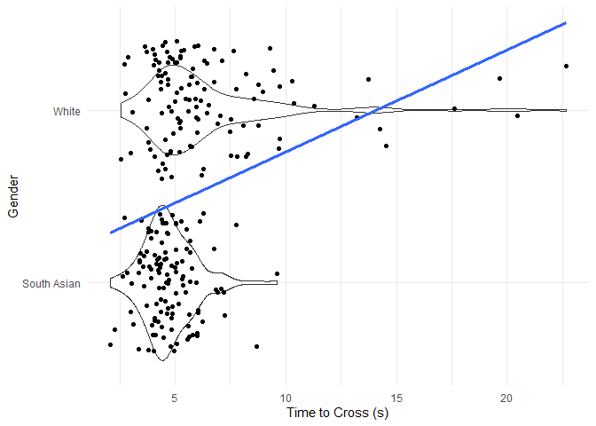<!-- -->


``` r
params_eth <- data %>%
  group_by(ethnicity) %>%
  summarise(
    mean = mean(time_to_cross_street),
    sd = sd(time_to_cross_street)
  )

curve_data_eth <- params_eth %>%
  rowwise() %>%
  do({
    tibble(
      ethnicity = .$ethnicity,
      x = seq(min(data$time_to_cross_street),
              max(data$time_to_cross_street),
              length.out = 200),
      y = dnorm(x, .$mean, .$sd)
    )
  })

ggplot(data, aes(time_to_cross_street, fill = ethnicity)) +
  geom_histogram(aes(y = after_stat(density)), binwidth = 0.5) +
  geom_line(data = curve_data_eth,
            aes(x = x, y = y),
            colour = "red",
            linewidth = 1,
            inherit.aes = FALSE) +
  labs(
    x = "Time to Cross (s)",
    y = "Count"
  ) +
  theme_minimal(
  ) +
  facet_wrap(~ethnicity)
```

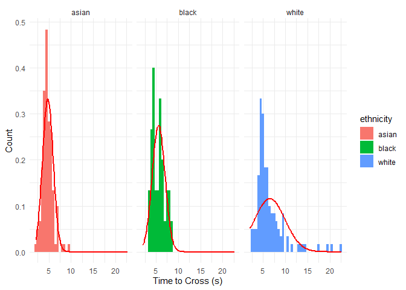<!-- -->

# 10b. Gender

``` r
data %>% 
  ggplot(aes(x = time_to_cross_street,
         fill = gender)) +
  geom_histogram((aes(y = after_stat(density))),binwidth = 0.5) +
  stat_function(fun = dnorm, args = list(mean = mean(data$time_to_cross_street), sd = sd(data$time_to_cross_street)), colour = "red", linewidth = 1) +
  labs(
    x = "Time to Cross (s)",
    y = "Count"
  ) +
  theme_minimal(
  )
```

```
## Warning: Multiple drawing groups in `geom_function()`
## ℹ Did you use the correct group, colour, or fill aesthetics?
```

<!-- -->


``` r
params_gen <- data %>%
  group_by(gender) %>%
  summarise(
    mean = mean(time_to_cross_street),
    sd = sd(time_to_cross_street)
  )

curve_data_gen <- params_gen %>%
  rowwise() %>%
  do({
    tibble(
      gender = .$gender,
      x = seq(min(data$time_to_cross_street),
              max(data$time_to_cross_street),
              length.out = 200),
      y = dnorm(x, .$mean, .$sd)
    )
  })

ggplot(data, aes(time_to_cross_street, fill = gender)) +
  geom_histogram(aes(y = after_stat(density)), binwidth = 0.5) +
  geom_line(data = curve_data_gen,
            aes(x = x, y = y),
            colour = "red",
            linewidth = 1,
            inherit.aes = FALSE) +
  labs(
    x = "Time to Cross (s)",
    y = "Count"
  ) +
  theme_minimal(
  ) +
  facet_wrap(~gender)
```

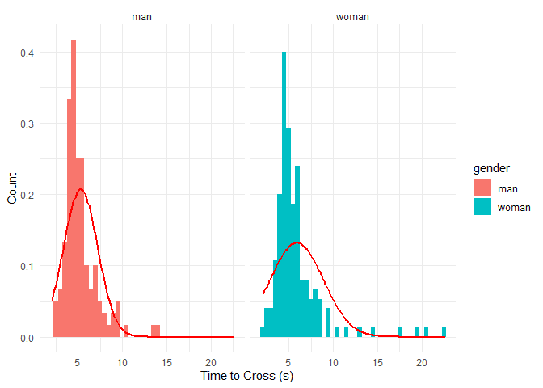<!-- -->

# 11. Visualizations
# 11a. Time by ethnicity

``` r
data %>% 
  ggplot(aes(x = ethnicity,
         y = time_to_cross_street,
         fill = ethnicity)) +
  geom_boxplot() +
  labs(
    x = "Ethnicicty",
    y = "Time to Cross (s)"
  ) +
  scale_x_discrete(labels = c(
    "white" = "White",
    "asian" = "South Asian",
    "black" = "Black"
   )) +
  theme_minimal(
  )
```

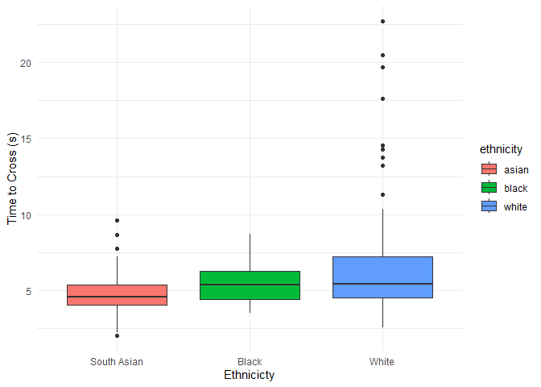<!-- -->

# 11b. Time by gender

``` r
data %>% 
  ggplot(aes(x = gender,
         y = time_to_cross_street,
         fill = gender)) +
  geom_boxplot(show.legend = FALSE) +
  labs(
    x = "Gender",
    y = "Time to Cross (s)"
  ) + 
  scale_x_discrete(labels = c(
    "man" = "Man",
    "woman" = "Woman"
   )) +
  theme_minimal()
```

<!-- -->

# 11c. Time to enter the street - Violin Plot with Jitter overlay - Facet by gender

``` r
data %>% 
  ggplot(aes(x = time_to_cross_street,
             y = gender)) +
  geom_violin() +
  geom_jitter(show.legend = FALSE) +
  geom_smooth(aes(group = 1), method = "lm", se = FALSE, linewidth = 1.2) +
  labs(
    x = "Time to Cross (s)",
    y = "Gender"
  ) + 
    scale_y_discrete(labels = c(
    "man" = "Man",
    "woman" = "Woman"
   )) +
  theme_minimal()
```

```
## `geom_smooth()` using formula = 'y ~ x'
```

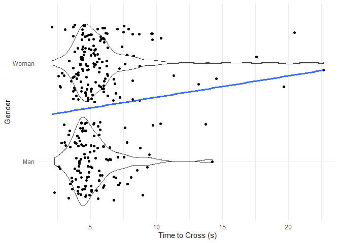<!-- -->

# 11d. Time to enter the street - Violin Plot with Jitter overlay - Facet by ethnicity

``` r
data %>% 
  ggplot(aes(x = time_to_cross_street,
             y = ethnicity)) +
  geom_violin() +
  geom_jitter(show.legend = FALSE) +
  geom_smooth(aes(group = 1), method = "lm", se = FALSE, linewidth = 1.2) +
  labs(
    x = "Time to Cross (s)",
    y = "Gender"
  ) + 
    scale_y_discrete(labels = c(
    "asian" = "South Asian",
    "white" = "White",
    "black" = "Black"
   )) +
  theme_minimal()
```

```
## `geom_smooth()` using formula = 'y ~ x'
```

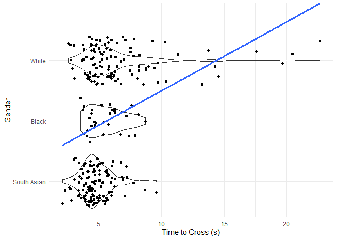<!-- -->

# 11e. Time to enter - QQplot - By ethnicity  

``` r
data %>% 
  ggplot(aes(sample = time_to_cross_street)) +
  geom_qq() +
  stat_qq_line() +
  facet_wrap(~ethnicity)
```

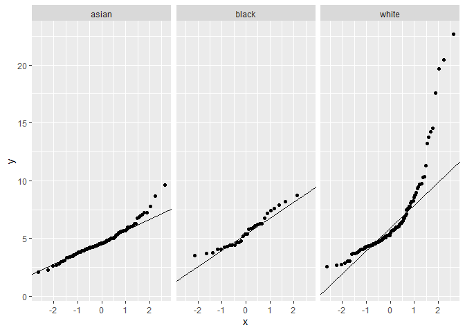<!-- -->

# 11f. Time to enter - QQplot - By gender 

``` r
data %>% 
  ggplot(aes(sample = time_to_cross_street)) +
  geom_qq() +
  stat_qq_line() +
  facet_wrap(~gender)
```

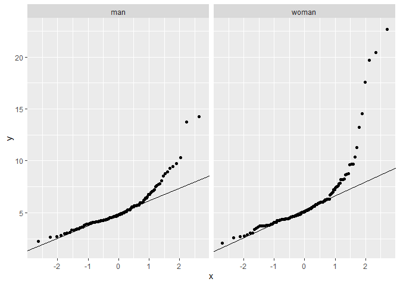<!-- -->

# 11g. 19th removed - Time to enter - By gender

``` r
data_19th_rm %>% 
  ggplot(aes(x = gender,
         y = time_to_cross_street,
         fill = gender)) +
  geom_boxplot(show.legend = FALSE) +
  labs(
    x = "Gender",
    y = "Time to Cross (s)"
  ) + 
  scale_x_discrete(labels = c(
    "man" = "Man",
    "woman" = "Woman"
  )) +
  theme_minimal()
```

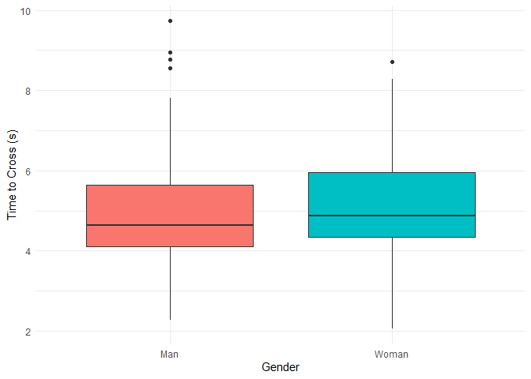<!-- -->

# 11h. Time by ethnicity and gender - grouped by location 

``` r
data%>% 
  ggplot(aes(x = ethnicity,
             y = time_to_cross_street,
               fill = gender)) +
  geom_boxplot() +
  facet_wrap(~location) +
  labs(
    x = "Ethnicity",
    y = "Time to Cross (s)",
    fill = "Gender"
  ) +
  theme_minimal()
```

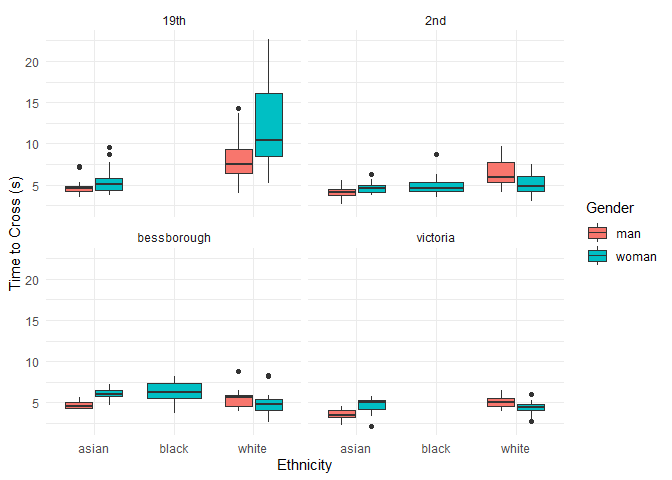<!-- -->

# 11i. Cars passed by ethnicity and gender

``` r
data %>% 
  ggplot(aes(x = ethnicity,
             y = num_cars_pass_before_yield,
             fill = gender)) +
  geom_col() +
  labs (
    x = "Ethnicity",
    y = "Number of Cars Passed",
    fill = "Gender"
  ) +
   scale_x_discrete(labels = c(
    "asian" = "South Asian",
    "white" = "White",
    "black" = "Black"
   )) + 
  theme_minimal()
```

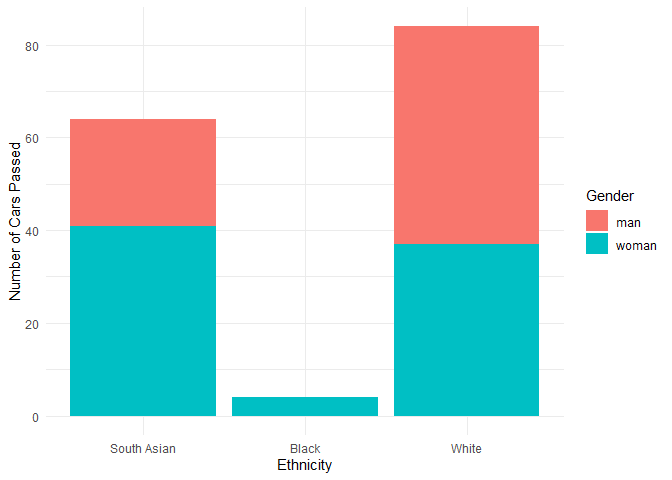<!-- -->

# 11j. Proportion of first car yields - By ethnicity 

``` r
data %>% 
  ggplot(aes(x = ethnicity,
             fill = first_car_yield)
         ) +
  geom_bar(position = "fill") +
  labs (
    x = "Ethnicity",
    y = "Proportion",
    fill = "Did the First Car Yield"
  ) +
   scale_x_discrete(labels = c(
    "asian" = "South Asian",
    "white" = "White",
    "black" = "Black"
   )) + 
  theme_minimal()
```

<!-- -->

# 11k. Proportion of first car yield - By gender 

``` r
data %>% 
  ggplot(aes(x = gender,
             fill = first_car_yield)
         ) +
  geom_bar(position = "fill") +
  labs (
    x = "Gender",
    y = "Proportion",
    fill = "Did the First Car Yield"
  ) +
  scale_x_discrete(labels = c(
    "man" = "Man",
    "woman" = "Woman"
  )) +
  theme_minimal()
```

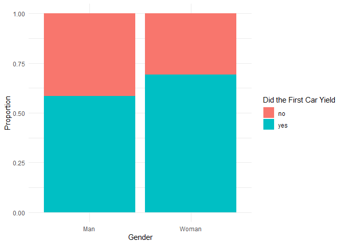<!-- -->

# 11l. Odds first car yield

``` r
or1 <- tidy(m4, conf.int = TRUE, exponentiate = TRUE)

ggplot(or1[-1,], aes(x = estimate,
                    y = reorder(term, estimate))) +
  geom_point(size = 3) +
  geom_errorbarh(aes(xmin = conf.low,
                     xmax = conf.high),
                 height = 0.2) +
  geom_vline(xintercept = 1,
             linetype = "dashed",
             colour = "red") +
  scale_x_log10() +
  scale_y_discrete(labels = c(
    "genderman" = "Man (vs Woman)",
    "genderwoman" = "Woman (vs Man)",
    "ethnicityasian" = "South Asian",
    "ethnicityblack" = "Black",
    "ethnicitywhite" = "White",
    "genderwoman:ethnicitywhite" = "White & Woman",
    "factor(location)victoria" = "Victoria",
    "factor(location)bessborough" = "Bessborough",
    "factor(location)2nd" = "2nd",
    "factor(location)19th" = "19th")) +
  labs(
    x = "Odds Ratio (95% CI)",
    y = "",
    title = "Logistic Regression Results"
  ) +
  theme_minimal()
```

```
## Warning: `geom_errorbarh()` was deprecated in ggplot2 4.0.0.
## ℹ Please use the `orientation` argument of `geom_errorbar()` instead.
## This warning is displayed once per session.
## Call `lifecycle::last_lifecycle_warnings()` to see where this warning was
## generated.
```

```
## `height` was translated to `width`.
```

```
## Warning: Removed 1 row containing missing values or values outside the scale range
## (`geom_point()`).
```

<!-- -->

# 11m. Odds car proceeded

``` r
or2 <- tidy(m16, conf.int = TRUE, exponentiate = TRUE)

ggplot(or2[-1,], aes(x = estimate,
                    y = reorder(term, estimate))) +
  geom_point(size = 3) +
  geom_errorbarh(aes(xmin = conf.low,
                     xmax = conf.high),
                 height = 0.2) +
  geom_vline(xintercept = 1,
             linetype = "dashed",
             colour = "red") +
  scale_x_log10() +
  scale_y_discrete(labels = c(
    "genderman" = "Male (vs Female)",
    "genderwoman" = "Female (vs Male)",
    "ethnicityasian" = "South Asian",
    "ethnicityblack" = "Black",
    "ethnicitywhite" = "White",
    "factor(location)victoria" = "Victoria",
    "factor(location)bessborough" = "Bessborough",
    "factor(location)2nd" = "2nd",
    "factor(location)19th" = "19th",
    "genderwoman:ethnicitywhite" = "White & Woman")) +
  labs(
    x = "Odds Ratio (95% CI)",
    y = "",
    title = "Logistic Regression Results"
  ) +
  theme_minimal()
```

```
## `height` was translated to `width`.
```

```
## Warning: Removed 1 row containing missing values or values outside the scale range
## (`geom_point()`).
```

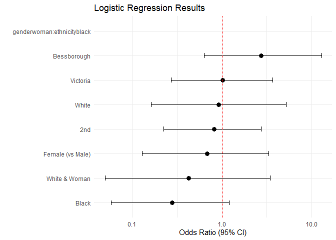<!-- -->

# 11n. Odds car stopped close//far 

``` r
or3 <- tidy(m20, conf.int = TRUE, exponentiate = TRUE)

ggplot(or3[-1,], aes(x = estimate,
                    y = reorder(term, estimate))) +
  geom_point(size = 3) +
  geom_errorbarh(aes(xmin = conf.low,
                     xmax = conf.high),
                 height = 0.2) +
  geom_vline(xintercept = 1,
             linetype = "dashed",
             colour = "red") +
  scale_x_log10() +
  scale_y_discrete(labels = c(
    "genderman" = "Male (vs Female)",
    "genderwoman" = "Female (vs Male)",
    "ethnicityasian" = "South Asian",
    "ethnicityblack" = "Black",
    "ethnicitywhite" = "White",
    "factor(location)victoria" = "Victoria",
    "factor(location)bessborough" = "Bessborough",
    "factor(location)2nd" = "2nd",
    "factor(location)19th" = "19th",
    "genderwoman:ethnicitywhite" = "White & Woman")) +
  labs(
    x = "Odds Ratio (95% CI)",
    y = "",
    title = "Logistic Regression Results"
  ) +
  theme_minimal()
```

```
## `height` was translated to `width`.
```

```
## Warning: Removed 1 row containing missing values or values outside the scale range
## (`geom_point()`).
```

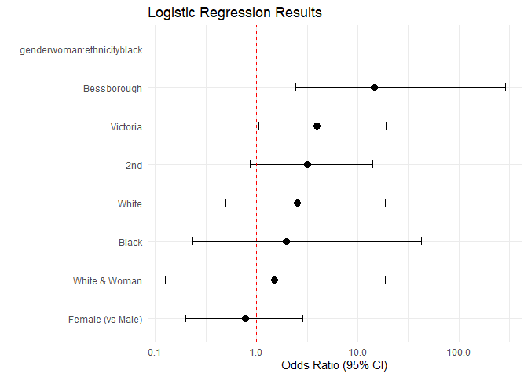<!-- -->
