# 1. Load Packages

``` r
library(tidyverse)
```

```
## ── Attaching core tidyverse packages ──────────────────────── tidyverse 2.0.0 ──
## ✔ dplyr     1.2.1     ✔ readr     2.2.0
## ✔ forcats   1.0.1     ✔ stringr   1.6.0
## ✔ ggplot2   4.0.3     ✔ tibble    3.3.1
## ✔ lubridate 1.9.5     ✔ tidyr     1.3.2
## ✔ purrr     1.2.2     
## ── Conflicts ────────────────────────────────────────── tidyverse_conflicts() ──
## ✖ dplyr::filter() masks stats::filter()
## ✖ dplyr::lag()    masks stats::lag()
## ℹ Use the conflicted package (<http://conflicted.r-lib.org/>) to force all conflicts to become errors
```

``` r
library(broom)
library(snakecase)
library(gtsummary)
```

```
## Warning: package 'gtsummary' was built under R version 4.6.1
```

``` r
library(broom.helpers)
```

```
## Warning: package 'broom.helpers' was built under R version 4.6.1
```

```
## 
## Attaching package: 'broom.helpers'
## 
## The following objects are masked from 'package:gtsummary':
## 
##     all_categorical, all_continuous, all_contrasts, all_dichotomous,
##     all_interaction, all_intercepts
```

``` r
library(gt)
```

```
## Warning: package 'gt' was built under R version 4.6.1
```

``` r
library(cowplot)
```

```
## Warning: package 'cowplot' was built under R version 4.6.1
```

```
## 
## Attaching package: 'cowplot'
## 
## The following object is masked from 'package:gt':
## 
##     as_gtable
## 
## The following object is masked from 'package:lubridate':
## 
##     stamp
```

``` r
library(magick)
```

```
## Warning: package 'magick' was built under R version 4.6.1
```

```
## Linking to ImageMagick 6.9.13.29
## Enabled features: cairo, freetype, fftw, ghostscript, heic, lcms, pango, raw, rsvg, webp
## Disabled features: fontconfig, x11
```

# 2. Load data - Remove invalid trials - Trials with unaffiliated pedestrians

``` r
data_file <- read_csv("master_file.csv") %>% 
  mutate(
    ethnicity = as.factor(ethnicity),
    gender = as.factor(gender),
    location = as.factor(location),
    first_car_yield = as.factor(first_car_yield),
    did_car_proceed_before_across = as.factor(did_car_proceed_before_across)
  )
```

```
## Rows: 385 Columns: 15
## ── Column specification ────────────────────────────────────────────────────────
## Delimiter: ","
## chr (10): ethnicity, gender, location, date, time_of_day, close_side_first_c...
## dbl  (5): order, trial_number, close_side_num_cars_pass_before_yield, num_ca...
## 
## ℹ Use `spec()` to retrieve the full column specification for this data.
## ℹ Specify the column types or set `show_col_types = FALSE` to quiet this message.
```

``` r
data <- data_file %>% drop_na(valid_trial)

data_19th_rm <- data %>% filter(location != "19th")
```

# 3. General descriptive statistics

``` r
data %>% 
  summarise(
    n = n(),
    mean_time = mean(time_to_cross_street, na.rm = TRUE),
    sd_time = sd(time_to_cross_street, na.rm = TRUE), 
    min_time = min(time_to_cross_street, na.rm = TRUE),
    max_time = max(time_to_cross_street, na.rm = TRUE),
    mean_cars = mean(num_cars_pass_before_yield, na.rm = TRUE), 
    sd_cars = sd(num_cars_pass_before_yield, na.rm = TRUE)
  )
```

```
## # A tibble: 1 × 7
##       n mean_time sd_time min_time max_time mean_cars sd_cars
##   <int>     <dbl>   <dbl>    <dbl>    <dbl>     <dbl>   <dbl>
## 1   360      5.75    2.71     2.07     22.7     0.628    1.08
```

# 4. Frequency tables 

``` r
data %>% count(ethnicity)
```

```
## # A tibble: 3 × 2
##   ethnicity     n
##   <fct>     <int>
## 1 asian       120
## 2 black       120
## 3 white       120
```

``` r
data %>% count(gender)
```

```
## # A tibble: 2 × 2
##   gender     n
##   <fct>  <int>
## 1 man      180
## 2 woman    180
```

``` r
data %>% count(location)
```

```
## # A tibble: 4 × 2
##   location        n
##   <fct>       <int>
## 1 19th           90
## 2 2nd            90
## 3 bessborough    90
## 4 victoria       90
```

``` r
data %>% count(first_car_yield)
```

```
## # A tibble: 2 × 2
##   first_car_yield     n
##   <fct>           <int>
## 1 no                138
## 2 yes               222
```

``` r
data %>% count(did_car_proceed_before_across)
```

```
## # A tibble: 3 × 2
##   did_car_proceed_before_across     n
##   <fct>                         <int>
## 1 no                               32
## 2 yes                             301
## 3 <NA>                             27
```
# 5. First car yield
# 5a. First car yield - Descriptive stats

``` r
data %>% 
  group_by(gender) %>% 
  count(first_car_yield) %>% 
  mutate(percentage = n / sum(n) * 100)
```

```
## # A tibble: 4 × 4
## # Groups:   gender [2]
##   gender first_car_yield     n percentage
##   <fct>  <fct>           <int>      <dbl>
## 1 man    no                 81       45  
## 2 man    yes                99       55  
## 3 woman  no                 57       31.7
## 4 woman  yes               123       68.3
```

``` r
  .groups = "drop"

data %>% 
  group_by(ethnicity) %>% 
  count(first_car_yield) %>% 
  mutate(percentage = n / sum(n) * 100)
```

```
## # A tibble: 6 × 4
## # Groups:   ethnicity [3]
##   ethnicity first_car_yield     n percentage
##   <fct>     <fct>           <int>      <dbl>
## 1 asian     no                 44       36.7
## 2 asian     yes                76       63.3
## 3 black     no                 46       38.3
## 4 black     yes                74       61.7
## 5 white     no                 48       40  
## 6 white     yes                72       60
```

``` r
  .groups = "drop"
  
data %>% 
  group_by(ethnicity, gender) %>% 
  count(first_car_yield) %>% 
  mutate(percentage = n / sum(n) * 100)
```

```
## # A tibble: 12 × 5
## # Groups:   ethnicity, gender [6]
##    ethnicity gender first_car_yield     n percentage
##    <fct>     <fct>  <fct>           <int>      <dbl>
##  1 asian     man    no                 16       26.7
##  2 asian     man    yes                44       73.3
##  3 asian     woman  no                 28       46.7
##  4 asian     woman  yes                32       53.3
##  5 black     man    no                 31       51.7
##  6 black     man    yes                29       48.3
##  7 black     woman  no                 15       25  
##  8 black     woman  yes                45       75  
##  9 white     man    no                 34       56.7
## 10 white     man    yes                26       43.3
## 11 white     woman  no                 14       23.3
## 12 white     woman  yes                46       76.7
```

``` r
  .groups = "drop"
```

# 5b. First car yield - Logistic regression 
# 5b1. Gender - Location fixed effects

``` r
m1 <- glm(first_car_yield ~ gender + factor(location),
          data = data,
          family = binomial())

tidy(m1)
```

```
## # A tibble: 5 × 5
##   term                        estimate std.error statistic      p.value
##   <chr>                          <dbl>     <dbl>     <dbl>        <dbl>
## 1 (Intercept)                   -0.738     0.251     -2.94 0.00329     
## 2 genderwoman                    0.644     0.234      2.75 0.00601     
## 3 factor(location)2nd            0.553     0.306      1.81 0.0704      
## 4 factor(location)bessborough    1.28      0.319      4.02 0.0000582   
## 5 factor(location)victoria       2.06      0.360      5.72 0.0000000106
```

``` r
summary(m1)
```

```
## 
## Call:
## glm(formula = first_car_yield ~ gender + factor(location), family = binomial(), 
##     data = data)
## 
## Coefficients:
##                             Estimate Std. Error z value Pr(>|z|)    
## (Intercept)                  -0.7380     0.2511  -2.939  0.00329 ** 
## genderwoman                   0.6442     0.2345   2.747  0.00601 ** 
## factor(location)2nd           0.5529     0.3056   1.810  0.07036 .  
## factor(location)bessborough   1.2841     0.3194   4.020 5.82e-05 ***
## factor(location)victoria      2.0598     0.3601   5.721 1.06e-08 ***
## ---
## Signif. codes:  0 '***' 0.001 '**' 0.01 '*' 0.05 '.' 0.1 ' ' 1
## 
## (Dispersion parameter for binomial family taken to be 1)
## 
##     Null deviance: 479.28  on 359  degrees of freedom
## Residual deviance: 428.88  on 355  degrees of freedom
## AIC: 438.88
## 
## Number of Fisher Scoring iterations: 4
```

``` r
exp(cbind(OR = coef(m1), confint(m1)))
```

```
## Waiting for profiling to be done...
```

```
##                                    OR     2.5 %     97.5 %
## (Intercept)                 0.4780607 0.2890291  0.7759266
## genderwoman                 1.9044585 1.2066155  3.0295057
## factor(location)2nd         1.7383528 0.9580288  3.1810280
## factor(location)bessborough 3.6112638 1.9486782  6.8351217
## factor(location)victoria    7.8446840 3.9574817 16.3270804
```

``` r
ci1 <- exp(confint(m1))
```

```
## Waiting for profiling to be done...
```

# 5b2. Ethnicity - Location fixed effects

``` r
m2 <- glm(first_car_yield ~ ethnicity + factor(location),
          data = data,
          family = binomial())

tidy(m2)
```

```
## # A tibble: 6 × 5
##   term                        estimate std.error statistic      p.value
##   <chr>                          <dbl>     <dbl>     <dbl>        <dbl>
## 1 (Intercept)                  -0.326      0.270    -1.21  0.226       
## 2 ethnicityblack               -0.0802     0.283    -0.283 0.777       
## 3 ethnicitywhite               -0.159      0.282    -0.564 0.573       
## 4 factor(location)2nd           0.540      0.302     1.79  0.0737      
## 5 factor(location)bessborough   1.25       0.315     3.98  0.0000692   
## 6 factor(location)victoria      2.02       0.356     5.67  0.0000000141
```

``` r
summary(m2)
```

```
## 
## Call:
## glm(formula = first_car_yield ~ ethnicity + factor(location), 
##     family = binomial(), data = data)
## 
## Coefficients:
##                             Estimate Std. Error z value Pr(>|z|)    
## (Intercept)                 -0.32608    0.26960  -1.210   0.2265    
## ethnicityblack              -0.08017    0.28320  -0.283   0.7771    
## ethnicitywhite              -0.15925    0.28236  -0.564   0.5727    
## factor(location)2nd          0.53956    0.30172   1.788   0.0737 .  
## factor(location)bessborough  1.25403    0.31515   3.979 6.92e-05 ***
## factor(location)victoria     2.01673    0.35557   5.672 1.41e-08 ***
## ---
## Signif. codes:  0 '***' 0.001 '**' 0.01 '*' 0.05 '.' 0.1 ' ' 1
## 
## (Dispersion parameter for binomial family taken to be 1)
## 
##     Null deviance: 479.28  on 359  degrees of freedom
## Residual deviance: 436.25  on 354  degrees of freedom
## AIC: 448.25
## 
## Number of Fisher Scoring iterations: 4
```

``` r
exp(cbind(OR = coef(m2), confint(m2)))
```

```
## Waiting for profiling to be done...
```

```
##                                    OR     2.5 %    97.5 %
## (Intercept)                 0.7217482 0.4229841  1.221504
## ethnicityblack              0.9229549 0.5289194  1.608552
## ethnicitywhite              0.8527823 0.4892298  1.482904
## factor(location)2nd         1.7152521 0.9522437  3.114328
## factor(location)bessborough 3.5044405 1.9061064  6.573986
## factor(location)victoria    7.5137456 3.8225784 15.497190
```

``` r
ci2 <- exp(confint(m2))
```

```
## Waiting for profiling to be done...
```

# 5b3. Gender + Ethnicity - Location fixed effects

``` r
m3 <- glm(first_car_yield ~ gender + ethnicity + factor(location),
          data = data,
          family = binomial())

tidy(m3)
```

```
## # A tibble: 7 × 5
##   term                        estimate std.error statistic      p.value
##   <chr>                          <dbl>     <dbl>     <dbl>        <dbl>
## 1 (Intercept)                  -0.657      0.300    -2.19  0.0283      
## 2 genderwoman                   0.645      0.235     2.75  0.00598     
## 3 ethnicityblack               -0.0820     0.286    -0.286 0.775       
## 4 ethnicitywhite               -0.163      0.286    -0.570 0.568       
## 5 factor(location)2nd           0.554      0.306     1.81  0.0702      
## 6 factor(location)bessborough   1.29       0.320     4.02  0.0000578   
## 7 factor(location)victoria      2.06       0.360     5.72  0.0000000105
```

``` r
summary(m3)
```

```
## 
## Call:
## glm(formula = first_car_yield ~ gender + ethnicity + factor(location), 
##     family = binomial(), data = data)
## 
## Coefficients:
##                             Estimate Std. Error z value Pr(>|z|)    
## (Intercept)                 -0.65715    0.29957  -2.194  0.02826 *  
## genderwoman                  0.64481    0.23460   2.749  0.00598 ** 
## ethnicityblack              -0.08199    0.28639  -0.286  0.77465    
## ethnicitywhite              -0.16286    0.28555  -0.570  0.56844    
## factor(location)2nd          0.55352    0.30572   1.811  0.07021 .  
## factor(location)bessborough  1.28538    0.31962   4.022 5.78e-05 ***
## factor(location)victoria     2.06177    0.36027   5.723 1.05e-08 ***
## ---
## Signif. codes:  0 '***' 0.001 '**' 0.01 '*' 0.05 '.' 0.1 ' ' 1
## 
## (Dispersion parameter for binomial family taken to be 1)
## 
##     Null deviance: 479.28  on 359  degrees of freedom
## Residual deviance: 428.55  on 353  degrees of freedom
## AIC: 442.55
## 
## Number of Fisher Scoring iterations: 4
```

``` r
exp(cbind(OR = coef(m3), confint(m3)))
```

```
## Waiting for profiling to be done...
```

```
##                                    OR     2.5 %     97.5 %
## (Intercept)                 0.5183280 0.2853579  0.9268773
## genderwoman                 1.9056322 1.2070865  3.0321254
## ethnicityblack              0.9212797 0.5246278  1.6157282
## ethnicitywhite              0.8497066 0.4843728  1.4868052
## factor(location)2nd         1.7393727 0.9582851  3.1839756
## factor(location)bessborough 3.6160546 1.9505830  6.8468752
## factor(location)victoria    7.8598977 3.9636450 16.3655565
```

``` r
ci3 <- exp(confint(m3))
```

```
## Waiting for profiling to be done...
```

# 5b4. Gender*Ethnicity - Location fixed effects

``` r
m4 <- glm(first_car_yield ~ gender*ethnicity + factor(location),
          data = data,
          family = binomial())

tidy(m4)
```

```
## # A tibble: 9 × 5
##   term                        estimate std.error statistic       p.value
##   <chr>                          <dbl>     <dbl>     <dbl>         <dbl>
## 1 (Intercept)                    0.117     0.355     0.329 0.742        
## 2 genderwoman                   -1.01      0.419    -2.41  0.0160       
## 3 ethnicityblack                -1.24      0.420    -2.96  0.00307      
## 4 ethnicitywhite                -1.48      0.423    -3.50  0.000466     
## 5 factor(location)2nd            0.603     0.320     1.89  0.0592       
## 6 factor(location)bessborough    1.40      0.335     4.16  0.0000312    
## 7 factor(location)victoria       2.22      0.377     5.89  0.00000000381
## 8 genderwoman:ethnicityblack     2.35      0.600     3.92  0.0000900    
## 9 genderwoman:ethnicitywhite     2.69      0.607     4.43  0.00000946
```

``` r
summary(m4)
```

```
## 
## Call:
## glm(formula = first_car_yield ~ gender * ethnicity + factor(location), 
##     family = binomial(), data = data)
## 
## Coefficients:
##                             Estimate Std. Error z value Pr(>|z|)    
## (Intercept)                   0.1168     0.3555   0.329 0.742449    
## genderwoman                  -1.0087     0.4189  -2.408 0.016034 *  
## ethnicityblack               -1.2432     0.4199  -2.961 0.003070 ** 
## ethnicitywhite               -1.4796     0.4228  -3.499 0.000466 ***
## factor(location)2nd           0.6031     0.3196   1.887 0.059169 .  
## factor(location)bessborough   1.3972     0.3355   4.165 3.12e-05 ***
## factor(location)victoria      2.2206     0.3769   5.892 3.81e-09 ***
## genderwoman:ethnicityblack    2.3493     0.5999   3.916 9.00e-05 ***
## genderwoman:ethnicitywhite    2.6868     0.6066   4.429 9.46e-06 ***
## ---
## Signif. codes:  0 '***' 0.001 '**' 0.01 '*' 0.05 '.' 0.1 ' ' 1
## 
## (Dispersion parameter for binomial family taken to be 1)
## 
##     Null deviance: 479.28  on 359  degrees of freedom
## Residual deviance: 403.64  on 351  degrees of freedom
## AIC: 421.64
## 
## Number of Fisher Scoring iterations: 4
```

``` r
exp(cbind(OR = coef(m4), confint(m4)))
```

```
## Waiting for profiling to be done...
```

```
##                                     OR      2.5 %     97.5 %
## (Intercept)                  1.1239029 0.56315080  2.2895971
## genderwoman                  0.3646865 0.15772617  0.8196298
## ethnicityblack               0.2884467 0.12421887  0.6479776
## ethnicitywhite               0.2277374 0.09730394  0.5132521
## factor(location)2nd          1.8277268 0.98070772  3.4421582
## factor(location)bessborough  4.0438589 2.11852930  7.9158646
## factor(location)victoria     9.2130453 4.50435790 19.8409751
## genderwoman:ethnicityblack  10.4779789 3.28958382 34.7295500
## genderwoman:ethnicitywhite  14.6840977 4.56203908 49.4581487
```

``` r
ci4 <- exp(confint(m4))
```

```
## Waiting for profiling to be done...
```

# 5c1. Combined models - Odd Ratio with 95% CI - gtsummary

``` r
tbl1 <- tbl_regression(
  m1,
  exponentiate = TRUE,
  label = list(
    gender ~ "Gender",
    "factor(location)" ~ "Intersection Location"
  )) %>% 
  modify_table_body(
    ~.x %>% 
      mutate(
        label = case_when(
          label == "man" ~ "Men",
          label == "woman" ~ "Women",
          label == "19th" ~ "19th Street",
          label == "2nd"  ~ "2nd Avenue",
          label == "bessborough" ~ "Bessborough",
          label == "victoria" ~ "Victoria Avenue",
          TRUE ~ label)
    ))

tbl2 <- tbl_regression(
  m2,
  exponentiate = TRUE,
  label = list(
    ethnicity ~ "Racialization",
    "factor(location)" ~ "Intersection Location"
  )) %>% 
  modify_table_body(
    ~.x %>% 
      mutate(
        label = case_when(
          label == "asian" ~ "South Asian",
          label == "white" ~ "White",
          label == "black" ~ "Black",
          label == "19th" ~ "19th Street",
          label == "2nd"  ~ "2nd Avenue",
          label == "bessborough" ~ "Bessborough",
          label == "victoria" ~ "Victoria Avenue",
          TRUE ~ label)
    ))

tbl3 <- tbl_regression(
  m3,
  exponentiate = TRUE,
  label = list(
    gender ~ "Gender",
    "factor(location)" ~ "Intersection Location",
    ethnicity ~ "Racialization"
  )) %>% 
  modify_table_body(
    ~.x %>% 
      mutate(
        label = case_when(
          label == "man" ~ "Men",
          label == "woman" ~ "Women",
          label == "asian" ~ "South Asian",
          label == "white" ~ "White",
          label == "black" ~ "Black",
          label == "19th" ~ "19th Street",
          label == "2nd"  ~ "2nd Avenue",
          label == "bessborough" ~ "Bessborough",
          label == "victoria" ~ "Victoria Avenue",
          TRUE ~ label)
    ))

tbl4 <- tbl_regression(
  m4,
  exponentiate = TRUE,
  label = list(
    gender ~ "Gender",
    "factor(location)" ~ "Intersection Location",
    ethnicity ~ "Racialization"
  )) %>% 
  modify_table_body(
    ~.x %>% 
      mutate(
        label = case_when(
          label == "man" ~ "Men",
          label == "woman" ~ "Women",
          label == "asian" ~ "South Asian",
          label == "white" ~ "White",
          label == "black" ~ "Black",
          label == "19th" ~ "19th Street",
          label == "2nd"  ~ "2nd Avenue",
          label == "bessborough" ~ "Bessborough",
          label == "victoria" ~ "Victoria Avenue",
          label == "woman * white" ~ "Women * White",
          label == "woman * black" ~ "Women * Black",
          TRUE ~ label)
    ))
```

# 5c2. Table 1 - First car yield combined models table

``` r
table1 <- tbl_merge(
  tbls = list(tbl1, tbl2, tbl3, tbl4),
  tab_spanner = c(
    "Gender",
    "Racialization",
    "Gender and Racialization",
    "Gender and Racialization Interaction"
  )
) %>% 
  modify_table_body(
    ~ .x %>% 
      mutate(
        row_order = case_when(
          variable == "gender" ~ 1,
          variable == "ethnicity" ~ 2,
          variable == "gender:ethnicity" ~ 3,
          variable == "location" ~ 4,
          TRUE ~ 99
        )
      ) %>% 
      arrange(row_order, row_type != "label") %>% 
      select(-row_order)
  )
```

```
## The number rows in the tables to be merged do not match, which may result in
## rows appearing out of order.
## ℹ See `tbl_merge()` (`?gtsummary::tbl_merge()`) help file for details. Use
##   `quiet=TRUE` to silence message.
```

``` r
as_gt(table1) %>% 
  gtsave(
    filename = "table1.png",
    vwidth = 2200,
    zoom = 2
  )
```

```
## file:///C:/Users/KADEGA~1/AppData/Local/Temp/RtmpElcwPG/file317079753332.html screenshot completed
```

# 6. Mean number of cars before yield
# 6a. Mean number of cars before yield - Descriptive stats

``` r
data %>% 
  group_by(gender) %>% 
  summarise(
    n = n(),
    mean = mean(num_cars_pass_before_yield),
    sd = sd(num_cars_pass_before_yield),
    .groups = "drop"
  )
```

```
## # A tibble: 2 × 4
##   gender     n  mean    sd
##   <fct>  <int> <dbl> <dbl>
## 1 man      180 0.7    1.13
## 2 woman    180 0.556  1.03
```

``` r
data %>% 
  group_by(ethnicity) %>% 
  summarise(
    n = n(),
    mean = mean(num_cars_pass_before_yield),
    sd = sd(num_cars_pass_before_yield),
    .groups = "drop"
  )
```

```
## # A tibble: 3 × 4
##   ethnicity     n  mean    sd
##   <fct>     <int> <dbl> <dbl>
## 1 asian       120 0.533 0.829
## 2 black       120 0.65  1.25 
## 3 white       120 0.7   1.13
```

``` r
data %>% 
  group_by(ethnicity, gender) %>% 
  summarise(
    n = n(),
    mean = mean(num_cars_pass_before_yield),
    sd = sd(num_cars_pass_before_yield),
    .groups = "drop"
  )
```

```
## # A tibble: 6 × 5
##   ethnicity gender     n  mean    sd
##   <fct>     <fct>  <int> <dbl> <dbl>
## 1 asian     man       60 0.383 0.715
## 2 asian     woman     60 0.683 0.911
## 3 black     man       60 0.933 1.58 
## 4 black     woman     60 0.367 0.688
## 5 white     man       60 0.783 0.846
## 6 white     woman     60 0.617 1.37
```

# 6b. Mean number of cars before yield - Linear regression 
# 6b1. Gender - Location fixed effects

``` r
m5 <- lm(num_cars_pass_before_yield ~ gender + factor(location),
         data = data)

tidy(m5)
```

```
## # A tibble: 5 × 5
##   term                        estimate std.error statistic  p.value
##   <chr>                          <dbl>     <dbl>     <dbl>    <dbl>
## 1 (Intercept)                    1.39      0.118     11.8  1.70e-27
## 2 genderwoman                   -0.144     0.105     -1.37 1.71e- 1
## 3 factor(location)2nd           -0.711     0.149     -4.77 2.64e- 6
## 4 factor(location)bessborough   -0.933     0.149     -6.27 1.07e- 9
## 5 factor(location)victoria      -1.13      0.149     -7.61 2.50e-13
```

``` r
summary(m5)
```

```
## 
## Call:
## lm(formula = num_cars_pass_before_yield ~ gender + factor(location), 
##     data = data)
## 
## Residuals:
##     Min      1Q  Median      3Q     Max 
## -1.3944 -0.4611 -0.2611  0.4611  7.6056 
## 
## Coefficients:
##                             Estimate Std. Error t value Pr(>|t|)    
## (Intercept)                   1.3944     0.1177  11.843  < 2e-16 ***
## genderwoman                  -0.1444     0.1053  -1.372    0.171    
## factor(location)2nd          -0.7111     0.1489  -4.775 2.64e-06 ***
## factor(location)bessborough  -0.9333     0.1489  -6.267 1.07e-09 ***
## factor(location)victoria     -1.1333     0.1489  -7.610 2.50e-13 ***
## ---
## Signif. codes:  0 '***' 0.001 '**' 0.01 '*' 0.05 '.' 0.1 ' ' 1
## 
## Residual standard error: 0.9991 on 355 degrees of freedom
## Multiple R-squared:  0.1606,	Adjusted R-squared:  0.1511 
## F-statistic: 16.98 on 4 and 355 DF,  p-value: 9.497e-13
```

# 6b2. Ethnicity - Location fixed effects

``` r
m6 <- lm(num_cars_pass_before_yield ~ ethnicity + factor(location),
         data = data)

tidy(m6)
```

```
## # A tibble: 6 × 5
##   term                        estimate std.error statistic  p.value
##   <chr>                          <dbl>     <dbl>     <dbl>    <dbl>
## 1 (Intercept)                    1.23      0.129     9.50  3.15e-19
## 2 ethnicityblack                 0.117     0.129     0.903 3.67e- 1
## 3 ethnicitywhite                 0.167     0.129     1.29  1.98e- 1
## 4 factor(location)2nd           -0.711     0.149    -4.77  2.73e- 6
## 5 factor(location)bessborough   -0.933     0.149    -6.26  1.13e- 9
## 6 factor(location)victoria      -1.13      0.149    -7.60  2.72e-13
```

``` r
summary(m6)
```

```
## 
## Call:
## lm(formula = num_cars_pass_before_yield ~ ethnicity + factor(location), 
##     data = data)
## 
## Residuals:
##     Min      1Q  Median      3Q     Max 
## -1.3944 -0.4611 -0.2611  0.4833  7.6556 
## 
## Coefficients:
##                             Estimate Std. Error t value Pr(>|t|)    
## (Intercept)                   1.2278     0.1292   9.504  < 2e-16 ***
## ethnicityblack                0.1167     0.1292   0.903    0.367    
## ethnicitywhite                0.1667     0.1292   1.290    0.198    
## factor(location)2nd          -0.7111     0.1492  -4.767 2.73e-06 ***
## factor(location)bessborough  -0.9333     0.1492  -6.257 1.13e-09 ***
## factor(location)victoria     -1.1333     0.1492  -7.598 2.72e-13 ***
## ---
## Signif. codes:  0 '***' 0.001 '**' 0.01 '*' 0.05 '.' 0.1 ' ' 1
## 
## Residual standard error: 1.001 on 354 degrees of freedom
## Multiple R-squared:  0.1603,	Adjusted R-squared:  0.1484 
## F-statistic: 13.51 on 5 and 354 DF,  p-value: 4.482e-12
```

# 6b3. Gender + Ethnicity - Location fixed effects

``` r
m7 <- lm(num_cars_pass_before_yield ~ gender + ethnicity + factor(location),
         data = data)

tidy(m7)
```

```
## # A tibble: 7 × 5
##   term                        estimate std.error statistic  p.value
##   <chr>                          <dbl>     <dbl>     <dbl>    <dbl>
## 1 (Intercept)                    1.30      0.139     9.33  1.22e-18
## 2 genderwoman                   -0.144     0.105    -1.37  1.71e- 1
## 3 ethnicityblack                 0.117     0.129     0.904 3.66e- 1
## 4 ethnicitywhite                 0.167     0.129     1.29  1.97e- 1
## 5 factor(location)2nd           -0.711     0.149    -4.77  2.66e- 6
## 6 factor(location)bessborough   -0.933     0.149    -6.26  1.09e- 9
## 7 factor(location)victoria      -1.13      0.149    -7.61  2.57e-13
```

``` r
summary(m7)
```

```
## 
## Call:
## lm(formula = num_cars_pass_before_yield ~ gender + ethnicity + 
##     factor(location), data = data)
## 
## Residuals:
##     Min      1Q  Median      3Q     Max 
## -1.4667 -0.4667 -0.2222  0.4389  7.5833 
## 
## Coefficients:
##                             Estimate Std. Error t value Pr(>|t|)    
## (Intercept)                   1.3000     0.1394   9.328  < 2e-16 ***
## genderwoman                  -0.1444     0.1053  -1.371    0.171    
## ethnicityblack                0.1167     0.1290   0.904    0.366    
## ethnicitywhite                0.1667     0.1290   1.292    0.197    
## factor(location)2nd          -0.7111     0.1490  -4.773 2.66e-06 ***
## factor(location)bessborough  -0.9333     0.1490  -6.265 1.09e-09 ***
## factor(location)victoria     -1.1333     0.1490  -7.607 2.57e-13 ***
## ---
## Signif. codes:  0 '***' 0.001 '**' 0.01 '*' 0.05 '.' 0.1 ' ' 1
## 
## Residual standard error: 0.9994 on 353 degrees of freedom
## Multiple R-squared:  0.1647,	Adjusted R-squared:  0.1505 
## F-statistic:  11.6 on 6 and 353 DF,  p-value: 7.264e-12
```

# 6b4. Gender*Ethnicity - Location fixed effects

``` r
m8 <- lm(num_cars_pass_before_yield ~ gender*ethnicity + factor(location),
         data = data)

tidy(m8)
```

```
## # A tibble: 9 × 5
##   term                        estimate std.error statistic  p.value
##   <chr>                          <dbl>     <dbl>     <dbl>    <dbl>
## 1 (Intercept)                    1.08      0.156      6.91 2.25e-11
## 2 genderwoman                    0.300     0.180      1.67 9.65e- 2
## 3 ethnicityblack                 0.550     0.180      3.05 2.42e- 3
## 4 ethnicitywhite                 0.400     0.180      2.22 2.69e- 2
## 5 factor(location)2nd           -0.711     0.147     -4.84 1.97e- 6
## 6 factor(location)bessborough   -0.933     0.147     -6.35 6.69e-10
## 7 factor(location)victoria      -1.13      0.147     -7.71 1.31e-13
## 8 genderwoman:ethnicityblack    -0.867     0.255     -3.40 7.41e- 4
## 9 genderwoman:ethnicitywhite    -0.467     0.255     -1.83 6.77e- 2
```

``` r
summary(m8)
```

```
## 
## Call:
## lm(formula = num_cars_pass_before_yield ~ gender * ethnicity + 
##     factor(location), data = data)
## 
## Residuals:
##     Min      1Q  Median      3Q     Max 
## -1.6278 -0.4778 -0.1778  0.3125  7.3722 
## 
## Coefficients:
##                             Estimate Std. Error t value Pr(>|t|)    
## (Intercept)                   1.0778     0.1559   6.913 2.25e-11 ***
## genderwoman                   0.3000     0.1800   1.666 0.096535 .  
## ethnicityblack                0.5500     0.1800   3.055 0.002423 ** 
## ethnicitywhite                0.4000     0.1800   2.222 0.026934 *  
## factor(location)2nd          -0.7111     0.1470  -4.838 1.97e-06 ***
## factor(location)bessborough  -0.9333     0.1470  -6.349 6.69e-10 ***
## factor(location)victoria     -1.1333     0.1470  -7.710 1.31e-13 ***
## genderwoman:ethnicityblack   -0.8667     0.2546  -3.404 0.000741 ***
## genderwoman:ethnicitywhite   -0.4667     0.2546  -1.833 0.067665 .  
## ---
## Signif. codes:  0 '***' 0.001 '**' 0.01 '*' 0.05 '.' 0.1 ' ' 1
## 
## Residual standard error: 0.9861 on 351 degrees of freedom
## Multiple R-squared:  0.1915,	Adjusted R-squared:  0.173 
## F-statistic: 10.39 on 8 and 351 DF,  p-value: 4.449e-13
```

# 6c1. Combined models - gtsummary

``` r
tbl5 <- tbl_regression(
  m5,
  intercept = TRUE,
  label = list(
    gender ~ "Gender",
    "factor(location)" ~ "Intersection Location"
    )
  )%>%
  modify_column_unhide(columns = std.error) %>% 
  modify_column_hide(columns = conf.low) %>% 
  modify_table_body(
    ~.x %>% 
      mutate(
        label = case_when(
          label == "(Intercept)" ~ "Constant",
          label == "man" ~ "Men",
          label == "woman" ~ "Women",
          label == "19th" ~ "19th Street",
          label == "2nd"  ~ "2nd Avenue",
          label == "bessborough" ~ "Bessborough",
          label == "victoria" ~ "Victoria Avenue",
          TRUE ~ label)
    ))

tbl6 <- tbl_regression(
  m6,
  intercept = TRUE,
  label = list(
    ethnicity ~ "Racialization",
    "factor(location)" ~ "Intersection Location"
  )) %>% 
  modify_column_unhide(columns = std.error) %>% 
  modify_column_hide(columns = conf.low) %>%
  modify_table_body(
    ~.x %>% 
      mutate(
        label = case_when(
          label == "(Intercept)" ~ "Constant",
          label == "asian" ~ "South Asian",
          label == "white" ~ "White",
          label == "black" ~ "Black",
          label == "19th" ~ "19th Street",
          label == "2nd"  ~ "2nd Avenue",
          label == "bessborough" ~ "Bessborough",
          label == "victoria" ~ "Victoria Avenue",
          TRUE ~ label)
    ))

tbl7 <- tbl_regression(
  m7,
  intercept = TRUE,
  label = list(
    gender ~ "Gender",
    "factor(location)" ~ "Intersection Location",
    ethnicity ~ "Racialization"
  )) %>% 
  modify_column_unhide(columns = std.error) %>% 
  modify_column_hide(columns = conf.low) %>% 
  modify_table_body(
    ~.x %>% 
      mutate(
        label = case_when(
          label == "(Intercept)" ~ "Constant",
          label == "man" ~ "Men",
          label == "woman" ~ "Women",
          label == "asian" ~ "South Asian",
          label == "white" ~ "White",
          label == "black" ~ "Black",
          label == "19th" ~ "19th Street",
          label == "2nd"  ~ "2nd Avenue",
          label == "bessborough" ~ "Bessborough",
          label == "victoria" ~ "Victoria Avenue",
          TRUE ~ label)
    ))

tbl8 <- tbl_regression(
  m8,
  intercept = TRUE,
  label = list(
    gender ~ "Gender",
    "factor(location)" ~ "Intersection Location",
    ethnicity ~ "Racialization"
  )) %>% 
  modify_column_unhide(columns = std.error) %>% 
  modify_column_hide(columns = conf.low) %>% 
  modify_table_body(
    ~.x %>% 
      mutate(
        label = case_when(
          label == "(Intercept)" ~ "Constant",
          label == "man" ~ "Men",
          label == "woman" ~ "Women",
          label == "asian" ~ "South Asian",
          label == "white" ~ "White",
          label == "black" ~ "Black",
          label == "19th" ~ "19th Street",
          label == "2nd"  ~ "2nd Avenue",
          label == "bessborough" ~ "Bessborough",
          label == "victoria" ~ "Victoria Avenue",
          label == "woman * white" ~ "Women * White",
          label == "woman * black" ~ "Women * Black",
          TRUE ~ label)
    ))
```

# 6c2. Table 2 - Mean number of cars before yield combined models table

``` r
table2 <- tbl_merge(
  tbls = list(tbl5, tbl6, tbl7, tbl8),
  tab_spanner = c(
    "Gender",
    "Racialization",
    "Gender and Racialization",
    "Gender and Racialization Interaction"
  )
) %>%
  modify_table_body(
    ~ .x %>% 
      mutate(
        row_order = case_when(
          variable == "(Intercept)" ~ 1,
          variable == "gender" ~ 2,
          variable == "ethnicity" ~ 3,
          variable == "gender:ethnicity" ~ 4,
          variable == "location" ~ 5,
          TRUE ~ 99
        )
      ) %>% 
      arrange(row_order, row_type != "label") %>% 
      select(-row_order)
  ) %>% 
  remove_abbreviation("CI = Confidence Interval")
```

```
## The number rows in the tables to be merged do not match, which may result in
## rows appearing out of order.
## ℹ See `tbl_merge()` (`?gtsummary::tbl_merge()`) help file for details. Use
##   `quiet=TRUE` to silence message.
```

``` r
as_gt(table2) %>% 
  gtsave(
    filename = "table2.png",
    vwidth = 2200,
    zoom = 2
  )
```

```
## file:///C:/Users/KADEGA~1/AppData/Local/Temp/RtmpElcwPG/file31701ad243b4.html screenshot completed
```

# 7. Mean time to enter intersection
# 7a. Mean time to enter intersection - Descriptive stats

``` r
data %>% 
  group_by(gender) %>% 
  summarise(
    n = n(),
    mean = mean(time_to_cross_street),
    sd = sd(time_to_cross_street),
    .groups = "drop"
  )
```

```
## # A tibble: 2 × 4
##   gender     n  mean    sd
##   <fct>  <int> <dbl> <dbl>
## 1 man      180  5.59  2.36
## 2 woman    180  5.92  3.02
```

``` r
data %>% 
  group_by(ethnicity) %>% 
  summarise(
    n = n(),
    mean = mean(time_to_cross_street),
    sd = sd(time_to_cross_street),
    .groups = "drop"
  )
```

```
## # A tibble: 3 × 4
##   ethnicity     n  mean    sd
##   <fct>     <int> <dbl> <dbl>
## 1 asian       120  4.75  1.20
## 2 black       120  6.01  2.70
## 3 white       120  6.49  3.45
```

``` r
data %>% 
  group_by(gender, ethnicity) %>% 
  summarise(
    n = n(),
    mean = mean(time_to_cross_street),
    sd = sd(time_to_cross_street),
    .groups = "drop"
  )
```

```
## # A tibble: 6 × 5
##   gender ethnicity     n  mean    sd
##   <fct>  <fct>     <int> <dbl> <dbl>
## 1 man    asian        60  4.27 0.924
## 2 man    black        60  6.19 2.99 
## 3 man    white        60  6.30 2.13 
## 4 woman  asian        60  5.24 1.26 
## 5 woman  black        60  5.84 2.40 
## 6 woman  white        60  6.68 4.40
```

# 7b. Mean time to enter intersection - Linear regression
# 7b1. Gender - Location fixed effects

``` r
m9 <- lm(time_to_cross_street ~ gender + factor(location),
         data = data)

tidy(m9)
```

```
## # A tibble: 5 × 5
##   term                        estimate std.error statistic  p.value
##   <chr>                          <dbl>     <dbl>     <dbl>    <dbl>
## 1 (Intercept)                    7.66      0.284     27.0  4.39e-88
## 2 genderwoman                    0.330     0.254      1.30 1.95e- 1
## 3 factor(location)2nd           -2.66      0.359     -7.42 8.81e-13
## 4 factor(location)bessborough   -2.22      0.359     -6.18 1.81e- 9
## 5 factor(location)victoria      -3.41      0.359     -9.50 3.23e-19
```

``` r
summary(m9)
```

```
## 
## Call:
## lm(formula = time_to_cross_street ~ gender + factor(location), 
##     data = data)
## 
## Residuals:
##     Min      1Q  Median      3Q     Max 
## -4.2791 -1.1535 -0.1911  0.7939 14.6909 
## 
## Coefficients:
##                             Estimate Std. Error t value Pr(>|t|)    
## (Intercept)                   7.6594     0.2836  27.005  < 2e-16 ***
## genderwoman                   0.3297     0.2537   1.299    0.195    
## factor(location)2nd          -2.6616     0.3588  -7.419 8.81e-13 ***
## factor(location)bessborough  -2.2156     0.3588  -6.175 1.81e-09 ***
## factor(location)victoria     -3.4080     0.3588  -9.499  < 2e-16 ***
## ---
## Signif. codes:  0 '***' 0.001 '**' 0.01 '*' 0.05 '.' 0.1 ' ' 1
## 
## Residual standard error: 2.407 on 355 degrees of freedom
## Multiple R-squared:  0.2229,	Adjusted R-squared:  0.2142 
## F-statistic: 25.46 on 4 and 355 DF,  p-value: < 2.2e-16
```

# 7b2. Ethnicity - Location fixed effects

``` r
m10 <- lm(time_to_cross_street ~ ethnicity + factor(location),
         data = data)

tidy(m10)
```

```
## # A tibble: 6 × 5
##   term                        estimate std.error statistic  p.value
##   <chr>                          <dbl>     <dbl>     <dbl>    <dbl>
## 1 (Intercept)                     6.82     0.297     23.0  3.41e-72
## 2 ethnicityblack                  1.26     0.297      4.24 2.83e- 5
## 3 ethnicitywhite                  1.74     0.297      5.86 1.09e- 8
## 4 factor(location)2nd            -2.66     0.343     -7.76 9.00e-14
## 5 factor(location)bessborough    -2.22     0.343     -6.46 3.42e-10
## 6 factor(location)victoria       -3.41     0.343     -9.94 1.07e-20
```

``` r
summary(m10)
```

```
## 
## Call:
## lm(formula = time_to_cross_street ~ ethnicity + factor(location), 
##     data = data)
## 
## Residuals:
##     Min      1Q  Median      3Q     Max 
## -4.5234 -1.3321 -0.1564  0.8487 14.1166 
## 
## Coefficients:
##                             Estimate Std. Error t value Pr(>|t|)    
## (Intercept)                   6.8249     0.2969  22.986  < 2e-16 ***
## ethnicityblack                1.2595     0.2969   4.242 2.83e-05 ***
## ethnicitywhite                1.7386     0.2969   5.855 1.09e-08 ***
## factor(location)2nd          -2.6616     0.3428  -7.763 9.00e-14 ***
## factor(location)bessborough  -2.2156     0.3428  -6.462 3.42e-10 ***
## factor(location)victoria     -3.4080     0.3428  -9.940  < 2e-16 ***
## ---
## Signif. codes:  0 '***' 0.001 '**' 0.01 '*' 0.05 '.' 0.1 ' ' 1
## 
## Residual standard error: 2.3 on 354 degrees of freedom
## Multiple R-squared:  0.2924,	Adjusted R-squared:  0.2824 
## F-statistic: 29.25 on 5 and 354 DF,  p-value: < 2.2e-16
```

# 7b3. Gender + Ethnicity - Location fixed effects

``` r
m11 <- lm(time_to_cross_street ~ gender + ethnicity + factor(location),
         data = data)

tidy(m11)
```

```
## # A tibble: 7 × 5
##   term                        estimate std.error statistic  p.value
##   <chr>                          <dbl>     <dbl>     <dbl>    <dbl>
## 1 (Intercept)                    6.66      0.320     20.8  2.91e-63
## 2 genderwoman                    0.330     0.242      1.36 1.74e- 1
## 3 ethnicityblack                 1.26      0.297      4.25 2.77e- 5
## 4 ethnicitywhite                 1.74      0.297      5.86 1.05e- 8
## 5 factor(location)2nd           -2.66      0.342     -7.77 8.50e-14
## 6 factor(location)bessborough   -2.22      0.342     -6.47 3.27e-10
## 7 factor(location)victoria      -3.41      0.342     -9.95 9.90e-21
```

``` r
summary(m11)
```

```
## 
## Call:
## lm(formula = time_to_cross_street ~ gender + ethnicity + factor(location), 
##     data = data)
## 
## Residuals:
##     Min      1Q  Median      3Q     Max 
## -4.3586 -1.2706 -0.1341  0.8738 13.9517 
## 
## Coefficients:
##                             Estimate Std. Error t value Pr(>|t|)    
## (Intercept)                   6.6600     0.3203  20.792  < 2e-16 ***
## genderwoman                   0.3297     0.2421   1.361    0.174    
## ethnicityblack                1.2595     0.2966   4.247 2.77e-05 ***
## ethnicitywhite                1.7386     0.2966   5.863 1.05e-08 ***
## factor(location)2nd          -2.6616     0.3424  -7.772 8.50e-14 ***
## factor(location)bessborough  -2.2156     0.3424  -6.470 3.27e-10 ***
## factor(location)victoria     -3.4080     0.3424  -9.952  < 2e-16 ***
## ---
## Signif. codes:  0 '***' 0.001 '**' 0.01 '*' 0.05 '.' 0.1 ' ' 1
## 
## Residual standard error: 2.297 on 353 degrees of freedom
## Multiple R-squared:  0.2961,	Adjusted R-squared:  0.2841 
## F-statistic: 24.75 on 6 and 353 DF,  p-value: < 2.2e-16
```

# 7b4. Gender*Ethnicity - Location fixed effects

``` r
m12 <- lm(time_to_cross_street ~ gender*ethnicity + factor(location),
         data = data)

tidy(m12)
```

```
## # A tibble: 9 × 5
##   term                        estimate std.error statistic  p.value
##   <chr>                          <dbl>     <dbl>     <dbl>    <dbl>
## 1 (Intercept)                    6.34      0.362    17.5   6.77e-50
## 2 genderwoman                    0.963     0.418     2.31  2.17e- 2
## 3 ethnicityblack                 1.92      0.418     4.59  6.28e- 6
## 4 ethnicitywhite                 2.03      0.418     4.87  1.71e- 6
## 5 factor(location)2nd           -2.66      0.341    -7.80  6.91e-14
## 6 factor(location)bessborough   -2.22      0.341    -6.50  2.81e-10
## 7 factor(location)victoria      -3.41      0.341    -9.99  7.35e-21
## 8 genderwoman:ethnicityblack    -1.31      0.591    -2.22  2.70e- 2
## 9 genderwoman:ethnicitywhite    -0.589     0.591    -0.996 3.20e- 1
```

``` r
summary(m12)
```

```
## 
## Call:
## lm(formula = time_to_cross_street ~ gender * ethnicity + factor(location), 
##     data = data)
## 
## Residuals:
##     Min      1Q  Median      3Q     Max 
## -4.3361 -1.3108 -0.0861  0.8916 13.9292 
## 
## Coefficients:
##                             Estimate Std. Error t value Pr(>|t|)    
## (Intercept)                   6.3433     0.3617  17.537  < 2e-16 ***
## genderwoman                   0.9632     0.4177   2.306   0.0217 *  
## ethnicityblack                1.9155     0.4177   4.586 6.28e-06 ***
## ethnicitywhite                2.0328     0.4177   4.867 1.71e-06 ***
## factor(location)2nd          -2.6616     0.3410  -7.805 6.91e-14 ***
## factor(location)bessborough  -2.2156     0.3410  -6.497 2.81e-10 ***
## factor(location)victoria     -3.4080     0.3410  -9.994  < 2e-16 ***
## genderwoman:ethnicityblack   -1.3120     0.5907  -2.221   0.0270 *  
## genderwoman:ethnicitywhite   -0.5885     0.5907  -0.996   0.3198    
## ---
## Signif. codes:  0 '***' 0.001 '**' 0.01 '*' 0.05 '.' 0.1 ' ' 1
## 
## Residual standard error: 2.288 on 351 degrees of freedom
## Multiple R-squared:  0.3059,	Adjusted R-squared:  0.2901 
## F-statistic: 19.33 on 8 and 351 DF,  p-value: < 2.2e-16
```

# 7c1. Combined models - gtsummary

``` r
tbl9 <- tbl_regression(
  m9,
  intercept = TRUE,
  label = list(
    gender ~ "Gender",
    "factor(location)" ~ "Intersection Location"
    )
  )%>%
  modify_column_unhide(columns = std.error) %>% 
  modify_column_hide(columns = conf.low) %>% 
  modify_table_body(
    ~.x %>% 
      mutate(
        label = case_when(
          label == "(Intercept)" ~ "Constant",
          label == "man" ~ "Men",
          label == "woman" ~ "Women",
          label == "19th" ~ "19th Street",
          label == "2nd"  ~ "2nd Avenue",
          label == "bessborough" ~ "Bessborough",
          label == "victoria" ~ "Victoria Avenue",
          TRUE ~ label)
    ))

tbl10 <- tbl_regression(
  m10,
  intercept = TRUE,
  label = list(
    ethnicity ~ "Racialization",
    "factor(location)" ~ "Intersection Location"
  )) %>% 
  modify_column_unhide(columns = std.error) %>% 
  modify_column_hide(columns = conf.low) %>%
  modify_table_body(
    ~.x %>% 
      mutate(
        label = case_when(
          label == "(Intercept)" ~ "Constant",
          label == "asian" ~ "South Asian",
          label == "white" ~ "White",
          label == "black" ~ "Black",
          label == "19th" ~ "19th Street",
          label == "2nd"  ~ "2nd Avenue",
          label == "bessborough" ~ "Bessborough",
          label == "victoria" ~ "Victoria Avenue",
          TRUE ~ label)
    ))

tbl11 <- tbl_regression(
  m11,
  intercept = TRUE,
  label = list(
    gender ~ "Gender",
    "factor(location)" ~ "Intersection Location",
    ethnicity ~ "Racialization"
  )) %>% 
  modify_column_unhide(columns = std.error) %>% 
  modify_column_hide(columns = conf.low) %>% 
  modify_table_body(
    ~.x %>% 
      mutate(
        label = case_when(
          label == "(Intercept)" ~ "Constant",
          label == "man" ~ "Men",
          label == "woman" ~ "Women",
          label == "asian" ~ "South Asian",
          label == "white" ~ "White",
          label == "black" ~ "Black",
          label == "19th" ~ "19th Street",
          label == "2nd"  ~ "2nd Avenue",
          label == "bessborough" ~ "Bessborough",
          label == "victoria" ~ "Victoria Avenue",
          TRUE ~ label)
    ))

tbl12 <- tbl_regression(
  m12,
  intercept = TRUE,
  label = list(
    gender ~ "Gender",
    "factor(location)" ~ "Intersection Location",
    ethnicity ~ "Racialization"
  )) %>% 
  modify_column_unhide(columns = std.error) %>% 
  modify_column_hide(columns = conf.low) %>% 
  modify_table_body(
    ~.x %>% 
      mutate(
        label = case_when(
          label == "(Intercept)" ~ "Constant",
          label == "man" ~ "Men",
          label == "woman" ~ "Women",
          label == "asian" ~ "South Asian",
          label == "white" ~ "White",
          label == "black" ~ "Black",
          label == "19th" ~ "19th Street",
          label == "2nd"  ~ "2nd Avenue",
          label == "bessborough" ~ "Bessborough",
          label == "victoria" ~ "Victoria Avenue",
          label == "woman * white" ~ "Women * White",
          label == "woman * black" ~ "Women * Black",
          TRUE ~ label)
    ))
```

# 7c2. Table 3 - Mean time before entering intersection combined models table

``` r
table3 <- tbl_merge(
  tbls = list(tbl9, tbl10, tbl11, tbl12),
  tab_spanner = c(
    "Gender",
    "Racialization",
    "Gender and Racialization",
    "Gender and Racialization Interaction"
  )
) %>%
  modify_table_body(
    ~ .x %>% 
      mutate(
        row_order = case_when(
          variable == "(Intercept)" ~ 1,
          variable == "gender" ~ 2,
          variable == "ethnicity" ~ 3,
          variable == "gender:ethnicity" ~ 4,
          variable == "location" ~ 5,
          TRUE ~ 99
        )
      ) %>% 
      arrange(row_order, row_type != "label") %>% 
      select(-row_order)
  ) %>% 
  remove_abbreviation("CI = Confidence Interval")
```

```
## The number rows in the tables to be merged do not match, which may result in
## rows appearing out of order.
## ℹ See `tbl_merge()` (`?gtsummary::tbl_merge()`) help file for details. Use
##   `quiet=TRUE` to silence message.
```

``` r
as_gt(table3) %>% 
  gtsave(
    filename = "table3.png",
    vwidth = 2200,
    zoom = 2
  )
```

```
## file:///C:/Users/KADEGA~1/AppData/Local/Temp/RtmpElcwPG/file3170e046a4d.html screenshot completed
```

# 8. Car proceed through intersection
# 8a. Car proceed through intersection - Descriptive stats

``` r
data %>% 
  group_by(gender) %>% 
  count(did_car_proceed_before_across) %>% 
  mutate(percentage = n / sum(n) * 100)
```

```
## # A tibble: 6 × 4
## # Groups:   gender [2]
##   gender did_car_proceed_before_across     n percentage
##   <fct>  <fct>                         <int>      <dbl>
## 1 man    no                               10       5.56
## 2 man    yes                             153      85   
## 3 man    <NA>                             17       9.44
## 4 woman  no                               22      12.2 
## 5 woman  yes                             148      82.2 
## 6 woman  <NA>                             10       5.56
```

``` r
  .groups = "drop"

data %>% 
  group_by(ethnicity) %>% 
  count(did_car_proceed_before_across) %>% 
  mutate(percentage = n / sum(n) * 100)
```

```
## # A tibble: 9 × 4
## # Groups:   ethnicity [3]
##   ethnicity did_car_proceed_before_across     n percentage
##   <fct>     <fct>                         <int>      <dbl>
## 1 asian     no                                7       5.83
## 2 asian     yes                             102      85   
## 3 asian     <NA>                             11       9.17
## 4 black     no                               12      10   
## 5 black     yes                             102      85   
## 6 black     <NA>                              6       5   
## 7 white     no                               13      10.8 
## 8 white     yes                              97      80.8 
## 9 white     <NA>                             10       8.33
```

``` r
  .groups = "drop"
  
data %>% 
  group_by(ethnicity, gender) %>% 
  count(did_car_proceed_before_across) %>% 
  mutate(percentage = n / sum(n) * 100)
```

```
## # A tibble: 18 × 5
## # Groups:   ethnicity, gender [6]
##    ethnicity gender did_car_proceed_before_across     n percentage
##    <fct>     <fct>  <fct>                         <int>      <dbl>
##  1 asian     man    no                                3       5   
##  2 asian     man    yes                              53      88.3 
##  3 asian     man    <NA>                              4       6.67
##  4 asian     woman  no                                4       6.67
##  5 asian     woman  yes                              49      81.7 
##  6 asian     woman  <NA>                              7      11.7 
##  7 black     man    no                                4       6.67
##  8 black     man    yes                              51      85   
##  9 black     man    <NA>                              5       8.33
## 10 black     woman  no                                8      13.3 
## 11 black     woman  yes                              51      85   
## 12 black     woman  <NA>                              1       1.67
## 13 white     man    no                                3       5   
## 14 white     man    yes                              49      81.7 
## 15 white     man    <NA>                              8      13.3 
## 16 white     woman  no                               10      16.7 
## 17 white     woman  yes                              48      80   
## 18 white     woman  <NA>                              2       3.33
```

``` r
  .groups = "drop"
```

# 8b. Car proceed through intersection - Logistic regression  
# 8b1. Gender - Location fixed effects

``` r
m13 <- glm(did_car_proceed_before_across ~ gender + factor(location),
           data = data,
           family = binomial()
           )

tidy(m13)
```

```
## # A tibble: 5 × 5
##   term                        estimate std.error statistic      p.value
##   <chr>                          <dbl>     <dbl>     <dbl>        <dbl>
## 1 (Intercept)                    2.61      0.465     5.60  0.0000000210
## 2 genderwoman                   -0.821     0.400    -2.05  0.0400      
## 3 factor(location)2nd           -0.261     0.499    -0.523 0.601       
## 4 factor(location)bessborough    0.482     0.568     0.848 0.397       
## 5 factor(location)victoria       0.346     0.547     0.633 0.527
```

``` r
summary(m13)
```

```
## 
## Call:
## glm(formula = did_car_proceed_before_across ~ gender + factor(location), 
##     family = binomial(), data = data)
## 
## Coefficients:
##                             Estimate Std. Error z value Pr(>|z|)    
## (Intercept)                   2.6076     0.4653   5.604  2.1e-08 ***
## genderwoman                  -0.8213     0.3999  -2.054    0.040 *  
## factor(location)2nd          -0.2612     0.4992  -0.523    0.601    
## factor(location)bessborough   0.4817     0.5683   0.848    0.397    
## factor(location)victoria      0.3460     0.5467   0.633    0.527    
## ---
## Signif. codes:  0 '***' 0.001 '**' 0.01 '*' 0.05 '.' 0.1 ' ' 1
## 
## (Dispersion parameter for binomial family taken to be 1)
## 
##     Null deviance: 210.74  on 332  degrees of freedom
## Residual deviance: 203.70  on 328  degrees of freedom
##   (27 observations deleted due to missingness)
## AIC: 213.7
## 
## Number of Fisher Scoring iterations: 5
```

``` r
exp(cbind(OR = coef(m13), confint(m13)))
```

```
## Waiting for profiling to be done...
```

```
##                                     OR     2.5 %     97.5 %
## (Intercept)                 13.5667392 5.8413271 36.7024024
## genderwoman                  0.4398763 0.1928904  0.9401291
## factor(location)2nd          0.7700901 0.2801243  2.0355821
## factor(location)bessborough  1.6188180 0.5331035  5.1683138
## factor(location)victoria     1.4134155 0.4801020  4.2507500
```

``` r
ci13 <- exp(confint(m13))
```

```
## Waiting for profiling to be done...
```

# 8b2. Ethnicity - Location fixed effects

``` r
m14 <- glm(did_car_proceed_before_across ~ ethnicity + factor(location),
           data = data,
           family = binomial()
           )

tidy(m14)
```

```
## # A tibble: 6 × 5
##   term                        estimate std.error statistic     p.value
##   <chr>                          <dbl>     <dbl>     <dbl>       <dbl>
## 1 (Intercept)                    2.54      0.509     4.99  0.000000591
## 2 ethnicityblack                -0.528     0.497    -1.06  0.288      
## 3 ethnicitywhite                -0.670     0.491    -1.36  0.173      
## 4 factor(location)2nd           -0.243     0.497    -0.489 0.625      
## 5 factor(location)bessborough    0.492     0.567     0.869 0.385      
## 6 factor(location)victoria       0.362     0.545     0.665 0.506
```

``` r
summary(m14)
```

```
## 
## Call:
## glm(formula = did_car_proceed_before_across ~ ethnicity + factor(location), 
##     family = binomial(), data = data)
## 
## Coefficients:
##                             Estimate Std. Error z value Pr(>|z|)    
## (Intercept)                   2.5438     0.5094   4.994 5.91e-07 ***
## ethnicityblack               -0.5284     0.4974  -1.062    0.288    
## ethnicitywhite               -0.6701     0.4915  -1.363    0.173    
## factor(location)2nd          -0.2430     0.4969  -0.489    0.625    
## factor(location)bessborough   0.4925     0.5665   0.869    0.385    
## factor(location)victoria      0.3621     0.5448   0.665    0.506    
## ---
## Signif. codes:  0 '***' 0.001 '**' 0.01 '*' 0.05 '.' 0.1 ' ' 1
## 
## (Dispersion parameter for binomial family taken to be 1)
## 
##     Null deviance: 210.74  on 332  degrees of freedom
## Residual deviance: 206.12  on 327  degrees of freedom
##   (27 observations deleted due to missingness)
## AIC: 218.12
## 
## Number of Fisher Scoring iterations: 5
```

``` r
exp(cbind(OR = coef(m14), confint(m14)))
```

```
## Waiting for profiling to be done...
```

```
##                                     OR     2.5 %    97.5 %
## (Intercept)                 12.7284552 5.0770252 38.050496
## ethnicityblack               0.5895634 0.2112819  1.531640
## ethnicitywhite               0.5116805 0.1849253  1.308153
## factor(location)2nd          0.7842502 0.2865424  2.064096
## factor(location)bessborough  1.6363671 0.5408272  5.207842
## factor(location)victoria     1.4363474 0.4897263  4.305242
```

``` r
ci14 <- exp(confint(m14))
```

```
## Waiting for profiling to be done...
```

# 8b3. Gender + Ethnicity - Location fixed effects

``` r
m15 <- glm(did_car_proceed_before_across ~ gender + ethnicity + factor(location),
           data = data,
           family = binomial()
           )

tidy(m15)
```

```
## # A tibble: 7 × 5
##   term                        estimate std.error statistic     p.value
##   <chr>                          <dbl>     <dbl>     <dbl>       <dbl>
## 1 (Intercept)                    3.01      0.577     5.22  0.000000180
## 2 genderwoman                   -0.805     0.401    -2.01  0.0445     
## 3 ethnicityblack                -0.508     0.500    -1.01  0.310      
## 4 ethnicitywhite                -0.641     0.494    -1.30  0.195      
## 5 factor(location)2nd           -0.256     0.501    -0.511 0.609      
## 6 factor(location)bessborough    0.482     0.570     0.845 0.398      
## 7 factor(location)victoria       0.343     0.548     0.625 0.532
```

``` r
summary(m15)
```

```
## 
## Call:
## glm(formula = did_car_proceed_before_across ~ gender + ethnicity + 
##     factor(location), family = binomial(), data = data)
## 
## Coefficients:
##                             Estimate Std. Error z value Pr(>|z|)    
## (Intercept)                   3.0136     0.5774   5.219  1.8e-07 ***
## genderwoman                  -0.8055     0.4009  -2.009   0.0445 *  
## ethnicityblack               -0.5077     0.5003  -1.015   0.3102    
## ethnicitywhite               -0.6412     0.4945  -1.297   0.1947    
## factor(location)2nd          -0.2560     0.5010  -0.511   0.6094    
## factor(location)bessborough   0.4816     0.5699   0.845   0.3981    
## factor(location)victoria      0.3427     0.5483   0.625   0.5319    
## ---
## Signif. codes:  0 '***' 0.001 '**' 0.01 '*' 0.05 '.' 0.1 ' ' 1
## 
## (Dispersion parameter for binomial family taken to be 1)
## 
##     Null deviance: 210.74  on 332  degrees of freedom
## Residual deviance: 201.82  on 326  degrees of freedom
##   (27 observations deleted due to missingness)
## AIC: 215.82
## 
## Number of Fisher Scoring iterations: 5
```

``` r
exp(cbind(OR = coef(m15), confint(m15)))
```

```
## Waiting for profiling to be done...
```

```
##                                     OR     2.5 %     97.5 %
## (Intercept)                 20.3600609 7.1323429 69.5669129
## genderwoman                  0.4468762 0.1956123  0.9573459
## ethnicityblack               0.6018897 0.2146416  1.5731058
## ethnicitywhite               0.5266791 0.1893821  1.3552546
## factor(location)2nd          0.7741566 0.2806898  2.0538229
## factor(location)bessborough  1.6187009 0.5314506  5.1826070
## factor(location)victoria     1.4087752 0.4770648  4.2490128
```

``` r
ci15 <- exp(confint(m15))
```

```
## Waiting for profiling to be done...
```

# 8b4. Gender*Ethnicity - Location fixed effects

``` r
m16 <- glm(did_car_proceed_before_across ~ gender*ethnicity + factor(location),
           data = data,
           family = binomial()
           )

tidy(m16)
```

```
## # A tibble: 9 × 5
##   term                        estimate std.error statistic   p.value
##   <chr>                          <dbl>     <dbl>     <dbl>     <dbl>
## 1 (Intercept)                   2.75       0.681     4.04  0.0000538
## 2 genderwoman                  -0.379      0.791    -0.479 0.632    
## 3 ethnicityblack               -0.322      0.791    -0.408 0.684    
## 4 ethnicitywhite               -0.0923     0.842    -0.110 0.913    
## 5 factor(location)2nd          -0.251      0.502    -0.499 0.617    
## 6 factor(location)bessborough   0.482      0.571     0.845 0.398    
## 7 factor(location)victoria      0.340      0.549     0.619 0.536    
## 8 genderwoman:ethnicityblack   -0.314      1.02     -0.307 0.759    
## 9 genderwoman:ethnicitywhite   -0.833      1.05     -0.792 0.428
```

``` r
summary(m16)
```

```
## 
## Call:
## glm(formula = did_car_proceed_before_across ~ gender * ethnicity + 
##     factor(location), family = binomial(), data = data)
## 
## Coefficients:
##                             Estimate Std. Error z value Pr(>|z|)    
## (Intercept)                  2.75220    0.68149   4.039 5.38e-05 ***
## genderwoman                 -0.37879    0.79119  -0.479    0.632    
## ethnicityblack              -0.32218    0.79053  -0.408    0.684    
## ethnicitywhite              -0.09227    0.84218  -0.110    0.913    
## factor(location)2nd         -0.25074    0.50200  -0.499    0.617    
## factor(location)bessborough  0.48240    0.57083   0.845    0.398    
## factor(location)victoria     0.33975    0.54924   0.619    0.536    
## genderwoman:ethnicityblack  -0.31365    1.02135  -0.307    0.759    
## genderwoman:ethnicitywhite  -0.83261    1.05064  -0.792    0.428    
## ---
## Signif. codes:  0 '***' 0.001 '**' 0.01 '*' 0.05 '.' 0.1 ' ' 1
## 
## (Dispersion parameter for binomial family taken to be 1)
## 
##     Null deviance: 210.74  on 332  degrees of freedom
## Residual deviance: 201.14  on 324  degrees of freedom
##   (27 observations deleted due to missingness)
## AIC: 219.14
## 
## Number of Fisher Scoring iterations: 5
```

``` r
exp(cbind(OR = coef(m16), confint(m16)))
```

```
## Waiting for profiling to be done...
```

```
##                                     OR      2.5 %    97.5 %
## (Intercept)                 15.6771158 4.77533493 73.879842
## genderwoman                  0.6846871 0.12897860  3.267303
## ethnicityblack               0.7245698 0.13665486  3.454022
## ethnicitywhite               0.9118575 0.16154220  5.145817
## factor(location)2nd          0.7782235 0.28165201  2.068825
## factor(location)bessborough  1.6199610 0.53091789  5.195621
## factor(location)victoria     1.4045933 0.47475555  4.243973
## genderwoman:ethnicityblack   0.7307732 0.09499206  5.673446
## genderwoman:ethnicitywhite   0.4349122 0.05129619  3.486590
```

``` r
ci16 <- exp(confint(m16))
```

```
## Waiting for profiling to be done...
```

# 8c1. Combined models - Odd Ratio with 95% CI - gtsummary

``` r
tbl13 <- tbl_regression(
  m13,
  exponentiate = TRUE,
  label = list(
    gender ~ "Gender",
    "factor(location)" ~ "Intersection Location"
  )) %>% 
  modify_table_body(
    ~.x %>% 
      mutate(
        label = case_when(
          label == "man" ~ "Men",
          label == "woman" ~ "Women",
          label == "19th" ~ "19th Street",
          label == "2nd"  ~ "2nd Avenue",
          label == "bessborough" ~ "Bessborough",
          label == "victoria" ~ "Victoria Avenue",
          TRUE ~ label)
    ))

tbl14 <- tbl_regression(
  m14,
  exponentiate = TRUE,
  label = list(
    ethnicity ~ "Racialization",
    "factor(location)" ~ "Intersection Location"
  )) %>% 
  modify_table_body(
    ~.x %>% 
      mutate(
        label = case_when(
          label == "asian" ~ "South Asian",
          label == "white" ~ "White",
          label == "black" ~ "Black",
          label == "19th" ~ "19th Street",
          label == "2nd"  ~ "2nd Avenue",
          label == "bessborough" ~ "Bessborough",
          label == "victoria" ~ "Victoria Avenue",
          TRUE ~ label)
    ))

tbl15 <- tbl_regression(
  m15,
  exponentiate = TRUE,
  label = list(
    gender ~ "Gender",
    "factor(location)" ~ "Intersection Location",
    ethnicity ~ "Racialization"
  )) %>% 
  modify_table_body(
    ~.x %>% 
      mutate(
        label = case_when(
          label == "man" ~ "Men",
          label == "woman" ~ "Women",
          label == "asian" ~ "South Asian",
          label == "white" ~ "White",
          label == "black" ~ "Black",
          label == "19th" ~ "19th Street",
          label == "2nd"  ~ "2nd Avenue",
          label == "bessborough" ~ "Bessborough",
          label == "victoria" ~ "Victoria Avenue",
          TRUE ~ label)
    ))

tbl16 <- tbl_regression(
  m16,
  exponentiate = TRUE,
  label = list(
    gender ~ "Gender",
    "factor(location)" ~ "Intersection Location",
    ethnicity ~ "Racialization"
  )) %>% 
  modify_table_body(
    ~.x %>% 
      mutate(
        label = case_when(
          label == "man" ~ "Men",
          label == "woman" ~ "Women",
          label == "asian" ~ "South Asian",
          label == "white" ~ "White",
          label == "black" ~ "Black",
          label == "19th" ~ "19th Street",
          label == "2nd"  ~ "2nd Avenue",
          label == "bessborough" ~ "Bessborough",
          label == "victoria" ~ "Victoria Avenue",
          label == "woman * white" ~ "Women * White",
          label == "woman * black" ~ "Women * Black",
          TRUE ~ label)
    ))
```

# 8c2. Table 4 - Car Proceed combined models table

``` r
table4 <- tbl_merge(
  tbls = list(tbl13, tbl14, tbl15, tbl16),
  tab_spanner = c(
    "Gender",
    "Racialization",
    "Gender and Racialization",
    "Gender and Racialization Interaction"
  )
) %>% 
  modify_table_body(
    ~ .x %>% 
      mutate(
        row_order = case_when(
          variable == "gender" ~ 1,
          variable == "ethnicity" ~ 2,
          variable == "gender:ethnicity" ~ 3,
          variable == "location" ~ 4,
          TRUE ~ 99
        )
      ) %>% 
      arrange(row_order, row_type != "label") %>% 
      select(-row_order)
  )
```

```
## The number rows in the tables to be merged do not match, which may result in
## rows appearing out of order.
## ℹ See `tbl_merge()` (`?gtsummary::tbl_merge()`) help file for details. Use
##   `quiet=TRUE` to silence message.
```

``` r
as_gt(table4) %>% 
  gtsave(
    filename = "table4.png",
    vwidth = 2200,
    zoom = 2
  )
```

```
## file:///C:/Users/KADEGA~1/AppData/Local/Temp/RtmpElcwPG/file3170474271d4.html screenshot completed
```

# 9. Cars stop close or far 
# 9a. Cars stop close or far binning

``` r
data$car_stop_close_or_far_bin <- ifelse(data$car_stop_close_or_far == "far", 1,
                                  ifelse(data$car_stop_close_or_far == "close", 0, NA))
```

# 9b. Cars stop close or far - Descritpive stats

``` r
data %>% 
  group_by(gender) %>% 
  count(car_stop_close_or_far) %>% 
  mutate(percentage = n / sum(n) * 100)
```

```
## # A tibble: 6 × 4
## # Groups:   gender [2]
##   gender car_stop_close_or_far     n percentage
##   <fct>  <chr>                 <int>      <dbl>
## 1 man    close                    11       6.11
## 2 man    far                     152      84.4 
## 3 man    <NA>                     17       9.44
## 4 woman  close                    10       5.56
## 5 woman  far                     160      88.9 
## 6 woman  <NA>                     10       5.56
```

``` r
  .groups = "drop"

data %>% 
  group_by(ethnicity) %>% 
  count(car_stop_close_or_far) %>% 
  mutate(percentage = n / sum(n) * 100)
```

```
## # A tibble: 9 × 4
## # Groups:   ethnicity [3]
##   ethnicity car_stop_close_or_far     n percentage
##   <fct>     <chr>                 <int>      <dbl>
## 1 asian     close                    11       9.17
## 2 asian     far                      98      81.7 
## 3 asian     <NA>                     11       9.17
## 4 black     close                     6       5   
## 5 black     far                     108      90   
## 6 black     <NA>                      6       5   
## 7 white     close                     4       3.33
## 8 white     far                     106      88.3 
## 9 white     <NA>                     10       8.33
```

``` r
  .groups = "drop"
  
data %>% 
  group_by(ethnicity, gender) %>% 
  count(car_stop_close_or_far) %>% 
  mutate(percentage = n / sum(n) * 100)
```

```
## # A tibble: 18 × 5
## # Groups:   ethnicity, gender [6]
##    ethnicity gender car_stop_close_or_far     n percentage
##    <fct>     <fct>  <chr>                 <int>      <dbl>
##  1 asian     man    close                     5       8.33
##  2 asian     man    far                      51      85   
##  3 asian     man    <NA>                      4       6.67
##  4 asian     woman  close                     6      10   
##  5 asian     woman  far                      47      78.3 
##  6 asian     woman  <NA>                      7      11.7 
##  7 black     man    close                     4       6.67
##  8 black     man    far                      51      85   
##  9 black     man    <NA>                      5       8.33
## 10 black     woman  close                     2       3.33
## 11 black     woman  far                      57      95   
## 12 black     woman  <NA>                      1       1.67
## 13 white     man    close                     2       3.33
## 14 white     man    far                      50      83.3 
## 15 white     man    <NA>                      8      13.3 
## 16 white     woman  close                     2       3.33
## 17 white     woman  far                      56      93.3 
## 18 white     woman  <NA>                      2       3.33
```

``` r
  .groups = "drop"
```

# 9c. Cars stop close or far - Logistic regression 
# 9c1. Gender - Location fixed effects

``` r
m17 <- glm(car_stop_close_or_far_bin ~ gender + factor(location),
           data = data,
           family = binomial()
)

tidy(m17)
```

```
## # A tibble: 5 × 5
##   term                        estimate std.error statistic   p.value
##   <chr>                          <dbl>     <dbl>     <dbl>     <dbl>
## 1 (Intercept)                    1.65      0.399     4.15  0.0000338
## 2 genderwoman                    0.181     0.460     0.394 0.694    
## 3 factor(location)2nd            1.23      0.608     2.02  0.0434   
## 4 factor(location)bessborough    2.01      0.787     2.55  0.0107   
## 5 factor(location)victoria       1.33      0.607     2.19  0.0287
```

``` r
summary(m17)
```

```
## 
## Call:
## glm(formula = car_stop_close_or_far_bin ~ gender + factor(location), 
##     family = binomial(), data = data)
## 
## Coefficients:
##                             Estimate Std. Error z value Pr(>|z|)    
## (Intercept)                   1.6526     0.3986   4.146 3.38e-05 ***
## genderwoman                   0.1813     0.4603   0.394   0.6936    
## factor(location)2nd           1.2287     0.6082   2.020   0.0434 *  
## factor(location)bessborough   2.0092     0.7867   2.554   0.0107 *  
## factor(location)victoria      1.3286     0.6074   2.187   0.0287 *  
## ---
## Signif. codes:  0 '***' 0.001 '**' 0.01 '*' 0.05 '.' 0.1 ' ' 1
## 
## (Dispersion parameter for binomial family taken to be 1)
## 
##     Null deviance: 156.72  on 332  degrees of freedom
## Residual deviance: 145.79  on 328  degrees of freedom
##   (27 observations deleted due to missingness)
## AIC: 155.79
## 
## Number of Fisher Scoring iterations: 6
```

``` r
exp(cbind(OR = coef(m17), confint(m17)))
```

```
## Waiting for profiling to be done...
```

```
##                                   OR     2.5 %    97.5 %
## (Intercept)                 5.220341 2.5034305 12.110022
## genderwoman                 1.198793 0.4836657  3.007206
## factor(location)2nd         3.416750 1.1086240 12.806740
## factor(location)bessborough 7.457045 1.9155261 49.312510
## factor(location)victoria    3.775651 1.2274687 14.133761
```

``` r
ci17 <- exp(confint(m17))
```

```
## Waiting for profiling to be done...
```

# 9c2. Ethnicity - Location fixed effects

``` r
m18 <- glm(car_stop_close_or_far_bin ~ ethnicity + factor(location),
           data = data,
           family = binomial()
           )

tidy(m18)
```

```
## # A tibble: 6 × 5
##   term                        estimate std.error statistic p.value
##   <chr>                          <dbl>     <dbl>     <dbl>   <dbl>
## 1 (Intercept)                    1.19      0.412      2.88 0.00394
## 2 ethnicityblack                 0.756     0.538      1.40 0.160  
## 3 ethnicitywhite                 1.13      0.611      1.85 0.0641 
## 4 factor(location)2nd            1.24      0.613      2.02 0.0430 
## 5 factor(location)bessborough    2.04      0.791      2.58 0.00992
## 6 factor(location)victoria       1.35      0.612      2.21 0.0272
```

``` r
summary(m18)
```

```
## 
## Call:
## glm(formula = car_stop_close_or_far_bin ~ ethnicity + factor(location), 
##     family = binomial(), data = data)
## 
## Coefficients:
##                             Estimate Std. Error z value Pr(>|z|)   
## (Intercept)                   1.1890     0.4125   2.883  0.00394 **
## ethnicityblack                0.7564     0.5384   1.405  0.16006   
## ethnicitywhite                1.1317     0.6113   1.851  0.06414 . 
## factor(location)2nd           1.2410     0.6132   2.024  0.04301 * 
## factor(location)bessborough   2.0397     0.7910   2.579  0.00992 **
## factor(location)victoria      1.3531     0.6125   2.209  0.02716 * 
## ---
## Signif. codes:  0 '***' 0.001 '**' 0.01 '*' 0.05 '.' 0.1 ' ' 1
## 
## (Dispersion parameter for binomial family taken to be 1)
## 
##     Null deviance: 156.72  on 332  degrees of freedom
## Residual deviance: 141.71  on 327  degrees of freedom
##   (27 observations deleted due to missingness)
## AIC: 153.71
## 
## Number of Fisher Scoring iterations: 6
```

``` r
exp(cbind(OR = coef(m18), confint(m18)))
```

```
## Waiting for profiling to be done...
```

```
##                                   OR     2.5 %   97.5 %
## (Intercept)                 3.283825 1.5165875  7.76540
## ethnicityblack              2.130668 0.7621622  6.52843
## ethnicitywhite              3.100810 1.0002503 11.68868
## factor(location)2nd         3.458912 1.1107637 13.07353
## factor(location)bessborough 7.687960 1.9559762 51.13071
## factor(location)victoria    3.869357 1.2450803 14.61067
```

``` r
ci18 <- exp(confint(m18))
```

```
## Waiting for profiling to be done...
```

# 9c3. Gender + Ethnicity - Location fixed effects

``` r
m19 <- glm(car_stop_close_or_far_bin ~ gender + ethnicity + factor(location),
           data = data,
           family = binomial()
           )

tidy(m19)
```

```
## # A tibble: 7 × 5
##   term                        estimate std.error statistic p.value
##   <chr>                          <dbl>     <dbl>     <dbl>   <dbl>
## 1 (Intercept)                    1.12      0.469     2.38  0.0174 
## 2 genderwoman                    0.149     0.465     0.321 0.748  
## 3 ethnicityblack                 0.752     0.539     1.40  0.163  
## 4 ethnicitywhite                 1.13      0.612     1.84  0.0657 
## 5 factor(location)2nd            1.25      0.614     2.03  0.0424 
## 6 factor(location)bessborough    2.04      0.791     2.58  0.00980
## 7 factor(location)victoria       1.36      0.613     2.21  0.0268
```

``` r
summary(m19)
```

```
## 
## Call:
## glm(formula = car_stop_close_or_far_bin ~ gender + ethnicity + 
##     factor(location), family = binomial(), data = data)
## 
## Coefficients:
##                             Estimate Std. Error z value Pr(>|z|)   
## (Intercept)                   1.1159     0.4690   2.379   0.0174 * 
## genderwoman                   0.1491     0.4649   0.321   0.7483   
## ethnicityblack                0.7518     0.5387   1.396   0.1629   
## ethnicitywhite                1.1258     0.6117   1.841   0.0657 . 
## factor(location)2nd           1.2451     0.6136   2.029   0.0424 * 
## factor(location)bessborough   2.0434     0.7912   2.583   0.0098 **
## factor(location)victoria      1.3565     0.6127   2.214   0.0268 * 
## ---
## Signif. codes:  0 '***' 0.001 '**' 0.01 '*' 0.05 '.' 0.1 ' ' 1
## 
## (Dispersion parameter for binomial family taken to be 1)
## 
##     Null deviance: 156.72  on 332  degrees of freedom
## Residual deviance: 141.61  on 326  degrees of freedom
##   (27 observations deleted due to missingness)
## AIC: 155.61
## 
## Number of Fisher Scoring iterations: 6
```

``` r
exp(cbind(OR = coef(m19), confint(m19)))
```

```
## Waiting for profiling to be done...
```

```
##                                   OR     2.5 %    97.5 %
## (Intercept)                 3.052184 1.2620091  8.078067
## genderwoman                 1.160842 0.4639276  2.936755
## ethnicityblack              2.120780 0.7581306  6.500967
## ethnicitywhite              3.082712 0.9935707 11.626545
## factor(location)2nd         3.473164 1.1146234 13.136106
## factor(location)bessborough 7.717003 1.9624098 51.340404
## factor(location)victoria    3.882733 1.2488727 14.666579
```

``` r
ci19 <- exp(confint(m19))
```

```
## Waiting for profiling to be done...
```

# 9c4. Gender*Ethnicity - Location fixed effects

``` r
m20 <- glm(car_stop_close_or_far_bin ~ gender*ethnicity + factor(location),
           data = data,
           family = binomial()
           )

tidy(m20)
```

```
## # A tibble: 9 × 5
##   term                        estimate std.error statistic p.value
##   <chr>                          <dbl>     <dbl>     <dbl>   <dbl>
## 1 (Intercept)                    1.32      0.542     2.42  0.0153 
## 2 genderwoman                   -0.258     0.658    -0.393 0.695  
## 3 ethnicityblack                 0.247     0.717     0.345 0.730  
## 4 ethnicitywhite                 0.924     0.875     1.06  0.291  
## 5 factor(location)2nd            1.25      0.615     2.03  0.0425 
## 6 factor(location)bessborough    2.05      0.792     2.59  0.00962
## 7 factor(location)victoria       1.37      0.614     2.23  0.0257 
## 8 genderwoman:ethnicityblack     1.12      1.12      1.01  0.313  
## 9 genderwoman:ethnicitywhite     0.405     1.22      0.331 0.741
```

``` r
summary(m20)
```

```
## 
## Call:
## glm(formula = car_stop_close_or_far_bin ~ gender * ethnicity + 
##     factor(location), family = binomial(), data = data)
## 
## Coefficients:
##                             Estimate Std. Error z value Pr(>|z|)   
## (Intercept)                   1.3153     0.5425   2.425  0.01532 * 
## genderwoman                  -0.2583     0.6579  -0.393  0.69467   
## ethnicityblack                0.2475     0.7169   0.345  0.72993   
## ethnicitywhite                0.9241     0.8752   1.056  0.29102   
## factor(location)2nd           1.2470     0.6146   2.029  0.04247 * 
## factor(location)bessborough   2.0506     0.7920   2.589  0.00962 **
## factor(location)victoria      1.3698     0.6139   2.231  0.02566 * 
## genderwoman:ethnicityblack    1.1250     1.1158   1.008  0.31335   
## genderwoman:ethnicitywhite    0.4047     1.2234   0.331  0.74081   
## ---
## Signif. codes:  0 '***' 0.001 '**' 0.01 '*' 0.05 '.' 0.1 ' ' 1
## 
## (Dispersion parameter for binomial family taken to be 1)
## 
##     Null deviance: 156.72  on 332  degrees of freedom
## Residual deviance: 140.56  on 324  degrees of freedom
##   (27 observations deleted due to missingness)
## AIC: 158.56
## 
## Number of Fisher Scoring iterations: 6
```

``` r
exp(cbind(OR = coef(m20), confint(m20)))
```

```
## Waiting for profiling to be done...
```

```
##                                    OR     2.5 %    97.5 %
## (Intercept)                 3.7260127 1.3792145 12.048554
## genderwoman                 0.7724015 0.2027581  2.831773
## ethnicityblack              1.2807927 0.3109302  5.603549
## ethnicitywhite              2.5195203 0.5006396 18.561993
## factor(location)2nd         3.4799648 1.1141669 13.182902
## factor(location)bessborough 7.7729453 1.9729307 51.762882
## factor(location)victoria    3.9346393 1.2624452 14.891931
## genderwoman:ethnicityblack  3.0801874 0.3640632 32.827562
## genderwoman:ethnicitywhite  1.4988274 0.1241738 18.262883
```

``` r
ci20 <- exp(confint(m20))
```

```
## Waiting for profiling to be done...
```

# 9c1. Combined models - Odd Ratio with 95% CI - gtsummary

``` r
tbl17 <- tbl_regression(
  m17,
  exponentiate = TRUE,
  label = list(
    gender ~ "Gender",
    "factor(location)" ~ "Intersection Location"
  )) %>% 
  modify_table_body(
    ~.x %>% 
      mutate(
        label = case_when(
          label == "man" ~ "Men",
          label == "woman" ~ "Women",
          label == "19th" ~ "19th Street",
          label == "2nd"  ~ "2nd Avenue",
          label == "bessborough" ~ "Bessborough",
          label == "victoria" ~ "Victoria Avenue",
          TRUE ~ label)
    ))

tbl18 <- tbl_regression(
  m18,
  exponentiate = TRUE,
  label = list(
    ethnicity ~ "Racialization",
    "factor(location)" ~ "Intersection Location"
  )) %>% 
  modify_table_body(
    ~.x %>% 
      mutate(
        label = case_when(
          label == "asian" ~ "South Asian",
          label == "white" ~ "White",
          label == "black" ~ "Black",
          label == "19th" ~ "19th Street",
          label == "2nd"  ~ "2nd Avenue",
          label == "bessborough" ~ "Bessborough",
          label == "victoria" ~ "Victoria Avenue",
          TRUE ~ label)
    ))

tbl19 <- tbl_regression(
  m19,
  exponentiate = TRUE,
  label = list(
    gender ~ "Gender",
    "factor(location)" ~ "Intersection Location",
    ethnicity ~ "Racialization"
  )) %>% 
  modify_table_body(
    ~.x %>% 
      mutate(
        label = case_when(
          label == "man" ~ "Men",
          label == "woman" ~ "Women",
          label == "asian" ~ "South Asian",
          label == "white" ~ "White",
          label == "black" ~ "Black",
          label == "19th" ~ "19th Street",
          label == "2nd"  ~ "2nd Avenue",
          label == "bessborough" ~ "Bessborough",
          label == "victoria" ~ "Victoria Avenue",
          TRUE ~ label)
    ))

tbl20 <- tbl_regression(
  m20,
  exponentiate = TRUE,
  label = list(
    gender ~ "Gender",
    "factor(location)" ~ "Intersection Location",
    ethnicity ~ "Racialization"
  )) %>% 
  modify_table_body(
    ~.x %>% 
      mutate(
        label = case_when(
          label == "man" ~ "Men",
          label == "woman" ~ "Women",
          label == "asian" ~ "South Asian",
          label == "white" ~ "White",
          label == "black" ~ "Black",
          label == "19th" ~ "19th Street",
          label == "2nd"  ~ "2nd Avenue",
          label == "bessborough" ~ "Bessborough",
          label == "victoria" ~ "Victoria Avenue",
          label == "woman * white" ~ "Women * White",
          label == "woman * black" ~ "Women * Black",
          TRUE ~ label)
    ))
```

# 9c2. Table 5 - Car yield close//far combined models table

``` r
table5 <- tbl_merge(
  tbls = list(tbl17, tbl18, tbl19, tbl20),
  tab_spanner = c(
    "Gender",
    "Racialization",
    "Gender and Racialization",
    "Gender and Racialization Interaction"
  )
) %>% 
  modify_table_body(
    ~ .x %>% 
      mutate(
        row_order = case_when(
          variable == "gender" ~ 1,
          variable == "ethnicity" ~ 2,
          variable == "gender:ethnicity" ~ 3,
          variable == "location" ~ 4,
          TRUE ~ 99
        )
      ) %>% 
      arrange(row_order, row_type != "label") %>% 
      select(-row_order)
  )
```

```
## The number rows in the tables to be merged do not match, which may result in
## rows appearing out of order.
## ℹ See `tbl_merge()` (`?gtsummary::tbl_merge()`) help file for details. Use
##   `quiet=TRUE` to silence message.
```

``` r
as_gt(table5) %>% 
  gtsave(
    filename = "table5.png",
    vwidth = 2200,
    zoom = 2
  )
```

```
## file:///C:/Users/KADEGA~1/AppData/Local/Temp/RtmpElcwPG/file3170e262646.html screenshot completed
```

# 10. Histograms
# 10a. Ethnicity


``` r
data %>% 
  ggplot(aes(x = time_to_cross_street,
         fill = ethnicity)) +
  geom_histogram((aes(y = after_stat(density))),binwidth = 0.5) +
  stat_function(fun = dnorm, args = list(mean = mean(data$time_to_cross_street), sd = sd(data$time_to_cross_street)), colour = "red", linewidth = 1) +
    labs(
    x = "Time to Cross (s)",
    y = "Count"
  ) +
  theme_minimal(
  )
```

```
## Warning: Multiple drawing groups in `geom_function()`
## ℹ Did you use the correct group, colour, or fill aesthetics?
```

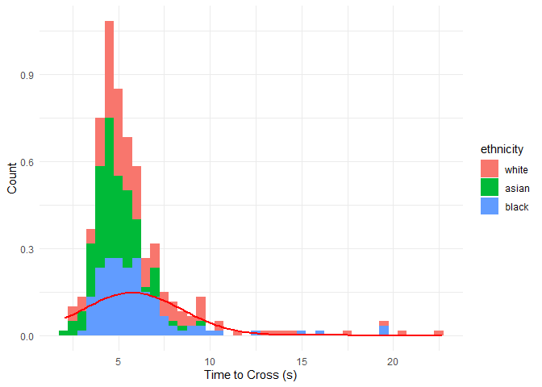<!-- -->


``` r
params_eth <- data %>%
  group_by(ethnicity) %>%
  summarise(
    mean = mean(time_to_cross_street),
    sd = sd(time_to_cross_street)
  )

curve_data_eth <- params_eth %>%
  rowwise() %>%
  do({
    tibble(
      ethnicity = .$ethnicity,
      x = seq(min(data$time_to_cross_street),
              max(data$time_to_cross_street),
              length.out = 200),
      y = dnorm(x, .$mean, .$sd)
    )
  })

ggplot(data, aes(time_to_cross_street, fill = ethnicity)) +
  geom_histogram(aes(y = after_stat(density)), binwidth = 0.5) +
  geom_line(data = curve_data_eth,
            aes(x = x, y = y),
            colour = "red",
            linewidth = 1,
            inherit.aes = FALSE) +
  labs(
    x = "Time to Cross (s)",
    y = "Count"
  ) +
  theme_minimal(
  ) +
  facet_wrap(~ethnicity)
```

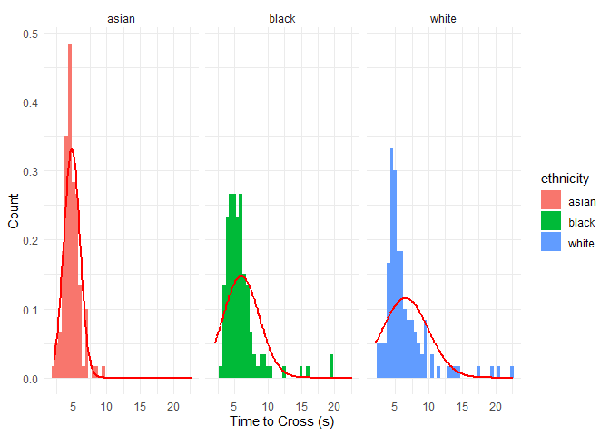<!-- -->

# 10b. Gender

``` r
data %>% 
  ggplot(aes(x = time_to_cross_street,
         fill = gender)) +
  geom_histogram((aes(y = after_stat(density))),binwidth = 0.5) +
  stat_function(fun = dnorm, args = list(mean = mean(data$time_to_cross_street), sd = sd(data$time_to_cross_street)), colour = "red", linewidth = 1) +
  labs(
    x = "Time to Cross (s)",
    y = "Count"
  ) +
  theme_minimal(
  )
```

```
## Warning: Multiple drawing groups in `geom_function()`
## ℹ Did you use the correct group, colour, or fill aesthetics?
```

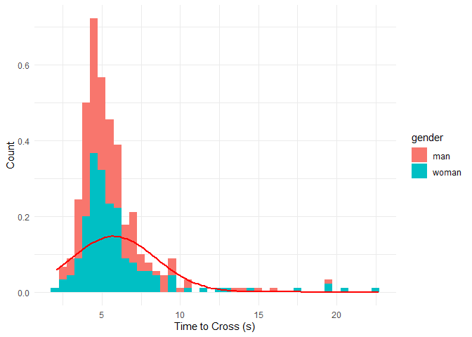<!-- -->


``` r
params_gen <- data %>%
  group_by(gender) %>%
  summarise(
    mean = mean(time_to_cross_street),
    sd = sd(time_to_cross_street)
  )

curve_data_gen <- params_gen %>%
  rowwise() %>%
  do({
    tibble(
      gender = .$gender,
      x = seq(min(data$time_to_cross_street),
              max(data$time_to_cross_street),
              length.out = 200),
      y = dnorm(x, .$mean, .$sd)
    )
  })

ggplot(data, aes(time_to_cross_street, fill = gender)) +
  geom_histogram(aes(y = after_stat(density)), binwidth = 0.5) +
  geom_line(data = curve_data_gen,
            aes(x = x, y = y),
            colour = "red",
            linewidth = 1,
            inherit.aes = FALSE) +
  labs(
    x = "Time to Cross (s)",
    y = "Count"
  ) +
  theme_minimal(
  ) +
  facet_wrap(~gender)
```

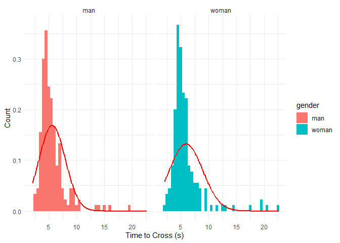<!-- -->

# 11. Visualizations
# 11a. Time by ethnicity

``` r
data %>% 
  ggplot(aes(x = ethnicity,
         y = time_to_cross_street,
         fill = ethnicity)) +
  geom_boxplot() +
  labs(
    x = "Ethnicicty",
    y = "Time to Cross (s)"
  ) +
  scale_x_discrete(labels = c(
    "white" = "White",
    "asian" = "South Asian",
    "black" = "Black"
   )) +
  theme_minimal(
  )
```

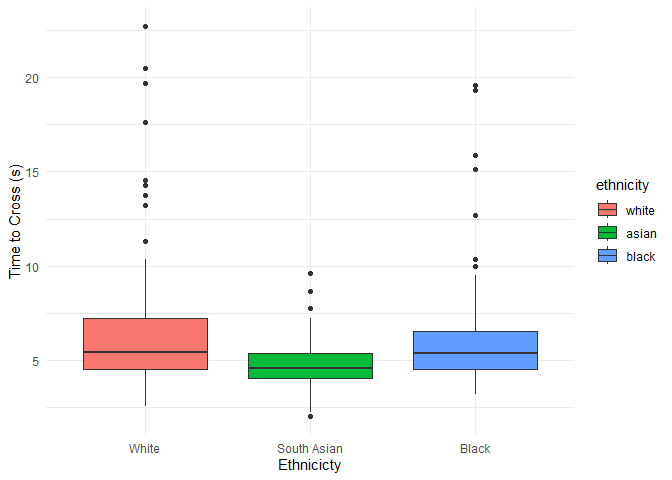<!-- -->

# 11b. Time by gender

``` r
data %>% 
  ggplot(aes(x = gender,
         y = time_to_cross_street,
         fill = gender)) +
  geom_boxplot(show.legend = FALSE) +
  labs(
    x = "Gender",
    y = "Time to Cross (s)"
  ) + 
  scale_x_discrete(labels = c(
    "man" = "Man",
    "woman" = "Woman"
   )) +
  theme_minimal()
```

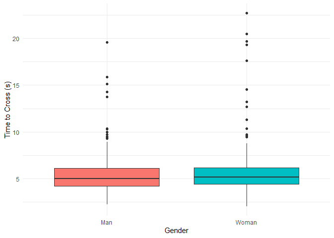<!-- -->

# 11c. Time to enter the street - Violin Plot with Jitter overlay - Facet by gender

``` r
data %>% 
  ggplot(aes(x = time_to_cross_street,
             y = gender)) +
  geom_violin() +
  geom_jitter(show.legend = FALSE) +
  geom_smooth(aes(group = 1), method = "lm", se = FALSE, linewidth = 1.2) +
  labs(
    x = "Time to Cross (s)",
    y = "Gender"
  ) + 
    scale_y_discrete(labels = c(
    "man" = "Man",
    "woman" = "Woman"
   )) +
  theme_minimal()
```

```
## `geom_smooth()` using formula = 'y ~ x'
```

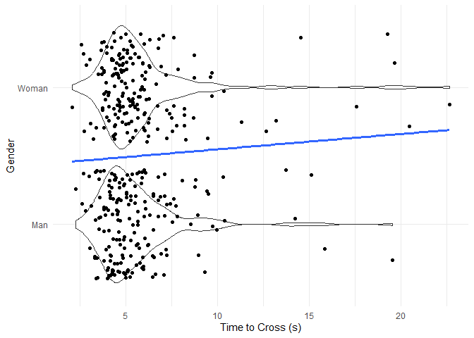<!-- -->

# 11d. Time to enter the street - Violin Plot with Jitter overlay - Facet by ethnicity

``` r
data %>% 
  ggplot(aes(x = time_to_cross_street,
             y = ethnicity)) +
  geom_violin() +
  geom_jitter(show.legend = FALSE) +
  geom_smooth(aes(group = 1), method = "lm", se = FALSE, linewidth = 1.2) +
  labs(
    x = "Time to Cross (s)",
    y = "Gender"
  ) + 
    scale_y_discrete(labels = c(
    "asian" = "South Asian",
    "white" = "White",
    "black" = "Black"
   )) +
  theme_minimal()
```

```
## `geom_smooth()` using formula = 'y ~ x'
```

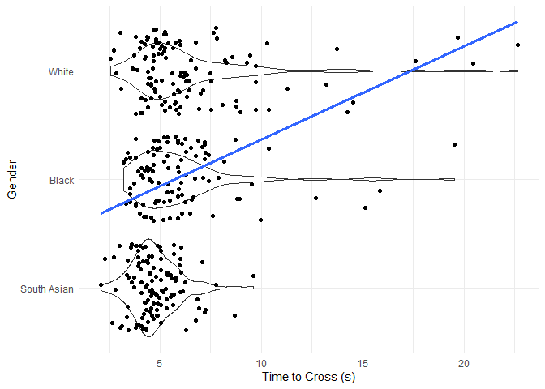<!-- -->

# 11e. Time to enter - QQplot - By ethnicity  

``` r
data %>% 
  ggplot(aes(sample = time_to_cross_street)) +
  geom_qq() +
  stat_qq_line() +
  facet_wrap(~ethnicity)
```

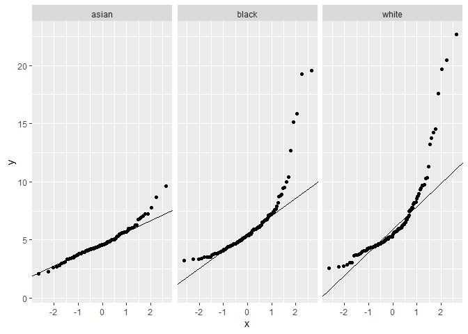<!-- -->

# 11f. Time to enter - QQplot - By gender 

``` r
data %>% 
  ggplot(aes(sample = time_to_cross_street)) +
  geom_qq() +
  stat_qq_line() +
  facet_wrap(~gender)
```

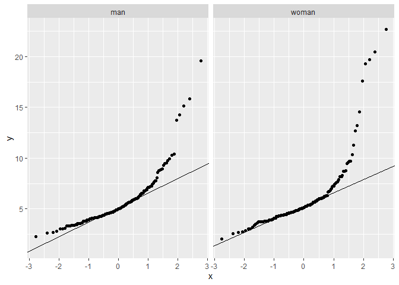<!-- -->

# 11g. 19th removed - Time to enter - By gender

``` r
data_19th_rm %>% 
  ggplot(aes(x = gender,
         y = time_to_cross_street,
         fill = gender)) +
  geom_boxplot(show.legend = FALSE) +
  labs(
    x = "Gender",
    y = "Time to Cross (s)"
  ) + 
  scale_x_discrete(labels = c(
    "man" = "Man",
    "woman" = "Woman"
  )) +
  theme_minimal()
```

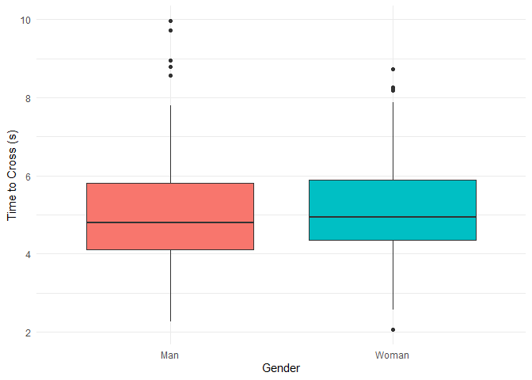<!-- -->

# Facet Labels

``` r
my_labels <- c("19th" = "19th Street",
               "2nd" = "2nd Avenue",
               "bessborough" = "Bessborough Hotel",
               "victoria" = "Victoria Avenue")
```

# 11h. Time by ethnicity and gender - grouped by location 

``` r
data%>% 
  ggplot(aes(x = ethnicity,
             y = time_to_cross_street,
               fill = gender)) +
  geom_boxplot() +
  facet_wrap(~location, labeller = labeller(location = my_labels)) +
  labs(
    x = "Ethnicity",
    y = "Time to Cross (s)",
    fill = "Gender"
  ) +
  scale_x_discrete(labels = c(
    "asian" = "South Asian",
    "white" = "White",
    "black" = "Black")
    ) +
  scale_fill_discrete(labels = c("Man",
                                 "Woman")
    ) +
  theme_minimal()
```

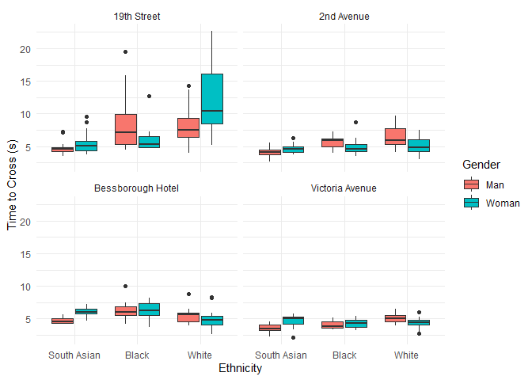<!-- -->

# 11i. Cars passed by ethnicity and gender

``` r
data %>% 
  ggplot(aes(x = ethnicity,
             y = num_cars_pass_before_yield,
             fill = gender)) +
  geom_col() +
  labs (
    x = "Ethnicity",
    y = "Number of Cars Passed",
    fill = "Gender"
  ) +
   scale_x_discrete(labels = c(
    "asian" = "South Asian",
    "white" = "White",
    "black" = "Black"
   )) + 
  theme_minimal()
```

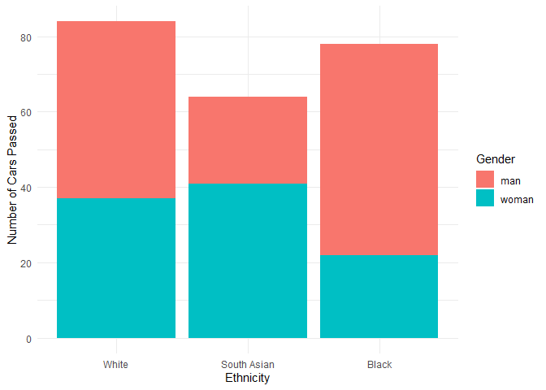<!-- -->

# 11j. Proportion of first car yields - By ethnicity 

``` r
data %>% 
  ggplot(aes(x = ethnicity,
             fill = first_car_yield)
         ) +
  geom_bar(position = "fill") +
  labs (
    x = "Ethnicity",
    y = "Proportion",
    fill = "Did the First Car Yield"
  ) +
   scale_x_discrete(labels = c(
    "asian" = "South Asian",
    "white" = "White",
    "black" = "Black"
   )) + 
  theme_minimal()
```

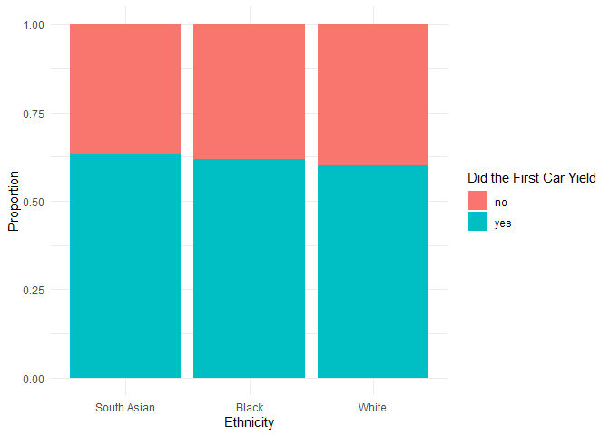<!-- -->

# 11k. Proportion of first car yield - By gender 

``` r
data %>% 
  ggplot(aes(x = gender,
             fill = first_car_yield)
         ) +
  geom_bar(position = "fill") +
  labs (
    x = "Gender",
    y = "Proportion",
    fill = "Did the First Car Yield"
  ) +
  scale_x_discrete(labels = c(
    "man" = "Man",
    "woman" = "Woman"
  )) +
  theme_minimal()
```

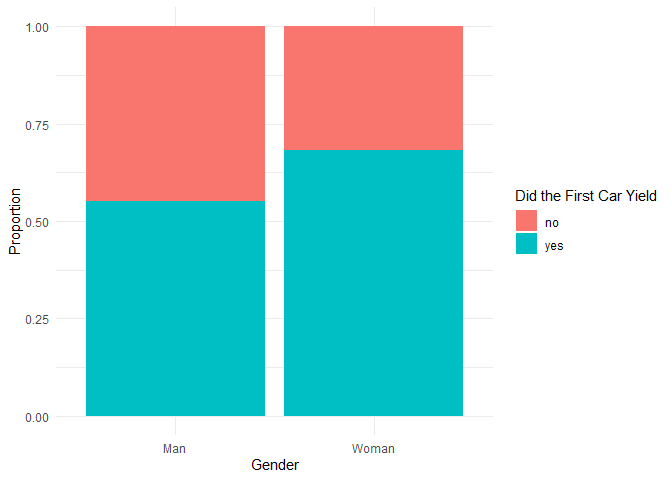<!-- -->

# 11l. Odds first car yield

``` r
or1 <- tidy(m4, conf.int = TRUE, exponentiate = TRUE)

ggplot(or1[-1,], aes(x = estimate,
                    y = reorder(term, estimate))) +
  geom_point(size = 3) +
  geom_errorbarh(aes(xmin = conf.low,
                     xmax = conf.high),
                 height = 0.2) +
  geom_vline(xintercept = 1,
             linetype = "dashed",
             colour = "red") +
  scale_x_log10() +
  scale_y_discrete(labels = c(
    "genderman" = "Man (vs Woman)",
    "genderwoman" = "Woman (vs Man)",
    "ethnicityasian" = "South Asian",
    "ethnicityblack" = "Black",
    "ethnicitywhite" = "White",
    "genderwoman:ethnicitywhite" = "White & Woman",
    "factor(location)victoria" = "Victoria",
    "factor(location)bessborough" = "Bessborough",
    "factor(location)2nd" = "2nd",
    "factor(location)19th" = "19th")) +
  labs(
    x = "Odds Ratio (95% CI)",
    y = "",
    title = "Logistic Regression Results"
  ) +
  theme_minimal()
```

```
## Warning: `geom_errorbarh()` was deprecated in ggplot2 4.0.0.
## ℹ Please use the `orientation` argument of `geom_errorbar()` instead.
## This warning is displayed once per session.
## Call `lifecycle::last_lifecycle_warnings()` to see where this warning was
## generated.
```

```
## `height` was translated to `width`.
```

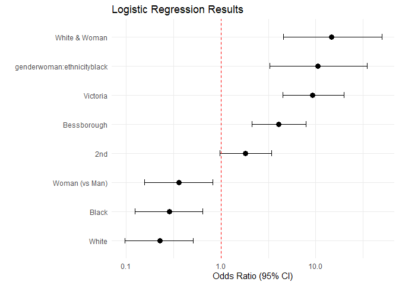<!-- -->

# 11m. Odds car proceeded

``` r
or2 <- tidy(m16, conf.int = TRUE, exponentiate = TRUE)

ggplot(or2[-1,], aes(x = estimate,
                    y = reorder(term, estimate))) +
  geom_point(size = 3) +
  geom_errorbarh(aes(xmin = conf.low,
                     xmax = conf.high),
                 height = 0.2) +
  geom_vline(xintercept = 1,
             linetype = "dashed",
             colour = "red") +
  scale_x_log10() +
  scale_y_discrete(labels = c(
    "genderman" = "Male (vs Female)",
    "genderwoman" = "Female (vs Male)",
    "ethnicityasian" = "South Asian",
    "ethnicityblack" = "Black",
    "ethnicitywhite" = "White",
    "factor(location)victoria" = "Victoria",
    "factor(location)bessborough" = "Bessborough",
    "factor(location)2nd" = "2nd",
    "factor(location)19th" = "19th",
    "genderwoman:ethnicitywhite" = "White & Woman")) +
  labs(
    x = "Odds Ratio (95% CI)",
    y = "",
    title = "Logistic Regression Results"
  ) +
  theme_minimal()
```

```
## `height` was translated to `width`.
```

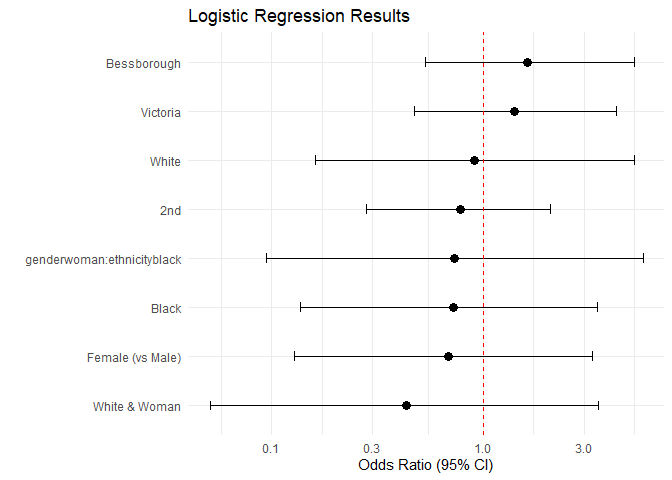<!-- -->

# 11n. Odds car stopped close//far 

``` r
or3 <- tidy(m20, conf.int = TRUE, exponentiate = TRUE)

ggplot(or3[-1,], aes(x = estimate,
                    y = reorder(term, estimate))) +
  geom_point(size = 3) +
  geom_errorbarh(aes(xmin = conf.low,
                     xmax = conf.high),
                 height = 0.2) +
  geom_vline(xintercept = 1,
             linetype = "dashed",
             colour = "red") +
  scale_x_log10() +
  scale_y_discrete(labels = c(
    "genderman" = "Male (vs Female)",
    "genderwoman" = "Female (vs Male)",
    "ethnicityasian" = "South Asian",
    "ethnicityblack" = "Black",
    "ethnicitywhite" = "White",
    "factor(location)victoria" = "Victoria",
    "factor(location)bessborough" = "Bessborough",
    "factor(location)2nd" = "2nd",
    "factor(location)19th" = "19th",
    "genderwoman:ethnicitywhite" = "White & Woman")) +
  labs(
    x = "Odds Ratio (95% CI)",
    y = "",
    title = "Logistic Regression Results"
  ) +
  theme_minimal()
```

```
## `height` was translated to `width`.
```

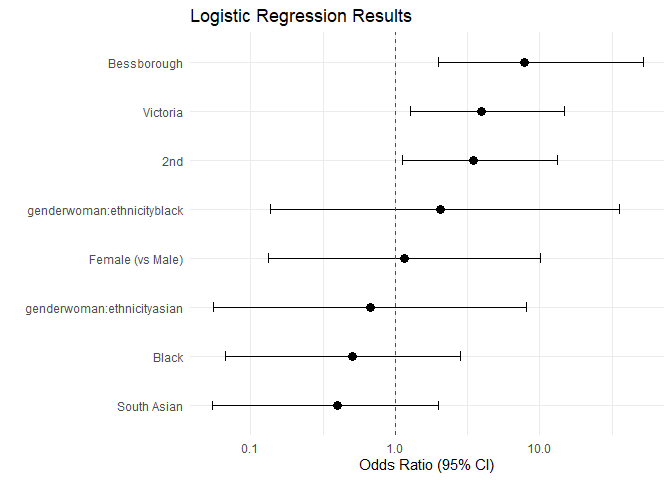<!-- -->

# 11o. Intersection Plots

``` r
p1 <- ggdraw() + draw_image("VicRender.png")
p2 <- ggdraw() + draw_image("2ndRender.png")
p3 <- ggdraw() + draw_image("19thRender.png")
p4 <- ggdraw() + draw_image("BesRender.png")

final_plot <- plot_grid(p1,p2, p3, p4,
          labels = c("A", "B", "C", "D")) +
  theme( 
    plot.background = element_blank(),
    panel.background = element_blank()
    )

ggsave(
  filename = "figure1.png",
  plot = final_plot,
  width = 10,
  height = 6,
  dpi = 300,
  bg = "transparent"
  )
```

